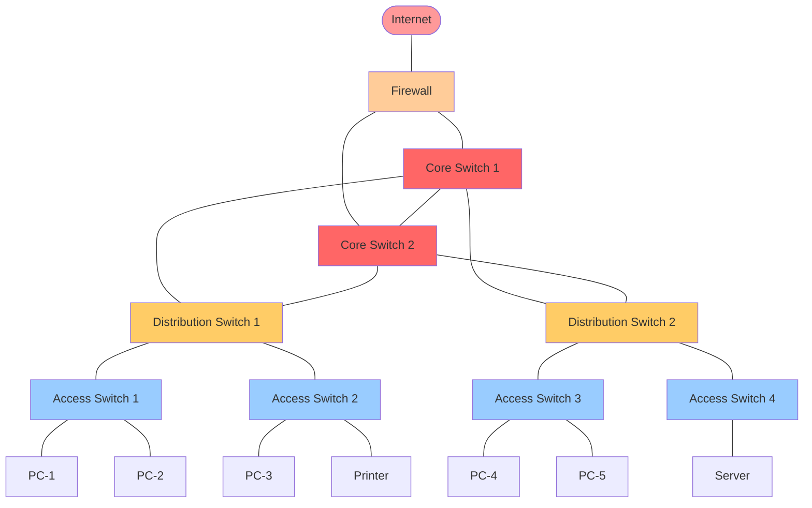
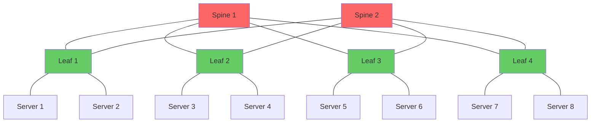
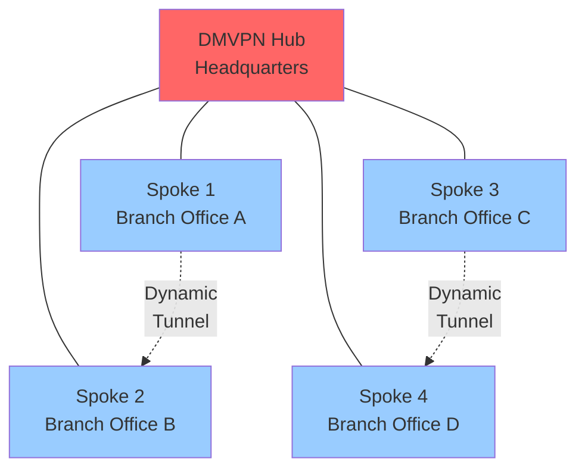

Network Topology

---

Introduction

What is Network Topology?

Network topology refers to the physical and logical arrangement of nodes, links, and connections in a computer network. It defines how devices such as routers, switches, firewalls, and end hosts are interconnected and how data flows between them. Topology is the architectural blueprint of a network — it determines not only the physical cabling and device placement but also the logical path that traffic takes across the infrastructure.

Network topology is typically categorized into two types:

Type	Description	
Physical Topology	The actual physical layout of cables, devices, and network components. This is what you see when you look at the rack, cabling, and hardware placement.	
Logical Topology	The virtual path that data takes between nodes. This defines how devices communicate logically, regardless of physical cabling. For example, a physically star-shaped network may logically operate as a bus.	

Why is Network Topology Important?

Understanding network topology is fundamental for every network engineer because it directly impacts:

1. Performance — The topology determines latency paths, bandwidth bottlenecks, and collision domains. A poor topology can create congestion points that degrade application performance.
2. Scalability — Some topologies scale horizontally with ease (mesh, leaf-spine) while others become unwieldy as the network grows (bus, ring).
3. Fault Tolerance — Redundant paths in mesh or hybrid topologies provide resilience. Single points of failure in bus or star topologies can cause widespread outages.
4. Security — Topology influences where access controls, firewalls, and segmentation boundaries are placed. A well-designed topology supports Zero Trust architecture.
5. Cost — The amount of cabling, number of ports, and equipment requirements vary dramatically between topologies. A full mesh of 50 routers requires 1,225 links — prohibitively expensive.
6. Troubleshooting — Knowing the topology allows engineers to trace paths, isolate faults, and predict the impact of failures.

Where is Network Topology Used?

Network topology is applied across every networking domain:

- Enterprise LANs — Hierarchical (core-distribution-access) topologies dominate office networks
- Data Centers — Leaf-spine (Clos) topology is the modern standard for east-west traffic
- WANs — Hub-and-spoke or partial mesh topologies connect branch offices
- Service Provider Networks — Full mesh or multi-tier hierarchical designs carry internet traffic
- Campus Networks — Extended star or hybrid topologies serve universities and hospitals
- Industrial Networks — Ring topologies with redundancy protocols (REP, ERPS) protect manufacturing

---

Fundamentals

Key Terminology

Term	Definition	
Node	Any device connected to the network: router, switch, firewall, server, PC, AP, printer	
Link	The communication channel connecting two nodes — can be copper (UTP), fiber, or wireless	
Point-to-Point	A direct connection between exactly two nodes	
Multipoint (Bus)	A shared medium where multiple nodes connect to a single link	
Neighbors	Nodes that share a direct physical link	
Degree	The number of direct connections a node has	
Path	A sequence of links traversed to reach from source to destination	
Diameter	The longest shortest-path between any two nodes in the network	
Bisection Bandwidth	The minimum bandwidth between two equal halves of a network	
Single Point of Failure (SPOF)	A component whose failure causes total or major network outage	

Classification of Topologies

```
Network Topologies
|
|-- Physical Topologies
|   |-- Bus
|   |-- Star
|   |-- Ring
|   |-- Mesh
|   |-- Tree
|   |-- Hybrid
|
|-- Logical Topologies
|   |-- Bus (Ethernet using hubs)
|   |-- Ring (Token Ring, FDDI)
|   |-- Star (modern switched Ethernet)
|   |-- Mesh (fully connected routing)
```

---

Detailed Technical Explanation

1. Bus Topology

Description: All devices connect to a single shared communication line called the backbone or trunk. Data transmitted by any device travels in both directions along the backbone until it reaches all nodes.

Architecture:

```
    PC-A     PC-B     Server     PC-C     PC-D
      |        |         |         |        |
      +--------+---------+---------+--------+
               (Shared Backbone Cable)
```

Internal Working:
- Uses coaxial cable (10BASE2, 10BASE5) historically
- All nodes share the same collision domain
- Data propagates as electrical signals in both directions
- Terminators (50-ohm resistors) are placed at both ends to absorb signals and prevent reflections
- Uses CSMA/CD (Carrier Sense Multiple Access with Collision Detection) in Ethernet implementations

Operation Steps:
1. Node listens to the bus (carrier sense)
2. If idle, node transmits data frame
3. Signal propagates in both directions along the backbone
4. All nodes receive the frame and check the destination MAC address
5. Only the destination node processes the frame; others discard it
6. If two nodes transmit simultaneously, a collision occurs
7. Both nodes back off using a random timer and retry (CSMA/CD)

Packet Flow: Source node → T-connector → Backbone cable → All T-connectors → All nodes (destination accepts, others ignore)

Advantages:
- Minimal cabling required
- Simple to install in small environments
- Cost-effective for very small networks

Disadvantages:
- Single point of failure (the backbone cable)
- Difficult to troubleshoot (hard to locate cable faults)
- Performance degrades significantly as nodes increase
- Collisions reduce effective throughput
- Adding or removing devices disrupts the entire network
- Limited cable length (185m for 10BASE2, 500m for 10BASE5)

Cisco Relevance: Historical only. Modern Cisco networks do not use bus topology. Understanding bus topology is important for legacy system support and for understanding why CSMA/CD was designed.

---

2. Star Topology

Description: All nodes connect to a central device (switch, hub, or wireless access point). Every communication passes through this central device.

Architecture:

```
                        [Core Switch]
                             |
        +--------+--------+--------+--------+
        |        |        |        |        |
    [Switch] [Switch] [Switch] [Switch] [Router]
        |        |        |        |
       PC-A     PC-B     PC-C     Server
```

Physical vs Logical:
- Physical Star: All cables run to a central wiring closet. This is the most common physical layout today.
- Logical Star: In modern switched Ethernet, the logical topology is also a star. Each device has a dedicated point-to-point link to the switch.
- Logical Bus in Physical Star: When a hub is used as the central device, the logical topology is a bus (all nodes share the same collision domain) despite the physical star appearance.

Internal Working:
- Each node has a dedicated, independent link to the central switch
- The switch maintains a MAC address table (CAM table) mapping MAC addresses to ports
- When a frame arrives, the switch forwards it only to the destination port (unicast) or all ports (broadcast/flooding)
- Each link operates as a separate collision domain
- Full-duplex operation eliminates collisions entirely on modern switches

Operation Steps:
1. PC-A sends a frame to PC-B
2. Frame arrives at Switch Port 1
3. Switch inspects the destination MAC address
4. Switch looks up the MAC in its CAM table
5. If found, forwards only to the associated port (Port 2)
6. If not found, floods to all ports except the incoming port
7. PC-B receives the frame; other devices ignore it

Packet Flow: Source → UTP cable → Switch port → Switch backplane → Destination switch port → UTP cable → Destination

Advantages:
- Easy to install and manage
- Simple fault isolation (one link failure affects only one node)
- Adding or removing nodes does not disrupt the network
- Centralized management point
- Supports modern full-duplex, collision-free operation

Disadvantages:
- Central device is a single point of failure (unless redundant)
- More cabling required than bus topology
- Cost of central switch/hub
- Cable length limitations (100m for Cat5e/Cat6 UTP)

Cisco Implementation: Every modern Cisco LAN uses star topology at the access layer. Cisco Catalyst switches are designed as the central device in star topologies.

---

3. Ring Topology

Description: Each node connects to exactly two other nodes, forming a closed loop. Data travels in one direction (unidirectional) or both directions (bidirectional) around the ring.

Architecture:

```
                    +---------+
                    |  Node A |
                    +----+----+
                         |
                    +----v----+
               +----+  Node B +----+
               |    +---------+    |
               |                   |
          +----v----+         +----v----+
          |  Node E |         |  Node C |
          +---------+         +----+----+
                                 |
                            +----v----+
                            |  Node D |
                            +---------+
```

Internal Working:
- Each node acts as a repeater: it receives data from its upstream neighbor, regenerates the signal, and forwards it to its downstream neighbor
- A token (special control frame) circulates continuously around the ring
- A node can only transmit when it possesses the token (Token Passing mechanism)
- This eliminates collisions entirely
- Each node examines every passing frame and copies it if the frame is addressed to it

Operation Steps:
1. Token circulates around the ring continuously
2. Node A wants to send data to Node C
3. Node A waits for and captures the token
4. Node A attaches data frame(s) to the token and marks it as "busy"
5. Frame circulates: A → B → C
6. Node C recognizes its address, copies the frame, and sets the ACK bit
7. Frame continues to circulate back to A (completing the full ring)
8. Node A sees the ACK, removes its frame, and releases a new free token

Packet Flow: Source → Neighbor 1 → Neighbor 2 → ... → Destination → ... → Source (acknowledgment)

Variants:
- Unidirectional Ring: Data flows in one direction only. Simple but if one link fails, the ring is broken.
- Bidirectional Ring (Dual Ring): Two counter-rotating rings. If the primary ring fails, traffic wraps to the secondary ring. Used in FDDI and Resilient Ethernet Protocol (REP).
- Counter-Rotating Ring: Two rings operating in opposite directions. SONET/SDH networks use this.

Advantages:
- Equal access for all nodes (fair token passing)
- Predictable performance (no collisions)
- Simple to install in circular physical layouts
- Each node regenerates the signal, extending distance

Disadvantages:
- A single break in the ring disrupts the entire network (unless dual ring)
- Adding or removing nodes requires breaking the ring temporarily
- Token passing adds latency (a node must wait for the token)
- All traffic passes through intermediate nodes, adding hop delay
- Troubleshooting is complex because the failure could be any link or node

Cisco Implementation: Cisco supports ring topologies through:
- Resilient Ethernet Protocol (REP) — Cisco proprietary ring protection for Ethernet
- MRP (Media Redundancy Protocol) — IEC standard for industrial rings
- ERPS (Ethernet Ring Protection Switching) — G.8032 ITU-T standard
- Rapid Spanning Tree Protocol (RSTP) — Can create logical rings with blocked ports for redundancy

---

4. Mesh Topology

Description: Every node is connected to every other node with dedicated point-to-point links. In a full mesh, there are `n(n-1)/2` links for `n` nodes.

Architecture:

```
    Full Mesh (4 nodes)              Partial Mesh (5 nodes)
    
         [A]                           [A]
        / | \                        /  |  \
       /  |  \                     /   |   \
     [B]-+-[C]                  [B]----+----[C]
       \  |  /                     \   |   /
        \ | /                       \  |  /
         [D]                         [D]-+-[E]
```

Internal Working:
- Each link is a dedicated, private connection between two nodes
- Traffic between any two nodes travels directly without passing through intermediaries
- Routing protocols (OSPF, EIGRP, BGP) are required to determine optimal paths
- Multiple paths exist between any pair of nodes, providing automatic redundancy

Full Mesh Formula:
- Number of links = `n(n-1) / 2`
- Number of interfaces per node = `n - 1`

Nodes	Links Required	Interfaces per Node	
3	3	2	
4	6	3	
5	10	4	
6	15	5	
10	45	9	
50	1,225	49	
100	4,950	99	

Operation Steps:
1. Node A wants to send a packet to Node D
2. Node A checks its routing table for the destination
3. In a full mesh, a direct route exists: A → D (single hop)
4. Node A encapsulates the packet and sends it directly to D
5. If the direct link fails, routing protocol converges and selects an alternate path (e.g., A → B → D)
6. Multiple parallel paths can be used for load balancing (ECMP)

Packet Flow: Source → Direct dedicated link → Destination (no intermediaries in full mesh)

Advantages:
- Maximum redundancy and fault tolerance
- Highest performance (direct paths, minimal hops)
- No single point of failure (multiple alternate paths)
- Traffic isolation (dedicated links)
- Load balancing across multiple paths

Disadvantages:
- Extremely expensive to implement (cabling, interfaces, ports)
- Complex configuration and management
- Difficult to scale (quadratic growth of links)
- High port density required on each device
- Complex routing tables

Partial Mesh:
- Only strategically important nodes have multiple connections
- Reduces cost while maintaining critical redundancy
- Common in WAN designs where only core sites interconnect fully

Cisco Implementation: Full mesh is used in:
- DMVPN (Dynamic Multipoint VPN) — Creates dynamic full mesh over Internet
- Service Provider core networks — Full mesh of P/PE routers
- Small high-availability clusters — 3-4 node full mesh
- MPLS L3VPN — PE routers often fully meshed via MP-BGP

---

5. Tree (Hierarchical) Topology

Description: A root node connects to multiple secondary nodes, which in turn connect to tertiary nodes, forming a branching structure similar to an organizational chart or a tree.

Architecture:

```
                        [Root/Core]
                             |
           +--------+--------+--------+
           |        |        |        |
       [Dist-1] [Dist-2] [Dist-3] [Dist-4]
           |        |        |
       +---+---+    |    +---+---+
       |   |   |    |    |   |   |
     [A] [B] [C]  [D]  [E] [F] [G]
```

Internal Working:
- Traffic flows up and down the hierarchy
- Nodes at the same level do not communicate directly; they go through their parent
- The root node handles inter-branch traffic
- This is a combination of multiple star topologies connected in a hierarchy

Operation Steps:
1. Node A wants to send data to Node E
2. Frame goes: A → Dist-1 → Root/Core → Dist-3 → E
3. Nodes within the same branch communicate through their distribution switch
4. Broadcast traffic is typically contained within branches (using VLANs)

Packet Flow: Source → Parent → (Possibly Grandparent) → Parent → Destination

Advantages:
- Natural scalability (easy to add new branches)
- Simplified management through hierarchy
- Supports VLAN segmentation at each level
- Cost-effective (fewer links than mesh)
- Matches organizational structures

Disadvantages:
- Root node is a critical single point of failure (unless redundant roots)
- Lower branches depend on upper levels
- Bottlenecks can occur at parent nodes
- More hops than mesh for inter-branch communication

Cisco Implementation: The Cisco Three-Layer Hierarchical Model is the industry-standard tree topology:
- Core Layer — High-speed backbone, no packet manipulation, fast forwarding
- Distribution Layer — Policy enforcement, routing, filtering, WAN access, VLAN routing
- Access Layer — End-user connections, port security, PoE, access control

---

6. Hybrid Topology

Description: A combination of two or more different topologies to leverage the strengths of each. Most real-world enterprise networks are hybrid topologies.

Architecture Example:

```
                    [Internet]
                        |
                    [Firewall]
                        |
                    [Core Switch] ←——→ [Core Switch]  (Mesh between cores)
                        |                    |
            +-----------+                    +-----------+
            |                                    |
      [Dist Switch]                          [Dist Switch]
       /    |    \                            /    |    \
      /     |     \                          /     |     \
   [Acc]  [Acc]  [Acc]                  [Acc]  [Acc]  [Acc]   (Stars)
    |      |      |                        |      |      |
   PCs    PCs    PCs                      PCs    PCs    PCs
```

Internal Working:
- Different sections of the network use different topologies optimized for their role
- Core may use mesh or partial mesh for redundancy
- Distribution and access use star topologies for ease of management
- WAN connections may use hub-and-spoke (a variant of star)
- Data center may use leaf-spine (a specialized mesh variant)

Common Hybrid Combinations:

Combination	Use Case	
Star + Bus	Multiple stars connected by a backbone	
Star + Ring	Industrial networks with redundant rings and local stars	
Mesh + Star	Core mesh with access star (Cisco Enterprise design)	
Tree + Mesh	Hierarchical with mesh core for redundancy	

Advantages:
- Highly flexible and customizable
- Cost-optimized (expensive topologies only where needed)
- Scalable by adding new segments
- Resilient where it matters most

Disadvantages:
- Complex design and documentation
- Troubleshooting requires understanding multiple topologies
- Inconsistent configurations across segments

---

7. Extended Topologies (Modern Data Center and WAN)

Leaf-Spine Topology

The dominant modern data center topology, based on the Clos network mathematical model.

```
            +------------+        +------------+
            |   Spine 1  |←——————→|   Spine 2  |
            +--+------+--+        +--+------+--+
               |      |               |      |
               |      |               |      |
            +--v--+ +--v--+         +--v--+ +--v--+
            |Leaf1| |Leaf2|         |Leaf3| |Leaf4|
            +--+--+ +--+--+         +--+--+ +--+--+
               |       |               |       |
              Hosts   Hosts           Hosts   Hosts
```

Characteristics:
- Two tiers: Leaf (Top-of-Rack) switches and Spine switches
- Every leaf connects to every spine (partial mesh between tiers)
- Leaf switches do NOT connect to other leaf switches
- Spine switches do NOT connect to other spine switches
- All hosts are exactly 2 hops away from each other (leaf → spine → leaf)
- Predictable, consistent latency for all host-to-host traffic
- Uses ECMP (Equal-Cost Multi-Path) routing for load balancing across all available spine-leaf paths
- Highly scalable: add more spines for bandwidth, more leafs for server capacity

Cisco Implementation:
- Cisco Nexus switches (Nexus 9000 series) are designed for leaf-spine
- VXLAN/EVPN overlay runs on the leaf-spine underlay
- BGP is commonly used as the underlay routing protocol

Hub-and-Spoke Topology

Primarily used in WAN and VPN designs.

```
                    [Hub Site]
                   /    |    \
                  /     |     \
                 /      |      \
            [Spoke1] [Spoke2] [Spoke3]
               |        |        |
             Branch   Branch   Branch
```

Characteristics:
- All spoke sites connect only to the central hub
- Spoke-to-spoke traffic goes through the hub
- Simplified management (only hub needs full routing knowledge)
- Cost-effective (fewer WAN links)
- Hub is a single point of failure and potential bottleneck

Cisco Implementation:
- DMVPN Phase 1 — Classic hub-and-spoke with NHRP
- DMVPN Phase 2/3 — Spoke-to-spoke tunnels dynamically built on demand
- Cisco SD-WAN — Intelligent hub-and-spoke with application-aware routing

---

Diagrams

Physical Topology Comparison

```
Bus:        Star:         Ring:         Mesh:         Tree:

A-B-C-D    A  B  C D    A———B        A—B—C       Core
 | | | |     \ | / /      |   |        |\ /|        |
———————      \|//        D———E        D—E—F     Dist Dist
 backbone     Hub         F———G        full mesh    |  |
                                                  Acc Acc
```

Mermaid Diagram: Enterprise Hierarchical Topology



Mermaid Diagram: Leaf-Spine Data Center



Mermaid Diagram: DMVPN Hub-and-Spoke



ASCII Topology: Redundant Ring with REP

```
                              [Gateway/Router]
                                    |
                              +---+---+
                              |       |
                          [Switch A]——[Switch B]
                              |  REP  |
                              | Ring  |
                          [Switch D]——[Switch C]
                              |       |
                             AP-1    AP-2
                              |       |
                            WiFi    WiFi
                           Clients Clients

REP Segment: Switch A (Primary Edge) → B → C → D → A
            Blocked port on Alternate Edge prevents loops
            <50ms failover when link fails
```

---

Protocol Details

Spanning Tree Protocol (STP) — Topology Loop Prevention

STP is essential in redundant topologies to prevent Layer 2 loops.

Parameter	Default Value	Purpose	
Hello Time	2 seconds	BPDU transmission interval	
Forward Delay	15 seconds	Time in Listening/Learning states	
Max Age	20 seconds	Maximum BPDU age before discarding	
Priority	32768	Bridge priority for root election	

STP Port States:

```
Disabled → Blocking → Listening → Learning → Forwarding
              ↑___________________________|
                    (when port fails)
```

State	Learns MACs	Forwards Frames	Duration	
Disabled	No	No	Administrative	
Blocking	No	No	Indefinite	
Listening	No	No	Forward Delay (15s)	
Learning	Yes	No	Forward Delay (15s)	
Forwarding	Yes	Yes	Indefinite	

VLAN Trunking — Topology Segmentation

VLANs create logical topologies independent of physical topology.

```
Physical Topology:           Logical Topology (VLAN 10):

    [Switch]                      [VLAN 10]
   /   |   \                    /    |    \
 PC1  PC2  PC3               PC1   PC2   Server
 VLAN10 VLAN20 VLAN10         (same broadcast domain)
```

802.1Q Frame Format:

```
Original Ethernet Frame:
[DST MAC 6B][SRC MAC 6B][Type 2B][Payload 46-1500B][FCS 4B]

802.1Q Tagged Frame (4 bytes inserted):
[DST MAC 6B][SRC MAC 6B][TPID 0x8100 2B][TCI 2B][Type 2B][Payload][FCS 4B]
                              ↑
                         TCI = PCP(3bits) + CFI(1bit) + VLAN ID(12bits)
                         VLAN ID range: 0-4095 (1-4094 usable)
```

REP (Resilient Ethernet Protocol) — Cisco Ring Topology

Feature	Specification	
Convergence Time	50ms (similar to SONET)	
Standard	Cisco Proprietary	
Topology	Ring only	
Root Election	Yes (Primary Edge elects)	
Load Balancing	Supports VLAN load balancing	
Interoperability	Only between Cisco devices	

REP Ports:
- Primary Edge Port: Controls the blocked port; sends topology change notices
- Alternate Edge Port: The blocked port under normal conditions
- No-Neighbor Ports: Edge ports facing non-REP devices

---

Cisco IOS Configuration

Basic Switch Configuration for Star Topology

```
! Hostname and basic settings
Switch(config)# hostname Access-Switch-1
Access-Switch-1(config)# enable secret Cisco123
Access-Switch-1(config)# service password-encryption
Access-Switch-1(config)# no ip domain-lookup

! Management VLAN interface
Access-Switch-1(config)# interface vlan 1
Access-Switch-1(config-if)# ip address 192.168.1.2 255.255.255.0
Access-Switch-1(config-if)# no shutdown
Access-Switch-1(config-if)# exit
Access-Switch-1(config)# ip default-gateway 192.168.1.1

! Configure access ports for end devices
Access-Switch-1(config)# interface range gigabitEthernet 0/1 - 12
Access-Switch-1(config-if-range)# description Access Ports - PCs and Printers
Access-Switch-1(config-if-range)# switchport mode access
Access-Switch-1(config-if-range)# switchport access vlan 10
Access-Switch-1(config-if-range)# spanning-tree portfast
Access-Switch-1(config-if-range)# spanning-tree bpduguard enable
Access-Switch-1(config-if-range)# no shutdown

! Configure trunk port to distribution switch
Access-Switch-1(config)# interface gigabitEthernet 0/24
Access-Switch-1(config-if)# description Trunk to Dist-Switch
Access-Switch-1(config-if)# switchport mode trunk
Access-Switch-1(config-if)# switchport trunk allowed vlan 10,20,30
Access-Switch-1(config-if)# switchport trunk native vlan 99
Access-Switch-1(config-if)# no shutdown
```

Command Explanations:

Command	Purpose	
`hostname`	Sets device name for identification	
`enable secret`	Sets encrypted privileged EXEC password	
`service password-encryption`	Encrypts all plaintext passwords	
`interface vlan 1`	Creates SVI (Switched Virtual Interface) for management	
`ip default-gateway`	Sets default gateway for management traffic	
`switchport mode access`	Configures port as access port (single VLAN)	
`switchport access vlan 10`	Assigns port to VLAN 10	
`spanning-tree portfast`	Immediately transitions port to forwarding (bypasses STP wait)	
`spanning-tree bpduguard enable`	Disables port if BPDU received (prevents rogue switches)	
`switchport mode trunk`	Configures port as trunk (carries multiple VLANs)	
`switchport trunk allowed vlan`	Restricts which VLANs are permitted on the trunk	
`switchport trunk native vlan 99`	Sets native (untagged) VLAN to 99 (security best practice)	

Spanning Tree Configuration for Redundant Topologies

```
! Set Root Bridge for VLAN 10 (Primary Root)
Core-Switch(config)# spanning-tree vlan 10 root primary
! Equivalent to: spanning-tree vlan 10 priority 24576

! Set Secondary Root Bridge
Core-Switch(config)# spanning-tree vlan 10 root secondary
! Equivalent to: spanning-tree vlan 10 priority 28672

! Or manually set priority
Core-Switch(config)# spanning-tree vlan 10,20,30 priority 4096

! Enable Rapid PVST+ (Per-VLAN Rapid Spanning Tree)
Core-Switch(config)# spanning-tree mode rapid-pvst

! Enable PortFast on all access ports
Core-Switch(config)# spanning-tree portfast default

! Enable BPDU Guard globally
Core-Switch(config)# spanning-tree portfast bpduguard default

! Configure Root Guard on ports that should never become root
Core-Switch(config)# interface gi 0/1
Core-Switch(config-if)# spanning-tree guard root

! Configure Loop Guard on redundant links
Core-Switch(config)# interface gi 0/2
Core-Switch(config-if)# spanning-tree guard loop
```

REP (Resilient Ethernet Protocol) Configuration for Ring Topology

```
! Configure REP on all switches in the ring

! Switch A (Primary Edge)
Switch-A(config)# interface gigabitEthernet 0/1
Switch-A(config-if)# rep segment 1 edge primary
Switch-A(config-if)# no shutdown

Switch-A(config)# interface gigabitEthernet 0/2
Switch-A(config-if)# rep segment 1
Switch-A(config-if)# no shutdown

! Switch B (Intermediate)
Switch-B(config)# interface gigabitEthernet 0/1
Switch-B(config-if)# rep segment 1
Switch-B(config-if)# no shutdown

Switch-B(config)# interface gigabitEthernet 0/2
Switch-B(config-if)# rep segment 1
Switch-B(config-if)# no shutdown

! Switch C (Intermediate)
Switch-C(config)# interface gigabitEthernet 0/1
Switch-C(config-if)# rep segment 1
Switch-C(config-if)# no shutdown

Switch-C(config)# interface gigabitEthernet 0/2
Switch-C(config-if)# rep segment 1
Switch-C(config-if)# no shutdown

! Switch D (Alternate Edge)
Switch-D(config)# interface gigabitEthernet 0/1
Switch-D(config-if)# rep segment 1
Switch-D(config-if)# no shutdown

Switch-D(config)# interface gigabitEthernet 0/2
Switch-D(config-if)# rep segment 1 edge alternate
Switch-D(config-if)# no shutdown
```

DMVPN Hub-and-Spoke Configuration

```
! HUB Configuration
Hub-Router(config)# interface tunnel 0
Hub-Router(config-if)# ip address 172.16.0.1 255.255.255.0
Hub-Router(config-if)# tunnel source gigabitEthernet 0/0
Hub-Router(config-if)# tunnel mode gre multipoint
Hub-Router(config-if)# ip nhrp network-id 100
Hub-Router(config-if)# ip nhrp authentication Cisco123
Hub-Router(config-if)# ip nhrp map multicast dynamic
Hub-Router(config-if)# tunnel key 1000
Hub-Router(config-if)# ip mtu 1400
Hub-Router(config-if)# tunnel path-mtu-discovery
Hub-Router(config-if)# ip tcp adjust-mss 1360

! SPOKE Configuration
Spoke-Router(config)# interface tunnel 0
Spoke-Router(config-if)# ip address 172.16.0.2 255.255.255.0
Spoke-Router(config-if)# tunnel source gigabitEthernet 0/0
Spoke-Router(config-if)# tunnel mode gre multipoint
Spoke-Router(config-if)# ip nhrp network-id 100
Spoke-Router(config-if)# ip nhrp authentication Cisco123
Spoke-Router(config-if)# ip nhrp nhs 172.16.0.1
Spoke-Router(config-if)# ip nhrp map 172.16.0.1 203.0.113.1
Spoke-Router(config-if)# ip nhrp map multicast 203.0.113.1
Spoke-Router(config-if)# tunnel key 1000
Spoke-Router(config-if)# ip mtu 1400
Spoke-Router(config-if)# ip tcp adjust-mss 1360
```

Verification Commands

```
! View spanning tree status
show spanning-tree
show spanning-tree vlan 10
show spanning-tree root
show spanning-tree summary

! View REP status
show rep topology
show rep segment 1 detail

! View DMVPN status
show dmvpn
show ip nhrp
show crypto isakmp sa

! View MAC address table (star topology central device)
show mac address-table
show mac address-table dynamic

! View interface status
show ip interface brief
show interfaces status
show interfaces description

! View CDP/LLDP neighbors (discover physical topology)
show cdp neighbors
show cdp neighbors detail
show lldp neighbors
show lldp neighbors detail

! View VLAN configuration
show vlan brief
show vlan id 10
show interfaces trunk

! View routing table (for routed topologies)
show ip route
show ip route ospf
show ip route eigrp

! View EtherChannel/Port-Channel (redundant links)
show etherchannel summary
show port-channel summary

! View VTP status (topology management)
show vtp status
show vtp password
```

---

Real World Implementation

Enterprise Campus Design (Cisco Validated Design)

A typical enterprise with 5,000+ employees uses a three-tier hierarchical hybrid topology:

Scale Reference:

Building Size	Access Switches	Distribution	Core	
Small (50-200 users)	2-4	Collapsed with Core	Optional	
Medium (200-1000)	8-20	2 (redundant pair)	2 (redundant pair)	
Large (1000-5000)	40-100	4-8	2-4 (full mesh)	
Campus (5000+)	100+	8-16	4 (Clos/mesh)	

Design Principles:
1. Modularity: Each building or floor is a self-contained module with its own access-distribution pair
2. Redundancy: Every critical component is duplicated — dual supervisors, dual power supplies, dual uplinks
3. Deterministic paths: Traffic flows follow predictable patterns: Access → Distribution → Core → Distribution → Access
4. 80/20 Rule (Historical): 80% local traffic, 20% crossing distribution. Now inverted with cloud/SaaS.

Data Center Leaf-Spine Deployment

A medium-sized data center with 1,000 servers:

```
4 Spine switches (Cisco Nexus 9336)
16 Leaf switches (Cisco Nexus 93180)
Each leaf connects to all 4 spines = 64 spine-leaf links
Each leaf has 48 server-facing ports = 768 total server ports
Oversubscription ratio: 4:1 (4 spine uplinks × 100G / 48 × 25G)
```

Traffic Pattern Considerations:
- North-South: Traffic entering/leaving the data center (leaf → spine → border leaf → firewall → WAN)
- East-West: Server-to-server traffic within the data center (leaf → spine → leaf) — this dominates modern DC traffic (70%+)

WAN Hub-and-Spoke for Retail Chain

A retail chain with 500 stores:

```
Hub: 2 redundant data centers (active/standby)
Spokes: 500 stores with dual WAN links (MPLS + Internet/DMVPN)
Topology: Hub-and-spoke with DMVPN Phase 3 for dynamic spoke-to-spoke
Backup: Internet-based SD-WAN with application-aware routing
```

Key Decisions:
- All stores route through hub for security inspection (PCI DSS compliance)
- Critical stores get dual MPLS links for redundancy
- Non-critical stores use Internet + 4G/LTE backup
- Regional distribution centers use partial mesh (connect to both hubs and each other)

---

Troubleshooting Guide

Common Topology Issues

1. Spanning Tree Loop

Symptoms:
- All switch ports blinking rapidly in unison ("Christmas tree" effect)
- CPU utilization at 100% on all switches
- Broadcast storms causing network-wide outage
- Duplicated packets reaching hosts
- MAC address table flapping

Diagnosis:

```
show spanning-tree vlan 10
! Look for ports in "Fwd" state that should be "BLK"
! Check if multiple paths are forwarding

show interfaces | include broadcast
! Excessive broadcast/multicast counters

show processes cpu
! Spanning Tree process consuming high CPU

show mac address-table | include Flapping
! Check for MAC flapping messages
```

Solutions:
- Enable BPDU Guard on all access ports
- Enable Root Guard on ports facing other switches that should not become root
- Enable Loop Guard on redundant links
- Manually identify and disconnect the redundant link causing the loop
- Temporarily enable Storm Control to limit broadcast traffic

2. Single Point of Failure

Symptoms:
- Entire network segment goes down when one device fails
- No redundancy path available during link failures
- Users report intermittent connectivity during maintenance

Diagnosis:

```
show cdp neighbors
! Map physical topology and identify single-link dependencies

show ip interface brief
! Check for interfaces with no backup path

show etherchannel summary
! Verify port-channels are properly configured

traceroute <destination>
! Check if only one path exists between critical segments
```

Solutions:
- Add redundant links between critical switches
- Configure EtherChannel/Port-Channel for redundant parallel links
- Deploy dual supervisors and dual power supplies in core switches
- Implement First Hop Redundancy Protocol (HSRP/VRRP/GLBP) for gateway redundancy

3. Topology Change Causing Convergence Issues

Symptoms:
- Network interruptions lasting 30-50 seconds
- Temporary loss of connectivity during link flaps
- Applications timing out during "minor" topology changes

Diagnosis:

```
show spanning-tree vlan 10 detail
! Check topology change counter incrementing

show spanning-tree summary totals
! View total topology changes

debug spanning-tree events
! Real-time topology change notifications

show logging | include TOPOLOGY
! Check syslog for topology change events
```

Solutions:
- Enable PortFast on all access ports (prevents TCN when PCs power on/off)
- Enable UplinkFast for rapid failover to alternate uplinks
- Enable BackboneFast for indirect link failure detection
- Use Rapid PVST+ or MST instead of legacy STP
- Use REP for ring topologies (50ms convergence)

4. Incorrect Cable Connections (Physical Topology Mismatch)

Symptoms:
- Port stays down or err-disabled
- Auto-negotiation failures
- Speed/duplex mismatches
- CRC errors on interfaces

Diagnosis:

```
show interfaces status
! Check for "notconnect", "err-disabled", or speed mismatches

show interfaces counters errors
! Check CRC, runts, giants, collisions

show interfaces gigabitEthernet 0/1
! Check duplex and speed settings
```

Solutions:
- Verify cable types (straight-through vs. crossover)
- Hardcode speed and duplex if auto-negotiation fails
- Replace damaged cables
- Check SFP/module compatibility for fiber connections

5. VLAN Trunk Mismatch

Symptoms:
- Some VLANs cannot communicate across switches
- Traffic works on some switches but not others
- Native VLAN mismatch warnings

Diagnosis:

```
show interfaces trunk
! Verify trunk status, allowed VLANs, native VLAN

show interfaces gigabitEthernet 0/24 switchport
! Check switchport mode and trunk configuration

show vlan brief
! Verify VLANs exist on the switch
```

Solutions:
- Match `switchport trunk allowed vlan` lists on both ends
- Ensure native VLAN matches on both trunk ends (or tag native VLAN)
- Manually configure trunk mode if DTP fails
- Create VLANs in the VLAN database if missing

---

CCNA Exam Notes

Critical Facts (Must Memorize)

1. Bus topology uses coaxial cable (10BASE2 = 185m max, 10BASE5 = 500m max)
2. Star topology is the most common physical topology today; uses twisted-pair cabling
3. Mesh formula: n(n-1)/2 links for full mesh. For 5 routers: 5(4)/2 = 10 links
4. Hybrid topologies combine multiple topologies and are most common in real networks
5. Logical topology may differ from physical topology (e.g., hub-based star = logical bus)
6. Three-tier Cisco model: Core → Distribution → Access
7. Collapsed core: Core and Distribution functions combined (for small networks)
8. STP prevents Layer 2 loops in redundant topologies; disables redundant paths
9. PortFast should ONLY be used on ports connecting to end devices (not switches)
10. BPDU Guard disables a port if it receives a BPDU (prevents rogue switches)

Exam Tips

- The CCNA exam loves questions about which topology provides the most redundancy — answer: full mesh
- Questions about cost of full mesh — remember the formula grows quadratically
- Star topology with a hub creates a single collision domain (logical bus)
- Star topology with a switch creates separate collision domains per port
- In a ring topology, a break affects the entire network unless a dual ring or redundancy protocol is used
- Know the difference between physical and logical topology — exam questions test this specifically
- Leaf-spine topology provides consistent latency for all host pairs (always 3 hops: host → leaf → spine → leaf → host)

Common Mistakes

Mistake	Why It's Wrong	
Using PortFast on trunk ports	Creates loops; PortFast is for access ports only	
Disabling STP to "fix" convergence	Opens network to broadcast storms	
Full mesh for >10 devices	Quadratic scaling makes it impossible	
Not documenting physical topology	Troubleshooting becomes nearly impossible	
Using same native VLAN on all trunks	VLAN hopping attacks possible	

Memory Tricks

- Mesh = Maximum redundancy (both start with 'M')
- Star = Switch in center (both start with 'S')
- Bus = Backbone (single line, like a bus route)
- Ring = Round and round (circular path)
- Tree = Tiers (hierarchical levels)

---

CCNP Advanced Concepts

Network Design with Topology Optimization

Choosing the Right Topology

Requirement	Recommended Topology	Protocols	
Maximum redundancy, cost no object	Full mesh	OSPF/IS-IS with ECMP	
Redundancy with cost control	Partial mesh + redundant stars	EIGRP/OSPF with stub areas	
Scalable data center	Leaf-spine (Clos)	BGP-EVPN with VXLAN	
Industrial/manufacturing	Ring with REP/MRP	REP, ERPS (G.8032)	
WAN with many branches	Hub-and-spoke (DMVPN/SD-WAN)	DMVPN, BFD, SD-WAN	
High-frequency trading	Full mesh with low-latency switches	Custom L2	

Advanced Spanning Tree Design

MST (Multiple Spanning Tree) Configuration:

```
! Enable MST mode
spanning-tree mode mst

! Enter MST configuration submode
spanning-tree mst configuration
 name REGION1
 revision 1
 instance 1 vlan 10,20
 instance 2 vlan 30,40
 instance 3 vlan 50,60
 active region-configuration

! Set root priorities per instance
spanning-tree mst 1 priority 4096
spanning-tree mst 2 priority 8192
spanning-tree mst 3 priority 12288
```

Load Balancing with PVST+:

```
! Dist-Switch-1 is root for VLANs 10,20
spanning-tree vlan 10,20 root primary
spanning-tree vlan 30,40 root secondary

! Dist-Switch-2 is root for VLANs 30,40
spanning-tree vlan 30,40 root primary
spanning-tree vlan 10,20 root secondary

! Result: VLAN 10,20 traffic uses Dist-1; VLAN 30,40 uses Dist-2
```

Security Considerations

Topology-Based Security Design:
1. Network Segmentation: Use VLANs and VRFs to create security zones
2. Root Guard: Prevent rogue switches from becoming STP root
3. BPDU Guard: Disable ports that receive unexpected BPDUs
4. DHCP Snooping: Prevent rogue DHCP servers on access ports
5. Dynamic ARP Inspection (DAI): Validate ARP packets against DHCP snooping database
6. IP Source Guard: Filter traffic based on IP/MAC binding

Zero Trust Architecture in Topology Design:

```
Traditional:      Zero Trust:

[Trusted]         [Verify]
  Inside           Everywhere
    |               |    |
[Untrusted]      [Host]-[Switch]-[Firewall]-[App]
  Outside         (Micro-segmentation, no implicit trust)
```

Optimization Techniques

PortChannel/EtherChannel for Redundant Links:

```
! Layer 2 EtherChannel
interface Port-channel 1
 switchport mode trunk
 switchport trunk allowed vlan 10,20,30

interface range gi 0/23 - 24
 channel-group 1 mode active
! LACP active mode — actively negotiates with neighbor

! Layer 3 EtherChannel
interface Port-channel 2
 no switchport
 ip address 10.1.1.1 255.255.255.252

interface range gi 0/21 - 22
 no switchport
 channel-group 2 mode active
```

Equal-Cost Multi-Path (ECMP) in Mesh/Leaf-Spine:
- Up to 16 equal-cost paths (Cisco platform dependent)
- Hash based on Layer 3 (source/destination IP) and/or Layer 4 (port numbers)
- Provides load balancing AND redundancy simultaneously

---

Interview Questions

Beginner Level

Q1: What is network topology and why does it matter?

> A: Network topology is the arrangement of nodes and connections in a network. It matters because it directly affects performance, scalability, fault tolerance, security, and cost. The wrong topology can create bottlenecks, single points of failure, or make the network impossible to manage at scale.

Q2: Name the seven basic network topologies.

> A: Bus, Star, Ring, Mesh, Tree, Hybrid, and Point-to-Point. In modern networking, Leaf-Spine and Hub-and-Spoke are also considered standard topologies.

Q3: What is the difference between physical and logical topology?

> A: Physical topology is the actual layout of cables and hardware — what you see in the rack. Logical topology is the path data actually takes between nodes. For example, a physical star using a hub operates as a logical bus because all devices share the same collision domain.

Q4: Why is star topology more popular than bus topology today?

> A: Star topology offers dedicated bandwidth per port, easy fault isolation (one cable failure affects only one device), simple scalability, and modern switches provide full-duplex, collision-free operation. Bus topology has a single point of failure (the backbone), performance degrades with more devices, and collisions reduce throughput.

Q5: What is a single point of failure (SPOF) and which topologies have it?

> A: A SPOF is one component whose failure causes a significant outage. Bus topology has the backbone cable as SPOF. Star topology has the central switch as SPOF (unless redundant). Tree topology has the root node as SPOF (unless redundant). Mesh topology has no SPOF by design.

Intermediate Level

Q6: How many links are needed for a full mesh of 8 routers? Is this practical?

> A: Using n(n-1)/2 formula: 8(7)/2 = 28 links. Each router needs 7 interfaces. This is expensive but feasible for a small core. For 50 routers: 1,225 links — completely impractical. This is why partial mesh or hierarchical designs are used.

Q7: Explain how STP prevents loops in a redundant topology.

> A: STP elects a root bridge, then calculates the shortest path to the root from every switch. One port in every redundant path is placed in Blocking state, creating a loop-free logical topology while keeping physical redundancy. If an active path fails, a blocked port transitions to Forwarding to restore connectivity.

Q8: What is PortFast and when should you use it?

> A: PortFast is a Cisco feature that immediately transitions a port to Forwarding state, bypassing the STP Listening and Learning phases (which normally take 30 seconds). It should ONLY be used on ports connected to end devices (PCs, printers, servers) — NEVER on ports connected to other switches, as this can cause loops.

Q9: Compare leaf-spine topology to three-tier hierarchical design.

> A: Leaf-spine is a two-tier data center topology where every leaf connects to every spine, providing consistent 3-hop latency for any host pair. It's optimized for east-west traffic. Three-tier (core-distribution-access) is a hierarchical campus design that scales through modularity and is optimized for north-south traffic patterns with policy enforcement at the distribution layer.

Q10: What is REP and when would you use it?

> A: Resilient Ethernet Protocol (REP) is a Cisco proprietary protocol for Ethernet ring topologies. It provides 50ms failover by blocking one port in the ring to prevent loops (similar to STP but optimized for rings). It's used in industrial networks, metro Ethernet, and any environment with physical ring cabling.

Advanced Level

Q11: Design a topology for a global enterprise with 10,000 employees across 50 offices.

> A: I would use a hybrid topology:
- Headquarters: Leaf-spine in the data center, three-tier hierarchical for campus
- Regional Hubs (5-10): Partial mesh between hubs, each hub serves local spokes
- Branch Offices: Hub-and-spoke connecting to nearest regional hub
- WAN: DMVPN or Cisco SD-WAN over Internet with MPLS backup
- Redundancy: Dual WAN links per site, dual supervisors in core, HSRP/GLBP for gateways, redundant WAN paths

Q12: How does the choice of topology affect routing protocol selection?

> A: Full mesh topologies work well with link-state protocols (OSPF, IS-IS) because every router has direct visibility to all neighbors. Hub-and-spoke designs benefit from EIGRP with stub routing or OSPF totally stubby areas to limit routing table size at spokes. Leaf-spine data centers increasingly use BGP (eBGP) for its simplicity, policy control, and ECMP support.

Q13: Explain the Clos network and why leaf-spine is based on it.

> A: A Clos network is a multistage switching architecture invented by Charles Clos in 1952. It's non-blocking if properly sized, meaning any input can connect to any output without blocking. Leaf-spine implements a two-stage Clos: leaf switches are the input stage, spine switches are the middle stage, and destination leaf switches are the output stage. This provides predictable bandwidth, consistent latency, and horizontal scalability.

Q14: How would you secure a network topology against lateral movement in a breach?

> A: I would implement micro-segmentation using VXLAN/EVPN with per-EPG (Endpoint Group) policies, Private VLANs to prevent host-to-host communication at Layer 2, SGT (Scalable Group Tags) with Cisco ISE for role-based access control, East-West firewalls between security zones, and Storm Control/BPDU Guard at the access layer to prevent topology manipulation.

Q15: A network with redundant links converges slowly during failures. How do you optimize it?

> A: First, replace legacy STP with Rapid PVST+ or MST to reduce convergence from 30-50s to 1-2s. Enable PortFast on all access ports and UplinkFast/BackboneFast. For even faster convergence, consider REP for rings (50ms), FabricPath/TRILL for data centers, or move to a routed access layer using L3 to the edge with BFD for sub-second failover.

---

Practical Labs

Lab 1: Star Topology with VLANs (Packet Tracer)

Objective: Build a star topology with a central switch, multiple VLANs, and inter-VLAN routing.

Topology:

```
                    [Router-on-Stick]
                          |
                    [Cisco 2960]
                   /    |    \
                  /     |     \
              VLAN10  VLAN20  VLAN30
                |       |       |
              PC-1    PC-2    Server
           192.168   192.168  192.168
           .10.0/24  .20.0/24 .30.0/24
```

Configuration Tasks:
1. Connect PC-1 to Fa0/1, PC-2 to Fa0/2, Server to Fa0/3
2. Create VLANs 10, 20, 30 on the switch
3. Assign ports to appropriate VLANs
4. Configure Fa0/24 as trunk port to router
5. Configure Router-on-a-Stick with subinterfaces
6. Verify inter-VLAN routing

Verification Steps:

```
! On switch
show vlan brief
show interfaces trunk
show mac address-table

! On router
show ip interface brief
show ip route
ping 192.168.20.2 source 192.168.10.1

! On PCs
ping 192.168.20.2
ping 192.168.30.2
```

Lab 2: Redundant Topology with STP (GNS3)

Objective: Create a redundant Layer 2 topology and observe STP behavior.

Topology:

```
               [Core-SW-1]——————[Core-SW-2]
                  |   \          /   |
                  |    \        /    |
                  |     \      /     |
               [Dist-1]——[Dist-2]——[Dist-3]
                  |        |        |
               [Acc-1]  [Acc-2]  [Acc-3]
```

Configuration Tasks:
1. Connect switches with redundant links as shown
2. Enable Rapid PVST+ on all switches
3. Configure Core-SW-1 as root bridge for VLAN 10
4. Configure Core-SW-2 as secondary root for VLAN 10
5. Configure reverse for VLAN 20 (load balancing)
6. Verify blocked ports and path redundancy

Verification Steps:

```
show spanning-tree vlan 10
show spanning-tree root
show spanning-tree blockedports
show spanning-tree summary

! Test failover
! Disable the root port and observe convergence
! Check with continuous ping: ping -t 192.168.10.1
```

Lab 3: Leaf-Spine Data Center (EVE-NG)

Objective: Build a 2-leaf, 2-spine Clos topology with BGP underlay.

Topology:

```
            [Spine-1]←——————→[Spine-2]
               | \          / |
               |  \        /  |
               |   \      /   |
            [Leaf-1]←—→[Leaf-2]
               |          |
            [Server-1] [Server-2]
```

Configuration Tasks:
1. Deploy 4x Cisco Nexus 9000v or IOSv routers
2. Configure point-to-point /31 subnets on all leaf-spine links
3. Enable eBGP with ASN 65001 for Spine-1, 65002 for Spine-2
4. Leaves use ASN 65011, 65012 (different ASN for eBGP)
5. Advertise loopbacks for VXLAN tunnel endpoints
6. Verify ECMP routing (both paths should be active)

Verification Steps:

```
show ip bgp summary
show ip route
show ip cef <destination>
show ip bgp <prefix>

! Verify ECMP
show ip route 10.0.0.0/8
! Should show two next-hops with equal cost

! Test failover
! Shutdown one spine link and verify traffic flows through remaining spine
```

Lab 4: DMVPN Hub-and-Spoke WAN (GNS3/EVE-NG)

Objective: Build a hub-and-spoke VPN topology using DMVPN.

Topology:

```
            [Internet Cloud]
                  |
            [Hub-Router]
           /     |      \
      [Spoke1] [Spoke2] [Spoke3]
         |        |        |
       LAN-1    LAN-2    LAN-3
```

Configuration Tasks:
1. Configure underlying Internet connectivity (public IPs)
2. Configure mGRE tunnel on Hub with NHRP
3. Configure mGRE tunnels on Spokes pointing to Hub
4. Enable OSPF or EIGRP over DMVPN
5. Test spoke-to-hub and spoke-to-spoke communication
6. Verify dynamic tunnel establishment

Verification Steps:

```
show dmvpn
show ip nhrp
show crypto isakmp sa
show ip ospf neighbor
show ip route

! Test dynamic spoke-to-spoke
! Ping from Spoke-1 LAN to Spoke-2 LAN
! Check that NHRP resolution occurs and direct tunnel is built
```

Lab 5: REP Ring Topology (Physical or EVE-NG)

Objective: Configure a 4-switch REP ring and test failover.

Topology:

```
     [SW-A]————[SW-B]
       |          |
     [SW-D]————[SW-C]
    (Ring with REP)
```

Configuration Tasks:
1. Connect switches in a ring (do NOT connect last link yet)
2. Configure REP segment on all switches
3. Designate SW-A as primary edge, SW-D as alternate edge
4. Complete the ring by connecting SW-D to SW-A
5. Verify REP converges with one blocked port

Verification Steps:

```
show rep topology
show rep segment 1 detail
show interfaces rep-detail

! Test failover
! Shutdown the blocked port — another port should unblock
! Verify <50ms failover with continuous ping

! Restore the failed link
! Verify topology returns to original state
```

---

Quick Reference Card

Topology Characteristics Summary

Topology	Redundancy	Scalability	Cost	Complexity	Best Use Case	
Bus	None	Very Poor	Very Low	Very Low	Legacy only	
Star	Switch only	Good	Low	Low	Small office LAN	
Ring	Dual ring	Moderate	Moderate	Moderate	Industrial/Metro	
Full Mesh	Maximum	Very Poor	Very High	Very High	Small core/DC	
Partial Mesh	Good	Moderate	High	High	WAN core	
Tree	If redundant	Excellent	Moderate	Moderate	Enterprise campus	
Leaf-Spine	Good	Excellent	High	Moderate	Data center	
Hub-and-Spoke	Hub only	Good	Low	Low	WAN/Branch	

Cisco Three-Layer Model Summary

Layer	Function	Example Devices	Key Protocols	
Core	Fast forwarding, redundancy	Nexus 7000, Catalyst 6500/6800	OSPF, IS-IS, BGP, ECMP	
Distribution	Policy, routing, filtering, WAN	Catalyst 4500/3850, ASR 1000	OSPF, EIGRP, HSRP, PBR	
Access	End-user connection, port security	Catalyst 2960/9300, WLC	STP, VLAN, 802.1X, PoE	

---

Interactive Visualization

Open the HTML file:
[Open Interactive Lab](./Network_Topology.html)