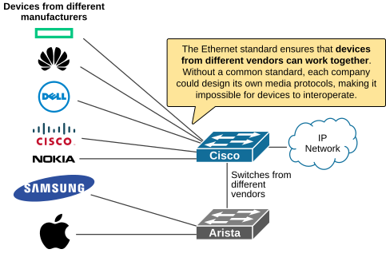
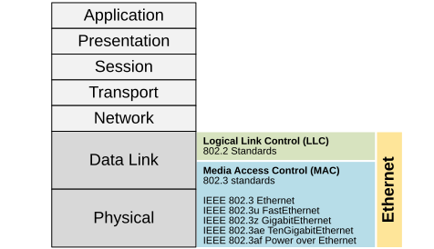

[Ethernet Technologies Overview](https://www.networkacademy.io/ccna/ethernet/ethernet-technologies-overview)
==========

This lesson begins our discussion of Ethernet. We'll explore how layer 2 networks work and how to configure and manage Ethernet switches. However, first let's take a look at the Ethernet standards.

## Why do we need the Ethernet standard?

Ethernet is a family of networking technologies used in local area networks (LANs), which are defined under IEEE 802.2 and 802.3 standards. It is the most widely used LAN technology family today.

Before we dive in, let's first clarify the question: Why do we need Ethernet standards?

The Ethernet standards ensure that all devices, regardless of manufacturer, can communicate with each other. Without standards, every company could use its own methods for cabling, signaling, and data formats, so devices wouldn't interoperate, as shown in the diagram below.

Figure 1. Why do we need Ethernet standards?

**Standards guarantee compatibility**, simplify design, reduce cost, and help networks scale easily.

## What is Ethernet?

Ethernet is **a set of networking standards** that define how devices in a local area network (LAN) communicate. It covers things like cable types, signaling, data frames, and how devices share the network medium. Ethernet is the most common LAN technology, and it allows computers, switches, and other devices to send and receive data reliably at high speeds.

The most important thing is to understand that Ethernet is not a single standard or protocol; **it's a family of standards**.

Ethernet has evolved over time to support different speeds, cable types, topologies, and features. For example, you'll see standards for 10 Mbps, 100 Mbps, 1 Gbps, 10 Gbps, and even faster rates. Some Ethernet standards use copper cabling, while others use fiber optics. The IEEE 802.3 working group manages all these variations. This is why Ethernet can fit into so many different environments — from a small home network to a large data center — because all these related standards work together to ensure interoperability and flexibility.

## Ethernet and the OSI model

The Ethernet family of protocols operates at both layer 2 (data link layer) and layer 1 (physical layer) of the OSI model. They are defined in the IEEE 802.2 and 802.3 standards.

Figure 2. Ethernet and the OSI model.

As shown in the diagram above, Ethernet standards define both Layer 2 and Layer 1 technologies. At the data-link layer, Ethernet relies on two separate sub-layers to operate, the Logical Link Control sublayer and the Media Access Control sublayer.

## LLC sublayer

The LLC sublayer is used to communicate with the upper protocol layers of the OSI model. It takes the protocol data units (PDUs) from the upper layers, which are typically IPv4 packets, and adds control information to help deliver the data to its destination.

The LLC sublayer is implemented in software and is hardware agnostic. An example of an LLC can be considered the network driver software of a server's NIC. The NIC driver is a software program that interacts directly with the NIC hardware and passes data between the MAC sublayer and the physical media.

## MAC sublayer

MAC constitutes the lower sublayer of the data link layer. The MAC sublayer is implemented in hardware, typically in the server's NIC. The Ethernet MAC sublayer has two primary functions:

- **Data Encapsulation and Decapsulation**
  - Frame Delimiting
  - Addressing
  - Error detection
- **Media Access Control**
  - Control of media access
  - Media recovery

Let's look at each of these functions more closely.

#### Data Encapsulation and Decapsulation

Data encapsulation is what happens when the MAC sublayer takes a packet from the upper layers (via the LLC sublayer) and wraps it inside an Ethernet frame. Decapsulation is the reverse — removing the frame headers at the destination.

The three key encapsulation functions are:

**Frame Delimiting** — The MAC sublayer adds a specific pattern of bits at the beginning and end of each frame to mark where it starts and stops. This is called framing. The receiving device uses these markers to know when a frame begins and ends, so it can extract the data correctly.

**Addressing** — Every Ethernet frame carries two MAC addresses: the source MAC address (the sender's NIC address) and the destination MAC address (the intended receiver's NIC address). These 48-bit (6-byte) addresses are burned into the NIC hardware and are globally unique. We'll cover MAC addresses in more detail later in this course.

**Error Detection** — At the end of each Ethernet frame, the MAC sublayer appends a Frame Check Sequence (FCS) field, which is a 4-byte checksum. The sender calculates this checksum based on the frame's contents. When the receiver gets the frame, it recalculates the checksum and compares it to the FCS value. If they don't match, the frame was corrupted during transmission and is discarded.

#### Media Access Control

The other main job of the MAC sublayer is controlling **who gets to transmit** and **when**.

In the old days, Ethernet networks used hubs and a shared cable. Only one device could send data at a time because all devices shared the same electrical circuit. If two devices sent data at the same moment, a **collision** occurred, and both transmissions were garbled.

To solve this, Ethernet used a protocol called **CSMA/CD** (Carrier Sense Multiple Access with Collision Detection). Here's how it worked:

- **Carrier Sense** — Before sending, a device "listens" to the wire to check if anyone else is transmitting.
- **Multiple Access** — Multiple devices share the same medium.
- **Collision Detection** — If two devices transmit simultaneously, they detect the collision and send a jam signal to notify all other devices. Then each device waits a random amount of time before trying again.

This is why older Ethernet networks operated in **half-duplex** mode — a device could either send or receive, but not both at the same time.

However, modern switched networks don't have this problem anymore. When you connect a device to a switch port, the connection is **point-to-point**, and the switch and the device can send and receive data simultaneously. This is called **full-duplex** communication, and it eliminates collisions entirely.

In full-duplex mode, **CSMA/CD is disabled** because there's simply no need for it. Each device can transmit freely without worrying about collisions. This is one of the main reasons why switches replaced hubs — they dramatically improved network efficiency by allowing full-duplex communication on every port.

## Ethernet Frame Format

Now that we've covered what the MAC sublayer does, let's open up an Ethernet frame and look at its internal structure. An Ethernet frame is like an envelope that carries the data across the network. Every field in the frame has a specific purpose.

| Preamble | SFD | Dest. MAC | Source MAC | Type/Length | Data (Payload) | FCS |
|-----------|-----|-----------|------------|-------------|----------------|-----|
| 7 bytes | 1 byte | 6 bytes | 6 bytes | 2 bytes | 46-1500 bytes | 4 bytes |

Figure 3. Ethernet Frame Format and Field Sizes.

The Ethernet frame consists of the following fields:

**Preamble (7 bytes)** — A series of alternating 1s and 0s that tells the receiving device "a frame is coming" and helps synchronize the clocks of the sender and receiver.

**Start Frame Delimiter (SFD) (1 byte)** — Marks the end of the preamble and signals "the real frame starts now." The last two bits of the SFD are both 1s, which breaks the alternating pattern of the preamble.

**Destination MAC Address (6 bytes)** — The MAC address of the device that should receive this frame. If this is a broadcast, it will be FF-FF-FF-FF-FF-FF.

**Source MAC Address (6 bytes)** — The MAC address of the device that sent the frame.

**Type/Length (2 bytes)** — This field identifies which protocol is inside the data portion. For example:
  - 0x0800 means the data is an IPv4 packet
  - 0x86DD means the data is an IPv6 packet
  - 0x0806 means the data is an ARP message

  In older Ethernet standards, this field was sometimes used to indicate the length of the data instead. Modern Ethernet always uses it as a Type field (EtherType).

**Data (46 to 1500 bytes)** — The actual payload being delivered. This is usually an IP packet. If the data is less than 46 bytes, padding bytes are added to reach the minimum frame size.

**Frame Check Sequence (FCS) (4 bytes)** — A cyclic redundancy check (CRC) value used for error detection. The receiving device recalculates the CRC and compares it to this value. If they don't match, the frame is corrupted and dropped.

The minimum Ethernet frame size is **64 bytes** (from Destination MAC through FCS). Any frame smaller than 64 bytes is called a **runt frame** and is considered invalid. The maximum standard frame size is **1518 bytes**, though jumbo frames (up to 9000 bytes or more) are supported on newer networks.

## Ethernet Standards Evolution

Ethernet has come a long way since its invention at Xerox PARC in the 1970s. The IEEE 802.3 working group has standardized dozens of Ethernet variants over the years. Here's a quick overview of the major ones you'll encounter as a CCNA student.

| Standard | Speed | Cable Type | Year |
|----------|-------|------------|------|
| 10BASE-T | 10 Mbps | Cat 3 or better UTP | 1990 |
| 100BASE-TX | 100 Mbps | Cat 5 UTP | 1995 |
| 1000BASE-T | 1 Gbps | Cat 5e UTP | 1999 |
| 1000BASE-SX | 1 Gbps | Multimode fiber | 1998 |
| 1000BASE-LX | 1 Gbps | Single-mode fiber | 1998 |
| 10GBASE-T | 10 Gbps | Cat 6a/7 UTP | 2006 |
| 10GBASE-SR | 10 Gbps | Multimode fiber | 2002 |
| 10GBASE-LR | 10 Gbps | Single-mode fiber | 2002 |
| 40GBASE-T | 40 Gbps | Cat 8 UTP | 2016 |
| 40GBASE-SR4 | 40 Gbps | Multimode fiber | 2010 |
| 100GBASE-SR10 | 100 Gbps | Multimode fiber | 2010 |

The naming convention follows a simple pattern: **Speed** + **Base** + **Medium**. For example:
- **1000** = speed in Mbps (1 Gbps)
- **BASE** = baseband signaling
- **T** = twisted-pair copper cabling
- **SX** = short-wavelength fiber (multimode)
- **LX** = long-wavelength fiber (single-mode)
- **SR** = short reach (fiber)
- **LR** = long reach (fiber)

As you can see, Ethernet continues to evolve, with speeds increasing from 10 Mbps in the 1980s to 400 Gbps and beyond today. But the core concepts — the MAC sublayer, the frame format, and the addressing — have remained remarkably consistent throughout this evolution.

## Auto-Negotiation

When two Ethernet devices are connected, they can automatically negotiate the best speed and duplex mode that both devices support. This feature is called **auto-negotiation**.

For example, suppose you connect a laptop that supports 10/100 Mbps to a switch port that supports 10/100/1000 Mbps. Through auto-negotiation, both devices will agree to use the highest common speed (100 Mbps) and the best duplex mode (full-duplex).

Auto-negotiation works by exchanging Fast Link Pulses (FLPs) — special electrical signals — during the link initialization phase. The devices advertise their capabilities and agree on the best common parameters.

Most Cisco switches have auto-negotiation **enabled by default**, and it's generally recommended to leave it enabled. A common source of network problems is when someone manually sets speed and duplex on one side but leaves auto-negotiation on the other — this can cause a **duplex mismatch**, leading to slow performance and errors.

## Summary

In this lesson, we covered the fundamentals of Ethernet technology:

- **Ethernet standards** (IEEE 802.2/802.3) ensure interoperability between devices from different manufacturers.
- Ethernet operates at both **Layer 1** (physical) and **Layer 2** (data link) of the OSI model.
- The data link layer is split into two sublayers: **LLC** (software, communicates with upper layers) and **MAC** (hardware, handles framing, addressing, and media access).
- The MAC sublayer is responsible for **data encapsulation** (framing, addressing, error detection) and **media access control** (CSMA/CD in half-duplex, no contention in full-duplex).
- Modern switched networks operate in **full-duplex** mode, eliminating collisions and the need for CSMA/CD.
- The Ethernet **frame format** includes preamble, SFD, source/destination MAC addresses, Type/Length, Data, and FCS fields.
- Ethernet has evolved from 10 Mbps to 400 Gbps, with standards for both copper and fiber-optic cabling.
- **Auto-negotiation** allows devices to automatically select the best speed and duplex mode.
