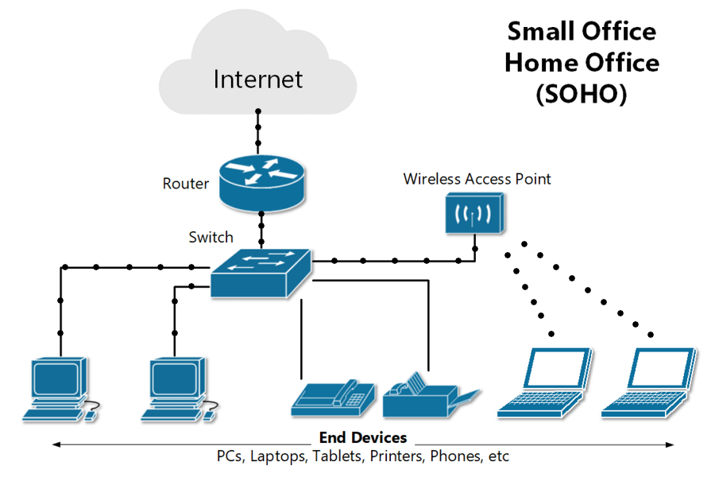
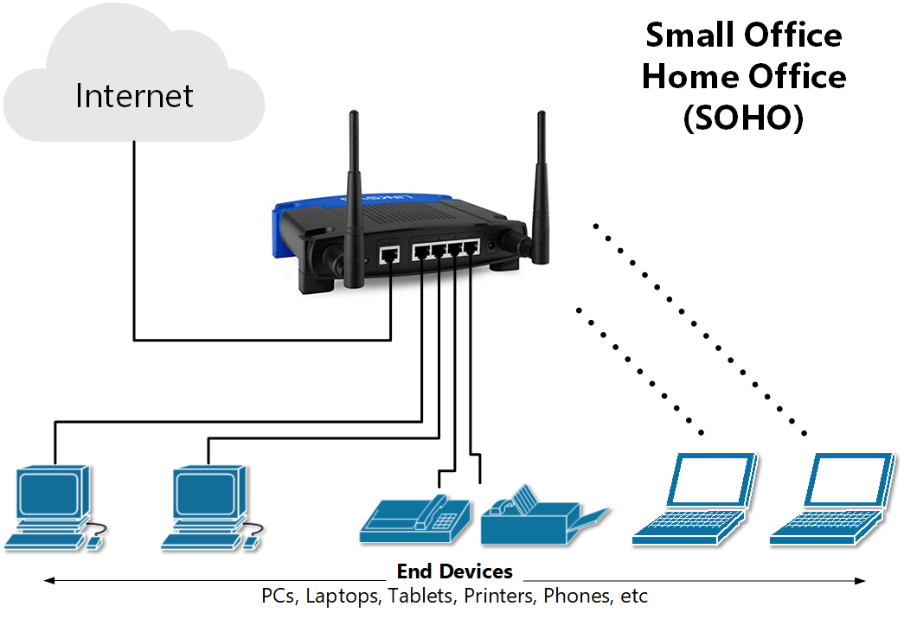
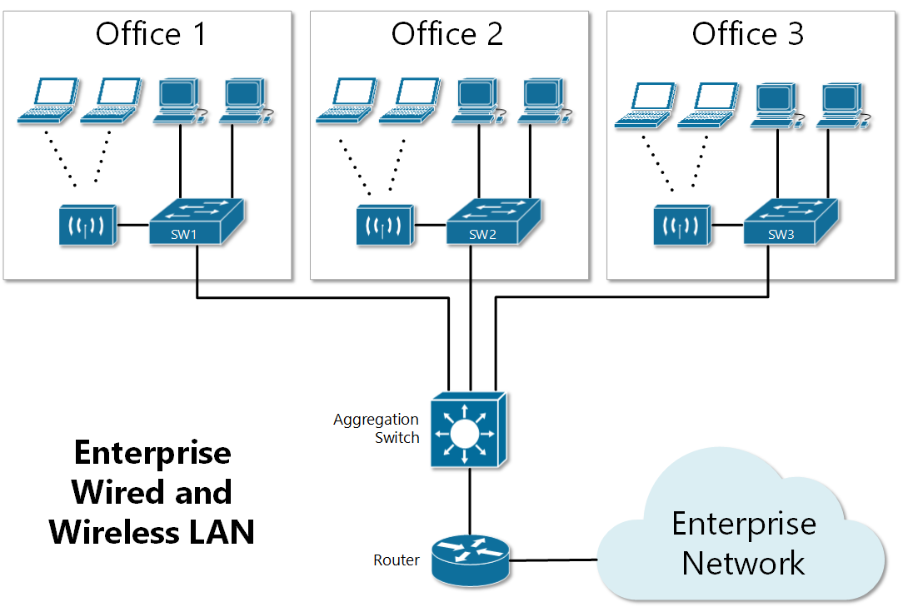

[Type of LANs](https://www.networkacademy.io/ccna/ethernet/type-of-lans)
==========

## SOHO LANs

One of the most common local-area deployments is the ***Small-Office / Home-Office*** LAN (SOHO). It is a small computer network usually built of one Ethernet switch, one router, and one wireless access point. The LAN uses Ethernet cables to connect different end-devices to one of the switch ports.

Figure 1. Typical SOHO LAN

Figure 1 shows a diagram of a SOHO Ethernet LAN with one switch, one router, and one access point. Some of the end devices are connected to the access switch with Ethernet cables and some of the mobile devices are connected via wireless. The Access point act as an Ethernet switch with the only difference that the clients are connected with radio waves instead of cables, using the IEEE 802.11 standards. Typical SOHO users primarily consume public services such an email and social media, so the traffic pattern is primarily from the Internet to the end clients.

Although in figure 1, the switch, router, and AP are shown as separate devices, many networking vendors combine them in one integrated network device specifically built for the SOHO LAN market.

Figure 2. SOHO with a single integrated network device

These types of devices, shown in figure 2, are typically referred to as a "wireless router", but they combine 4-port Ethernet switch, wireless access point, IP router, and a firewall into an all-in-one device. Usually, these types of devices are easy to set up and ready to go after unboxing, but the downside is that they have lower performance and availability and most importantly, they don't scale as well as the enterprise-grade dedicated devices. For example, the integrated device shown in figure 2 has only one routing port and 4 switch ports. Imagine if the company has three Internet providers or 30 PCs or is spread on two building floors. For that kind of scale, enterprise-grade network devices are required.

## Enterprise LANs

Enterprise networks are much larger in scale than a typical SOHO LAN. The network devices used are enterprise-grade, usually racked in wiring closets. Clients typically connect the access switches through the building's structure cabling and there is wireless access as well.

Figure 3. Enterprise Wired and Wireless LAN

Figure 3 shows a typical part of an enterprise LAN. Each office has an Ethernet switch and a wireless access point (AP). To allow communication between the offices, all access switches connect to one centralized aggregation switch. Note that if a client in office 1 wants to communicate with a client in office 2, the data path goes from switch 1 to the aggregation switch to switch 2. This is a very common pattern in enterprise LAN networks. Access switches typically don't have connections between each other but connect to centralized aggregation switch also referred to as a *distribution switch*.
