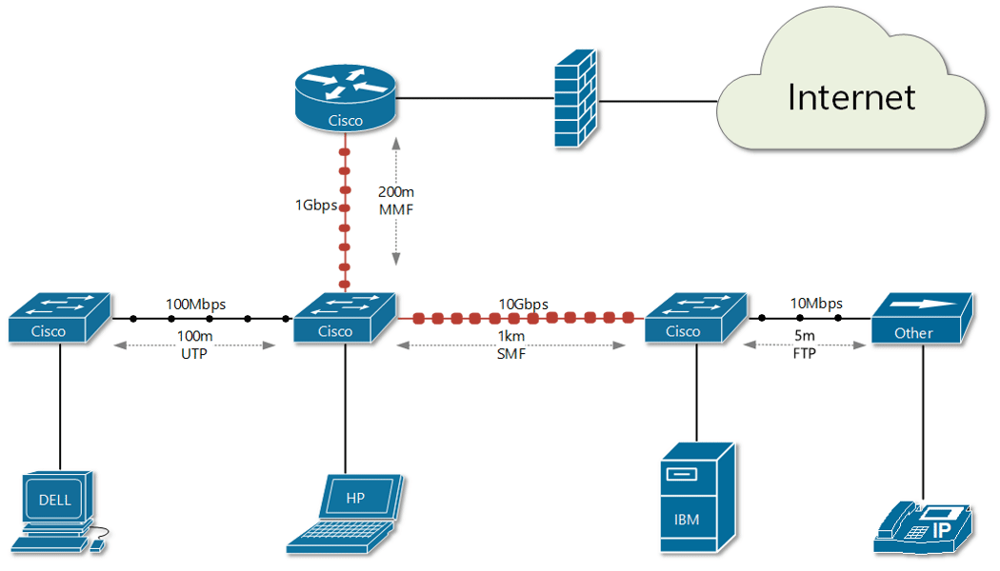
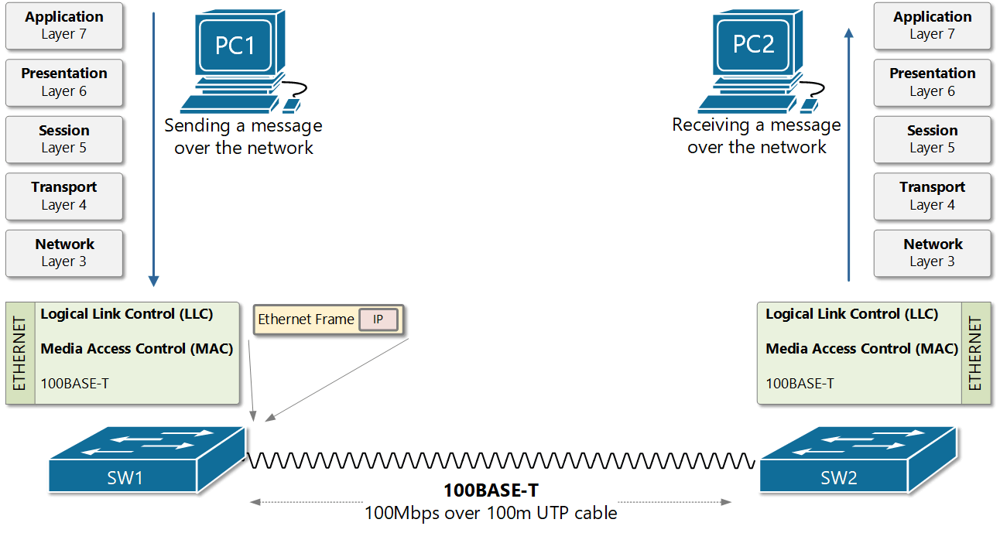

[Ethernet Physical Layer Standards](https://www.networkacademy.io/ccna/ethernet/ethernet-physical-layer-standards)
==========

## Ethernet Physical Layer

As we have already learned, *Ethernet* is not a single thing, it refers to a family of standards. The ultimate goal of the Ethernet is to act like a single LAN technology even though the data may traverse different types of links (optical and copper cables, wireless links) with different speeds (from 10Mbps trough 100Gbps), because it uses the same data-link layer standard over all links.

Figure 1. Data traversing different types of Ethernet links

Let's look at the example in figure 1. We have several network devices connected with different types of media. For example, the router and the switch below are connected with 200 meters of Multi-Mode Fiber optic at 1 Gbps speed. The switch itself connects to its adjacent switch on the right via 10 Gbps Single-Mode fiber optic cable with a length of 1 kilometer. Note also that some of the devices are not from the same vendor.

**KEY TOPIC** While the physical layer standards deal with sending bits over cables, the Ethernet data-link protocols focus on sending frames from source to destination. From a data-link perspective, network devices forward frames in a consistent manner over all physical links.

Figure 2 shows an example of this. PC1 sends a message to PC2. The message is being encapsulated down the layers of the OSI models. When it gets to the Network layer (layer 3), it is encapsulated into an IP packet. Then it is passed down to the Ethernet layers. The Logical-Link Control sublayer is responsible to receive the IP packet and to encapsulate it in an Ethernet Frame, including all necessary information such as header and trailer. Then the frame is passed to the Media Access Control Layer. The MAC layer knows what media the frame has to be sent to and how to convert the frame to 1s and 0s based on the 802.3 media standard used. If the link is IEEE802.3u FastEthernet for example, the 1s and 0s are represented as electrical signals, if for example fiber optic link is used, the 1s and 0s are send as light pulses.

Figure 2. Switches sending frames over FastEthernet LAN.

In the next lessons, we are going to learn more about the different media types and technologies. However, a network engineer must know the names of at least the most widely used Ethernet media standards such as FastEthernet and GigabitEthernet. Table 1 below shows a few of the most used ones.

Table 1. Example of most common Ethernet standards

| Speed | Common Name | Informal IEEE Standard Name | Formal IEEE Standard Name |
|---|---|---|---|
| 10 Mbps | Ethernet | 10BASE-T | 802.3 |
| 100 Mbps | FastEthernet | 100BASE-T | 802.3u |
| 1 Gbps | GigabitEthernet | 1000BASE-T | 802.3ab |
| 10 Gbps | 10 GE | 10GBASE-T | 802.3an |
| 40 Gbps | 40 GE | 40GBASE-T | |
