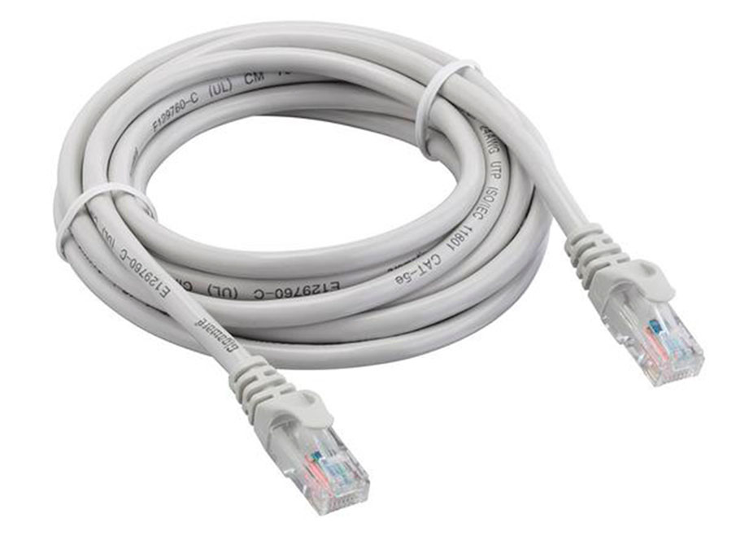
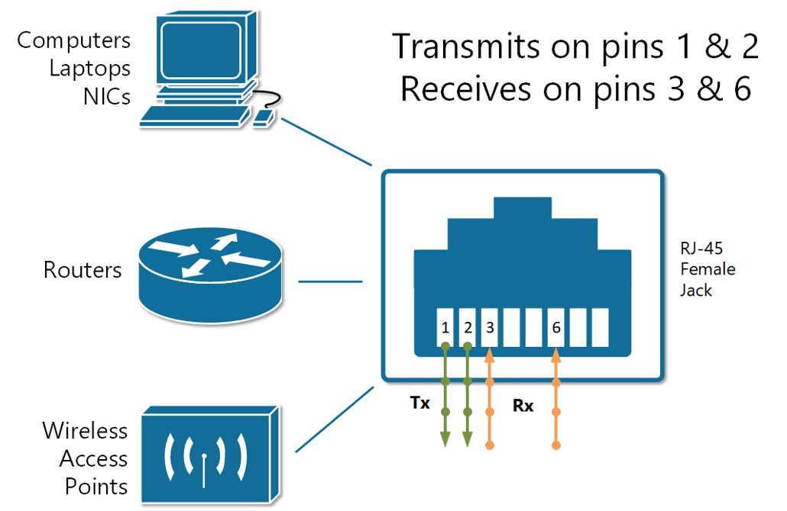
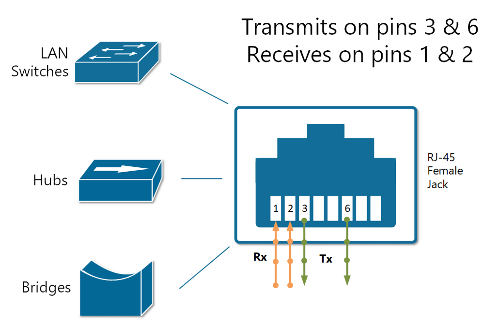
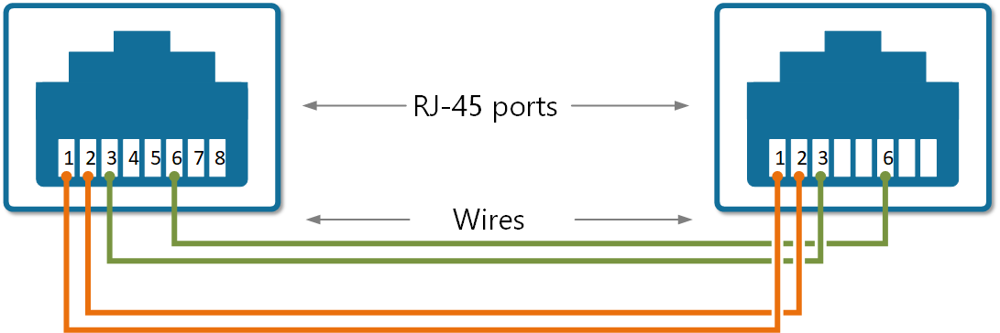
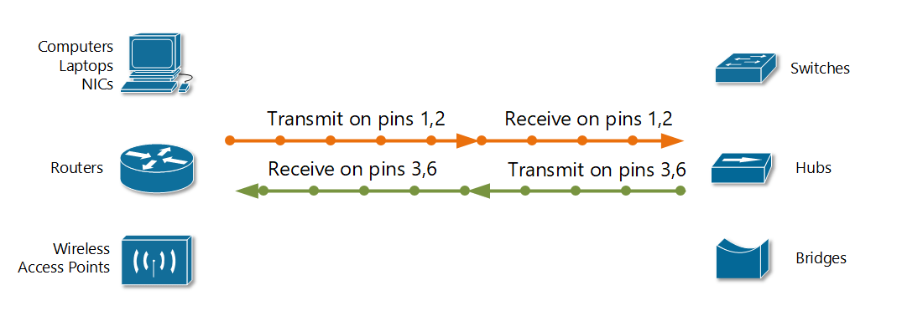
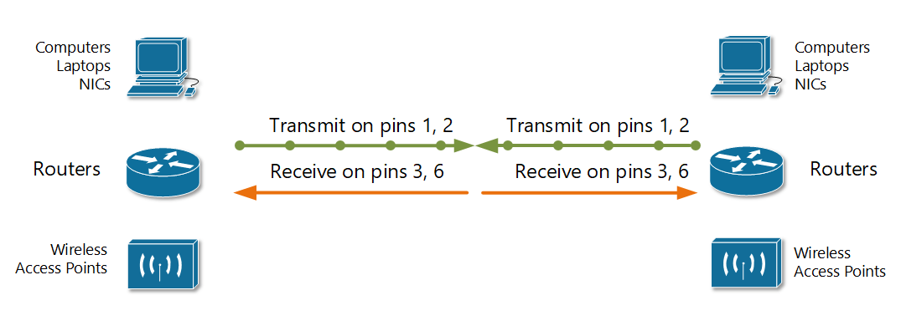
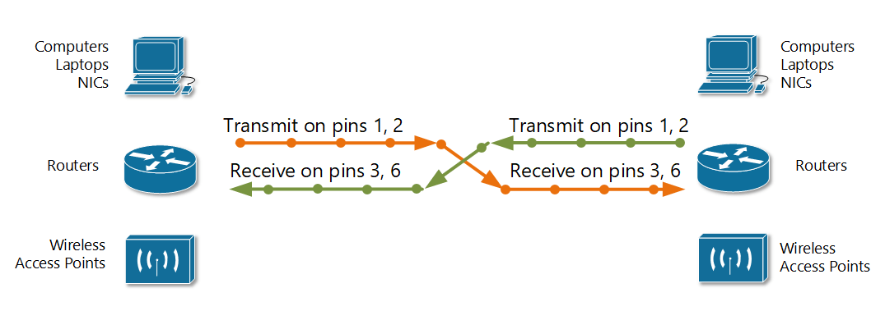
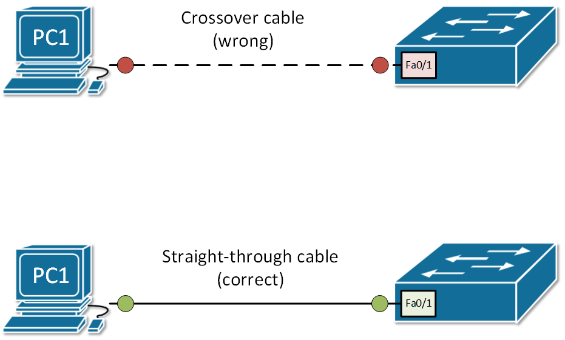

[Copper Cabling](https://www.networkacademy.io/ccna/ethernet/copper-cabling)
==========

Ethernet LANs are most widely built using UTP cables. UTP cable is made of 8 copper wires, grouped together in four twisted pairs. Each pair has a color scheme in which one wire is solid colored and the other one is the same color but striped.

Typical Ethernet UTP cable has RJ-45 connectors on both ends. Each RJ-45 connector has eight *pins* into which the eight wires can be inserted into. Based on the scheme that is used to tell each wire goes into which pin, UTP cables are **straight-through** cable or **cross-over** cable.



Figure 1. UTP Cable with RJ45 connectors

Different cable types are required when you connect different devices because some devices transmit data on pins 1&2 and receive on pins 3,6 and others transmit on pins 3,6 and receive on pins 1,2. So in order to connect the transmit pair of pins on one device to the receiving pair of pins on the other you have to use the correct cable type.

## UTP Cabling Pinouts

In order to understand the difference between the two main types of Ethernet cables: straight-through cable and crossover cable, we must first understand how different types of devices transmit electrical signals on their RJ45 ports. As an example, we will use some of those rules for the 10BASE-T and 100BASE-T Ethernet standards.

Let's first have a look at the first group of devices such as Computers, Routers, and Wireless Access Points. These devices use pins 1 and 2 to transmit data in the form of electrical signals and pair of pins at positions 3 and 6 to receive data.



Figure 1. Devices that transmit on pins 1,2 and receive on 3,6

Shown in Figure 1 is an example of an RJ-45 port that transmits on pins 1 and 2 and receives on pins 3 and 6, and the devices that use these rules for communicating over UTP copper cables.

The other group of devices such as Ethernet Hubs, Bridges and Switches use pins 3 and 6 to transmit data in the form of electrical signals and pair of pins at positions 1 and 2 to receive data. If you look closer you will see that this is exactly the opposite of the devices shown in Figure 1.



Figure 2. Devices that transmit on pins 3,6 and receive on 1,2

A straight-through cable, as the name implies, connects the wire at pin 1 on one end of the cable straight to pin 1 at the other end of the cable; the wire at pin 2 to pin 2 on the other end of the cable; pin 3 on one end connects to pin 3 on the other, and so on, as shown in Figure 3.



Figure 3. Straight-Through cable pinout

So let's look at what happens when we connect a device that transmits on pins 1,2 with a device that receives on pins 1,2. For example, a PC connected to a LAN switch using a straight-through UTP cable. As shown in Figure 4, everything works correctly because the devices on the right use the opposite pins to transmit and receive electrical signals.



Figure 4. Straight-Through Cable used between devices that transmit on opposite pair of pins

But let's look at what will happen if we connect two like devices with a straight cable as shown in Figure 5. For example, a router connected to a router or computer's NIC card connected directly to a router. The figure shows what happens on a link between the devices. The two routers both transmit on the pair at pins 1 and 2, and they both receive on the pair at pins 3 and 6. So the signal being transmitted on both sides can't get to the respective receiving end and communication is not possible.



Figure 5. Straight-Through Cable used between devices that transmit on pins 1,2

The solution to this problem is to cross-connect the cable wires in such a way, so the transmitting pins on one side to connect to the receiving pins on the other side and vice versa. If some of the wires are crossed, the cable is not "straight" anymore, that's why it is called a crossover cable.



Figure 6. Using crossover cable between devices that transmit on pins 1,2

So in summary, the logic in choosing the correct cable to connect Ethernet devices is:

- **Crossover cable**: If both devices transmit on the same pin pair
- **Straight-through cable**: If both devices transmit on different pin pairs

**NOTE** Nowadays, if you connect two Cisco devices together using whatever cable you like, the link will still work because there is a feature called ***auto-mdix*** that notices when the wrong cable is used and automatically changes its logic to make the link work. However, for the CCNA exam, you must be able to identify whether the correct cable used.

## Example of using a wrong cable

Let's look at the following example of what happens if we use wrong cable type to connect two device and auto-mdix is disabled.



Figure 7. An example of using a wrong cable type

First let's look the case where crossover cable is used and auto-mdix is disabled on this interface, so the switch cannot automatically figure out the correct pins to use.

```ini
Switch#show interface Fa0/1
FastEthernet0/1 is down, line protocol is down (disabled)
  Hardware is Lance, address is 0001.4274.6001 (bia 0001.4274.6001)
...
```

You can see that the physical status of the interface is down and the line protocol is down. Let's see what happens if we enable the auto-mdix.

```ini
Switch#conf t
Enter configuration commands, one per line.  End with CNTL/Z.
Switch(config)#int fa0/1
Switch(config-if)#mdix auto
%LINK-5-CHANGED: Interface FastEthernet0/1, changed state to up
%LINEPROTO-5-UPDOWN: Line protocol on Interface FastEthernet0/1, changed state to up
```

Now if we check the interface status, we can see that the interface is up/up and fully operational.

```ini
Switch#show interface Fa0/1
FastEthernet0/1 is up, line protocol is up (connected)
...
```

## Summary

- We use different ethernet cables based on the pinouts because **different type of devices transmit and receive electrical signals on different pins** of the RJ45 connector.
- There are two main types of copper cables based on the pinouts: **straight-through** and **crossover**. The general rule of thumb is that you use **straight-through to connect different types** of devices like PC to a switch and you use **crossover to connect devices of the same type** like to connect switch to a switch.
- Modern network devices automatically detect the cable and swaps their transmitting and receiving pins so the cable works. The protocol responsible for this is called **auto-mdix**.
- It is always a good practice to use the correct cable but it is even more important for the CCNA exam that **you correctly identify the type of cable needed** to connect a particular set of network devices.
