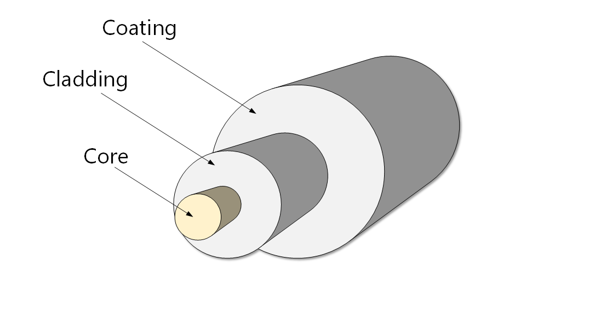
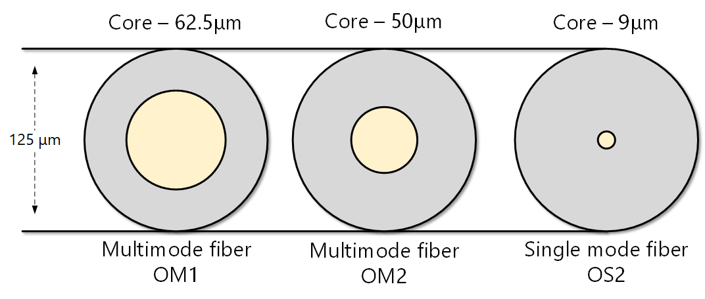
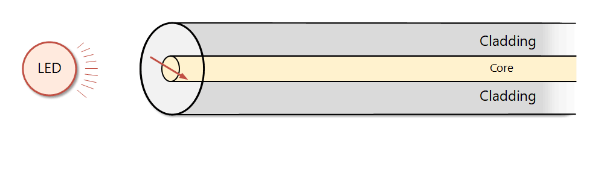
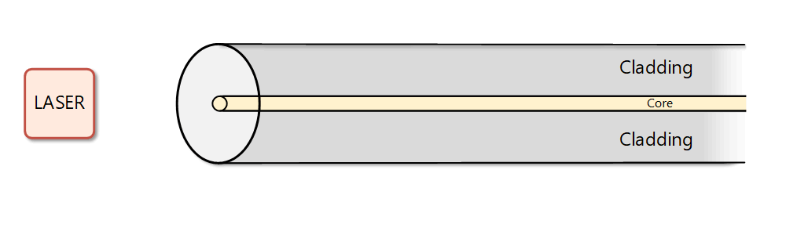
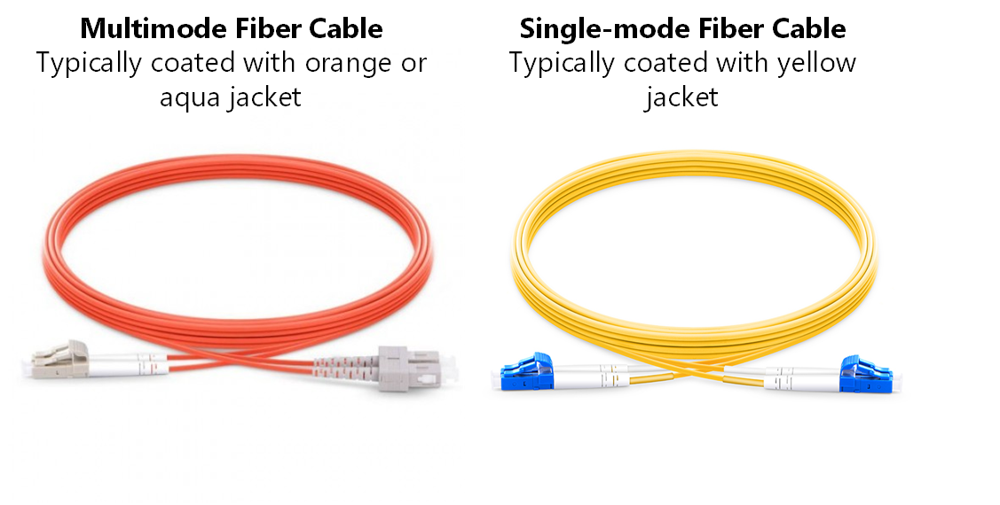

[Fiber-Optic Cabling](https://www.networkacademy.io/ccna/ethernet/fiber-optic-cabling)
==========

Fiber-optic cabling is widely used for high-speed Ethernet links over relatively long distances. It uses glass or plastic fiber as a medium through which light is "guided" to the other end of the link. The fiber-optic cable itself has several layers made from different materials and having different functions. The most important layer is the **core**, which is the very center of the cable. A light source, called transmitter or Tx, shines a light into the core. The core itself is surrounded by optical material called the **cladding** that keeps the light in the core using an optical technique called *total internal reflection*. Together the **cladding** and **core** create the environment to allow transmission of light over the cable.

Figure 1. Fiber Optic Cable Components

Figure 1 shows a simplified view of typical fiber-optic components. You can see that the *core* and *cladding* are at the very center of the cable. The outer *coating* layer protects the interior and makes the cable stronger and easier to install and manage. Depending on the cable type, the outer layer could be made of a few additional sublayers such as *buffer* and *strengthener*.

**KEY TOPIC** Depending primarily on the diameter of the core, fiber-optics are separated into two main types: **single-mode fiber (SMF)** and **multimode fiber (MMF)**.

Figure 2 shows the difference in the diameter of the core between the two types. Typically, the core of single-mode fiber is up to five times smaller than the core of multimode fiber optic.

Figure 2. Optical Fiber Core Diameters

Of course, there are other differences between the two types, which we are going to look at next.

## Multi-Mode Fiber Optics

Due to its bigger core, some of the light beams may travel a direct route, whereas others bounce off the cladding as shown in Figure 3. These alternate paths cause the different groups of light beams, referred to as modes, to arrive separately at the end of the link. Because of this, the strength of the light is reduced over long distances.

Figure 3. Multi-Mode Fiber Optics

Due to the large core size of multimode fiber, some low-cost light sources like LEDs (light-emitting diodes) and VCSELs (vertical-cavity surface-emitting lasers) are typically used. Because of this, transmission system costs (transmitters and receivers) are lower than single-mode fiber. Typical light wavelengths used are 850 nm and 1300 nm.

In summary, multimode fiber gives high bandwidth at high speeds over medium distances (up to 1km) at a lower cost.

## Single-Mode Fiber Optics

Single-mode fiber cables have up to 5 times smaller diametral core than the multi-mode cables. It allows only one mode of light to propagate through the core as shown in Figure 4. Because of this, the number of light reflections is lower than of multimode fiber, so the signal can travel further.

Figure 4. Single-Mode Fiber Optics (SMF)

Single-mode fiber typically uses a laser or laser diodes to emit light into the core. Because of this, transmission system costs (transmitters and receivers) are higher than multimode fiber. Typical light wavelengths used are 1310 nm and 1550 nm. Single-mode fiber bandwidth is theoretically unlimited because it allows only one light mode to goes through at a time.

In summary, single-mode fiber gives unlimited bandwidth at very high speeds over long distances (up to 80km) at a high cost.

## Using Ethernet with fiber-optics

A typical Ethernet link with fiber needs two fiber cables, one for each direction, and two transceiver modules such as SFP or SFP+, as shown in Figure 5. Note that the transmitting end on one device connects to a cable that connects to receiving end on the other device and vice versa with the other cable. This concept is particularly important to know when the connection is not a direct cable between two devices but goes via structured cabling systems such as Optical Distribution Frames (ODF).

Figure 5. Ethernet link with two Fiber Cables with Tx Connected to Rx on Each Cable

When the Ethernet link is not direct but is made of a few connected cables, it is very easy to cross the Rx/Tx ends and to connect the transmit side of one device to the transmit side on the other one.

## Single Mode vs Multimode Fiber

Although both types of optics are widely used, the differences between single-mode fiber cables and multimode fiber cables are still confusing for many network engineers. Let's answer the most common questions about them.

##### How can I differentiate single mode from multimode cable?

Single-mode cables are coated with yellow outer sheath, and multimode cables are coated either with orange or aqua jacket.

Figure 6. Color sheath of fiber cables

##### Which one is better - single-mode or multimode?

Each type has its own advantages and disadvantages, so there is no better one. Choosing the best fit for your network is the best. The leading factor to consider is the distance required. If the distances are longer than 500m you chose single-mode, for data centers usually multimode cables are used. Costs and upgradability are other important factors to consider.

### Full Content Access is for Subscribed Users Only...

- **Learn any CCNA, CCIE or Network Automation topic** with animated explanation.
- **We focus on simplicity.** Networking tutorials and examples written in simple, understandable language.

[Sign up for free](https://networkacademy.io/user/register)
