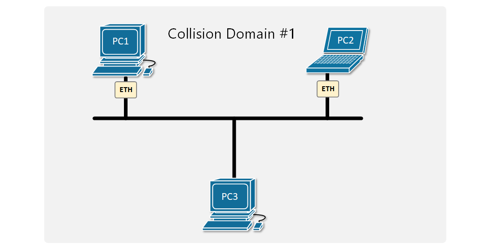
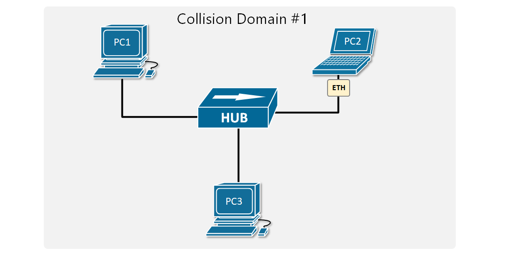
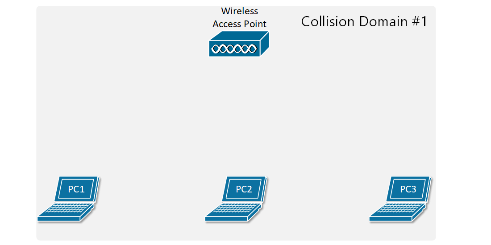
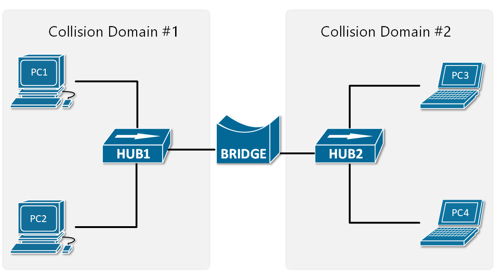
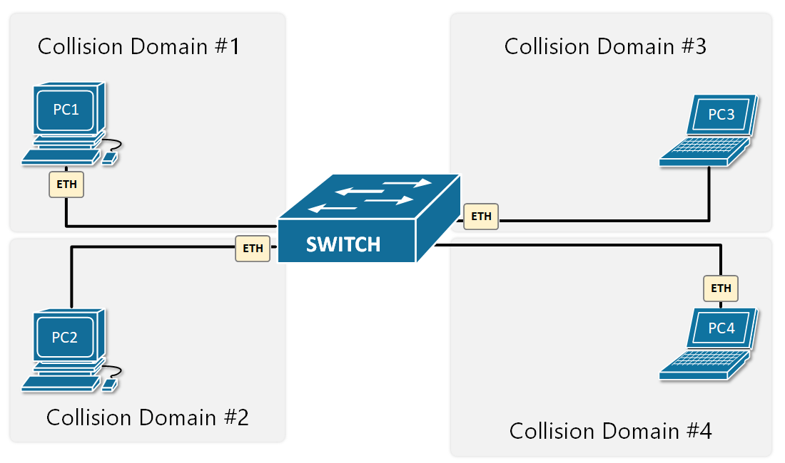

[Collision Domains](https://www.networkacademy.io/ccna/ethernet/collision-domains)
==========

To understand what a collision domain is, we have to look a little bit in the past when Ethernet LANs were built using devices like Hubs and Bridges.

## Ethernet LAN with Hubs

Ethernet Hub is a network device that is used for connecting multiple nodes and making them act as connected to a single network segment. It works purely at the physical layer of the OSI model. It has multiple ports, in which the incoming electrical signals on one port are repeated at the output of every other port. There is no forwarding logic at all.

A Hub makes all connected devices to be part of one single network segment because every electrical signal on every cable is replicated to all other cables. This creates a single shared medium and **a network collision** occurs when more than one device attempts to send a frame on the segment at the same time.



Figure 1. Example of one collision domain

Figure 1 shows an example of two PCs trying to send an Ethernet frame simultaneously. Because they are connected to a shared network segment, they are part of **one collision domain**. It is also visible in Figure 2 that only one the PCs in the collision domain may transmit at any one time otherwise collision occurs.



Figure 2. Two devices trying to transmit data simultaneously via Ethernet Hub

## Carrier-sense multiple access with Collision Detection (CSMA/CD)

So at that point, you may be wondering if collisions happen all the time, how are devices connected to an Ethernet Hub even able to communicate? There is a media access control method called CSMA/CD that devices use when trying to communicate over a shared medium. CSMA/CD stands for Carrier Sense Multiple Access with Collision Detection. The key here is the **Collision Detection**. When a device wants to transmit a frame, it checks to see if the segment is free. If the segment is not free, the device waits a random amount of time before retransmitting. If the network segment is free and two devices send frames at the same time, their signals collide. When the collision is detected, they both stop and wait a random amount of time before retransmitting.

To understand what is behind Carrier Sense Multiple Access with Collision Detection, let's look at each component individually:

- **Carrier sense** (CS): The idea that nodes may only send data over the network if the shared medium is free.
- **Multiple access** (MA): Several nodes share a network segment, so they need an access method to resolve collisions.
- **Collision detection** (CD): If a collision does occur, it will be detected and the transmission will be tried again after a random amount of time.

The concept of collision domains also applies in wireless networks because the radio signals traverse a shared medium, which is the wi-fi radio spectrum. So all things we have said by now apply to Wireless networks as well - only one node in a wireless LAN may transmit at any one time, otherwise collision occurs as shown in Figure 3.



Figure 3. Two devices trying to transmit data simultaneously via radio

Several techniques were introduced over the years to resolve this scaling problem. For now, we are going to focus only on the Wired LANs.

## Ethernet Bridges

Ethernet Bridges are the predecessor of modern LAN switches. They were introduced to resolve the scaling problem with shared segments and collisions. Bridges are layer 2 devices, which means they can read the Ethernet Header of the frames they forward and make decisions based on the information in the headers. This eliminated the need to send all frames out all ports, which practically means to repeat all electrical signals out to all ports. Therefore, Ethernet bridges split a network segment into two collision domains as shown in Figure 4.



Figure 4. Ethernet LAN with Hubs and a Bridge

At the time, that was a huge scaling improvement and enabled the creation of larger LAN segments. As local area networks grew bigger, demand for more scale was needed so devices with better performance and more interfaces were introduced - LAN switches.

## Ethernet Switches

LAN switches completely resolve the problem with collisions. They operate at layer 2 of the OSI model, meaning that they look at the ethernet header and trailer. Their main advantage is that all their ports can operate in **full-duplex**, meaning they can simultaneously transmit and receive frames on any given port at any given time. Because of this, the media access algorithm for collision detection (CSMA/CD) is no longer required and is disabled by default. Another big advantage of switches is that they forward frames based on MAC addresses, so any given frame doesn't need to be sent to all ports as hubs do.



Figure 5. Ethernet LAN with a Switch

That's why these days all wired local area networks are built with LAN switches.

## Troubleshooting Collisions

Cisco switches have pretty sophisticated interface statistics that are sufficient for troubleshooting problems in Ethernet collision domains. There are a few counters we have to check out.

#### Deferred frames

The deferred counter increases when the switch tries to send a frame out an interface but finds the carrier busy (Carrier Sense). This does not mean that there is a problem and is part of the normal Ethernet switching and forwarding process.

```plaintext
SW1#show interface Fa0/1
...
     0 output errors, 54 collisions, 10 interface resets
     0 babbles, 75 late collision, 1213 deferred
```

#### Collisions

It counts the number of collisions that occurred after the frame was sent by the switch. As explained above, it is normal to have some collisions in the network, but if the number is high, it might indicate that the collision domain is too big and must be broken down into smaller ones.

```plaintext
SW1#show interface Fa0/2
...
     0 output errors, 432 collisions, 10 interface resets
     0 babbles, 0 late collision, 320 deferred
```

#### Late Collisions

If a collision is detected after the first 512 bits of the frame was sent, it is counted as a ***late collision***. It usually points to a duplex mismatch, incorrect cabling or that the collision domain is too big.

```plaintext
SW1#show interface Fa0/3
...
     32 output errors, 9 collisions, 10 interface resets
     0 babbles, 42 late collision, 30 deferred
```

## Summary

So, in summary, the most important points about collision domains are:

- All devices connected to a Hub are in **a single collision domain**.
- When devices are in a single collision domain, they must use **half-duplex communication**. They either transmit or receive frames at any given time, but not both.
- Only **one device may transmit into the collision domain at any one time**; otherwise, a collision occurs. The other devices detect the transition with the CSMA/CD method, wait a random amount of time, and retransmit.
- Each switch interface is a separate collision domain.
- Each switch interface can transmit and receive frames at the same time, **full-duplex**.
- **CSMA/CD** is disabled by default on switches because collisions cannot occur.
