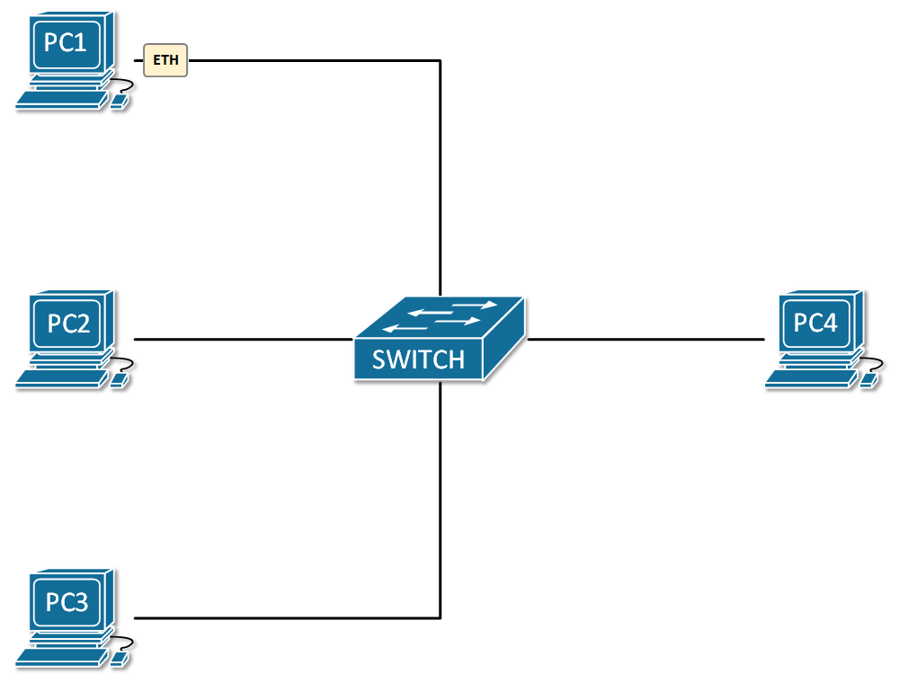
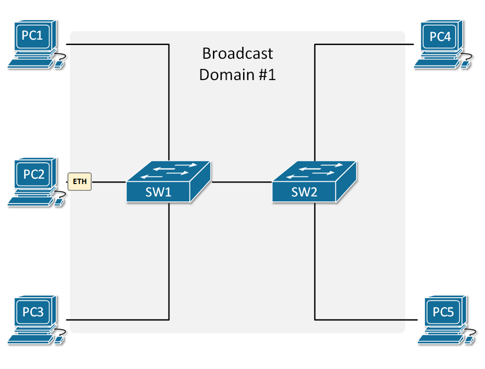
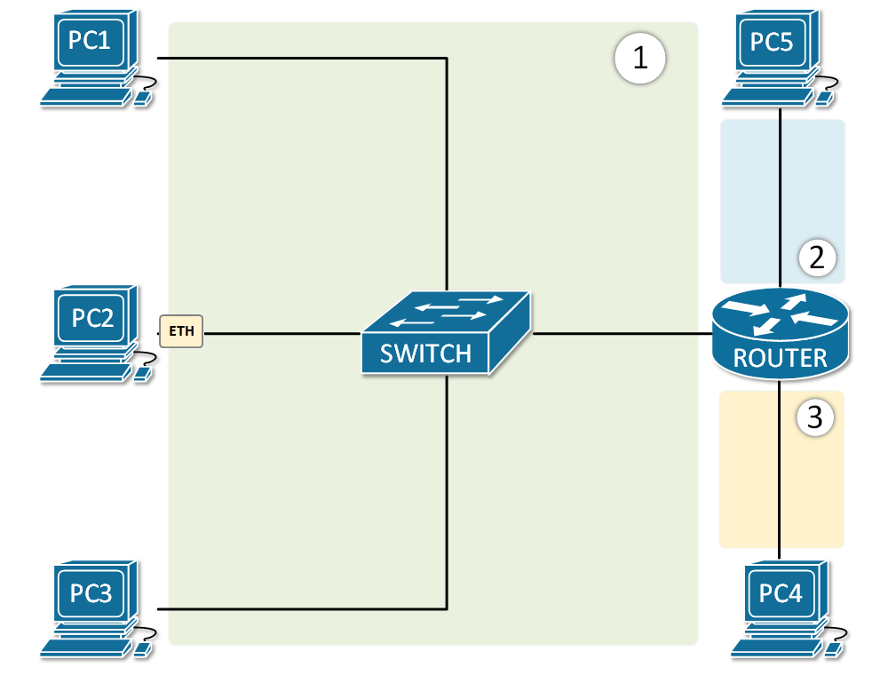

[Broadcast Domains](https://www.networkacademy.io/ccna/ethernet/broadcast-domains)
==========

## What is a broadcast domain?

In Ethernet LANs, **a broadcast is one-to-all** communication, which means that if a node sends a broadcast frame, **everybody receives a copy of it**. At the Ethernet layer, broadcast frames have a destination MAC address of FF-FF-FF-FF-FF-FF. When a switch receives a frame with this MAC, it sends a copy of the frame out all its interfaces, except the one it received the broadcast on. An example of this behavior is shown in Figure 1.

Figure 1. Example of one broadcast domain

**A broadcast domain** is a segment of the network where all devices receive a copy of every broadcast frame sent. To better understand the concept let's look at the example in Figure 1. PC1 sends a broadcast frame with a destination MAC address ff-ff-ff-ff-ff-ff. When the switch receives the frame, it looks in the Ethernet header of the frame and understands, based on the destination MAC, that this is a broadcast frame. The switch then floods the frame out all its ports, except the one it received the frame on (the port towards PC1). In the end, the broadcast frame reached all devices in the LAN - PC1 originated the frame, and PC2,3 and 4 get a copy of it through the switch. Therefore PC1,2,3 and 4 are in **one broadcast domain**.

## Multiswitch broadcast domain

The same network logic applies when the LAN is made of more than one switch. When a node sends a broadcast frame, it is "flooded" to everybody in the broadcast domain.

Figure 2. Example of a multi-switch broadcast domain

Let's look at the example in Figure 2. PC2 sends a broadcast frame with destination MAC address FF-FF-FF-FF-FF-FF. When Switch1 gets the frame, it looks at the Ethernet header and sees based on the MAC address that this is a broadcast, so it floods it out all its port, except the port, it was received on. So the frame goes out the link towards Switch2. When Switch2 receives the frame, it does the same thing as switch1. It understands based on the MAC addresses that this is a broadcast frame and floods it out all its ports. Eventually, the frame goes to every connected device in the LAN. Therefore all devices are in one broadcast domain.

This logic applies to LANs with many switches. If we connect another switch to the topology in Figure 2, the broadcast domain will be extended across the new switch, and so on.

## Broadcast Domains and Routers

At this point, you may be wondering when this flood of broadcast ends and whether a whole network environment a one broadcast domain. If we want to break down a broadcast domain into smaller domains, we use a router. **Routers don't flood broadcast frames** but instead decapsulate the ethernet frames and act upon the layer 3 information within the IP packets.

Figure 3. Example of one broadcast domain and a router

Let's look at the example in Figure 2. PC2 sends a broadcast frame. The switch floods the frame out all its ports, so PC1,3 and router 1 get a copy of it. But note that the router doesn't flood the frame to PC4 and PC5, because routers don't forward broadcast frames and the domain ends there. Every interface of the router creates a separate broadcast domain as shown in Figure 3.

There is another way to split a broadcast domain into multiple ones. It can be done with a technology called Virtual LANs (VLANs). We will have a closer look at VLANs in a separate section in this course, but for now, just have it in mind.

## Summary

So in summary, the most important points about broadcast domains are:

- **A broadcast domain** is a segment of the network where all devices receive a copy of every broadcast frame sent.
- Switches **flood broadcast traffic** out all interfaces, except the one they received the broadcast on.
- Routers stop broadcast flood and **break broadcast domains**.
- A broadcast domain can be split into smaller one with VLANs.
