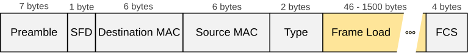
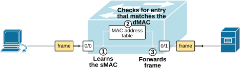
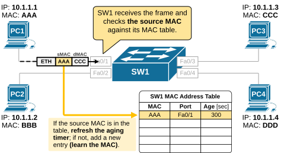
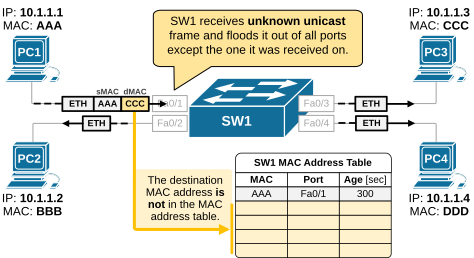
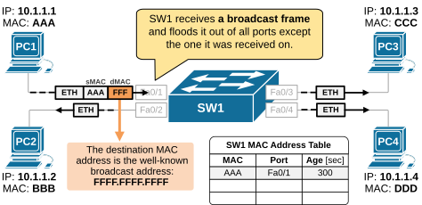
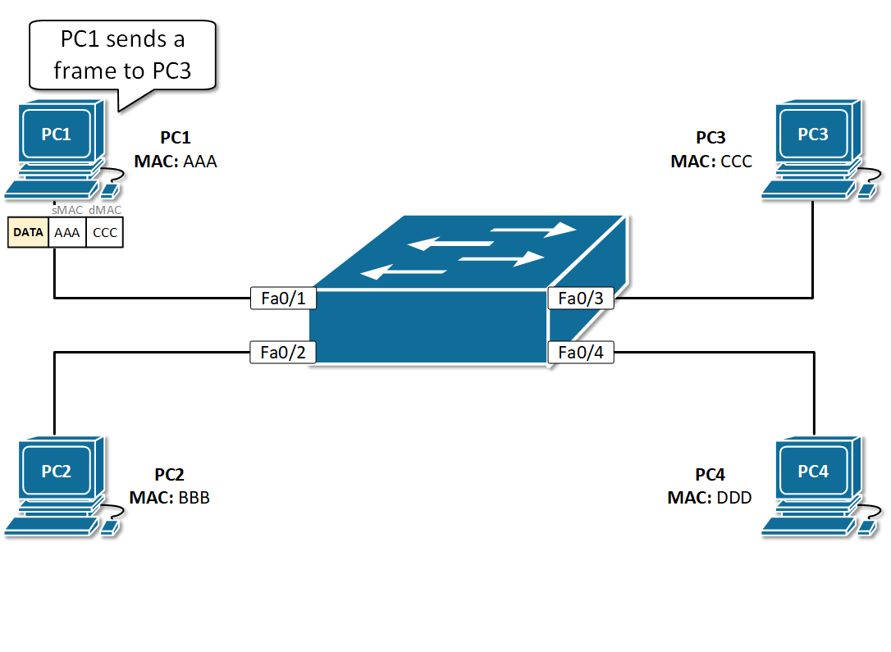
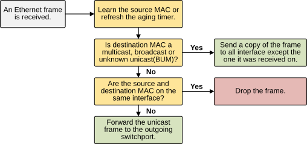

[Overview of Switching Logic](https://www.networkacademy.io/ccna/ethernet/switching-logic)
==========

# Overview of Switching Logic

This lesson begins our deep dive into LAN switching logic and **how a switch handles frame forwarding**. We will explore how a switch receives, processes, and forwards Ethernet frames based on MAC address information.

## LAN switching logic

A LAN switch forwards Ethernet frames between interfaces. To do this, a switch makes decisions **based on the source and destination MAC addresses** in Ethernet frames, whose structure is shown below.

Figure 1. Ethernet Header Structure.

When a switch receives a frame, it follows a set of rules and ultimately makes a decision on which port or multiple ports to forward the frame. The switch logic can be summarized in a few steps:

-   **Step 1. Receive** an Ethernet frame, examine the source MAC address, and update its MAC address table.
-   **Step 2. Decide** where and how to forward the frame based on the destination MAC address.
-   **Step 3. Forward** the frame:
    -   If the MAC is in the MAC table (known unicast), the switch forwards the frame **only to the correct port**.
    -   If it's not in the MAC table (unknown unicast), the switch **floods a copy of the frame out of all ports** except the one it came in on.
    -   If it's a broadcast or multicast, the switch also **floods the frame** unless special multicast handling is configured.

Figure 2. LAN Switching Logic.

There is one additional **Step 4. Aging**, which we will not cover in detail in this lesson, but it is essential to know it exists. If a MAC address isn't seen again within a certain time (default 300 seconds), it's removed from the MAC address table.

Let's start with the process of receiving frames and learning MAC addresses.

### Step 1. Receiving frames - Learning MAC addresses

Switches build their MAC address tables by examining the source MAC address of incoming Ethernet frames. When a switch receives a frame, it first checks the source MAC address. If the address is already in the MAC address table, the switch simply **refreshes the aging timer for that entry**. If the MAC address is not in the table, the switch **adds it along with the port it was received on,** as shown in the diagram below.

Figure 3. Learning MAC addresses.

This process is called **learning**. It is fundamental to how switches build their MAC address tables. Over time, when all devices exchange frames, the switch learns where every MAC address is connected.

It is important to mention that the terms *port*, *switchport*, and *switch interface* are used interchangeably. Also the switch's MAC address table is also called the switching table and CAM table (Content-Addressable Memory Table).

### Step 2. Forwarding decision

Next, the switch examines the destination MAC address in the received frame. If it finds a matching entry in its MAC table, it forwards the frame out only through the port associated with that MAC address. If the destination MAC is not in the table, the switch floods the frame out of all ports except the one it came in on. This is called **unknown unicast flooding** and is illustrated in the diagram below.

Figure 4. Forwarding unknown unicast frames.

If the destination address is a broadcast or multicast, the switch also floods the frame out of all ports except on the port the frame came in, as shown in the diagram below. This behavior is referred to as **flooding**.

Figure 5. Forwarding broadcast frames.

Remember that **switches always flood BUM traffic**. BUM stands for Broadcast, Unknown Unicast, and Multicast. These are types of Layer 2 frames that a switch cannot send to a single destination port, so it floods them to all ports.

## Summary of Switching Logic

The following diagram summarizes all the steps that we have seen so far into one animation. Notice how the switch handles the communication. The process starts when PC1 sends an Ethernet frame to PC3. Let's look closely at each step the switch takes:

1.  An ethernet frame is received on switchport Fa0/1. Each frame starts with a 7-byte preamble and a 1-byte start frame delimiter (SFD), as shown in Figure 1 above. These first 8 bytes of the frame are used to get the attention of the receiving node. Essentially, they tell the receiving node to get ready to receive a new frame.
2.  The switch examines the source MAC address, which is the physical address of PC1 - AAAA.AAAA.AAAA.
3.  The switch then checks **the source MAC address** against its MAC address table. If it is not found in the table, the switch creates a new entry. **Learn**.
4.  Next, the switch checks **the destination MAC address**.
    1.  If there is an entry in the MAC table for this address, then it sends out the frame out that interface. However, there is no entry in this case.
    2.  If there is no match in the MAC table, the switch **floods a copy of the frame out of all ports** (Fa0/2-4) except the one the frame came in (Fa0/1). **Flood**.

Figure 6. LAN Switch forwarding frames and learning MAC addresses

5.  After SW1 floods the PC1's frame, it goes to all connected devices and **eventually reaches its intended recipient**, PC3.
6.  PC3 then replies, and the same **flood-and-learn process** happens again in the opposite direction.
7.  In the end, SW1 learns on which ports PC1 and PC3 are connected, and all subsequent communication is switched directly to the connected device without using flooding.

Remember that this switching logic is referred to as **Flood and Learn**. It is the fundamental process switches use to handle unknown traffic and build their MAC address table.

When a switch receives a frame for the first time, it learns the source MAC address and then floods it out. As the switch learns more and more MAC addresses over time, **flooding happens less and less often**, and frame forwarding becomes more efficient.

## Key takeaways

The following diagram summarizes the switching logic when forwarding frames.

Figure 7. Summary of switch operations.

The most important takeaway of this lesson is to understand and remember the following terms and processes:

-   **Flood and Learn:**
    -   Learn: When a frame arrives, the switch learns the source MAC and the port it came from by creating an entry in its MAC table.
    -   Flood: If the destination MAC isn't in the table, the switch floods the frame out of all ports (except the one it came in on). The frame eventually reaches its intended recipient, who replies.
-   **BUM traffic:**
    -   Broadcast: a frame that is intended for all connected devices in the broadcast domain/VLAN/Subnet. Example: ARP.
    -   Unknown unicast: Destination MAC is not in the MAC table, so the switch floods it to all ports.
    -   Multicast: Sent to a group of devices. If no multicast optimization (like IGMP snooping) is enabled, the switch floods it like a broadcast.
-   **MAC Aging timer:**
    -   When a frame is received, the switch learns the source MAC and starts a timer for it (default is usually 300 seconds).
    -   If more frames come from that MAC, the timer is reset.
    -   If no frames come in before the timer expires, the switch removes the MAC from the table.
