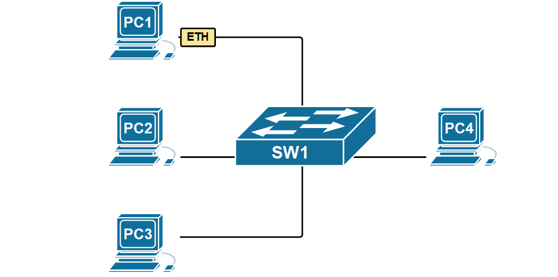
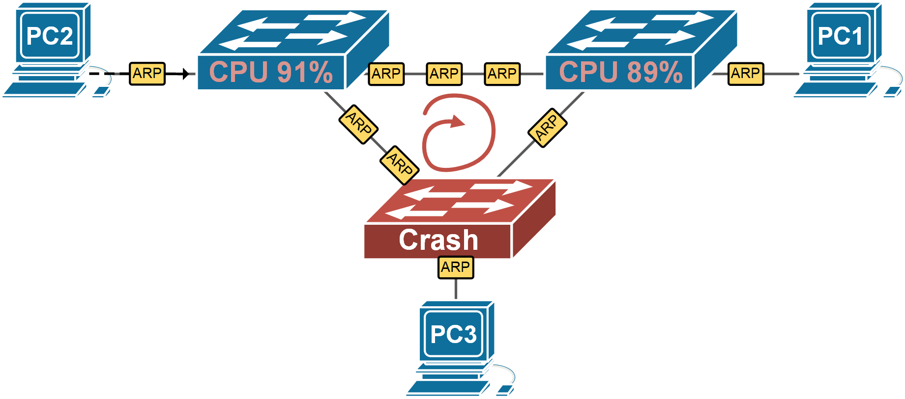
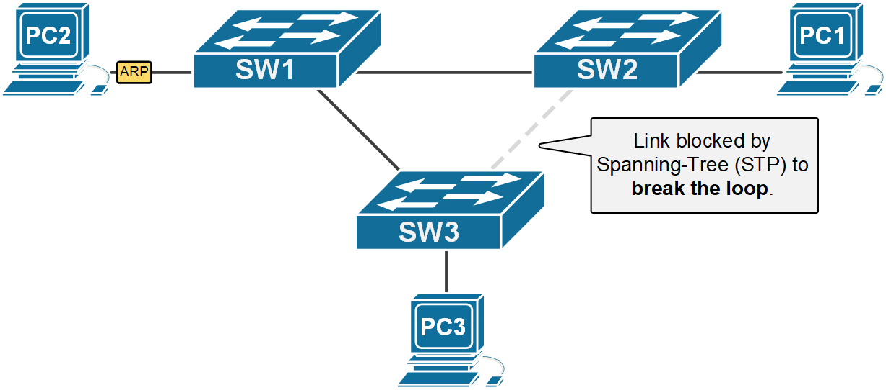

[LAN Switching with Redundant Links](https://www.networkacademy.io/ccna/ethernet/an-switching-redundant-links)
==========

# LAN Switching with Redundant Links

All LAN switching examples up until now were with simple LAN topologies. In the real world, every network topology uses redundant devices and links because availability is paramount for computer networks. Let's look at how switches behave when there are redundant links.

## Flooding BUM frames

If you recall what we have learned in the [previous lesson](https://www.networkacademy.io/cisco-ccna-200-301-complete-certification-learning-path/1/ethernet-fundamentals-ccna-students/overview-switching-logic) when a switch receives a frame, it checks the destination MAC address against its MAC table and if there is no matching entry, it forwards the frame out all interfaces except the incoming interface. This process is often referred to as **flooding** and the frame whose destination MAC is unknown is called an **unknown unicast**.



Figure 1. An Ethernet switch flooding unknown unicast frames.

The main idea here is simple - if you don't know where exactly to deliver a frame, **send it out everywhere**, and the intended recipient will eventually get it. The receiver will likely reply back. Subsequently, the switch will learn both nodes' MAC addresses and continue the future forwarding process as known unicast (not flooding the frames).

For example, look at the animation above. Suppose PC1 sends a frame destined for PC4. However, initially, SW1 doesn't know where PC4 is connected. It sends a copy of the PC1's frame to EVERYONE. PC4 will eventually get the frame and replies back. Now the switch knows where PC1 and PC4 are connected. Any subsequent communication between them will be forwarded only to the ports they are connected to, without flooding all other devices on the LAN. This is how an Ethernet network works.

Switches flood three types of Ethernet frames:

-   **Broadcast frames** - ones destined to the Ethernet broadcast address FF-FF-FF-FF-FF-FF
-   **Multicast frames** - ones destined to a MAC address that starts with bits '1110'
-   **Unknown unicast frames** - ones that have a destination MAC address that is not in the MAC address table.

Ethernet networks rely on this **flood-and-learn** behavior to work. It is straightforward to understand when there is a very simple topology with only one switch. However, if you apply this flood-and-learn to a more complex topology with multiple switches and redundant links between them, **the network breaks** because of a phenomenon called Ethernet loop. Let's see why that happens.

## Ethernet Loops (Broadcast storms)

If we apply this flooding logic to a switching topology with redundant links, a strange effect takes place. Let's look at the example shown in Figure 2. PC1 sends out a broadcast frame. When switch 1 receives the broadcast, it sends it out on all ports, except the incoming one. Therefore, it sends a copy of the frame to switch 2 and switch 3. The same happens when SW2 and SW3 receive the copies. They see that this is a broadcast and send a copy of it out on all ports except the incoming one. In the end, the flooding of this broadcast results in the frame looping around the three switches indefinitely until one of them crashes because of high CPU, or one of the links gets completely congested and unusable. This effect is referred to as *Ethernet Loop, Layer 2 Loop,* or *Broadcast Storm.*



Figure 2. Network topology with redundant links without STP.

Redundant topology like Figure 2 is necessary for high availability, but switches need to prevent the bad effect of those looping broadcast frames. To stop these loops, Cisco switches use a protocol called Spanning-Tree (STP) that causes some of the redundant links to go into a blocking state. Blocking means that the interface doesn't receive or forward frames until a network failure occurs and the link needs to be used.

**KEY TOPIC** LAN switching doesn't work in looped topologies (networks with redundant links) without a mechanism that breaks the topology into a loop-free one. The most widely used loop-preventing techniques are Spanning Tree Protocol (STP) and link aggregation, but others exist as well.

Shown in Figure 3 is an example of the same network but with a mechanism that breaks the looped topology. Note that the link between switch 2 and switch 3 is not used for frame forwarding and therefore there is no way for the broadcast frames to loop around indefinitely.



Figure 3. Redundant links with Spanning-Tree (STP).

Let's check the actual status of the link between switch 2 and switch 3 from SW3's console.

```plaintext
SW3# show interface fa0/2 
FastEthernet0/2 is up, line protocol is up (connected)
  Hardware is Lance, address is 000a.f36b.4d02 (bia 000a.f36b.4d02)
  Description: LINK-TO-SW2
 BW 100000 Kbit, DLY 1000 usec,
     reliability 255/255, txload 1/255, rxload 1/255
  Encapsulation ARPA, loopback not set
  Keepalive set (10 sec)
  Full-duplex, 100Mb/s
  input flow-control is off, output flow-control is off
  ARP type: ARPA, ARP Timeout 04:00:00
  Last input 00:00:08, output 00:00:05, output hang never
  Last clearing of "show interface" counters never
  Input queue: 0/75/0/0 (size/max/drops/flushes); Total output drops: 0
  Queueing strategy: fifo
  Output queue :0/40 (size/max)
  5 minute input rate 0 bits/sec, 0 packets/sec
  5 minute output rate 0 bits/sec, 0 packets/sec
     323256 packets input, 1933434351 bytes, 0 no buffer
     Received 3223 broadcasts, 0 runts, 0 giants, 0 throttles
     0 input errors, 0 CRC, 0 frame, 0 overrun, 0 ignored, 0 abort
     0 watchdog, 0 multicast, 0 pause input
     0 input packets with dribble condition detected
     73124 output, 26353270 bytes, 0 underruns
     0 output errors, 0 collisions, 10 interface resets
     0 babbles, 0 late collision, 0 deferred
     0 lost carrier, 0 no carrier
     0 output buffer failures, 0 output buffers swapped out
```

You can see that the interface is physically UP and the line protocol is UP, but there is no actual forwarding going on. This is due to the Spanning-Tree protocol actually blocking the interface in order to prevent broadcast looping around indefinitely as explained above. Note that the status of FastEthernet0/2 is "BLK," meaning blocking, and the port role is "Altn," meaning alternative. We are going to learn how the Spanning-Tree protocol works in great detail in the next course in our CCNA learning path called Spanning-Tree Fundamentals.

```plaintext
SW3#show spanning-tree 
VLAN0001
  Spanning tree enabled protocol ieee
  Root ID    Priority    24577
             Address     0030.F236.4D0B
             Cost        19
             Port        1(FastEthernet0/1)
             Hello Time  2 sec  Max Age 20 sec  Forward Delay 15 sec

  Bridge ID  Priority    32769  (priority 32768 sys-id-ext 1)
             Address     00D0.BC32.01DD
             Hello Time  2 sec  Max Age 20 sec  Forward Delay 15 sec
             Aging Time  20

Interface        Role Sts Cost      Prio.Nbr Type
---------------- ---- --- --------- -------- --------------------------------
Fa0/1            Root FWD  19        128.1    P2p
Fa0/2            Altn BLK  19        128.2    P2p
```

## Summary

So in summary, the most important points from this lesson are:

-   LAN networks with redundant links don't work without a mechanism that breaks the topology into a logical loop-free tree.
-   By default, Cisco switches use a protocol called **Spanning-Tree that prevents layer 2 loops**.
