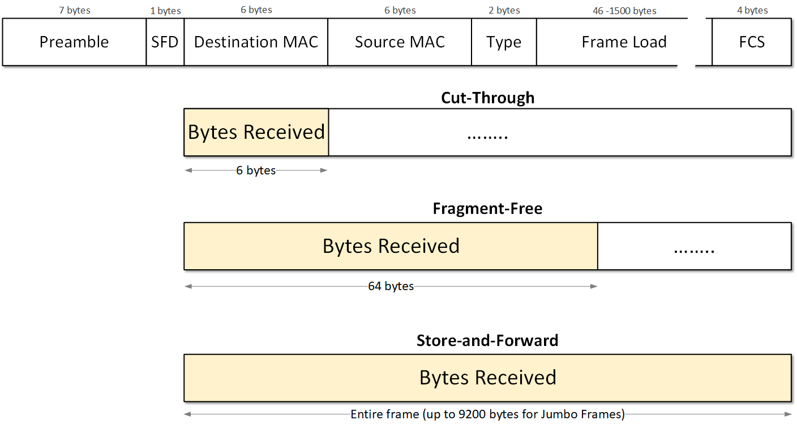
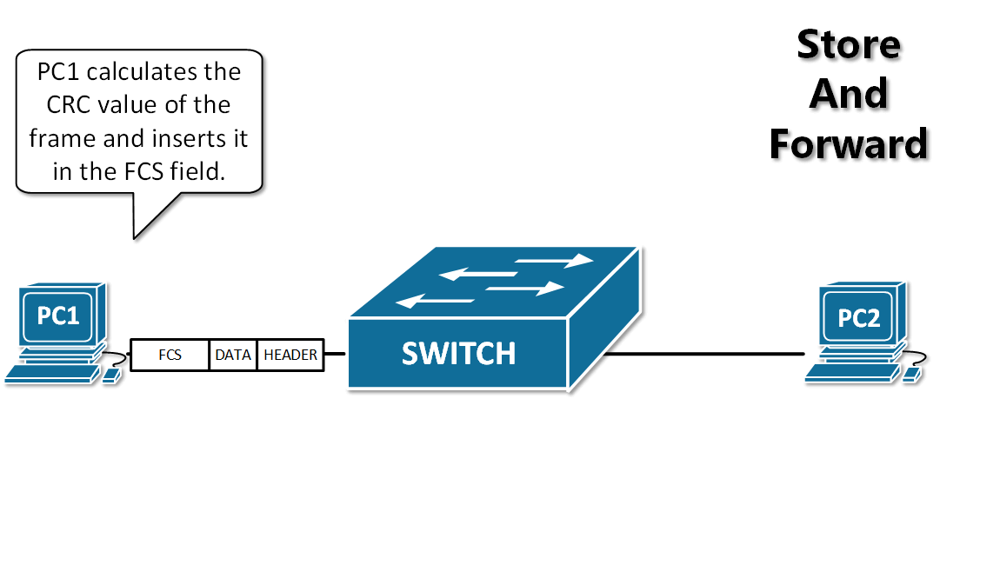
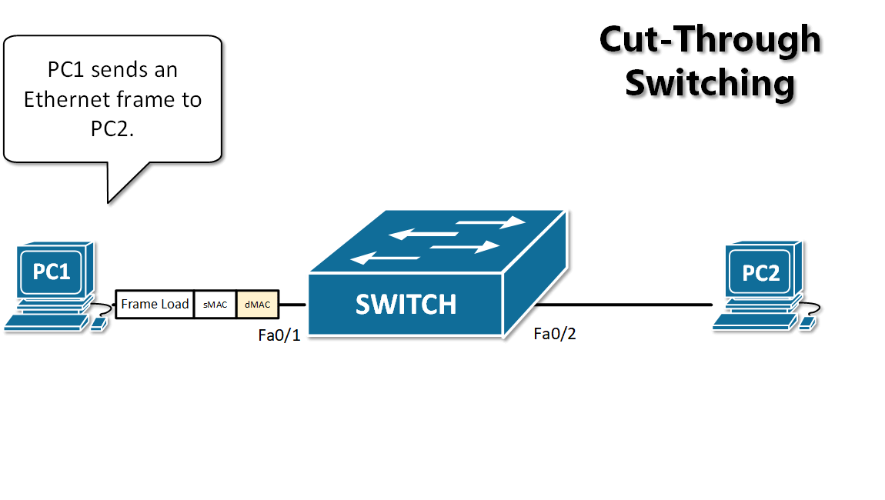

[Switching modes: Store-and-Forward vs Cut-Through](https://www.networkacademy.io/ccna/ethernet/store-and-forward-vs-cut-through-switching)
==========

# Switching modes: Store-and-Forward vs Cut-Through

As we learned in the previous lesson, the first step in switches' operational logic is to receive an Ethernet frame from the transmitting node. Depending on the type of switching methodology in use, the switch needs to receive and examine a different number of bytes before going to the next operational step and ultimately switch the frame to the outgoing port or ports. There are two main switching modes supported on Cisco switches:

-   Cut-Through mode, which has two forms:
    -   Fragment-free switching
    -   Fast-forward switching
-   Store-and-Forward mode

Both switching modes base their forwarding decisions on the destination MAC address of the Ethernet frames. They also learn MAC addresses and build their MAC tables as they examine the source MAC address (SMAC) fields in the Ethernet header as frames are being forwarded. These switching modes differ in how much of the frame must be received and examined by the switch before the frame start being forwarded out the egress port.



Figure 1. Switching Modes based on Frame Bytes Received

Figure 1 compares each of the three modes and shows how much information must be received in each mode. Let's look at each one in detail.

## Store-and-Forward Mode

Historically, the first widely used forwarding method at the Ethernet layer was referred to as "store-and-forward" switching. In this switching method, the frame has to be **received entirely** before a forwarding decision is made based on destination MAC address lookup. Once received and buffered, the switch will compare the FCS field of the frame against its frame-check-sequence (FCS) calculations to **ensure the integrity and correctness of the data**. If the CRC values don't match, the frame is marked as invalid and dropped. If the values match, the destination and the source MAC addresses are examined before the frame is forwarded.

This method creates higher latency than the other three and discards frames smaller than 64 bytes(runts) and larger than 1518 bytes (giants) by default.



Figure 2. Example of Store-and-Forward Switching Mode

Figure 2 shows an example of a switch receiving a frame and validating its integrity. Note that it is first received in its entirety before the next actions are performed.

## Cut-Through Switching

Ethernet switch that uses cut-through switching can make a forwarding decision as soon as it gets the first couple of bytes of the incoming frame. The switch does not have to wait for the rest of the frame to start switching the frame to the outgoing port.

#### Fragment-Free Mode

Switches operating in this mode must receive and examine the first 64 bytes of the frame and then make a forwarding decision. Why they need exactly 64 bytes? In an Ethernet LAN, collision fragments are detected in the first 64 bytes. This switching mode is no longer widely used these days, so we only mention it for reference.

#### Fast-forward switching (referred to just as cut-through)

A cut-through switch can **make a forwarding decision as soon as it gets the destination MAC address** of the frame, which means it needs only the first 6 bytes. It does not have to wait for the rest of the Ethernet frame to make its forwarding decision. An example of this behavior is shown in Figure 3.



Figure 3. Example of Cut-Through Switching Mode

However, more sophisticated cut-through switches today do not necessarily take this approach. They may parse an incoming frame until they have enough information from the frame content to perform all additional features. For example, if there is an Access Control List (ACL) configured on the interface, the switch must receive the frame up to the IP and transport-layer headers (20 bytes for IPv4 header and 20bytes for TCP header) to match the information there against the interface access list. This means a total of 54 bytes up to that point. Another example would be if there is a quality of service (QoS) configured or any other advanced feature.

Unlike store-and-forward switching, cut-through switching does not drop invalid Ethernet frames. They get forwarded to the next nodes until some device along the path invalidates the FCS of the frame and drops it.

A primary advantage of this switching approach is that the amount of time the switch takes to start forwarding the packet (referred to as the switch's latency) is way lower than store-and-forward switching.

## Configuring and Verifying switching modes

Most modern switch platforms come with cut-through switching mode enabled by default. You can check that using the ***show switching-mode*** command.

```ini
SW1# show switching-mode 
Configured switching mode: Cut through 

Module Number                   Operational Mode 
     1                          Cut-Through
```

If you want to enable the store-and-forward mode, you can use the following simple procedure.

```ini
SW1#  configure terminal 
Enter configuration commands, one per line. End with CNTL/Z.
SW1(config)# switching-mode store-forward 
SW1(config)# end

SW1# show switching-mode 
Configured switching mode: Store and Forward 

Module Number                   Operational Mode 
     1                          Store and Forward
```

## In Summary

So in summary, the most important points about the different switching modes are:

-   In **store-and-forward mode**, switches **receive and store the entire frame** before making any operational decision. This approach is good for keeping the integrity and validity of the frames but creates additional network latency.
-   In **cut-through switching mode**, switches **receive only a fraction of the frame** and immediately start making a forwarding decision. In this approach, switches do not drop invalid frames but forward them to the next node. However, the network latency is lower than with the store-and-forward approach.
