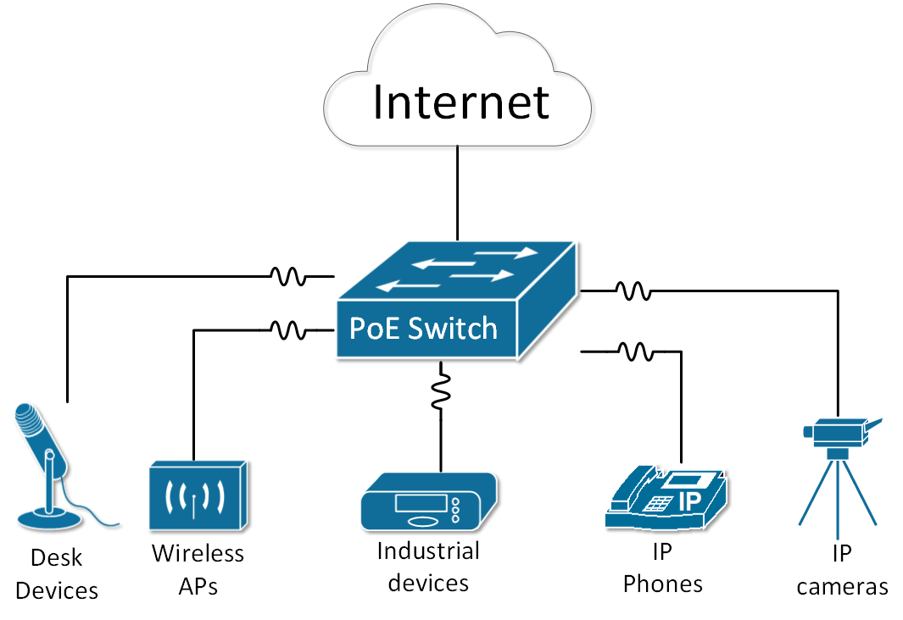
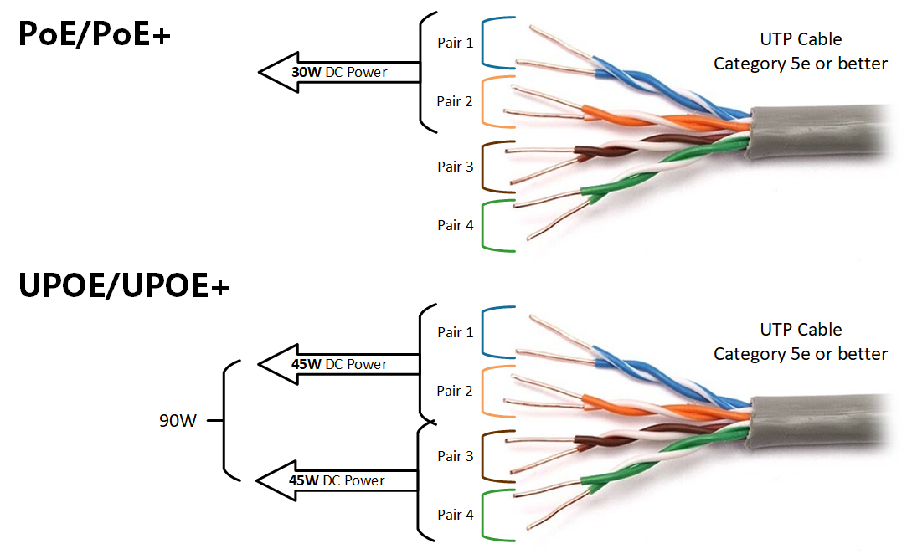
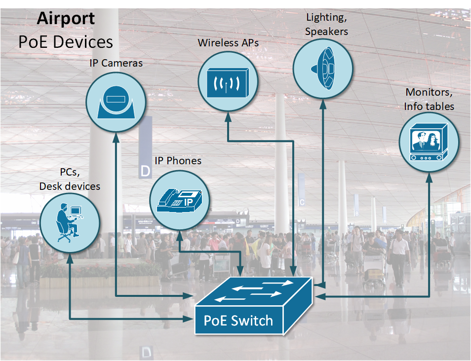

[Power over Ethernet (PoE, PoE+, UPOE, UPOE+)](https://www.networkacademy.io/ccna/ethernet/power-over-ethernet)
==========

# Power over Ethernet (PoE, PoE+, UPOE, UPOE+)

## PoE and PoE+

Power over Ethernet (PoE) is a widely used LAN technology that **provides DC power to endpoints** over existing copper Ethernet cabling used for data connectivity. Power is passed from Power Sourcing Equipment (PSE) over the twisted pairs to Powered Devices (PD) such as IP phones, IP cameras, card readers, selling machines, wireless access points, and other industrial and building appliances.



Figure 1. An Ethernet switch providing power to end clients

There are two specifications for standard PoE implementations, IEEE 802.3af (2003) and IEEE 802.3at (2009), which accommodate different power levels. They do not affect the data speed level 10/100/1000 Mbps to the PD though.

The first standard **IEEE 802.3af PoE provides up to 15.4W** on DC power per switch interface (PSE side). Due to power dissipation in the cable, only 12.95W of this is guaranteed to be available at the end client. With the technology getting popular and widely deployed, the power requirement of end clients increased. This led to the introduction of the IEEE 802.3at standard, known as PoE+. **It provides up to 30W** of DC power per switch interface, assuring 25.5W of power at the end device.

Both standards deliver electrical power over two out of four pairs in the UTP cable, cat5e or better.

## Cisco UPoE and UPoE+

Over the years, IP networks have evolved and connected devices required greater power. To meet this demand, Cisco two improved Power over Ethernet technologies - Cisco Universal Power over Ethernet (UPoE) and Cisco Universal Power over Ethernet Plus (UPoE+), which **tripled the power provided per switch interface**.



Figure 2. Comparison of PoE/PoE and UPOE/UPOE+ cabling

It uses the same cabling standard as Power over Ethernet but instead of delivering power over two of the twisted pairs, it uses all four twisted pairs in the Category 5e or better cable.

Table 1. PoE, PoE+, and Cisco UPOE+, UPOE comparison

|   | PoE | PoE+ | UPoE | UPoE+ |
|---|---|---|---|---|
| Minimum cable type | Cat. 5e | Cat. 5e | Cat. 5e | Cat. 6a |
| IEEE standard | 802.3af | 802.3at | Cisco proprietary | Cisco proprietary |
| PoE Type Designation | Type 1 | Type 2 | Type 3 | Type 4 |
| Maximum power per interface | 15.4W | 30W | 60W | 90W |
| Maximum power at the end device | 12.95W | 25.5W | 51W | 71.3W |
| Number of twisted pairs used | 2 | 2 | 4 | 4 |
| Max Cable Length | 100m | 100m | 100m | 100m |

## Device detection and negotiation process

When you connect an end device to a PoE enabled interface, the switch sends out a detection pulse and waits for a valid detection signature (as defined in 802.3af/at). When the end device responds to this pulse by drawing a standard amount of current, which tells the switch what PoE class the end client is.

Table 2. Power ranges of different classes of end devices

| Class | Power(W) |
|---|---|
| 0 | up to 12.95W |
| 1 | up to 3.84W |
| 2 | 3.84W to 6.49W |
| 3 | 6.49W to 12.95W |
| 4 | 12.95W to 25.5W |

This process is called a *hardware handshake* or *PoE handshake* and as the name implies, it is implemented in the switch's hardware.

There is another software-based approach to negotiate the power consumption of an end device. It is done using the Link Layer Discovery Protocol (LLDP), which is a data link layer protocol for advertising network capabilities.

## Configuring and Verifying PoE on Cisco switches

Typically, every series of Cisco switches has models that support power over ethernet and models which don't. This can be easily seen in the name of the switch model indicated with the letter P. For example, WS-C3850-24T-L is not PoE capable and WS-C3850-24**P**-L is PoE capable.

By default, all switch ports are in PoE mode *auto,* which means that if the interface detects that PD is connected, it automatically starts providing power. This can be checked using the ***show power inline*** command. Let's look at the following example:

```ini
Switch#show power inline
Available:370.0(w)  Used:60.0(w)  Remaining:310.0(w)

Interface Admin  Oper       Power   Device              Class Max
                            (Watts)
--------- ------ ---------- ------- ------------------- ----- ----
Fa0/2     auto   on         10.0    IP Phone 7960       3     15.4
Fa0/3     auto   on         10.0    IP Phone 7960       3     15.4
Fa0/4     auto   off        0.0     n/a                 n/a   15.4
Fa0/5     auto   off        0.0     n/a                 n/a   15.4
Fa0/6     auto   off        0.0     n/a                 n/a   15.4
Fa0/7     auto   on         5.0     Light Weight Access Point0n/a   15.4
Fa0/8     auto   on         5.0     Light Weight Access Point1n/a   15.4
Fa0/9     auto   off        0.0     n/a                 n/a   15.4
Fa0/10    auto   off        0.0     n/a                 n/a   15.4
Fa0/11    auto   off        0.0     n/a                 n/a   15.4
Fa0/12    auto   off        0.0     n/a                 n/a   15.4
Fa0/13    auto   on         10.0    IP Phone 7960       3     15.4
Fa0/14    auto   off        0.0     n/a                 n/a   15.4
Fa0/15    auto   on         10.0    IP Phone 7960       3     15.4
Fa0/16    auto   on         10.0    IP Phone 7960       3     15.4
Fa0/17    auto   off        0.0     n/a                 n/a   15.4
Fa0/18    auto   off        0.0     n/a                 n/a   15.4
Fa0/19    auto   off        0.0     n/a                 n/a   15.4
Fa0/20    auto   off        0.0     n/a                 n/a   15.4
Fa0/21    auto   off        0.0     n/a                 n/a   15.4
Fa0/22    auto   off        0.0     n/a                 n/a   15.4
Fa0/23    auto   off        0.0     n/a                 n/a   15.4
Fa0/24    auto   off        0.0     n/a                 n/a   15.4
```

Note that the switch says it has 370W of power available to end clients, currently 60W are used so 310W remains. As explained above, all devices are in Admin state *auto.* Note that interface Fa0/1 is not shown in the output. This is because PoE is explicitly disabled on this port by the network administrator. This is done using the ***power inline never*** command in interface configuration mode. Let's see how interface FastEthernet 0/1 was configured.

```ini
Switch#configure terminal
Enter configuration commands, one per line.  End with CNTL/Z.

Switch(config)#interface fa0/1
Switch(config-if)#power inline ?
  auto   Automatically detect and power inline devices
  never  Never apply inline power

Switch(config-if)#power inline never 
Switch(config-if)#end
Switch#
%SYS-5-CONFIG_I: Configured from console by console
```

If you want to see more detailed information about a specific interface you can use the following command:

```ini
Switch#show power inline FastEthernet 1/5
Available:750(w)  Used:11(w)  Remaining:739(w)

Interface   Admin      Oper               Power(Watts)  Device    Class
                                From PS    To Device                    
-------- ------ ----- -------- ---------- ------------ -------- --------
Fa1/5       auto       on         11.2       10.0       Ieee PD     0    

Interface  AdminPowerMax   AdminConsumption    
               (Watts)                  (Watts)           
---------- --------------- --------------------  
Fa1/5          15.4                    10.0
```

## Common Use Cases

In today's world, buildings infrastructure is getting more complex every day. Subsystems such as lighting, cooling, security and communication are getting more difficult to manage and operate. Power over Ethernet provides a technical solution that combines these independent infrastructures into a common medium - Ethernet network.



Figure 3. An airport powered by Power over Ethernet (PoE)

Imagine a large international airport, for example, there are hundreds of security cameras, body temperature sensors, information tables, barcode scanners, phones and all kind of devices that are part of the airport operations. All those devices need power, but there are no power outlets and wall sockets everywhere and it is not safe and convenient to deploy electrical circuits to all devices in such congested with people buildings. The natural solution is to use power over ethernet because all those sensors and devices need network connectivity as well. Using single cable for both data and power is the best fit for most of the infrastructure systems.

Other industries where PoE is widely deployed are retail, hotels, enterprise IT, hospitals and industrial facilities.

## Benefits of PoE

-   **Cost-effectiveness and Flexibility:** Using PoE instead of conventional electrical wiring decreases significantly the electrical costs of installation of wall circuits. It also provides more granular control of connected devices and enables more complex features around device powering such as automation, scheduled power off - power on, and many more.
-   **Manageability and Simplicity**: Powering end devices over Ethernet cables eliminates the need to position the device close to the power circuit. It also improves the standardization of powering, eliminating different types of AC-DC adapters and connectors, which makes the infrastructure easier to manage and operate.
