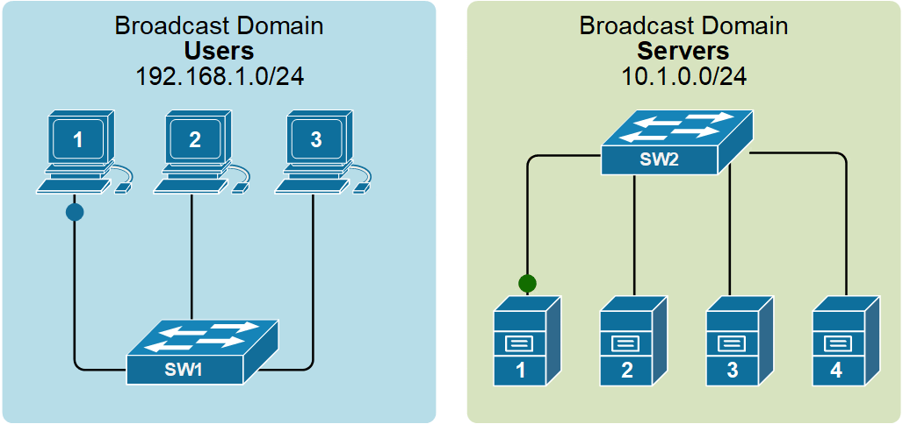
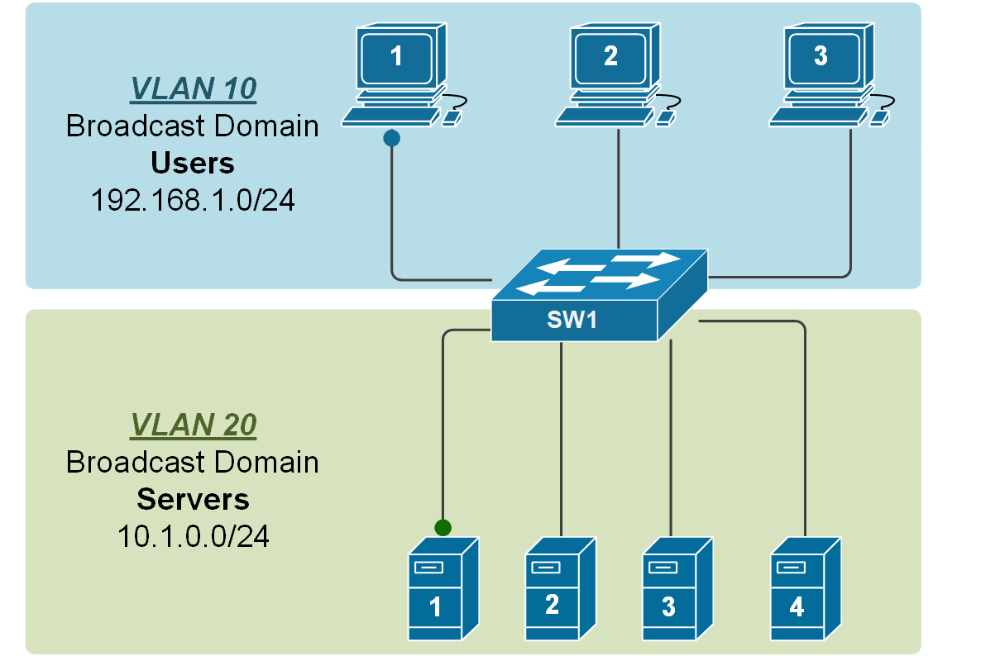
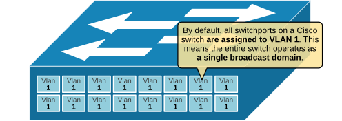
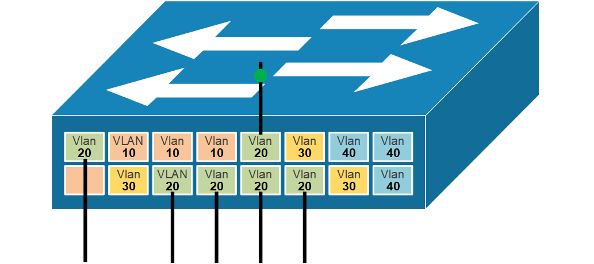
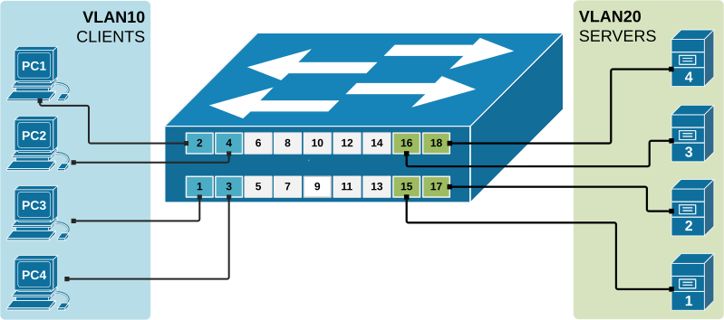
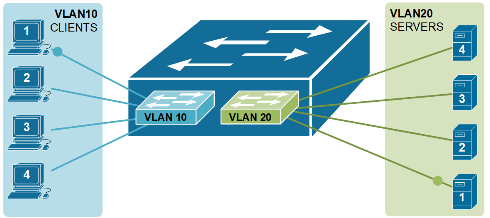

[VLAN Concept](https://www.networkacademy.io/ccna/ethernet/vlan-concept)
==========

# VLAN Concept

This lesson discusses arguably the most important topic in the networking field - Virtual LANs (VLANs). It is a simple yet very powerful concept that changed the network industry and is nowadays used in EVERY network.

## LAN switches and BUM traffic

Before understanding the VLAN concept, you must first understand two core concepts about the Ethernet standard - what is **a broadcast domain** and what **BUM traffic** is. Let's start with the BUM data type. BUM stands for broadcast, unknown unicast, and multicast. When a LAN switch receives a frame that belongs to one of these types, it sends the frame to all its ports except the port it received the frame on. This behavior is shown in the diagram below.



Figure 1. LAN switch forwards BUM traffic (animated).

A broadcast domain includes all connected devices that get a copy of any broadcast, unknown unicast, or multicast (BUM) frame being sent. In the above figure, the blue LAN on the left is one broadcast domain, and the green LAN on the right side is another broadcast domain. A general rule of thumb is that a single LAN is equal to a Broadcast Domain, which is equal to a Subnet, as shown below.

```plaintext
LAN = Broadcast Domain = Subnet
```

Back in the old days, a broadcast domain was equal to one physical switch. Every BUM frame was sent out to all switchports except the port it was received on. However, the introduction of VLANs changed that forever.

## Why do we need VLANs?

By default, all interfaces on a Cisco switch are **in the same broadcast domain**. Therefore, when a broadcast frame is received on any switch port, the switch forwards it out to all its other ports. At the same time, organizations want to isolate different users into separate broadcast domains. For example, the R&D department must be isolated from the HR department.

-   R&D needs to keep their secret project work confidential.
-   HR must protect sensitive information like employee salaries.

However, if they share the same broadcast domain, R&D's BUM traffic reaches HR users, and HR traffic reaches R&D users. This creates security and privacy issues. By placing each department in its own broadcast domain, organizations keep traffic separated and improve both control and privacy.

**But how do we separate some users into different broadcast domains?** (if VLANs don't exist)

You must connect each different group of users to a different physical switch. But how many different physical switches can you have in the network? What if the organizations want to have hundreds or thousands of separate broadcast domains? Can you really have thousands of physical switches to isolate some BUM traffic from others? Of course not. At some point, people realized that there is another way - we can isolate broadcast domains logically.

## What are VLANs?

We have said that to create two separate LANs (such as one for servers and one for users), we must use two different physical switches, as shown in the diagram above. This approach is not scalable; imagine if your organization wants to have a thousand separate LANs, it has to have **thousands of physical switches**. This scaling limitation is the reason why Virtual LANs were introduced.

By using VLANs, **a single switch can act as multiple logical switches** and create multiple broadcast domains. This is done on a port-by-port basis. Using the following diagram as an example, the ports where the users are connected are configured to be part of VLAN10 (or, in other words, to be connected to virtual switch 10), and the ports where the servers are connected are configured to be part of VLAN20 (or in other words to be connected to virtual switch 20). The switch will then never forward a frame sent by any user to any of the servers and vice-versa because they are part of different broadcast domains.



Figure 2. Two broadcast domains using a single switch (animated).

## How do VLANs work?

VLANs are actually a very simple concept (but very powerful at the same time). A VLAN is simply a number between 1 and 4096. **Each switch port is always assigned to a specific VLAN number**. Ports assigned to the same VLAN number are in the same broadcast domain. That's it. That is what VLANs are.

By default, **all switchports on a Cisco switch are assigned to VLAN 1**, as shown in the diagram below. This means the entire switch operates as a single broadcast domain. Any BUM frame (broadcast, unknown unicast, or multicast) sent by one device is received by all other devices connected to the switch. This is called a flat network, with no separation between users or devices.



Figure 3. Cisco Default VLAN 1.

When we want to separate some devices into separate broadcast domains, we configure different switchports with different VLAN numbers. All devices within the same VLAN receive BUM traffic from other devices in that VLAN. However, devices in different VLANs do not receive those BUM frames.

For example, we can configure all switchports that connect to servers with VLAN number 20. Then, any BUM traffic received on ports assigned to VLAN 20 goes out **ONLY to other ports assigned to VLAN 20**, as shown in the diagram below.



Figure 4. VLANs per port view (animated).

The switch uses the port's VLAN assignment to decide which broadcast domain the traffic belongs to. If two devices are on different VLANs, even if they are connected to the same switch, **they cannot communicate directly**.

## Benefits of using VLANs

Using VLANs not only improves the scaling of the LAN. It has many more advantages, such as:

-   **It improves security** by reducing the number of end stations that receive copies of BUM traffic.
-   **It creates smaller fault domains** by isolating different groups of devices in separate broadcast domains.
-   **It reduces the CPU overhead** on each device in the LAN by limiting the number of broadcast frames received.
-   **It improves network performance** and speed of failure recovery.

## Creating VLANs on a Cisco switch

Cisco switches do not require any initial configuration to work. You just unbox the device, install the cabling, power it up, and it works. By default, all interfaces are in VLAN 1. This means that all devices connected to the switch are in the same broadcast domain and must be in one subnet. This logic also applies if you connect multiple default setting switches together. They create one multiswitch broadcast domain, which implies all connected clients must be on the same IP subnet. At some point, you will need to connect clients that are in different subnets, though. This means that VLANs must be created.

To configure VLANs on a Cisco switch, additional configuration must be added. There are two main steps for creating a new VLAN:

-   **Step 1**. Create a new VLAN in the switch VLAN database
    -   In global configuration mode, we use the **vlan [vlan-id]** command to create the new VLAN in the switch's database.
    -   (Optional) In VLAN configuration mode, we use the **name [name]** command to assign a name to the VLAN.
-   **Step 2**. Assign interfaces to the newly created VLAN.
    -   In global configuration mode, we use the **interface [number]** command to move into the interface configuration mode.
    -   We then use the **switchport access vlan [id]** to specify the VLAN number associated with the interface.
    -   (Optional) We use **switchport mode access** to make the port always operate as an access port.

For this example we will use the following topology. We will create two VLANs - VLAN10 named CLIENTS and VLAN20 named SERVERS and will assign four access ports to each VLAN as shown in the diagram below.



Figure 5. Example of a switch with two VLANs.

First, let's look at the default VLAN database using the command shown in the output below.

```plaintext
Switch# show vlan brief 

VLAN Name                             Status    Ports
---- -------------------------------- --------- -------------------------------
1    default                          active    Fa0/1, Fa0/2, Fa0/3, Fa0/4
                                                Fa0/5, Fa0/6, Fa0/7, Fa0/8
                                                Fa0/9, Fa0/10, Fa0/11, Fa0/12
                                                Fa0/13, Fa0/14, Fa0/15, Fa0/16
                                                Fa0/17, Fa0/18, Fa0/19, Fa0/20
                                                Fa0/21, Fa0/22, Fa0/23, Fa0/24
                                                Gig0/1, Gig0/2
1002 fddi-default                     act/unsup    
1003 token-ring-default               act/unsup 
1004 fddinet-default                  act/unsup 
1005 trnet-default                    act/unsup 
```

Notice two important things—by default, there are 5 undeletable VLANs that are always present on every Cisco switch.

-   VLAN1 cannot be deleted but can be used. By default, all switch interfaces are assigned to it. It is called the *Default* Vlan.
-   VLANs 1002-1005 cannot be deleted and cannot be used. You can see that their status is "act/unsp," which stands for unsupported. This means that these VLANs are completely unusable these days. **They are leftovers from the days of FDDI and Token Rings**.

With that out of the way, let's create VLAN 10 and VLAN 20 using step 1 described above.

```plaintext
Switch# configure terminal 
Enter configuration commands, one per line.  End with CNTL/Z.
Switch(config)# vlan 10
Switch(config-vlan)# name CLIENTS
Switch(config-vlan)# exit
Switch(config)# vlan 20
Switch(config-vlan)# name SERVERS
Switch(config-vlan)# end
```

```plaintext
Switch#show vlan brief 

VLAN Name                             Status    Ports
---- -------------------------------- --------- -------------------------------
1    default                          active    Fa0/1, Fa0/2, Fa0/3, Fa0/4
                                                Fa0/5, Fa0/6, Fa0/7, Fa0/8
                                                Fa0/9, Fa0/10, Fa0/11, Fa0/12
                                                Fa0/13, Fa0/14, Fa0/15, Fa0/16
                                                Fa0/17, Fa0/18, Fa0/19, Fa0/20
                                                Fa0/21, Fa0/22, Fa0/23, Fa0/24
                                                Gig0/1, Gig0/2
10   CLIENTS                          active 
20   SERVERS                          active    
1002 fddi-default                     act/unsup
1003 token-ring-default               act/unsup
1004 fddinet-default                  act/unsup
1005 trnet-default                    act/unsup
```

If you compare the output of the **show vlan brief** with the previous one, you can see VLAN10 and VLAN20 are created, but there are no ports assigned to them. All ports are still assigned to the default VLAN 1. Let's assign interfaces to the newly created VLANs as per the example diagram.

```plaintext
Switch# configure terminal
Enter configuration commands, one per line.  End with CNTL/Z.
Switch(config)# interface range fastEthernet 0/1 - 4
Switch(config-if-range)# switchport access vlan 10
Switch(config-if-range)# switchport mode access 
Switch(config-if-range)# exit
Switch(config)# interface range fastEthernet 0/15 - 18
Switch(config-if-range)# switchport access vlan 20
Switch(config-if-range)# switchport mode access 
Switch(config-if-range)# end

Switch#show vlan brief 
VLAN Name                             Status    Ports
---- -------------------------------- --------- -------------------------------
1    default                          active    Fa0/5, Fa0/6, Fa0/7, Fa0/8
                                                Fa0/9, Fa0/10, Fa0/11, Fa0/12
                                                Fa0/13, Fa0/14, Fa0/19, Fa0/20
                                                Fa0/21, Fa0/22, Fa0/23, Fa0/24
                                                Gig0/1, Gig0/2
10   CLIENTS                          active    Fa0/1, Fa0/2, Fa0/3, Fa0/4
20   SERVERS                          active    Fa0/15, Fa0/16, Fa0/17, Fa0/18
1002 fddi-default                     act/unsup 
1003 token-ring-default               act/unsup 
1004 fddinet-default                  act/unsup 
1005 trnet-default                    act/unsup              
```

Now we can see that interfaces Fa0/1 through Fa0/4 are assigned to VLAN10 and interfaces Fa0/15 through Fa0/18 to VLAN20. Let's see whether clients in VLAN10 can ping each other.

```plaintext
C:\> ipconfig

FastEthernet0 Connection:(default port)
   Link-local IPv6 Address.........: FE80::20A:41FF:FE83:371A
   IP Address......................: 192.168.1.10
   Subnet Mask.....................: 255.255.255.0
   Default Gateway.................: 0.0.0.0
   
C:\>ping 192.168.1.11
Pinging 192.168.1.11 with 32 bytes of data:
Reply from 192.168.1.11: bytes=32 time<1ms TTL=128
Reply from 192.168.1.11: bytes=32 time<1ms TTL=128
Reply from 192.168.1.11: bytes=32 time<1ms TTL=128
Reply from 192.168.1.11: bytes=32 time<1ms TTL=128
Ping statistics for 192.168.1.11:
    Packets: Sent = 4, Received = 4, Lost = 0 (0% loss)
```

Obviously, they are reachable, but let's try to ping one of the servers.

```plaintext
C:\> ping 10.1.0.10
Pinging 10.1.0.10 with 32 bytes of data:
Request timed out.
Request timed out.
Request timed out.
Request timed out.
Ping statistics for 10.1.0.10:
    Packets: Sent = 4, Received = 0, Lost = 4 (100% loss)
```

We can see that client 1 cannot ping server 1, because they are part of different VLANs now. The switch acts as two logical switches with the clients connected to logical switch VLAN10 and the servers connected to logical switch VLAN20, as shown in the diagram below.



Figure 6. Isolation between VLANs, logical view.

To forward data between the VLANs, we need to use either a layer 3 switch or a router, which we are going to do in the next lesson.

## Key Takeaways

-   LAN switches forward any BUM frame to all its ports except the port it received the frame on. This process is called **flooding**.
-   By default, all connected devices are in the same broadcast domain (Vlan1). This is a **scaling limitation and security vulnerability**.
-   VLANs were introduced in order to separate devices into different broadcast domains.
-   A general rule of thumb is that a **VLAN = Broadcast Domain = Subnet**.
-   VLANs are configured and assigned **per switchport**.

In the next lesson, we are going to talk about how VLANs work across multiple switches.
