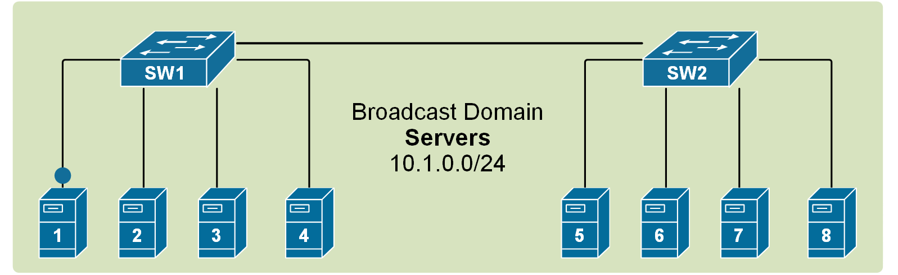
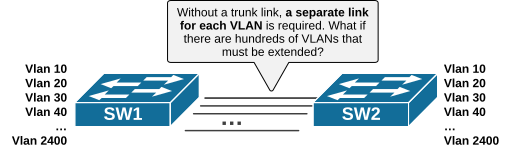
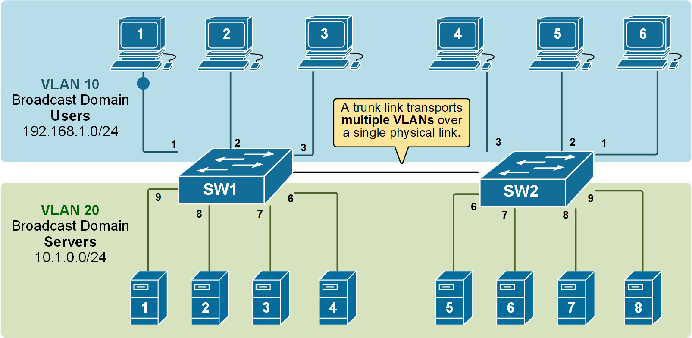
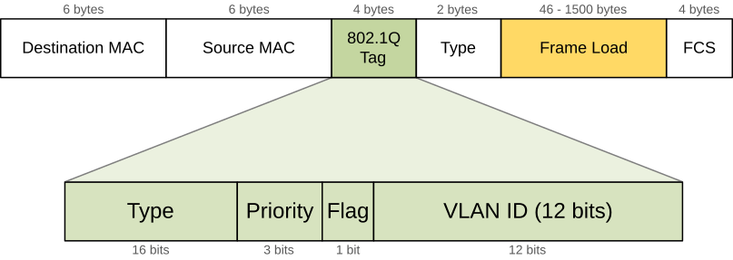
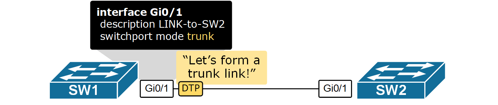
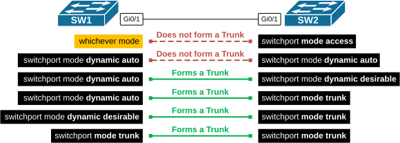
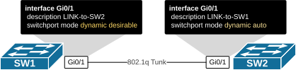

[VLAN Trunking](https://www.networkacademy.io/ccna/ethernet/vlan-trunking)
==========

# VLAN Trunking

This lesson discusses VLAN trunking - a technology that switches use to carry traffic for multiple VLANs over **a single physical link** called a trunk link. It is a fundamental topic of the CCNA exam and the networking field in general.

## Why do we need trunk links?

Soon after VLANs were introduced, people realized they needed to extend them across multiple switches. But some challenges had to be solved first. How do we span multiple VLANs between switches? Let's find out.

### Multiswitch broadcast domains

Recall that when a broadcast frame is received on any switch port, the switch forwards it out to all its other ports. Having that in mind, if we connect two default setting switches, as shown in the diagram below, any broadcast frame received by either switch is forwarded to the other one and then out all its ports. Therefore, a broadcast domain **is not limited to one switch only**; it includes all devices that get a copy of any broadcast frame, even if they are connected to other switches.



Figure 1. A broadcast domain spanned across two switches (animated).

If we scale this logic to a LAN with many interconnected switches, we could have **a broadcast domain consisting of hundreds of end devices**. This can sometimes contest the network with BUM traffic to the point that the LAN becomes unusable. Thus, splitting the single broadcast domain into multiple smaller ones is even more important in large topologies for interconnected switches.

### A VLAN on multiple switches

If we apply the [VLAN concept](https://www.networkacademy.io/ccna/ethernet/vlan-concept) to multiple switches, we can split the topology into multiple broadcast domains. For example, if we have two VLANs, 10 and 20, that we want to extend across two switches, we can simply interconnect them with one link assigned to VLAN 10 (port 4) and another one assigned to VLAN 20 (port 5), as shown in the diagram below.


Figure 2. Extending VLANs without a trunk link.

Although it is a valid design and it works, it simply does not scale very well. It requires a physical link between the switches per VLAN. If the topology has to have 10+ VLANs, it would need 10+ physical cables between the switches, and it would use 10+ switchports (on each switch) for those links. But how many ports can a switch have? What if hundreds of VLANs must be extended across switches?



Figure 3. Why do we need 802.1Q trunks?

Obviously, this design is applicable in topologies with only a few VLANs. Nowadays, there are tens of VLANs in modern enterprise networks, so this way of spanning VLANs between switches is not applicable at scale at all.

## What is a Trunk link?

In order to overcome this scaling limitation, we can use another Ethernet technology called VLAN trunking. It creates only **one link** between the switches that **support as many VLANs as needed**. At the same time, it also keeps the VLAN traffic separate, so frames from VLAN 20 won't go to devices in VLAN 10 and vice-versa. An example can be seen in the diagram below.



Figure 4. Extending multiple VLANs using a trunk link.

Notice that the link between switch SW1 and switch SW2 is **a trunk link**. Both VLAN 10 and VLAN 20 pass through it.

## How does a Trunk link work?

A trunk link keeps track of which VLAN each frame belongs to. The sending device adds a special header to the original Ethernet frame. This header includes a VLAN ID, which tells the receiving side which VLAN this frame belongs to.

Over the years, two trunking protocols have been used on Cisco switches: **Inter-Switch Link (ISL)** and **IEEE 802.1Q**.

-   **ISL** was a Cisco proprietary tagging protocol predecessor of 802.1Q, it has been deprecated and is not used anymore.
-   **IEEE 802.1Q** is the industry-standard trunking encapsulation at present and is typically the only one supported on modern switches.

The IEEE 802.1q trunking protocol works by **adding an additional 4-byte header** to Ethernet frames that pass through the trunk link. The 802.1q header is shown in the diagram below.



Figure 5. Ethernet frame tagged with 802.1q header.

It is important to note that the tag adds 4 additional bytes to the Ethernet header of the frames. The most important field in the tag is the VLAN ID, which is 12 bits long. It specifies the VLAN to which the frame belongs. Because values of 0x000 and 0xFFF are reserved, there are 4,094 possible VLAN numbers.

### 802.1Q VLAN Tagging

VLAN trunking allows switches to forward frames from different VLANs over a single link called a **trunk**. This is done by adding an additional header information called **tag** to the Ethernet frame. The process of adding this small header is called **VLAN tagging**. If you look at the diagram below, PC1 is sending a broadcast frame. When switch SW1 receives the frame, it knows that this is a broadcast, and it has to send it out to all its ports. However, SW1 must tell SW2 that this frame belongs to VLAN10. So before sending the frame over the 802.1Q trunk link, SW1 adds a VLAN header to the original ethernet frame, with VLAN number 10, as shown below.


Figure 6. Example of VLAN tagging.

When switch SW2 receives the frame, it sees that the frame belongs to VLAN 10, then it removes the header and forwards to the original ethernet frame to all its interfaces configured in VLAN10.

In the given example, ethernet frames sent between the switches over the trunk link **are tagged with a VLAN header**. When the receiving switch receives them, it removes the VLAN tag and sends them to the clients in the VLAN as untagged frames (original Ethernet frames).

**KEY NOTE**: It is very important to remember that VLAN tagging **only happens between switches** over a trunk link. When a frame is sent to an end device, the switch removes the VLAN tag before forwarding it (as shown in the diagram above). End devices do not see or process VLAN tags.

### Switch interface modes

Each switch interface can operate as an **access** or **trunk** port. Because a typical LAN deployment has hundreds or even thousands of switch ports, Cisco has introduced a proprietary protocol called **Dynamic Trunking Protocol (DTP)** that helps switches automatically determine their operational mode. How DTP works? Each port is configured with a mode like access, trunk, dynamic auto, or dynamic desirable. DTP advertises this mode on the remote side and tries to negotiate a trunk link if the configuration of the two sides is compatible.



Figure 7. Dynamic Trunking Protocol (DTP).

Notice that DTP only works on switch-to-switch links. End hosts do not understand and process it. Additionally, it only works between Cisco devices because it is a Cisco-proprietary protocol.

By default, all Cisco switch ports are in operational state dynamic auto, which means that this Dynamic Trunking Protocol (DTP) is listening and trying to understand what is configured on the other side of the cable and, based on that, to decide whether to become an access or trunk port. For example, if we have a link between SW1 and SW2, if we configure the interface on SW1 to be a trunk port, DTP will advertise this to the other side, and the interface on SW2 will automatically set itself in trunk mode, and a trunk link will be formed between the switches.

Table 1. Switchport modes

| Mode | Behaviour |
|---|---|
| switchport mode dynamic auto | - DEFAULT MODE for layer 2 interfaces of modern Cisco switches<br>- Passively waiting to convert the port into a **trunk**. (DTP listening for messages from the far side saying "let's form a trunk")<br>- Becomes a trunk if the other side of the link is configured with **trunk** or **dynamic desirable** mode |
| switchport mode dynamic desirable | - Actively trying to convert the link to a **trunk**. (DTP actively sending messages to the far side saying "let's form a trunk")<br>- Becomes a trunk if the other side of the link is configured with **trunk** or **dynamic desirable** or **dynamic auto.** |
| switchport mode access | - The interface becomes an **access port**.<br>- DTP negotiates the link as nontrunk link. |
| switchport mode trunk | - The interface becomes a **trunk port**.<br>- DTP negotiates the link as trunk link. (DTP actively sending messages to the far side saying "let's form a trunk") |
| switchport mode nonegotiate | - Disables the Dynamic Trunking Protocol (DTP).<br>- Interface mode is configured manually. |

As you can see, there are quite a few switchport operational modes, so there are several possible combinations for both ends of a link between two switches. Depending on the configuration of both sides, the switches could form a trunk link or not. All combinations are shown in the diagram below.



Figure 8. Forming a trunk link combinations.

Notice that there are two key points to remember:

-   If one side of the link is configured as an access port, the trunk link **will never form**.
-   If the two sides of the link are configured as dynamic, one **must actively negotiate** the trunk formation.
    -   If you connect two switches, a trunk link will not form by default because both ports are set to dynamic auto.

## Configuring Trunk ports

As we have already said, the default mode for Cisco switchports is dynamic auto. Therefore, in order to form a trunk, at least one side of the link must be configured **to negotiate it actively**. This means one side must be set to switchport mode dynamic desirable or switchport mode trunk; otherwise, a trunk link won't form.



Figure 9. Trunk Configuration Topology**.**

Let's configure the topology as shown in the diagram above. SW1's Gi0/1 will be set to dynamic desirable and will actively negotiate the trunk using the DTP protocol.

```plaintext
SW1# conf t
Enter configuration commands, one per line.  End with CNTL/Z.
SW1(config)# interface GigabitEthernet 0/1
SW1(config-if)#switchport mode dynamic ?
  auto       Set trunking mode dynamic negotiation parameter to AUTO
  desirable  Set trunking mode dynamic negotiation parameter to DESIRABLE

SW1(config-if)# switchport mode dynamic desirable
SW1(config-if)# end
%SYS-5-CONFIG_I: Configured from console by console
```

Now, if we check the interface mode using the following command, we see that the link has become a trunk.

```plaintext
SW1# show interface trunk 

Port        Mode         Encapsulation  Status        Native vlan
Gig0/1      desirable    n-802.1q       trunking      1

Port        Vlans allowed on trunk
Gig0/1      1-1005

Port        Vlans allowed and active in management domain
Gig0/1      1,10,20

Port        Vlans in spanning tree forwarding state and not pruned
Gig0/1      1,10,20
```

The output of the show interface trunk command shows that a trunk link formed even though we haven't configured anything on the other side of the link on SW2. That is the function of the dynamic trunking protocol. Let's check the link's status according to SW2.

```plaintext
SW2#sh interfaces trunk 

Port        Mode         Encapsulation  Status        Native vlan
Gig0/1      auto         n-802.1q       trunking      1

Port        Vlans allowed on trunk
Gig0/1      1-1005

Port        Vlans allowed and active in management domain
Gig0/1      1,10,20

Port        Vlans in spanning tree forwarding state and not pruned
Gig0/1      1,10,20
```

Note that the interface on SW2 is in operational mode auto, meaning it was waiting for SW1 to negotiate the trunk.

## Key Takeaways

-   VLANs are **locally significant** and are stored in the switch's local VLAN database.
-   Trunk links **tag** frames with VLAN identification.
-   IEEE 802.1Q is the **standard trunking mechanism** on Cisco switches. The old method called ISL has been deprecated and is not used anymore.
-   Dynamic Trunking Protocol (DTP) can **negotiate trunk links**.
-   To form a trunk link between two switches, both have to be configured to allow trunking on each end of the link.
