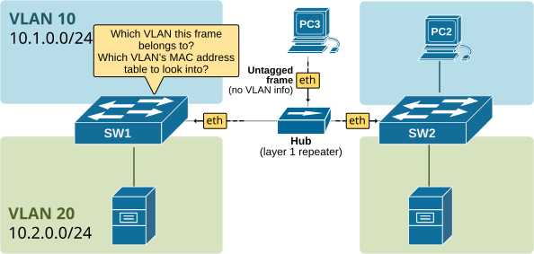
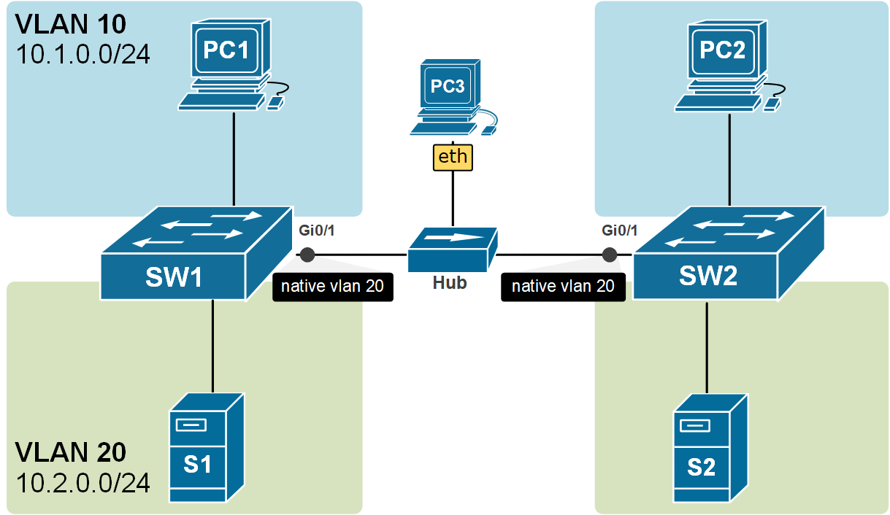
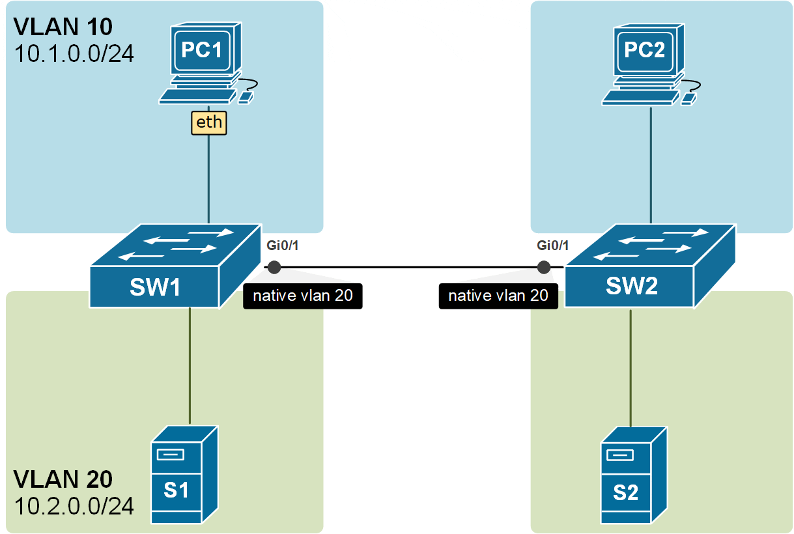
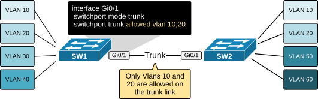

[Trunk Native VLAN](https://www.networkacademy.io/ccna/ethernet/trunk-native-vlan)
==========

# Trunk Native VLAN

This lesson discusses the Native VLAN - one of the most confusing and challenging topics in the CCNA exam — and networking overall. Although it may seem simple at first, it often causes misunderstandings and mistakes in real-world setups. This lesson will help you clearly understand the topic through many diagrams and animated examples.

## Why do we need the Native VLAN?

Recall that a trunk port sends and receives Ethernet frames **tagged with IEEE 802.1q VLAN tags**. The primary idea behind this is to be able to transport frames from multiple VLANs over a single physical link between switches. This means that both ends of a trunk will always receive tagged frames, as shown in the diagram below.


Figure 1. Frames forwarding over a trunk line. (animated)

The diagram shows that Ethernet frames pass through the trunk link with 802.1Q tags that indicate the VLAN ID they belong to (in green). **But is this always the case?**

What if there is a hub in the way or any other layer 1 device? What will happen if **an untagged frame somehow gets into the trunk link**?

Look at the following diagram. The trunk link between SW1 and SW2 is not a direct cable. It is a shared layer 1 segment. PC3 is connected to the same trunk link via a Hub. When PC3 sends frames on the trunk, the frames are not tagged with 802.1Q headers. End devices do not understand VLANs and do not tag frames. Hence, the frames do not include any VLAN information.



Figure 2. Why do we need the Native VLAN?

However, when these untagged frames reach the switches over the trunk link, SW1 and SW2 must decide which MAC address table to look into for the destination MAC address and which VLAN these frames belong to. But how can the switches decide which VLAN to use?

Native VLAN has been introduced to solve this specific scenario. Let's see how.

## What is the Native VLAN?

The Native VLAN is a VLAN number configured **per trunk port; it is locally significant,** and it instructs the switch the following:

"*If you receive an untagged frame on this trunk port, forward it as if it is part of the native VLAN number."*

For example, if we configure the native VLAN on a trunk to be 20, if a frame without IEEE 802.1q header comes in that port, it will be forwarded to VLAN 20. You can see an example of this in the diagram below. PC3 is somehow connected to the trunk and is sending untagged frames. When they are received on both sides of the link, they are forwarded into the VLAN 20 because it is the Native VLAN configured on the trunk ports.



Figure 3. Forwarding untagged frames on a trunk link. (animated)

By default, the native VLAN of all trunk ports on Cisco switches is assigned to VLAN 1, but it can be any valid VLAN number.

There is another very important angle to this concept. The switches are not only **putting the received untagged frames into the native VLAN**, but they are also **sending the frames in the Native VLAN untagged**. Look at the example in the diagram below. The frames from VLAN 10 are carried across the trunk with 802.1q headers, but the frames from VLAN20 are carried across untagged because VLAN20 is the Native VLAN of the trunk port.



Figure 4. Frames are untagged in the Native VLAN but tagged in all others. (animated)

Notice another essential aspect of the Native VLAN. All control plane messages, such as CDP, VTP, and DTP, are sent using the Native VLAN. This means they travel across trunk links as untagged frames without a VLAN ID added by 802.1Q tagging.

## Configuring and Verifying Native VLAN on a Trunk port

Now, let's shift focus to the configuration side of things. First. let's see how we can check the operational mode and the native VLAN on any trunk port using the command **show interface switchport** command, as shown in the output below.

```plaintext
SW2# show interface Gi0/1 switchport
Name: Gig0/1
Switchport: Enabled
Administrative Mode: dynamic auto
Operational Mode: trunk
Administrative Trunking Encapsulation: dot1q
Operational Trunking Encapsulation: dot1q
Negotiation of Trunking: On
Access Mode VLAN: 1 (default)
Trunking Native Mode VLAN: 1 (default)
Voice VLAN: none
Administrative private-vlan host-association: none
Administrative private-vlan mapping: none
Administrative private-vlan trunk native VLAN: none
Administrative private-vlan trunk encapsulation: dot1q
Administrative private-vlan trunk normal VLANs: none
Administrative private-vlan trunk private VLANs: none
Operational private-vlan: none
Trunking VLANs Enabled: All
Pruning VLANs Enabled: 2-1001
Capture Mode Disabled
Capture VLANs Allowed: ALL
Protected: false
Unknown unicast blocked: disabled
Unknown multicast blocked: disabled
Appliance trust: none
```

You can see that VLAN 1 is configured as Native by default. Let's change it to another value using the **switchport trunk native vlan** command in interface configuration mode. Always remember that this configuration **is locally significant** and has to be manually configured to match **both sides of the trunk** link; otherwise, a faulty state occurs.

```plaintext
SW2# conf t
Enter configuration commands, one per line.  End with CNTL/Z.
SW2(config)# interface GigabitEthernet 0/1
SW2(config-if)# switchport trunk ?
  allowed  Set allowed VLAN characteristics when interface is in trunking mode
  native   Set trunking native characteristics when interface is in trunking
           mode
SW2(config-if)# switchport trunk native vlan ?
  <1-4094>  VLAN ID of the native VLAN when this port is in trunking mode
SW2(config-if)# switchport trunk native vlan 20
SW2(config-if)# end
%SYS-5-CONFIG_I: Configured from console by console
```

```plaintext
SW2# show interface Gi0/1 switchport 
Name: Gig0/1
Switchport: Enabled
Administrative Mode: dynamic auto
Operational Mode: trunk
Administrative Trunking Encapsulation: dot1q
Operational Trunking Encapsulation: dot1q
Negotiation of Trunking: On
Access Mode VLAN: 1 (default)
Trunking Native Mode VLAN: 20 (USERS)
Voice VLAN: none
Administrative private-vlan host-association: none
Administrative private-vlan mapping: none
Administrative private-vlan trunk native VLAN: none
Administrative private-vlan trunk encapsulation: dot1q
Administrative private-vlan trunk normal VLANs: none
Administrative private-vlan trunk private VLANs: none
Operational private-vlan: none
Trunking VLANs Enabled: All
Pruning VLANs Enabled: 2-1001
Capture Mode Disabled
Capture VLANs Allowed: ALL
Protected: false
Unknown unicast blocked: disabled
Unknown multicast blocked: disabled
Appliance trust: none
```

### Native VLAN Mismatch

Interface Trunk configuration is **locally significant**. This means that the Trunk settings on one switchport do not have to exactly match the settings on the other side of the link. Therefore, you can configure native VLAN 10 on one side and VLAN 20 on the other side of a single trunk link. This causes a dangerous faulty state called **Native VLAN mismatch**. Cisco proprietary protocol **CDP can detect** this misconfiguration and report with error messages as shown below. Note that if CDP is disabled on the link, there is no way for the switch to detect this automatically.

```plaintext
SW2#
%CDP-4-NATIVE_VLAN_MISMATCH: Native VLAN mismatch discovered on GigabitEthernet0/1 (20), with SW1 GigabitEthernet0/1 (10).
%CDP-4-NATIVE_VLAN_MISMATCH: Native VLAN mismatch discovered on GigabitEthernet0/1 (20), with SW1 GigabitEthernet0/1 (10).
%CDP-4-NATIVE_VLAN_MISMATCH: Native VLAN mismatch discovered on GigabitEthernet0/1 (20), with SW1 GigabitEthernet0/1 (10).
%CDP-4-NATIVE_VLAN_MISMATCH: Native VLAN mismatch discovered on GigabitEthernet0/1 (20), with SW1 GigabitEthernet0/1 (10).
```

Native VLAN mismatch can cause some major issues and security implications, such as:

-   **Misdirected traffic**—Frames originating in the VLAN configured as Native is sent untagged across the trunk. Upon receiving on the other side of the link, they are forwarded in a different VLAN because trunk settings don't match on both sides.
-   **VLAN hopping**—malicious traffic can cross VLAN boundaries.

### Allowed VLANs on a Trunk port

By default, on Cisco switches, frames from all VLANs are transported over the trunk link. However, there is a way to specify exactly which VLAN numbers are allowed to be carried across. There are many cases in which you would want to specify only certain VLANs and not send frames from all VLANs. If we take Figure 5 as an example, the switch on the left has four VLANs, 10,20,30 and 40, but the switch on the right has VLANs 10, 20, 50, and 60. So you would probably want to send only traffic for 10 and 20 over the trunk link. This can be configured using the **switchport trunk allowed vlan** command.



Figure 5. A trunk link with allowed VLANs.

Let's configure the link in the diagram above to carry across only frames from vlan 10 and 20. First, let's verify how many virtual LANs are configured on SW1 and SW2.

```plaintext
SW1# show vlan

VLAN Name                             Status    Ports
---- -------------------------------- --------- -------------------------------
1    default                          active    Fa0/5, Fa0/6, Fa0/7, Fa0/9
                                                Fa0/10, Fa0/11, Fa0/12, Fa0/13
                                                Fa0/14, Fa0/20, Fa0/21, Fa0/22
                                                Fa0/23, Fa0/24, Gig0/2
10   USERS                            active    Fa0/2, Fa0/3, Fa0/4
20   SERVERS                          active    Fa0/15, Fa0/16, Fa0/17
30   SALES                            active    Fa0/8
40   MGMT                             active    Fa0/18, Fa0/19
1002 fddi-default                     active    
1003 token-ring-default               active    
1004 fddinet-default                  active    
1005 trnet-default                    active    
```

```plaintext
SW2# show vlan

VLAN Name                             Status    Ports
---- -------------------------------- --------- -------------------------------
1    default                          active    Fa0/5, Fa0/6, Fa0/7, Fa0/8
                                                Fa0/9, Fa0/10, Fa0/11, Fa0/19
                                                Fa0/22, Fa0/23, Fa0/24,
                                                Gig0/2
10   USERS                            active    Fa0/2, Fa0/3, Fa0/4
20   SERVERS                          active    Fa0/12, Fa0/13, Fa0/14
50   IT                               active    Fa0/15, Fa0/16, Fa0/17, Fa0/18
60   SENSORS                          active    Fa0/20, Fa0/21
1002 fddi-default                     active    
1003 token-ring-default               active    
1004 fddinet-default                  active    
1005 trnet-default                    active  
```

Note that if we look at the **show interface trunk** output on SW1, it is shown that VLANs 1 - 1005 are allowed on the trunk. This means that all are allowed.

```plaintext
SW1#sh int trunk 

Port        Mode         Encapsulation  Status        Native vlan
Gi0/1       on           802.1q         trunking      1
     
Port        Vlans allowed on trunk
Gi0/1       1-1005

Port        Vlans allowed and active in management domain
Gi0/1       1,10,20,30,40

Port        Vlans in spanning tree forwarding state and not pruned
Gi0/1       1,10,20,30,40
```

The same can be seen on SW2 as well.

```plaintext
SW2#sh int trunk 

Port        Mode         Encapsulation  Status        Native vlan
Gi0/1       on           802.1q         trunking      1
     
Port        Vlans allowed on trunk
Gi0/1       1-1005

Port        Vlans allowed and active in management domain
Gi0/1       1,10,20,50,60

Port        Vlans in spanning tree forwarding state and not pruned
Gi0/1       1,10,20,50,60
```

We want to configure only 10 and 20 to be allowed. Let's configure the trunk link on SW1 and SW2. The configuration is the same on both switches, so we need to look at only one example.

```plaintext
SW2# conf t
Enter configuration commands, one per line.  End with CNTL/Z.
SW2(config)# interface Gi0/1
SW2(config-if)# switchport trunk ?
  allowed  Set allowed VLAN characteristics when interface is in trunking mode
  native   Set trunking native characteristics when interface is in trunking
           mode
  
SW2(config-if)# switchport trunk allowed vlan 10,20
SW2(config-if)# end
SW2#
%SYS-5-CONFIG_I: Configured from console by console
```

The same configuration is applied on both switches. Let's now look at the trunk ports.

```plaintext
SW2# show interfaces trunk 

Port        Mode         Encapsulation  Status        Native vlan
Gi0/1       on           802.1q         trunking      1
     
Port        Vlans allowed on trunk
Gi0/1       10,20

Port        Vlans allowed and active in management domain
Gi0/1       10,20

Port        Vlans in spanning tree forwarding state and not pruned
Gi0/1       10,20
```

Using this feature is very common in scenarios where a switch owned by one organization is connected to another external switch. Usually, there is an agreement to exchange data in one VLAN, so you would want to filter all other VLANs out.

## Key Takeaways

-   **Inbound**: Untagged frames received on a trunk port are forwarded into the VLAN configured as Native.
-   **Outbound**: Frames from the VLAN configured as Native are forwarded untagged.
-   Control-plane messages such as **DTP and BPDUs** are sent out untagged.
-   Control-plane messages such as CDP and VTP are sent out untagged if the Native VLAN is 1; otherwise, they are tagged with VLAN1.
-   Native VLAN is configured **per trunk port** and is **locally significant**. Therefore, different VLAN numbers can be configured on both sides of a single trunk link leading to **native VLAN mismatch**.
-   Native VLAN mismatch leads to **misdirected traffic** and is **a security implication**.
-   Allowed VLANs can be specified on any trunk port with the **switchport trunk allowed vlan** command.
