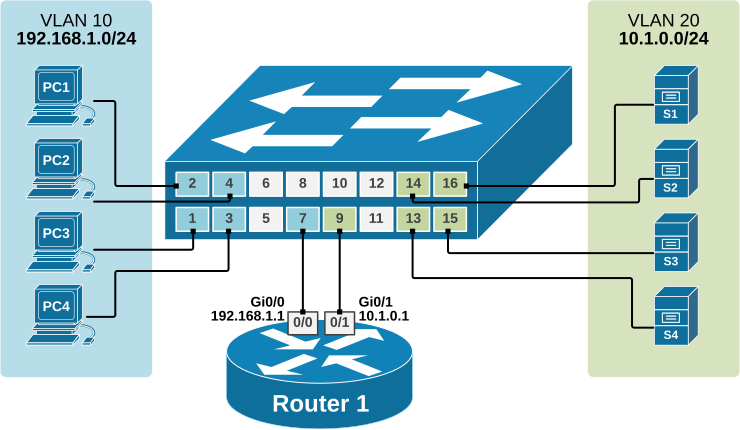
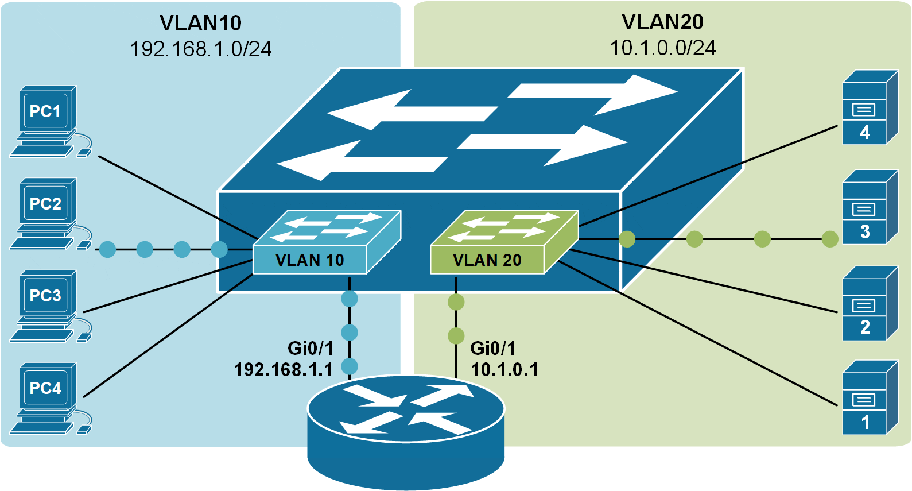

[Forwarding Data Between VLANs](https://www.networkacademy.io/ccna/ethernet/forwarding-data-between-vlans)
==========

# Forwarding Data Between VLANs

This lesson discusses the most basic method of forwarding data between VLANs using a router with multiple Interfaces. Each VLAN connects to a separate physical interface on the router. This method is older and not common today. However, it is fundamental to use the most modern methods, which we will see in the following lessons.

## Connectivity between VLANs

Recall that LAN switches forward frames based on Layer 2 logic. This means that when a switch receives an Ethernet frame, it looks at the destination MAC address and forwards the frame out to another interface or multiple interfaces if it is a BUM frame. This type of switch is often called **a Layer 2 switch***.*


Figure 1. Connectivity between VLANs, physical view.

Layer 2 forwarding logic is performed per VLAN. For example, in the diagram above, all end-hosts on the left are configured in VLAN10, which is a separate broadcast domain and different subnet. The servers on the right are configured in VLAN20, which is also in its own broadcast domain and a different subnet from VLAN10.

Because VLAN10 and VLAN20 are different broadcast domains, frames from one VLAN will never leak over to the other. Therefore, the switch acts like two separate switches, as shown in the diagram below.


Figure 2. Connectivity between VLANs, logical view. (animated)

A Layer 2 switch **cannot forward traffic between VLANs**. It only sends frames within the same VLAN. To send data from one VLAN to another, we need a device that can route traffic — like a router or a Layer 3 switch.

## Routing between VLANs with a router

Ultimately, when we design networks, we want to have any-to-any connectivity between all devices. Following the logic that we have learned in the previous lessons, that

VLAN = Broadcast Domain = Subnet

Enabling connectivity between two VLANs means enabling connectivity between IP subnets. Therefore, we need to have a device that acts as a **router**. There are two possible solutions: we can use an actual router to do the routing, or the switch itself can perform routing functionalities. Switches that can perform Layer 3 routing functions are called Layer 3 switches or Multilayer switches.



Figure 3. Routing between VLANs with a router, physical view.

In the following example, we are using a router to route data between VLAN10 and VLAN20. The router has one physical interface connected to the switchport in VLAN10 and one physical interface connected to the switchport in VLAN20. Thus, the router has one interface in subnet 192.168.1.0/24 and one interface in subnet 10.1.0.0/24, and it does what all routers do - route IP packets between subnets.



Figure 4. Routing between VLANs with a router, logical view.

The downside of this approach for forwarding data between VLANs is that **the router must have physical interfaces for every VLAN**. The above example is a feasible design option, but if we have 10+ VLANs, for example, it will obviously not scale well because we will use 10+ interfaces on both the router and the switch. Routers typically have only a few routing interfaces, so this approach is only applicable in very small-scale deployments.

## Configuring InterVLAN routing

Now, let's go through a configuration example that shows the concept we've covered so far. We will use the topology shown in Figure 3 above. This is a new environment with all devices in their default state and no configurations applied. We will configure each device to allow communication between clients in VLAN10 and servers in VLAN20.

### Configuring the switch

Let's first start with the switch. It's a brand-new device in its factory-default settings. First, we are going to define the VLANs:

```plaintext
Switch(config)# vlan 10
Switch(config-vlan)# name CLIENTS
Switch(config-vlan)# vlan 20
Switch(config-vlan)# name SERVERS
Switch(config-vlan)# end
```

Then, we will configure the ports where clients and servers connect to the switch, as shown in Figure 3:

```plaintext
Switch(config)# interface range Fa0/1-4
Switch(config-if-range)# description CLIENTS
Switch(config-if-range)# switchport mode access 
Switch(config-if-range)# switchport access vlan 10
Switch(config-if-range)# exit
```

```plaintext
Switch(config)# interface range Fa0/13-16
Switch(config-if-range)# description SERVERS
Switch(config-if-range)# switchport mode access 
Switch(config-if-range)# switchport access vlan 20
Switch(config-if-range)# end
```

Now, we need to configure the switchports where the router is connected. Interface Fa0/7 will be assigned to VLAN 10 while Fa0/9 will be assigned to VLAN 20, as shown in the output below.

```plaintext
interface FastEthernet0/7

 description Link-to R1-Gi0/0
 switchport access vlan 10
!
interface FastEthernet0/9
 description Link-to R1-Gi0/1
 switchport access vlan 20
!
```

Let's now check if everything is configured correctly on the switch. We have four clients in VLAN10 (in blue) and four servers in VLAN20 (in green) connected, as shown in Figure 3.

```plaintext
SW1# show vlan

VLAN Name                             Status    Ports
---- -------------------------------- --------- -------------------------------
1    default                          active    Fa0/5, Fa0/6, Fa0/8
                                                Fa0/10, Fa0/11, Fa0/12
                                                Fa0/17, Fa0/18, Fa0/19, Fa0/20
                                                Fa0/21, Fa0/22, Fa0/23, Fa0/24
                                                Gig0/1, Gig0/2
10   CLIENTS                          active    Fa0/1, Fa0/2, Fa0/3, Fa0/4, Fa0/7
20   SERVERS                          active    Fa0/9, Fa0/13, Fa0/14, Fa0/15, Fa0/16
1002 fddi-default                     active    
1003 token-ring-default               active    
1004 fddinet-default                  active    
1005 trnet-default                    active    
```

At this point, everything is configured on the switch. Now, let's focus on the router that will perform the InterVLAN routing.

### Configuring the router

The router has default settings at the moment. This means there are no IP addresses configured, and all ports are shut down. Remember that all Layer 2 ports are enabled (no shutdown) by default, while all Layer 3 ports are disabled (shutdown) by default.

That's why we first enable the router ports and only then configure the IP addressing parameters, as shown in the output below.

```plaintext
Router# conf t
Enter configuration commands, one per line.  End with CNTL/Z.

Router(config)# interface gi0/0
Router(config-if)# no shutdown 
%LINK-5-CHANGED: Interface GigabitEthernet0/0, changed state to up
%LINEPROTO-5-UPDOWN: Line protocol on Interface GigabitEthernet0/0, 
changed state to up

Router(config-if)# ip address 192.168.1.1 255.255.255.0
Router(config-if)#description CLIENTS
Router(config-if)# exit

Router(config)# int gigabitEthernet 0/1
Router(config-if)# no shutdown 
%LINK-5-CHANGED: Interface GigabitEthernet0/1, changed state to up
%LINEPROTO-5-UPDOWN: Line protocol on Interface GigabitEthernet0/1, 
changed state to up

Router(config-if)# ip address 10.1.0.1 255.255.255.0
Router(config-if)# description SERVERS
Router(config-if)# end
```

Let's now check the router interfaces. You can see that both interfaces are enabled and have IP addresses, according to the diagram.

```plaintext
Router#sh ip interface brief
Interface            IP-Address      OK? Method Status                Protocol 
GigabitEthernet0/0   192.168.1.1     YES manual up                    up 
GigabitEthernet0/1   10.1.0.1        YES manual up                    up 
GigabitEthernet0/2   unassigned      YES unset  administratively down down 
Vlan1                unassigned      YES unset  administratively down down
```

If we check the router routing table, we will see that VLAN 10 (192.168.1.0/24) connects to Gi0/0 while VLAN 20 (10.1.0.0/24) connects to Gi0/1.

```plaintext
Router# show ip route
Codes: L - local, C - connected, S - static, R - RIP, M - mobile, B - BGP
       D - EIGRP, EX - EIGRP external, O - OSPF, IA - OSPF inter area
       N1 - OSPF NSSA external type 1, N2 - OSPF NSSA external type 2
       E1 - OSPF external type 1, E2 - OSPF external type 2, E - EGP
       i - IS-IS, L1 - IS-IS level-1, L2 - IS-IS level-2, ia - IS-IS inter area
       * - candidate default, U - per-user static route, o - ODR
       P - periodic downloaded static route

Gateway of last resort is not set

     10.0.0.0/8 is variably subnetted, 2 subnets, 2 masks
C       10.1.0.0/24 is directly connected, GigabitEthernet0/1
L       10.1.0.1/32 is directly connected, GigabitEthernet0/1
     192.168.1.0/24 is variably subnetted, 2 subnets, 2 masks
C       192.168.1.0/24 is directly connected, GigabitEthernet0/0
L       192.168.1.1/32 is directly connected, GigabitEthernet0/0
```

Now, the router and the switch are configured. However, there is one more thing we need to set up before clients will be able to reach the servers.

### Configuring end hosts

Lastly, we need to configure the end hosts. We need to assign them an IP address, Subnet Mask, and Default gateway from their respective VLAN.

The following output shows the configuration of one of the Clients.

```plaintext
C:\> ipconfig

FastEthernet0 Connection:(default port)

   Connection-specific DNS Suffix..: 
   Link-local IPv6 Address.........: FE80::20D:BDFF:FEE0:46C1
   IPv6 Address....................: ::
   IPv4 Address....................: 192.168.1.10
   Subnet Mask.....................: 255.255.255.0
   Default Gateway.................: 192.168.1.1
```

Lastly, let's run a ping from one of the clients to one of the servers.

```plaintext
C:\> ping 10.1.0.10

Pinging 10.1.0.10 with 32 bytes of data:

Reply from 10.1.0.10: bytes=32 time<1ms TTL=127
Reply from 10.1.0.10: bytes=32 time=1ms TTL=127
Reply from 10.1.0.10: bytes=32 time=8ms TTL=127
Reply from 10.1.0.10: bytes=32 time<1ms TTL=127

Ping statistics for 10.1.0.10:
    Packets: Sent = 4, Received = 4, Lost = 0 (0% loss),
Approximate round trip times in milli-seconds:
    Minimum = 0ms, Maximum = 8ms, Average = 2ms
```

You can see that the traffic from VLAN 10 is successfully routed to VLAN 20 and vice versa.
