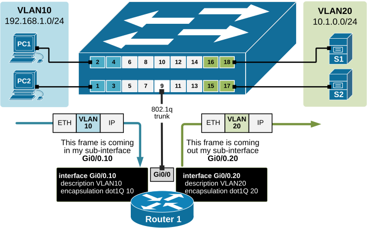
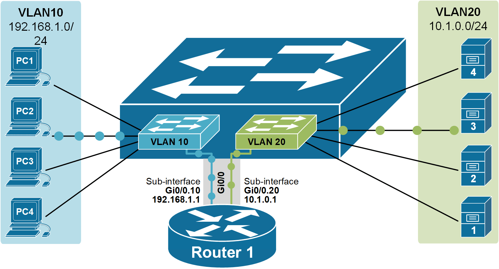
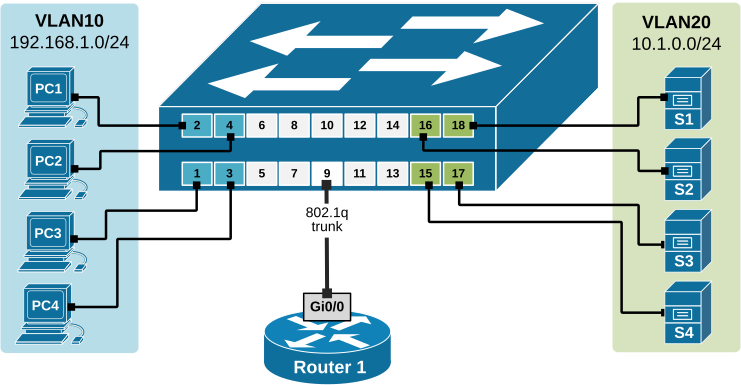
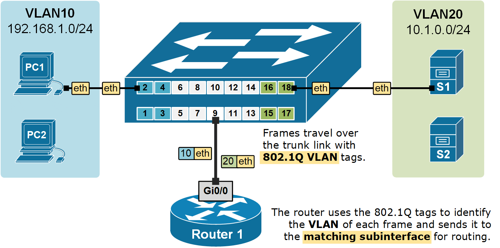
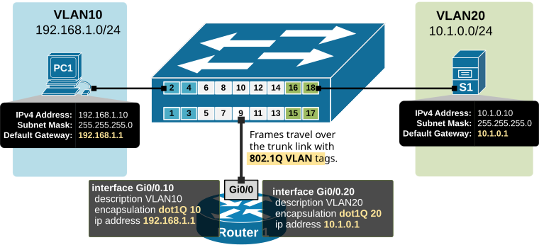

[Router on a stick (ROAS)](https://www.networkacademy.io/ccna/ethernet/router-on-a-stick)
==========

# Router on a stick (ROAS)

Almost all networks in the world use Virtual Local Area Networks (VLANs) nowadays. In our previous lessons on VLANs, we have learned a general rule of thumb that is:

```plaintext
VLAN = Broadcast Domain = Subnet
```

This means that if we have nodes connected in different VLANs, they most probably are part of different subnets. If we take the topology shown in Figure 1, for example, we have four clients in VLAN10 with addresses in subnet 192.168.1.0/24 and four servers in VLAN20 with addresses in 10.1.0.0/24. Therefore, the communication between the two VLANs must be handled by a device that can perform IP routing between subnets. This device must have an IP address in each network and clients need then to use these addresses as **their default gateways** respectively.

There are two typical devices that are used to perform routing between VLANs (InterVLAN routing):

-   **Multilayer Switch (Layer 3 switch)** - MLS switches work at both Layer 2 and Layer 3 of the OSI model. They can switch frames and perform IP routing between VLANs. We are examining this InterVLAN routing technique in our [next lesson](https://www.networkacademy.io/ccna/ethernet/intervlan-routing).
-   **Router** - There are two ways to use a router as a device that performs IP routing between VLANs.
    -   Connecting a **separate router interface to each VLAN** and giving each interface an IP address from the respective VLAN subnet. Then, it is just regular routing between networks. We have already discussed this technique in detail in one of our [previous lessons](https://www.networkacademy.io/ccna/ethernet/forwarding-data-between-vlans).
    -   Connecting a router with **a single link** to a switch trunk port and defining sub-interfaces for each vlan. An IP address is then configured on each sub-interface from the respective VLAN. This technique is called **router-on-a-stick (ROAS)** because there is only one physical link between the router and the switch, as you can see in Figure 1.

## What is router-on-a-stick?

**Router-on-a-stick (ROAS)** is a technique to connect a router with **a single physical link** to a switch and perform IP routing between VLANs. From the switch's perspective, this physical link is configured as a trunk port allowing all VLANs that are going to be routed. From the router's perspective, this physical interface is represented as **multiple virtual sub-interfaces**, one for each VLAN. An IP address from each VLAN is then configured on each sub-interface, and the router performs IP routing between connected networks.

Comparing this approach to the other scenario where we can use a physical interface for each VLAN, it is obviously a better, more scalable technique to use a single trunk link between the switch and the router, as shown in the diagram below.



Figure 1. A router on a stick, physical view.

Let's look more closely at the above physical diagram. There is **a single cable** connecting the router to the switch. From the switch's perspective, port 9 is an 802.1q trunk that sends all frames toward the router with a VLAN tag.

From the router's perspective, all frames are coming in tagged. Therefore, based on this tag, **the router can differentiate which incoming frames are part of which VLAN**. Knowing the VLAN number of each frame, the router also knows which subnet it is part of because VLAN = Broadcast Domain = Subnet. Having this logic in mind, we can create a virtual interface on the router that treats all frames tagged with VLAN 10 as connected to a virtual interface Gi0/0.10 and all frames tagged with VLAN20 as connected to sub-interface Gi0/0.20.

We create a sub-interface using the following command:

```plaintext
Router(config)# interface [interface-name].[sub-interface-number]
```

This creates a virtual interface with the specified number and leads us into the sub-interface configuration mode. There, we specify the VLAN ID with the following command:

```plaintext
Router(config-subif)# encapsulation dot1Q [vlan-id]
```

This tells the router that when frames come in the physical interface and are tagged with this particular VLAN number, they should be handled by this sub-interface. Keep in mind that the sub-interface number **does not have to match the VLAN-ID** and could be **any random number** between 1 and 429496729. However, the VLAN-ID under the encapsulation command must match the VLAN number on the switch.

For example, we configure the router's subinterface in VLAN 10 using the following set of commands:

```plaintext
Router1(config)# interface GigabitEthernet 0/0.10 
Router1(config-subif)# encapsulation dot1Q ?
  <1-4094>  IEEE 802.1Q VLAN ID

Router1(config-subif)# encapsulation dot1Q 10
Router1(config-subif)# ip address 192.168.1.1 255.255.255.0
Router1(config-subif)# no shutdown
```

Once we configure subinterfaces for each VLAN, the router simply performs IP routing between connected subnets.

The following diagram shows the logical traffic flow of the Router-on-a-Stick setup. It illustrates how devices in VLAN 10 send traffic to the router through a single trunk link Gi0/0 and how the router uses subinterfaces to route the traffic between the VLANs.



Figure 2. A router on a stick, logical view.

Notice something important: at the IP level, each router subinterface has an IP address for each VLAN. This IP address must be set as **the default gateway on all hosts in that VLAN**.

The default gateway is used when a host wants to send traffic to a different network. The host sends the traffic to the router's subinterface, and the router forwards it to the correct VLAN.

## Configuring ROAS

Now, let's walk through a configuration example that will demonstrate all the concepts that we have discussed so far.

### Physical diagram

The following diagram shows the physical topology that we are going to use in this configuration example. Note that there is only one physical link between the switch and the router which will be used for all VLANs. Compare this topology to the one from the previous lesson, where there was a physical link for every VLAN.



Figure 3. Using router-on-a-stick for InterVLAN routing, physical diagram.

The topology is a greenfield environment. All devices are in their default state, with no additional configurations applied. We are going to configure every device to enable connectivity between the clients in VLAN10 and the servers in VLAN20.

### Configuring the switch

Let's first start with the switch. It's a brand-new device in its factory-default state. First, we are going to define the VLANs:

```plaintext
Switch1(config)# vlan 10
Switch1(config-vlan)# name CLIENTS
Switch1(config-vlan)# vlan 20
Switch1(config-vlan)# name SERVERS
Switch1(config-vlan)# exit
```

And then configure the switchports where clients and servers connect, according to the diagram:

```plaintext
Switch1(config)# interface range fastEthernet 0/1-4
Switch1(config-if-range)# description CLIENTS
Switch1(config-if-range)# switchport mode access 
Switch1(config-if-range)# switchport access vlan 10
Switch1(config-if-range)# exit
```

```plaintext
Switch1(config)# interface range fastEthernet 0/15-18
Switch1(config-if-range)# description SERVERS
Switch1(config-if-range)# switchport mode access 
Switch1(config-if-range)# switchport access vlan 20
Switch1(config-if-range)# end
```

The last part is to configure the port where the router is connected to act as an 802.1Q trunk port.

```plaintext
Switch1(config)# interface fastEthernet 0/9
Switch1(config-if)# description LINK-TO-ROUTER1
Switch1(config-if)# switchport mode trunk 
Switch1(config-if)# exit
```

### Configuring the router

Let's see that the router has default settings. It has three physical interfaces with no configuration and is currently administratively down.

```plaintext
Router# show ip int brief 
 
Interface              IP-Address      OK? Method Status                Protocol 
GigabitEthernet0/0     unassigned      YES unset  administratively down down 
GigabitEthernet0/1     unassigned      YES unset  administratively down down 
GigabitEthernet0/2     unassigned      YES unset  administratively down down
```

According to our physical diagram, we will have one router interface, Gi0/0, connected to the switch on port Fa0/9. The first configuration step we must perform is to enable the interface. Just to remind you that - by default, all router interfaces are shut down (administratively down), and all switch interfaces are enabled. This also applies in case we have a device that has switchports (layer 2 interfaces) and router ports (layer 3 interfaces) at the same time. Layer 2 interfaces are enabled by default, and layer 3 interfaces are shut down.

```plaintext
Router1# configure terminal 
Enter configuration commands, one per line.  End with CNTL/Z.
Router1(config)# interface gigabitEthernet 0/0
Router1(config-if)# no shutdown 

%LINK-5-CHANGED:Interface GigabitEthernet0/0, changed state to up
%LINEPROTO-5-UPDOWN:Line protocol on Interface GigabitEthernet0/0, changed state to up
```

The goal of the router-on-a-stick is to route data between the VLANs **using only one physical link**. However, the router needs to have an IP address/mask associated with each VLAN because VLAN = Broadcast Domain = Subnet. To have an address in each VLAN, the router can create virtual routing interfaces associated with each VLAN. These virtual interfaces are called subinterfaces.

Let's first configure a subinterface for VLAN10.

```plaintext
Router1(config)# interface gigabitEthernet 0/0.10
%LINK-5-CHANGED: Interface GigabitEthernet0/0.10, changed state to up
%LINEPROTO-5-UPDOWN: Line protocol on Interface GigabitEthernet0/0.10,
changed state to up

Router1(config-subif)# encapsulation dot1Q 10
Router1(config-subif)# ip address 192.168.1.1 255.255.255.0
Router1(config-subif)# exit
```

And one more sub-interface for VLAN20.

```plaintext
Router1(config-if)# interface gigabitEthernet 0/0.20
%LINK-5-CHANGED: Interface GigabitEthernet0/0.20, changed state to up
%LINEPROTO-5-UPDOWN: Line protocol on Interface GigabitEthernet0/0.20,
 changed state to up
 
Router1(config-subif)# encapsulation dot1Q 20
Router1(config-subif)# ip address 10.1.0.1 255.255.255.0
Router1(config-subif)# exit
```

Now that we have a sub-interface created for each VLAN. The router can forward data between the subnets, as shown in the diagram below.



Figure 4. A router on a stick, logical view.

Notice two very important aspects in the diagram above:

-   Frames travel from end hosts to the switch **without** an 802.1Q tag.
-   The switch then adds an **802.1Q VLAN tag** when sending the frames over the trunk port to the router.
-   The router uses the 802.1Q tags to identify the VLAN of each frame and then forwards the frame to **the correct subinterface** for routing.

Let's look at the router's interface configuration now.

```plaintext
Router1#show ip int brief 
 
Interface              IP-Address      OK? Method Status                Protocol 
GigabitEthernet0/0     unassigned      YES unset  up                    up
GigabitEthernet0/0.10  192.168.1.1     YES manual up                    up
GigabitEthernet0/0.20  10.1.0.1        YES manual up                    up
GigabitEthernet0/1     unassigned      YES unset  administratively down down 
GigabitEthernet0/2     unassigned      YES unset  administratively down down 
```

Note that no IP address is configured on the physical interface Gi0/0, highlighted in orange. All layer 3 configuration is applied under the respective sub-interface. If we now check the routing table of router1, we are going to see that it is connected to both networks (VLAN10 192.168.1.0/24 and VLAN20 10.1.0.0/24)

```plaintext
Router1# show ip route 

Codes: L - local, C - connected, S - static, R - RIP, M - mobile, B - BGP
       D - EIGRP, EX - EIGRP external, O - OSPF, IA - OSPF inter area
       N1 - OSPF NSSA external type 1, N2 - OSPF NSSA external type 2
       E1 - OSPF external type 1, E2 - OSPF external type 2, E - EGP
       i - IS-IS, L1 - IS-IS level-1, L2 - IS-IS level-2, ia - IS-IS inter area
       * - candidate default, U - per-user static route, o - ODR
       P - periodic downloaded static route
       
Gateway of last resort is not set
     10.0.0.0/8 is variably subnetted, 2 subnets, 2 masks
C       10.0.1.0/24 is directly connected, GigabitEthernet0/0/0.20
L       10.0.1.1/32 is directly connected, GigabitEthernet0/0/0.20
     192.168.1.0/24 is variably subnetted, 2 subnets, 2 masks
C       192.168.1.0/24 is directly connected, GigabitEthernet0/0/0.10
L       192.168.1.1/32 is directly connected, GigabitEthernet0/0/0.10
```

### Configuring End Hosts

Lastly, we need to set up something that is often forgotten - end hosts must set their **default gateway** to the IP address of the router's subinterface on their VLAN. This allows traffic to be properly routed between VLANs through the router, as shown in the diagram below.



Figure 5. Hosts Default Gateway.

In our lab environment, the hosts are running Windows, so their IP settings look like the following output. Keep in mind that different operating systems use different methods to set the IP address, subnet mask, and default gateway. But in the end, they all configure the same standard IP settings.

```plaintext
C:\> ipconfig

FastEthernet0 Connection:(default port)
   Connection-specific DNS Suffix..: 
   Link-local IPv6 Address.........: FE80::2D0:FFFF:FE31:697A
   IPv6 Address....................: ::
   IPv4 Address....................: 192.168.1.10
   Subnet Mask.....................: 255.255.255.0
   Default Gateway.................: 192.168.1.1
```

The last verification step would be to try a ping between a client in VLAN10 and a server in VLAN20. And sure, there is connectivity.

```plaintext
C:\> ping 10.1.0.10

Pinging 10.1.0.10 with 32 bytes of data:
Reply from 10.1.0.10: bytes=32 time<1ms TTL=127
Reply from 10.1.0.10: bytes=32 time<1ms TTL=127
Reply from 10.1.0.10: bytes=32 time<1ms TTL=127
Reply from 10.1.0.10: bytes=32 time<1ms TTL=127

Ping statistics for 10.1.0.10:
    Packets: Sent = 4, Received = 4, Lost = 0 (0% loss),
Approximate round trip times in milli-seconds:
    Minimum = 0ms, Maximum = 0ms, Average = 0ms
```

## Key Takeaways

-   The name Router on a Stick (ROAS) comes from the fact that a router is connected to a switch using, like a "*stick*."
-   This one link carries traffic for multiple VLANs using **802.1Q tagging**.
-   On the switch side, the link is configured as a trunk port with the switchport mode trunk command.
-   On the router side, the single physical link is divided into **subinterfaces**. Each subinterface is configured for a specific VLAN and handles traffic based on the 802.1Q tag in the frame.
