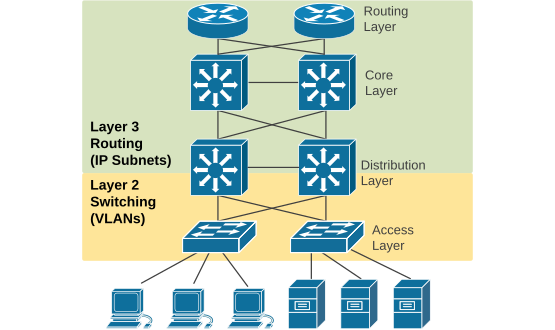
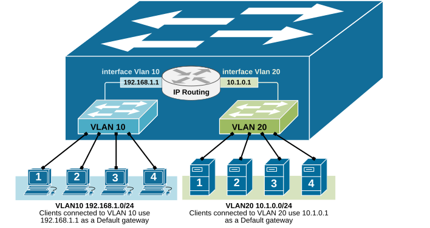
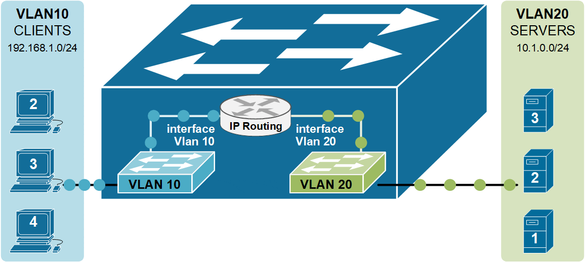
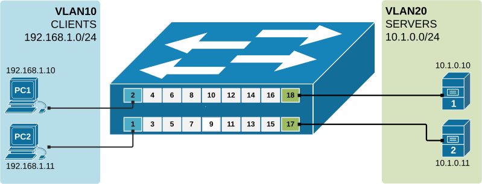
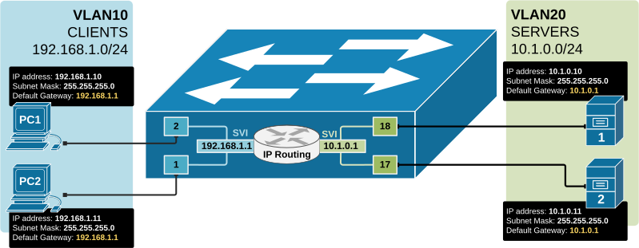

[InterVLAN routing using Layer 3 switch](https://www.networkacademy.io/ccna/ethernet/intervlan-routing)
==========

# InterVLAN routing using Layer 3 switch

In this lesson, we will learn to configure a **multilayer switch** (also called **Layer 3 switch**) to perform **inter-VLAN routing**, which was previously done using an actual router. Multilayer switches can forward frames based on MAC address information and can also forward IP packets based on IP destination. That is why they are also referred to as Layer 3 switches.

## Multilayer Switches

A switch is a device that typically operates at layer 2 of the OSI model. It inspects frames and switches them between interfaces **based on MAC addresses** found in the Ethernet header. This type of device is referred to as just a switch or a **Layer 2 switch**. It does not look deeper than the Ethernet header and does not make any decisions based on information in the IP header. Routers, on the other hand, strip the Ethernet header of frames and look at the packet in the frame's payload. They make routing decisions **based on the IP addresses** found in the Layer 3 header and place a new Ethernet header before switching the frame out to another interface.

A multilayer switch can perform both functions explained above at incredibly fast speeds. It can switch frames as a regular switch and can perform IP routing as a router. Therefore, it can perform functions at layer 2 and layer 3 of the OSI model. That is why such a device is called a **Multilayer Switch** or a **Layer 3 switch**.

## Why do we need Layer 3 switches?

Back in the old days, when the networks started to grow rapidly, people realized that it was unscalable to perform InterVlan routing at the router layer of the network. For example, when the network scales to the point where there are multiple layers of switches: access, distribution, and core, if you want to perform InterVLAN routing using routers, you must extend the VLANs up to the routers. This creates some serious problems:

-   **Unscalable**—Look where the routers are in the three-tier design. If these devices are to perform inter-VLAN routing, we must extend the VLANs all the way to the top of the network topology. However, large Layer 2 networks with many switches and VLANs are hard to manage. Additionally, the Spanning Tree Protocol (STP) blocks all redundant ports and slows down the convergence.
-   **Large fault domain—**If there's a loop or broadcast storm in the Layer 2 network, it can bring down the whole network. There's no fault isolation between sections of the network.



Figure 1. Why do we need Layer 3 switches?

The industry realized that **switches needed to be able to perform switching and routing** at the same time. With InterVLAN routing done by switches at the distribution layer, the network could be separated into access, distribution, and core layers. This improved fault isolation and allowed the network to scale.

On the other side of the spectrum, there was also a problem: very small networks with only one switch with multiple VLANs needed a router to do the InterVLAN routing. For example, if we look closer at the topology shown in the diagram below, we have four clients in Vlan 10 and four servers in Vlan 20. Clients and Servers are in separate broadcast domains and different subnets. Therefore, for clients in VLAN 10 to be able to communicate with the Servers in VLAN20, IP routing is required.


Figure 2. A single switch with multiple VLANs.

However, routers are usually much more expensive than switches. In many cases, a router **can cost 5 to 10 times** more than a similar switch. This is because routers are built for advanced features, like wide-area networks (WAN) and complex routing protocols. They also have fewer interfaces than switches.

The industry realized that it doesn't make sense to use an expensive router in the LAN simply to perform InterVLAN routing. It is not cost-efficient for small and medium businesses.

Those two inefficiencies of using routers for InterVLAN routing have led to the introduction of switches with embedded routing functionality called Layer 3 switches.

## What is a Layer 3 switch?

A Layer 3 switch has an IP routing process that can route packets based on the IP address information in the Layer 3 header. This means it checks the destination IP address in each packet and decides where to send it, just like a router.

It uses a routing table to find the best path to the destination network. **The routing is done in hardware (using ASICs)**, so it's much faster than traditional routers that use software-based routing. So, a Layer 3 switch can forward packets between different IP subnets using this built-in routing function.



Figure 3. Inter-VLAN routing by a Layer 3 switch.

As you know from the previous two examples of Inter-VLAN routing, the router has a routing interface in each VLAN. This routing interface has an IP address from the respective subnet, and the nodes in the vlan use this IP as a Default Gateway. But in the case of a Layer 3 switch, we do not have a router or any routing interfaces. That is why Layer 3 switches use the concept of **an SVI interface that connects a Vlan to the routing process**, as shown in the diagram above. SVI stands for Switched Virtual Interface. For example, interface Vlan 10 connects to VLAN 10, and interface VLAN 20 connects to VLAN 20.

An SVI interface is created using the following command in global configuration mode:

```plaintext
L3Switch(config)# interface Vlan10
%LINK-5-CHANGED: Interface Vlan10, changed state to up
%LINEPROTO-5-UPDOWN: Line protocol on Interface Vlan10, 
changed state to up
```

Once the interface is defined, we configure the IP parameters under the interface configuration mode.

```plaintext
L3Switch(config-if)# description VLAN10
L3Switch(config-if)# ip address 192.168.1.1 255.255.255.0
L3Switch(config-if)# no shutdown
```

An SVI interface is configured and works the same as a physical router interface, but it is virtual. The main difference is that an SVI doesn't use a physical port. Instead, it uses the switch's internal hardware to route traffic between VLANs. It behaves just like a router interface, but it's created in software and linked to a VLAN, as shown in the diagram below.



Figure 4. L3 switch performing InterVLAN routing.

Notice that instead of a physical external router, the inter-Vlan routing functionality is performed by the switch itself.

## Configuration Example

Now, let's demonstrate how we configure a multiplayer switch to route between two virtual LANs.

### Physical diagram

In this example, we will learn to configure a **multilayer switch** (also called *Layer 3 switch*) to perform inter-VLAN routing, which was previously done using an actual router. Multilayer switches can forward frames based on MAC address information and can also forward IP packets based on IP destination. That is why they are also referred to as Layer 3 switches.

The diagram below shows the physical topology that we are going to use for this demonstration. Note that there is no router present because the switch itself will perform the Inter-VLAN routing.



Figure 5. L3 switching physical topology.

The topology is a greenfield deployment. All devices are with their factory-default settings.

## Configuring the switch

Let's first see all available interfaces on the switch. Note that the ports where we have connected devices are up/up, and all other switch ports are down/down. Also pay attention that by default there is one SVI interface already configured on the switch - the default Vlan1's SVI.

```plaintext
L3Switch# show ip interface brief
Interface              IP-Address      OK? Method Status                Protocol 
FastEthernet0/1        unassigned      YES unset  up                    up 
FastEthernet0/2        unassigned      YES unset  up                    up 
FastEthernet0/3        unassigned      YES unset  up                    up 
FastEthernet0/4        unassigned      YES unset  up                    up 
FastEthernet0/5        unassigned      YES unset  down                  down 
FastEthernet0/6        unassigned      YES unset  down                  down 
FastEthernet0/7        unassigned      YES unset  down                  down 
FastEthernet0/8        unassigned      YES unset  down                  down 
FastEthernet0/9        unassigned      YES unset  down                  down 
FastEthernet0/10       unassigned      YES unset  down                  down 
FastEthernet0/11       unassigned      YES unset  down                  down 
FastEthernet0/12       unassigned      YES unset  down                  down 
FastEthernet0/13       unassigned      YES unset  down                  down 
FastEthernet0/14       unassigned      YES unset  down                  down 
FastEthernet0/15       unassigned      YES unset  up                    up 
FastEthernet0/16       unassigned      YES unset  up                    up 
FastEthernet0/17       unassigned      YES unset  up                    up 
FastEthernet0/18       unassigned      YES unset  up                    up 
GigabitEthernet0/1     unassigned      YES unset  down                  down 
GigabitEthernet0/2     unassigned      YES unset  down                  down 
Vlan1                  unassigned      YES unset  administratively down down
```

Let's create two VLANs - VLAN10 (Clients) and VLAN20 (Servers) and assign the interfaces to the respective VLANs.

```plaintext
L3Switch(config)# vlan 10
L3Switch(config-vlan)# name CLIENTS
L3Switch(config-vlan)# exit
!
L3Switch(config)# vlan 20
L3Switch(config-vlan)# name SERVERS
L3Switch(config-vlan)# exit
```

Now, let's assign the ports where the end devices connect to the correct VLANs, according to the physical diagram.

```plaintext
L3Switch# conf t
Enter configuration commands, one per line.  End with CNTL/Z.
L3Switch(config)# interface range fastEthernet 0/1 - 2
L3Switch(config-if-range)# switchport access vlan 10
L3Switch(config-if-range)# exit
L3Switch(config)# interface range fastEthernet 0/17 - 18
L3Switch(config-if-range)# switchport access vlan 20
L3Switch(config-if-range)# end
```

Let's verify that the VLANs are configured and the ports are correctly assigned using the following command.

```plaintext
L3Switch# show vlan brief

VLAN Name                             Status    Ports
---- -------------------------------- --------- -------------------------------
1    default                          active    Fa0/5, Fa0/6, Fa0/3, Fa0/4, Fa0/7,
                                                Fa0/8, Fa0/9, Fa0/10, Fa0/11, Fa0/12
                                                Fa0/13, Fa0/14, Fa0/15, Fa0/16,
                                                Gig0/1, Gig0/2
10   CLIENTS                          active    Fa0/1, Fa0/2
20   SERVERS                          active    Fa0/17, Fa0/18
1002 fddi-default                     active    
1003 token-ring-default               active    
1004 fddinet-default                  active    
1005 trnet-default                    active    
```

### Configuring the switch's IP routing functionality

The second step in the process is to enable the switch's IP routing functionality using the following command in global configuration mode.

```plaintext
L3Swtich(config)# ip routing 
```

The next step is to configure the SVi interfaces for each VLAN and assign them an IP address.

```plaintext
L3Swtich# configure terminal 
Enter configuration commands, one per line.  End with CNTL/Z.
L3Swtich(config)# interface Vlan10
%LINK-5-CHANGED: Interface Vlan10, changed state to up
%LINEPROTO-5-UPDOWN: Line protocol on Interface Vlan10, changed state to up
L3Swtich(config-if)# description CLIENTS
L3Swtich(config-if)# ip address 192.168.1.1 255.255.255.0
L3Swtich(config-if)# exit
L3Swtich(config)# interface Vlan20
%LINK-5-CHANGED: Interface Vlan20, changed state to up
%LINEPROTO-5-UPDOWN: Line protocol on Interface Vlan20, changed state to up
L3Swtich(config-if)# description SERVERS
L3Swtich(config-if)# ip address 10.1.0.1 255.255.255.0
L3Swtich(config-if)# end
```

Now, the switch has routing interfaces in both VLANs and both subnets in its routing table, which is shown as Connected.

```plaintext
L3Switch# show ip route

Codes: C - connected, S - static, I - IGRP, R - RIP, M - mobile, B - BGP
       D - EIGRP, EX - EIGRP external, O - OSPF, IA - OSPF inter area
       N1 - OSPF NSSA external type 1, N2 - OSPF NSSA external type 2
       E1 - OSPF external type 1, E2 - OSPF external type 2, E - EGP
       i - IS-IS, L1 - IS-IS level-1, L2 - IS-IS level-2, ia - IS-IS inter area
       * - candidate default, U - per-user static route, o - ODR
       P - periodic downloaded static route
Gateway of last resort is not set
     10.0.0.0/24 is subnetted, 1 subnets
C    10.1.0.0 is directly connected, Vlan20
C    192.168.1.0/24 is directly connected, Vlan10
```

### Configuring End Hosts

The last step to enable inter-VLAN routing is to configure each end host with the correct IP address, subnet mask, and default gateway.

-   The IP address must match the VLAN's subnet.
-   The default gateway must be the IP address of the SVI for that VLAN.



Figure 6. Default Gateway to SVI.

This allows the host to send traffic to devices in other VLANs through the switch's Layer 3 routing process. Without the correct gateway, devices can only talk to others on the same VLAN.

## Key Takeaways

-   Layer 3 switches can perform **both** switching (Layer 2) and routing (Layer 3) functions.
-   They use **hardware-based (ASIC) routing**, which is much faster than traditional routers.
-   They are commonly used **in enterprise LANs**, especially in distribution and core layers.
-   Layer 3 switches made the three-tier network design possible by allowing fast **inter-VLAN routing**.
-   SVI (Switched Virtual Interface) is **a virtual Layer 3 interface** for a VLAN.
-   An SVI acts like a router interface, providing **an IP gateway** for devices in that VLAN.
-   To use SVIs for routing between VLANs, you must enable the **ip routing** command.
-   SVIs make routing inside the switch faster and more efficient **without needing external routers**.
