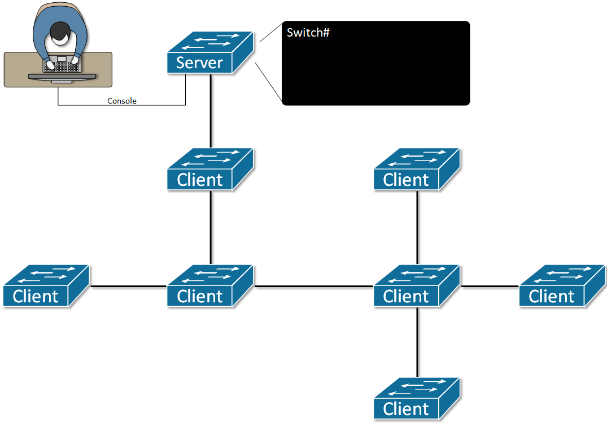
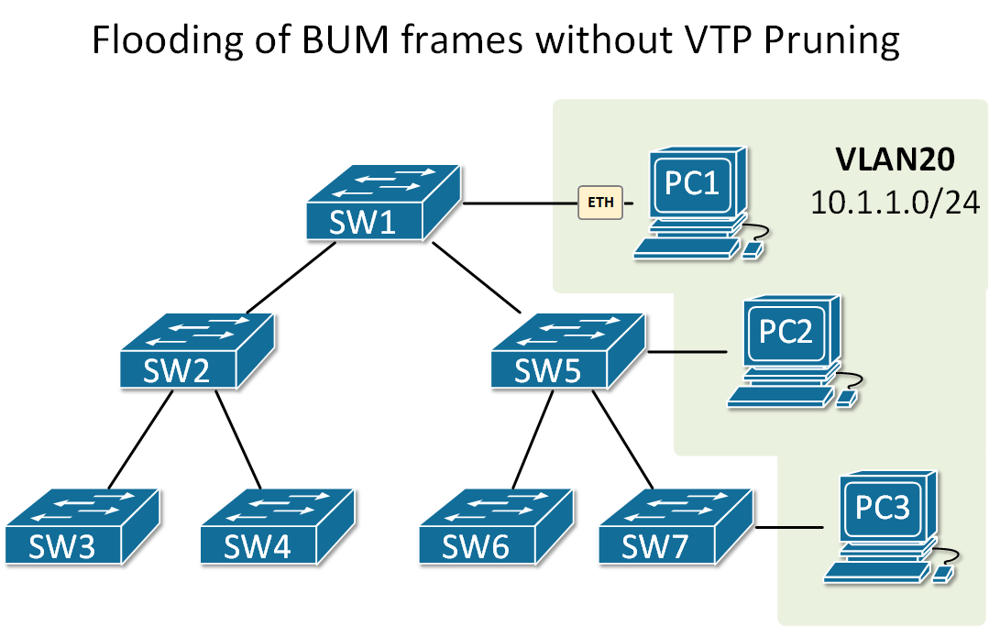

[What is VTP?](https://www.networkacademy.io/ccna/ethernet/vlan-trunking-protocol-vtp-0)
==========

## What problem does VTP solve?

In the previous section, we have learned that VLANs are locally significant for a switch and are configured manually. Well, if you think more deeply about it, this is a huge scaling limitation. Imagine a network that has 100+ switches and you want to provision a new VLAN. Someone has to log on every single device and execute the commands. This is a slow and trivial process prone to human error. The **VLAN Trunking Protocol (VTP)** has been introduced to solve this scaling problem.

VTP is a Layer 2 messaging protocol that was designed **to manage the creation and deletion of VLANs** and maintain network-wide VLAN database consistency. Using this protocol, a network administrator can add or delete VLANs and have those changes automatically propagated to all other switches in the network. Without VTP, switches do not exchange information about VLANs.

The protocol has been designed around the centralized management idea. One or more switches are assigned the role of **VTP Server**. Any updates made on these switches are sent through VTP to the other switches, which are **VTP Clients**.

Figure 1. Example of how VTP works

## VTP Domain

A VTP domain is defined by all switches that share the same **VTP Domain name**. A switch can be in only one domain.

By default, Cisco switches do not have a VTP domain name assigned. When they receive a VTP advertisement over a trunk link, they inherit the domain name and the VTP revision number found in the message. The name can be configured manually using the **vtp name** command.

All changes made on the VTP server are propagated only to the switches in the VTP domain. If there is a switch configured with different VTP domain name, it won't accept the advertisements and won't update its VLAN database.

## VTP Modes

Table 1. VTP Modes of operation

| VTP Mode | Description |
|---|---|
| VTP Server | VTP Server is the **Default Mode** on Cisco switches. In Server mode, the switch advertises all changes to the VLAN database to all other switches in the same VTP Domain. These advertisement messages are sent over trunk links. |
| VTP Client | VTP Clients transmit and receive VTP updates but cannot create or delete VLANs. All VLAN changes are done on the switch in Server mode. |
| VTP Transparent | Switches in VTP Transparent mode transmit and receive VTP updates but do not update their VLAN database. They do not participate in VTP at all and only relay VTP messages. |
| VTP Off | Switches in VTP Off mode do not participate in VTP at all and do not relay VTP messages. |

## VTP Versions

#### VTP Version 1

VTP version 1 supports the following features:

- The default for old Cisco switches.
- VTP transparent switch relay VTP messages only if the domain and version found in the message are equal to its own.
- It supports only the normal VLAN range (1-1005) even in Transparent mode.
- It drops unknown TLVs (Type-Length-Value).

#### VTP Version 2

VTP version 2 has the following improvements over version 1:

- The default for modern Cisco switches.
- VTP transparent switch **relays VTP messages** without inspecting the domain name and version number.
- It supports extended VLANs range (1006 to 4094) in Transparent mode.
- When new information is received from VTP messages, **consistency checks are not performed**. If the MD5 digest on a received VTP message is correct, the information is accepted.
- It relays unknown TLVs (Type-Length-Value).

#### VTP Version 3

VTP version 3 has many important features and improvements over v1 and v2 such as:

- It supports **the extended VLAN range** (VLANs 1006 to 4094) in advertisements. V1 and V2 only work with VLANs 1 to 1005.
- It supports **Private VLANs** (private vlan is a technique to partition a single VLAN into isolated 'sub-VLANs').
- It supports advertisements for **Multiple-Spanning-Tree (MST)** information.
- It supports **enhanced authentication**. Passwords can be configured as **hidden** or **secret**.
- It supports the option to **turn off VTP**. In V1 and V2 you can only set the VTP in transparent mode but cannot completely switch it off.
- It has greater control over the VLAN database through the concept of **VTP primary server** and **VTP secondary server**. It solves the revision overwrite problem that exists in VTP version1 and VTP version 2. Even if a rogue switch is connected to the network as a VTP server with the same domain/password and higher revision number, it won't overwrite the VLAN database because it won't have VTP primary server privileges (these are given manually by a network administrator).

## VTP Revision Number

Switches use the **VTP Revision Number** to keep track of domain's VLAN database changes. It starts from 0 and for every change (VLAN added, VLAN deleted etc), the number is increased by 1 and is advertised to all other VTP clients in the domain. Therefore, all switches in a VTP domain must have the same revision number at any given time. If a switch receives a VTP message, it only processes the data if the revision number in the update is higher than its own.

## VTP Pruning

When using VTP, all switches have all VLANs, because VTP synchronizes the VLAN databases of all devices in the domain. If for example, a network topology has 100 VLANs, every single switch has these 100 VLANs in the database and allowed on the trunk links and every switch receives BUM frames from all VLANs. But what if there are end clients in only 3 VLANs, why does the switch need to receive broadcast frames from the other 97 VLANs and then discard them because there are no end clients in these VLANs? This is wasting available bandwidth and resources. That's why the feature VTP pruning has been introduced to solve this sub-optimal resource usage.

VTP Pruning restricts flooded BUM traffic on trunk links that lead to switches with no clients in particular VLAN. Figure 2 shows a network topology without VTP Pruning enabled. PC1 is sending a broadcast frame in VLAN 20. Note that there are only three end clients connected in this VLAN (PC1, PC2, and PC3) but the broadcast frame floods to every switch in the network, even though SW2, SW3, SW4, and SW6 have no clients in this VLAN.

Figure 2. Flooding of BUM frames without VTP Pruning

Figure 3 shows a network topology using VTP and VTP Pruning enabled. PC1 is sending a broadcast frame in VLAN 20. Note that the broadcast frame floods only to those switches that have clients in this VLAN - SW1, SW5, and SW7. VTP Pruning has removed this VLAN from the trunk links towards the switches with no end clients.

Figure 3. Flooding of BUM frames with VTP Pruning

VTP Pruning needs to be enabled on a single VTP Server, and it becomes active for the entire VTP domain.
