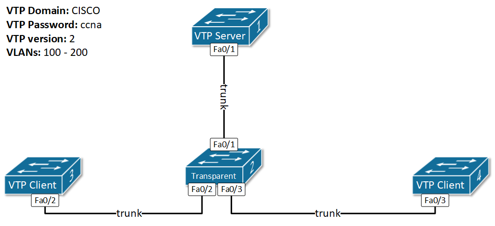

[Configuring and Verifying VTP v2](https://www.networkacademy.io/ccna/ethernet/configuring-vtp-v2)
==========

# Configuring and Verifying VTP v2

## Configuring VTP

#### Verifying the topology

Before you start configuring VLAN Trunking Protocol on Cisco switches, it is very important to first verify that all inter-switch links are **trunks**. Especially in lab/test environments, engineers often spent time troubleshooting VTP issues and in the end, it turns out that the problem is not with the VTP but with the Interswitch links.

**IMPORTANT TO REMEMBER** VTP messages are sent and received on trunk links only.

In this configuration example, we will use the topology shown in Figure 1. Before we start configuring the VTP, let's verify the trunks and how many VLANs are configured.



Figure 1. VTP Configuration Topology

The easiest way to verify this by checking Switch 2, because it has links to all other switches.

```ini
SW2#sh interfaces trunk 
Port        Mode         Encapsulation  Status        Native vlan
Fa0/1       desirable    n-802.1q       trunking      1
Fa0/2       desirable    n-802.1q       trunking      1
Fa0/3       desirable    n-802.1q       trunking      1

Port        Vlans allowed on trunk
Fa0/1       1-1005
Fa0/2       1-1005
Fa0/3       1-1005

Port        Vlans allowed and active in management domain
Fa0/1       1
Fa0/2       1
Fa0/3       1

Port        Vlans in spanning tree forwarding state and not pruned
Fa0/1       1
Fa0/2       1
Fa0/3       1

SW2# sh vlan

VLAN Name                             Status    Ports
---- -------------------------------- --------- -------------------------------
1    default                          active    Fa0/4, Fa0/5, Fa0/6, Fa0/7
                                                Fa0/8, Fa0/9, Fa0/10, Fa0/11
                                                Fa0/12, Fa0/13, Fa0/14, Fa0/15
                                                Fa0/16, Fa0/17, Fa0/18, Fa0/19
                                                Fa0/20, Fa0/21, Fa0/22, Fa0/23
                                                Fa0/24, Gig0/1, Gig0/2
1002 fddi-default                     active    
1003 token-ring-default               active    
1004 fddinet-default                  active    
1005 trnet-default                    active    
```

As you can see, SW2 has only the default VLANs and all inter-switch links are trunks.

#### VTP Domain Name

When setting up VTP for the first time, we always start with the domain name. All switches in the topology must be in the same domain. There are two ways to configure this. First more explicit way is to manually configure the name on each switch. The other one is to configure the name only on the VTP server switch and it will advertise it to the others.

```ini
SW1#conf t
Enter configuration commands, one per line.  End with CNTL/Z.

SW1(config)#vtp domain ?
  WORD  The ascii name for the VTP administrative domain.
SW1(config)#vtp domain CISCO
Changing VTP domain name from NULL to CISCO
SW1(config)#end
SW1#
%SYS-5-CONFIG_I: Configured from console by console

SW1#show vtp status 
VTP Version capable             : 1 to 2
VTP version running             : 2
VTP Domain Name                 : CISCO
VTP Pruning Mode                : Disabled
VTP Traps Generation            : Disabled
Device ID                       : 0001.43A9.0200
Configuration last modified by 0.0.0.0 at 0-0-00 00:00:00
Local updater ID is 0.0.0.0 (no valid interface found)

Feature VLAN : 
--------------
VTP Operating Mode                : Server
Maximum VLANs supported locally   : 1005
Number of existing VLANs          : 5
Configuration Revision            : 0
MD5 digest                        : 0x1A 0xFC 0x64 0xDA 0x8E 0xA1 0x8A 0x3B 
                                    0x47 0x97 0x87 0xB1 0x8B 0x59 0xE9 0x52 
```

### VTP Password

There is no need to explain what the VTP password does. It is set to protect the VTP domain from rouge switches. Let's configure a password on SW1.

```ini
SW1#conf t
Enter configuration commands, one per line.  End with CNTL/Z.

SW1(config)#vtp password ?
  WORD  The ascii password for the VTP administrative domain.
SW1(config)#vtp password cisco
Setting device VLAN database password to cisco
SW1(config)#end
SW1#
%SYS-5-CONFIG_I: Configured from console by console

SW1#show vtp status 
VTP Version capable             : 1 to 2
VTP version running             : 2
VTP Domain Name                 : CISCO
VTP Pruning Mode                : Disabled
VTP Traps Generation            : Disabled
Device ID                       : 0001.43A9.0200
Configuration last modified by 0.0.0.0 at 0-0-00 00:00:00
Local updater ID is 0.0.0.0 (no valid interface found)

Feature VLAN : 
--------------
VTP Operating Mode                : Server
Maximum VLANs supported locally   : 1005
Number of existing VLANs          : 5
Configuration Revision            : 0
MD5 digest                        : 0x68 0xDE 0x27 0x00 0xEB 0x43 0x67 0x3F 
                                    0x47 0xB4 0xB4 0x18 0x7F 0x7C 0xF5 0x81 

SW1#show vtp password 
VTP Password: cisco
```

You can see that the password is stored and shown in cleartext.
