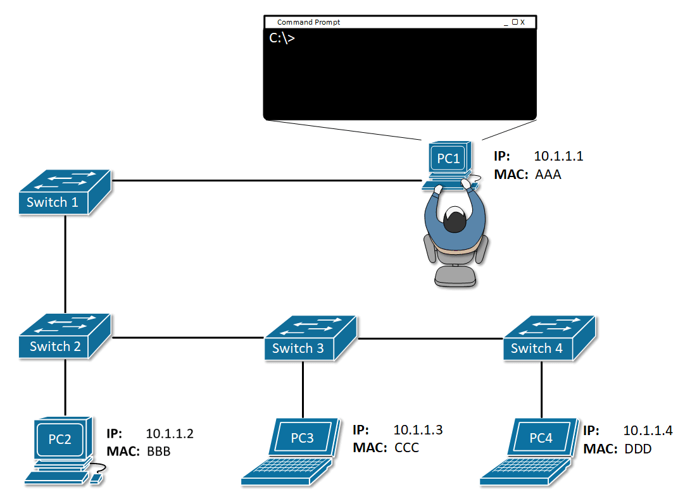
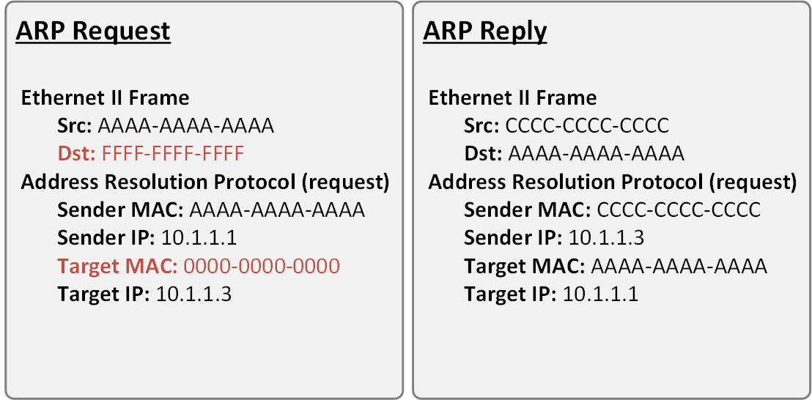
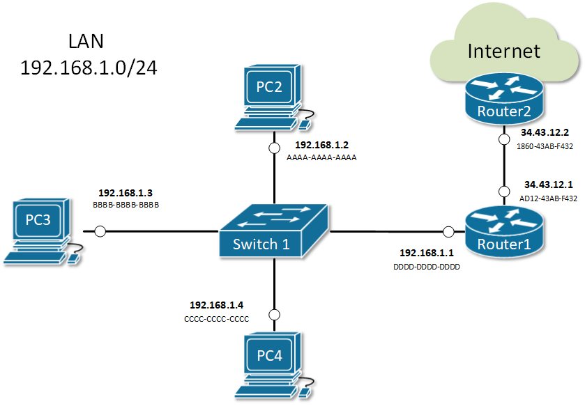

[What is ARP?](https://www.networkacademy.io/ccna/ethernet/what-is-arp)
==========

# What is ARP?

## ARP Role

Address Resolution Protocol (ARP) is a very fundamental protocol in computer networking. When a PC wants to send a message over the network, it has to encapsulate the data down the layers of the OSI model. At each layer, it has to fill all header information such as TCP/UDP ports in the layer 4 header, source, and destination IP addresses in the Layer 3 header, and source and destination MAC addresses in the Layer 2 header. If you think about it, all this information is available to the end client except for the destination MAC address. **Address Resolution Protocol (ARP)** has been introduced to resolve a MAC address based on a given IP address in a local network.

Let's look at the example shown in Figure 1.



Figure 1. What is Address Resolution Protocol (ARP)?

PC1 tries to ping PC3, which is in the same local area network and the same subnet 10.1.1.0/24. When the user executes the command **ping 10.1.1.3**, PC1 starts encapsulating an ICMP Request (ping) into an Ethernet frame before sending it over the network. Let's look at how PC constructs the protocol data unit (PDU):

-   **At the application layer** - PC1 knows that ping works by sending an ICMP Echo Request and waits for an ICMP Echo Response. So, it sets the protocol to be ICMP with the Echo Request flag set. Therefore, everything needed at this layer is available.
-   **At layer 3** - PC1 knows the destination IP address, it is explicitly mentioned by the user in the ping 10.1.1.3 command so it puts it into the destination IP field. PC1 knows its own configured IP address 10.1.1.1 and puts it in the source field. Therefore, everything needed at this layer is available.
-   **At later 2** - PC1 knows its own configured MAC address and put in the source field. BUT there is no way for PC1 to know which end client in the LAN has 10.1.1.3 configured and what is its MAC address. Therefore destination MAC address is not available to PC1 and it has to use **ARP** in order to get it.

## How ARP works

ARP uses broadcast communication (one-to-all) in order to ask all end clients within a LAN, what is the physical address of a given IP.

## ARP Messages

There are two main types of packets in ARP operations:

-   ARP Request
-   ARP Reply

Figure 2 shows an example of both types. You can see that there are four fields in the ARP header:

-   Source Hardware Address (MAC)
-   Source Protocol Address (IP)
-   Target Hardware Address (MAC)
-   Target Protocol Address (IP)



Figure 2. ARP Messages

Note that in the **ARP Request message**, the destination MAC address is the well-known broadcast address **FFFF-FFFF-FFFF**. This signals the switches in the LAN that this is broadcast communication and all connected devices in the LAN must receive a copy of the frame. The other important value to note is the **Target MAC** is **0000-0000-0000**. This signals the owner of the Target IP that the sender is trying to resolve the physical address of this IP.

Note that in the **ARP Reply messages**, both source and destination MAC addresses are unicast ones.



Figure 3. Typical cases when ARP is used

There are four typical cases when this happens:

1.  **Host wants to send data to another host in the same network.** For example, PC2 sends a message to PC3.
    -   PC2 sends an ARP request about the IP address of PC3 192.168.1.3.
    -   Everybody on the LAN receives a copy of the ARP frame.
    -   PC3 replies back with its physical address BBBB-BBBB-BBBB. All other hosts drop the ARP request.
2.  **Host wants to send data to another host in another network.** For example, PC2 sends a message to google.com.
    -   PC2 looks at its routing table.
    -   Finds the IP address of its default gateway 192.168.1.1.
    -   Sends an ARP request about the default gateway IP address 192.168.1.1.
    -   Everybody on the LAN receives a copy of the ARP frame including Router1.
    -   Router1 replies back with its physical address DDDD-DDDD-DDDD.
3.  **A router receives data destined for a host in a locally connected network.** Router1 receives data destined for PC2.
    -   Router 1 sends an ARP request about the destination IP address 192.168.1.2.
    -   Everybody on the LAN receives a copy of the ARP frame.
    -   PC2 replies back with its physical address. All other hosts drop the ARP request.
4.  **A router receives data destined for a host on another network.** Router2 receives data destined for PC2.
    -   Router2 checks its routing table.
    -   Finds that the next-hop address towards PC2 is 34.43.12.1.
    -   Sends an ARP request about the next-hop IP address 34.43.12.1.
    -   Router1 receives a copy of the ARP request.
    -   Router1 replies back with its physical address AD12-43AB-F432.

## ARP Table (ARP Cache)

When a device successfully resolves the MAC address of a given IP, it stores the IP-to-MAC binding in a table called the **ARP table**. Subsequent communication use this cached binding instead of sending ARP request out again. Let's look at the ARP table of a Cisco router.

```plaintext
Router#show arp
Protocol  Address          Age (min)  Hardware Addr   Type   Interface
Internet  10.1.1.1                -   00E0.B076.9A02  ARPA   GigabitEthernet0/1
Internet  10.1.1.2                9   0030.A321.43E3  ARPA   GigabitEthernet0/1
Internet  192.168.1.1             -   00E0.B076.9A01  ARPA   GigabitEthernet0/0
Internet  192.168.1.2             23  0040.0BAD.3852  ARPA   GigabitEthernet0/0
Internet  192.168.1.3             59  00E0.F760.8C2D  ARPA   GigabitEthernet0/0
Internet  192.168.1.4             0   00E0.B01D.B1E7  ARPA   GigabitEthernet0/0
Internet  192.168.1.64            2   0060.2FE4.6DB0  ARPA   GigabitEthernet0/0
```

Each entry in the table is kept for 240 minutes (4 hours) by default. This value is known as **ARP Timeout** and can be set to a different value per interface. You can check it by a look at the output of **show interface**.

```plaintext
Router#sh int GigabitEthernet 0/1
GigabitEthernet0/0/1 is up, line protocol is up (connected)
  Hardware is ISR4331-3x1GE, address is 00e0.b076.9a02 (bia 00e0.b076.9a02)
  Internet address is 10.1.1.1/24
  MTU 1500 bytes, BW 1000000 Kbit, DLY 100 usec,
     reliability 255/255, txload 1/255, rxload 1/255
  Encapsulation ARPA, loopback not set
  Keepalive not supported
  output flow-control is on, input flow-control is on
  ARP type: ARPA, ARP Timeout 04:00:00, 
  Last input 00:00:08, output 00:00:05, output hang never
  Last clearing of "show interface" counters never
  Input queue: 0/375/0 (size/max/drops); Total output drops: 0
  Queueing strategy: fifo
  Output queue :0/40 (size/max)
  5 minute input rate 4 bits/sec, 0 packets/sec
  5 minute output rate 4 bits/sec, 0 packets/sec
     4 packets input, 512 bytes, 0 no buffer
     Received 0 broadcasts (0 IP multicasts)
     0 runts, 0 giants, 0 throttles
     0 input errors, 0 CRC, 0 frame, 0 overrun, 0 ignored
     0 watchdog, 1017 multicast, 0 pause input
     0 input packets with dribble condition detected
     4 packets output, 512 bytes, 0 underruns
     0 output errors, 0 collisions, 1 interface resets
     0 unknown protocol drops
     0 babbles, 0 late collision, 0 deferred
     0 lost carrier, 0 no carrier
     0 output buffer failures, 0 output buffers swapped out
```

The ARP Cache of hosts running Windows or Unix can be checked by executing **arp -a** in the command prompt window

```plaintext
C:\>arp -a
  Internet Address      Physical Address      Type
  192.168.1.1           00e0.b076.9a01        dynamic
  192.168.1.2           0040.0bad.3852        dynamic
  192.168.1.4           00e0.b01d.b1e7        dynamic
  192.168.1.64          0060.2fe4.6db0        dynamic
```

## Summary

-   Address Resolution Protocol (ARP) is a mechanism to resolve the physical address (**MAC**) of a given logical address (**IP**) in a LAN: **IP-to-MAC binding**.
-   An **ARP Request** is encapsulated in a **broadcast frame**. Therefore, it is **one-to-all** communication and every host in the LAN receives a copy of the ARP request. Only the owner of the targeted IP replies back.
-   An **ARP Reply** is encapsulated in a **unicast frame**. Thus it is a **one-to-one** communication between the requestor and the replier.
-   When a device receives the physical address of an IP, it creates an entry in its **ARP Table (ARP Cache)**. Any subsequent communication uses the cached entry.
-   Every entry in the ARP table is kept for 4 hours by default. This is called **ARP Timeout**.
