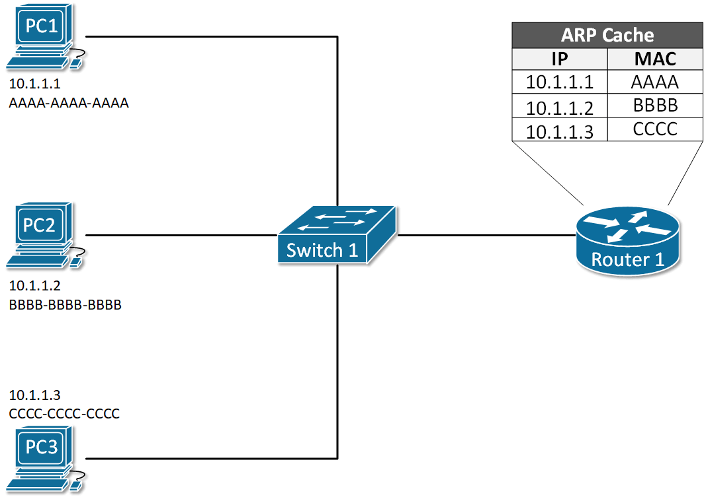
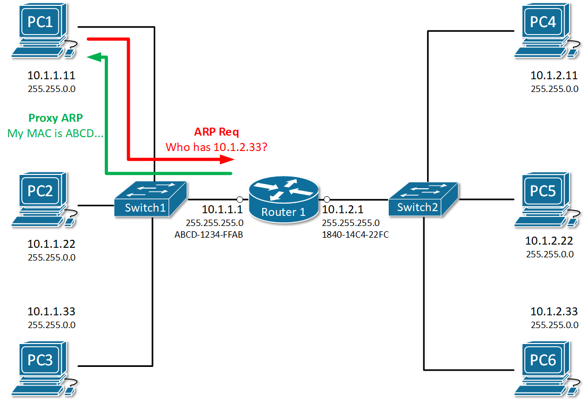

[ARP Features](https://www.networkacademy.io/ccna/ethernet/arp-features)
==========

# ARP Features

## Static ARP Entries

Static ARP entry is a permanent IP-to-MAC binding in the ARP table (ARP cache). One reason that you may want to do this is if two nodes in the LAN are constantly communicating and never change their IP and MAC addresses. Another reason would be to prevent the ARP entry from being overridden by a rouge host in the LAN. In some advanced network scenarios, an IP may need to be bind to a multicast MAC address which can only be done with static ARP.

To add a static ARP cache entry on a Cisco device we use the following command.

```ini
R1(config)#arp 192.168.1.5 20fc.1480.aff2 arpa
```

After executing this command, we can see that the IP-to-MAC binding is in the ARP table

```ini
R1#show arp
Protocol  Address          Age (min)  Hardware Addr   Type   Interface
Internet  192.168.1.1             -   0001.C77E.3B01  ARPA   GigabitEthernet0/0/0
Internet  192.168.1.2             1   00D0.D37E.31C3  ARPA   GigabitEthernet0/0/0
Internet  192.168.1.5             -   20FC.1480.AFF2  ARPA   GigabitEthernet0/0/0
```

To add a static ARP cache entry on a Windows machine we use the following command.

```ini
C:\> arp -s 192.168.1.10 48-6d-bb-be-a6-66
```

After executing this command, we can see that the IP-to-MAC binding is in the ARP table

```ini
C:\>arp -a
Interface: 192.168.1.104 --- 0x10
  Internet Address      Physical Address      Type
  192.168.1.1           54-e6-fc-b6-cb-40     dynamic
  192.168.1.101         48-6d-bb-be-a6-66     dynamic
  192.168.1.10         48-6d-bb-be-a6-66     static
  192.168.1.255         ff-ff-ff-ff-ff-ff     static
```

## Gratuitous ARP (GARP)

**Gratuitous ARP is an unsolicited message** used when a host wants to tell all other nodes to update theirs ARP cache with new MAC-to-IP binding. An example of such a use-case would be when the IP address of a client is suddenly changed. Let's look at the example in Figure 1. Initially, PC1 has IP address 10.1.1.1 and has been communicating over the network for some time. Therefore Router 1 has an entry in the ARP table for PC1's IP-to-MAC binding (10.1.1.1 AAAA-AAAA-AAAA).



Figure 1. Usecase of Gratuitous ARP (GARP)

But what happens if suddenly, the IP address of PC1 is changed from 10.1.1.1 to 10.1.1.7? There is no way for the other nodes in the LAN including Router 1 to know that. So in the ARP cache of router 1 nothing would change until the entry 10.1.1.1 AAAA-AAAA-AAAA expires in 4 hours, but until then communication between PC1 and Router 1 would not be possible.

Gratuitous ARP has been introduced to solve this problem. When the IP address of PC1 is changed. It immediately sends out a GARP message that tells all nodes in the LAN to update their MAC-to-IP bindings with the new address 10.1.1.7 AAAA-AAAA-AAAA. Note that the message is sent unsolicitedly (without ARP Request )

## Proxy ARP

Proxy ARP is a technique by which a router answers with its own MAC address to ARP requests for an IP address that is not on the local network. The router, acting as a proxy, must have a valid route in the routing table for the traffic's destination. A typical scenario when proxy ARP is used is called ***Transparent subnet gatewaying***. This is the case when two separate data-link segments (two different broadcast domains) use the same IP range as shown in Figure 2. In this example, PC1, PC2, and PC3 are in one data-link segment and PC4, PC5, and PC6 are in a different one. Think what will happen when PC1 wants to communicate with PC6, it will send an ARP request such as "Who has 10.1.2.33" but will PC6 ever hear that ARP request in order to reply back? No, it won't because both hosts are in different broadcast domains and the ARP frame from PC1 won't reach PC6. By default, on all Cisco routers, there is a feature called Proxy ARP, which is enabled on all Layer 3 interfaces. It has been introduced to solve this problem by replying to ARP requests for IP addresses that the router has routing towards. In our sample, Router 1 will reply to the ARP request of PC1 with its own MAC address ABCD-1234-FFAB and when the actual traffic comes, it will route to PC6. Ultimately, PC1 and PC6 won't even understand that there is a router in between them, that is why this scenario is called ***Transparent subnet gatewaying**.*



Figure 2. Example of Proxy ARP

To check whether Proxy ARP is enabled on an interface, we use the **show ip interface <interface number>** command.

```ini
R1#sh ip interface gi0/0/0
GigabitEthernet0/0/0 is up, line protocol is up (connected)
  Internet address is 10.1.1.1/24
  Broadcast address is 255.255.255.255
  Address determined by setup command
  MTU is 1500 bytes
  Helper address is not set
  Directed broadcast forwarding is disabled
  Outgoing access list is not set
  Inbound  access list is not set
  Proxy ARP is enabled
  Security level is default
  Split horizon is enabled
  ICMP redirects are always sent
  ICMP unreachables are always sent
  ICMP mask replies are never sent
  IP fast switching is disabled
  IP fast switching on the same interface is disabled
  IP Flow switching is disabled
  IP Fast switching turbo vector
  IP multicast fast switching is disabled
  IP multicast distributed fast switching is disabled
  Router Discovery is disabled
  IP output packet accounting is disabled
  IP access violation accounting is disabled
  TCP/IP header compression is disabled
  RTP/IP header compression is disabled
  Probe proxy name replies are disabled
  Policy routing is disabled
  Network address translation is disabled
  BGP Policy Mapping is disabled
  Input features: MCI Check
  WCCP Redirect outbound is disabled
  WCCP Redirect inbound is disabled
  WCCP Redirect exclude is disabled
```

To disable the feature an interface, we use **no ip proxy-arp** command in interface configuration mode.

```ini
R1# configure terminal
Enter configuration commands, one per line.  End with CNTL/Z.
R1(config)# interface gi0/0/0
R1(config-if)# no ip proxy-arp
R1(config-if)# ^Z
R1#
```

## Inverse ARP

As the name implies, inverse ARP is used to find a Layer-3 address (IP address) based on known Layer 2 address (typically DLCI in frame relay and ATM). In frame relay, for example, the remote router's DLCI is known but its IP address is not known. Therefore Inverse ARP is used to obtain and map the Layer 2 DLCI-to-IP.

As Frame-Relay slowly disappeared, Inverse ARP is not commonly used anymore.

## Reverse ARP

Reverse ARP was used for requesting an IP address from the gateway router's ARP table. It is a predecessor of two common protocols - BOOTP (Bootstrap Protocol) and DHCP (Dynamic Host Configuration Protocol). It is not used anymore in modern local area networks.

## Summary

-   **Static ARP** entry is **a permanent IP-to-MAC binding in the ARP table** configured manually by a network administrator. A typical use-case is to enhance local area security between certain hosts that do not change their IP addresses often.
-   **Gratuitous ARP is an unsolicited message** used when a host wants to tell all other nodes to update theirs ARP cache with new MAC-to-IP binding.
-   **Proxy ARP** is used when a router replies to an ARP request for an IP address that is not part of the local network. The proxy (the router) must have a valid route to the destination in the routing table.
-   **Inverse ARP** is used to find a Layer-3 address (IP address) based on known Layer 2 address (typically DHCP). Not commonly used anymore.
-   **Reverse ARP** is used for requesting an IP address from the gateway router's ARP table. Not used anymore because we have BOOTP and DHCP.
