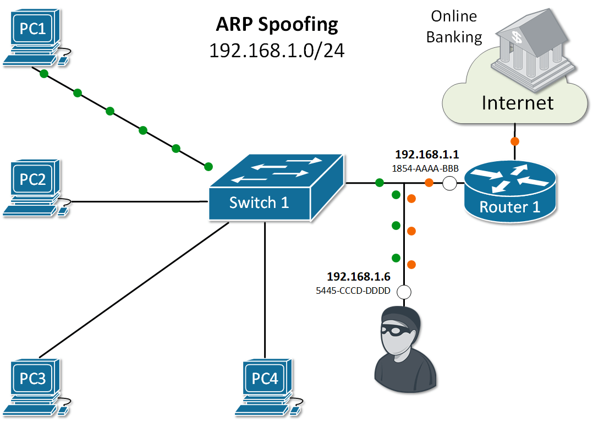
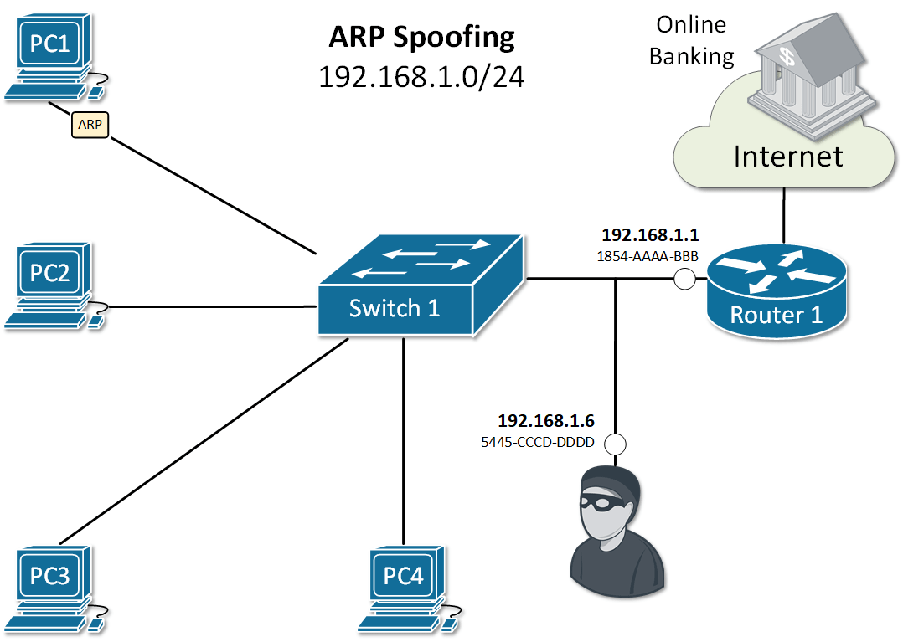
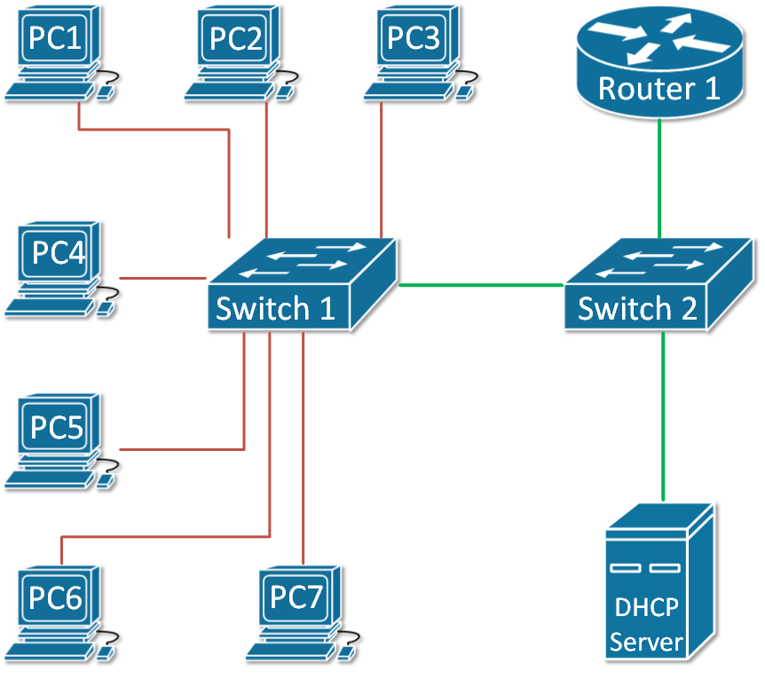

[ARP Security](https://www.networkacademy.io/ccna/ethernet/arp-security)
==========

# ARP Security

## ARP vulnerabilities

Address Resolution Protocol (ARP) has been designed in times when network security has not been very developed. Therefore **the protocol is clear text with no embedded security**. It does not validates ARP packets and even accepts ARP Response even if ARP Request has never been sent out. By default, no mechanism validates whether a rouge host sends malicious ARP messages or intercepts and alters ARP Request/Replies. Several well-known attacks use the same process called **ARP spoofing**. The ultimate goal of the attackers is to get in the data path, as shown in Figure 1, and steal private data.



Figure 1. Example of man in the middle attack

## ARP spoofing

When a rouge host in the local area network sends false ARP messages, it can associate its MAC address with the IP address of the default gateway or any other IP in the LAN. It then can start receiving data intended for another host in the network. There are there main attacks that utilize this spoofing technique:

-   **Main-in-the-Middle:** An intruder intercepts ARP messages from legitimate users and modifies them to redirect the data.
-   **Session Hijacking:** A hacker tries to use ARP spoofing to steal a cookie, token, or session ID so he can gain unauthorized access to private data. Pretty common in public WiFi networks at busy bus stations and airports.
-   **Denial of Service (DoS)**: An attacker tries to make a host or network resource unavailable to its intended users. Typically in the case of ARP spoofing, it is done by stealing legitimate data intended to the particular host or flooding the host with a high number of false or malformed ARP messages.



Figure 2. ARP Spoofing Example

Let's look at the example in Figure 2. PC1 sends an ARP Request for the IP of Router 1. As you already know, all nodes in the LAN receive a copy of this packet. Because of that, an attacker with IP 192.168.1.6 can spoof or alter the reply of router 1 in a way so the physical address associated with IP 192.168.1.1 is 5445-CCCD-DDDD. This will force all traffic between PC1 and Router 1 to go through the attacker as shown in Figure 1. This type of ARP exploit is often referred to as **ARP Poisoning**.

## ARP Security Features

Cisco has introduced a few ARP security features to address the vulnerabilities explained above.

#### Dynamic ARP Inspection (DAI)

**Dynamic ARP inspection (DAI)** is a feature that intercepts ARP Request/Reply messages and validates the MAC-to-IP bindings against a trusted database built by another feature called **DHCP snooping**. The main idea is that if you dynamically assign IP addresses to hosts with DHCP, the switch can snoop the DHCP messages and track which IP is given to which host in the LAN. Based on that information, it can, later on, validate if a host replies to ARP request for an IP address that is not assigned to it. Invalid or false ARP replies are dropped.

The feature works by associating a **trust state** to each interface on the switch. ARP frames arriving at trusted interfaces bypass the inspection, while those being received on untrusted ports go through a validation check. In a typical DAI configuration, all switch ports connected to end clients would be **untrusted**, while the ports connected to other switches/routers or DHCP servers would be **trusted**.



Figure 3. Dynamic ARP Inspection Example

Let's look at the example in Figure 3. The green ports are configured as trusted and the red ones are untrusted.

#### ARP Rate Limiting

**ARP packets are processed in the CPU**, so when a switch receives a high number of ARP frames, this can easily overload the CPU and crash the device. This can be exploited as a denial-of-service attack. DAI has a built-in mechanism that prevents this by limiting the number of ARP packets that can go to the CPU each second. When dynamic ARP inspection is enabled on a switch, automatically all untrusted ports are rate-limited to 15 ARP packets per second, while trusted has no rate-limiting. When the rate of incoming ARP frames exceeds the limits, the interface is disabled.

#### DAI Logging

A log message is generated for every denied ARP packet and can be sent to Security Operation Center (SOC) for analysis or can be fed into automated threat detection algorithms that can act upon it. An example of such a log message is shown below.

```xml
14:21:58: %SW_DAI-4-DHCP_SNOOPING_DENY: 1 Invalid ARPs (Req) on Gi1/0/21, vlan 1.([18b1.a4f5.3aa1/192.168.1.45/0000.0000.0000/0.0.0.0/14:14:21 UTC Fri June 12 2020])
```

## Configuring Dynamic ARP Inspection (DAI)

Assume we are using the topology shown in Figure 3 as an example. To enable Dynamic ARP Insepction (DAI) on both switches and configure the trunk link between as trusted, the following steps are needed:

**Step 1:** Enabling and Verifying DAI on both switches.

```ini
SW1#configure terminal 
Enter configuration commands, one per line.  End with CNTL/Z.

SW1(config)#ip arp inspection ?
  validate  Validate addresses
  vlan      Enable/Disable ARP Inspection on vlans

SW1(config)#ip arp inspection vlan 1
```

The same configuration is applied on switch 2. Let's now verify the status of the feature.

```ini
SW1#show ip arp inspection 

Source Mac Validation      : Disabled
Destination Mac Validation : Disabled
IP Address Validation      : Disabled

 Vlan     Configuration    Operation   ACL Match          Static ACL
 ----     -------------    ---------   ---------          ----------
    1     Enabled           Active

 Vlan     ACL Logging      DHCP Logging      Probe Logging
 ----     -----------      ------------      -------------
    1     Deny             Deny              Off

 Vlan      Forwarded        Dropped     DHCP Drops      ACL Drops
 ----      ---------        -------     ----------      ---------
    1              0              0              0              0

 Vlan   DHCP Permits    ACL Permits  Probe Permits   Source MAC Failures
 ----   ------------    -----------  -------------   -------------------
    1              0              0              0                     0

 Vlan   Dest MAC Failures   IP Validation Failures   Invalid Protocol Data
 ----   -----------------   ----------------------   ---------------------
    1                   0                        0                       0
```

**Step 2:** Configure the link between the switches as trusted port.

```ini
SW1#sh cdp neighbors 
Capability Codes: R - Router, T - Trans Bridge, B - Source Route Bridge
                  S - Switch, H - Host, I - IGMP, r - Repeater, P - Phone
Device ID    Local Intrfce   Holdtme    Capability   Platform    Port ID
SW2          Fas 0/1          170                    3560        Fas 0/1

SW1#configure terminal 
Enter configuration commands, one per line.  End with CNTL/Z.

SW1(config)#int fa0/1
SW1(config-if)#ip arp inspection trust 
SW1(config-if)#end
SW1#
%SYS-5-CONFIG_I: Configured from console by console

SW1#sh ip arp inspection interfaces fa0/1
Interface        Trust State     Rate(pps)    Burst Interval
---------------  -----------     ---------    --------------
Fa0/1            Trusted                None                 1
```

**Step 3:** Verify that DHCP Snooping is running and there are MAC-to-IP Bindings

```ini
SW1# show ip dhcp snooping binding
MacAddress IpAddress Lease(sec) Type VLAN Interface
------------------ --------------- ---------- ------------- ---- --------------------
18:50:FD:3D:4C:01 192.168.1.7 5227 dhcp-snooping 1 FastEthernet0/7
```

Now lets see what will happen if a rouge host sends a false ARP reply trying to poison the ARP cache for 192.168.1.7

```ini
14:21:41: %SW_DAI-4-DHCP_SNOOPING_DENY: 2 Invalid ARPs (Req) on Fa0/7, vlan 1.([1841.0fc2.043d/192.168.1.7/0000.0000.0000/0.0.0.0/14:20:35 UTC Tue June 12 2020])
```

## Summary

-   ARP is not a secure protocol and **doesn't have built-in security mechanisms**.
-   A few exploits based around **ARP Spoofing (ARP Poisoning)** are well-known.
-   Cisco has introduce a feature called **Dynamic ARP Inspection (DAI)** that mitigates most of the well-know vulnarabilities.
-   DAI depends on another feature called **DHCP Snooping** that tracks which IP address has been given by DHCP to which host and store that information in a **MAC-to-IP binding table**.
-   DAI works by associating a **trust state** to each interface on the switch. When ARP packet arrives on untrusted port, it is validated against the MAC-to-IP binding table.
-   Untrusted ports are **rate-limited to 15 ARP packets** per second to prevent Denial-of-Service attacks.
