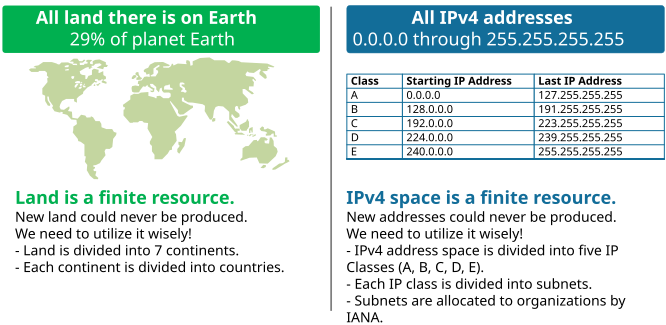
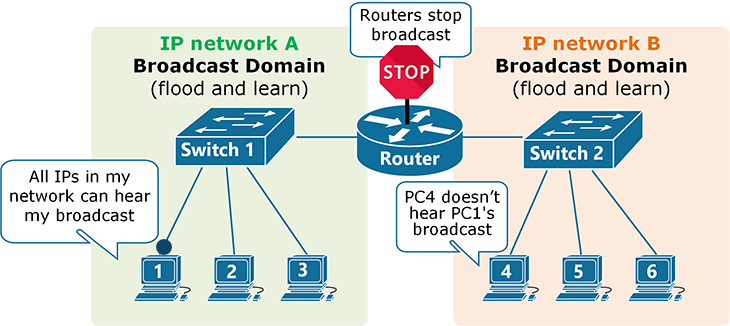
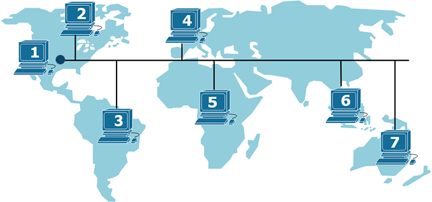
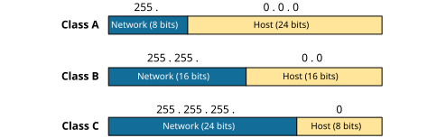
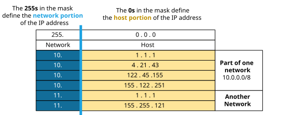
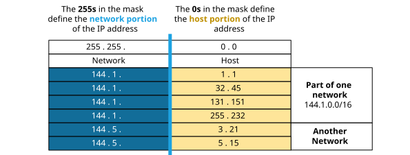
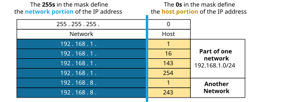
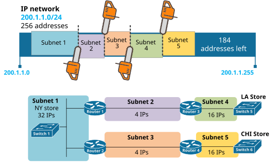

[Why do we need IP Subnetting?](https://www.networkacademy.io/ccna/ip-subnetting/why-do-we-need-ip-subnetting)
==========

In this lesson, we will begin our discussion on IPv4 addressing and subnetting. We will see why we need to **subdivide **classful IP networks into **subnets**. 

## What is an IP address?

An IP address is an Internet Protocol address used as an endpoint identifier in IP-based communications. In simplified language, **an IP address is just like a telephone number**. When you want to call another person over your mobile, you use the telephone number of the other person who receives the call from your telephone number. Basically, the phone call is between phone numbers. In the same way, when a device wants to communicate using IP communication, it sends the data to the remote device's IP address. Every mobile phone has a telephone number. In the same way, every device needs to have an IP address to send and receive data over an IP network.

A key point here is that, by standard, **an IP address is 32 bits long** (4 bytes), which means that there are only 2^32 (4,294,967,296) possible unique IP addresses (and they were officially exhausted in April 2017). That's it; new addresses could never be produced. The IPv4 address space is a finite resource, and we need to wisely utilize each IP address (similar to our planet's land). 

*Figure 1. IPv4 address space is a finite resource*

So every device in the world needs an IP address, and on the other hand, the IPv4 address space is a finite resource, and there are only 2^32 addresses. 

## What is an IP network?

Let's get back to the analogy with telephony to understand what is an IP network. When you call a landline telephone number in your area, you just call the number directly. However, when you call another landline telephone number in another area, you do not call the number directly but dial the area code first. An IP network is a group of IP addresses that share the same broadcast domain and don't need a router to communicate - similar to how we directly dial phone numbers within the same area. Within one IP network, each device can resolve the MAC addresses of each IP address via ARP and communicate directly at the Ethernet layer because all IPs share the same broadcast domain and can receive a copy of each other's broadcast packets.

*Figure 2. What is an IP network?*

If we look at figure 2 above, hosts 1, 2, and 3 are in one IP network-A and share the same Ethernet segment. When host 1 sends broadcast packets, such as ARP requests, all other hosts (2, 3, and the router) hear the broadcast and can respond back. This behavior is referred to as **flood-and-learn**. Host-1 floods the broadcast domain saying, "*I am looking for host-3*". Each host in the subnet receives the broadcast packet, including host-3, which answers back, and both hosts start communicating directly. However, when a device wants to communicate to an IP address part of another network, it has to send the packets to a router (the default gateway). The router forwards the packets based on its routing table toward the destination IP address. **Routers stop the flood-and-learn way of communicating** and introduce a path selection logic based on routing protocols.

We can summarize what we have shown so far with three essential rules related to IP networks that every network engineer should always remember:

- **Rule #1. **One subnet = Broadcast domain =  One VLAN
- **Rule #2. **IP addresses in the same subnet communicate directly through Ethernet switching and aren't separated by a router
- **Rule #3. **IP addresses in different subnets are separated by one or more routers and communicate through IP routing.

### Why do we need multiple IP networks?

Okay, at this point, you might be wondering - "*Why don't we just assign an IP address to every device in the world, make them in one giant IP network, and get done with it? Why do we need to have **subnets **and **subnet masks**?*"

Figure 3 shows what will happen if we have one giant IP network that spans the entire planet. Let's suppose PC 1 wants to communicate to PC2 and both clients are very close together - all other hosts in the IP network will receive a copy of the broadcast packets that PC1 will send. Basically, each broadcast packet will be heard by all hosts worldwide. Even if two hosts adjacent to each other communicate, their broadcast packets will have to go to the other side of the planet.

*Figure 3. One Giant IP Network*

Suppose you are in a group of several people, and you say, "*I am looking for Bob*" Bob will likely hear you and answer back. However, if you are in a stadium full of people and everybody starts yelling, "*I am looking for person-X*," most likely, nobody will be able to communicate because the communication medium will be over-congested. In such a case, we tell one of the stadium stewards, "*I am looking for Bob, who is on floor 2, section 4B, seat 16*" The steward will transport the message via other stewards to Bob without the entire stadium hearing about it. Well, **this is exactly what routers do** - they forward messages between IP networks using the shortest, most efficient path to the destination. 

Obviously, this **flood-and-learn** way of communicating is inefficient and isn't feasible at scale and great distances. That is why broadcast domains are Ethernet segments with less than 255 hosts located within a few hundred meters.

### Classful IP Networks

At the very beginning of the networking age, the entire IPv4 address space was divided into 256 networks. All IP addresses with equal first 8-bits were considered part of the same IP network. For example, 144.1.1.1 and 144.56.78.123 were part of the same network 144.0.0.0/8, 1.1.1.1, and 1.255.255.254 were also in the same network, and so on. However, with the rapid growth of the Internet at the beginning of the 1980s, it became pretty obvious that dividing the entire IPv4 address space into only 256 networks was simply not enough. Then the Internet Governing body at the time decided to divide the IP address space more efficiently and invented the **Classful **address model. 

The classful addressing model divides the IP address space (from 0.0.0.0 through 255.255.255.255) into five distinct classes: A, B, C, D, and E, as shown in the table below. This new model states that for the Class A addresses, the network mask is /8 (255.0.0.0), meaning that all IP addresses with equal first 8-bits are part of the same network. However, for the addresses from Class B, only IPs that have equal first-16 bits are part of the same network. And for the ones in class C, only the addresses with equal first 24 bits are part of the same IP network. For example, now the address 200.1.1.1 and 200.1.2.1 are part of different IP networks class C.

# Classful IPv4 Networks

| Class | Network Mask | Number of IP Networks | Number of IP Addresses per Network | Range |
|---|---|---:|---:|---|
| A | 255.0.0.0 (/8) | 126 usable | 16,777,216 | 0.0.0.0 – 127.255.255.255 |
| B | 255.255.0.0 (/16) | 16,384 | 65,536 | 128.0.0.0 – 191.255.255.255 |
| C | 255.255.255.0 (/24) | 2,097,152 | 256 | 192.0.0.0 – 223.255.255.255 |
| D | Multicast | — | — | 224.0.0.0 – 239.255.255.255 |
| E | Reserved/Experimental | — | — | 240.0.0.0 – 255.255.255.255 |

## Class Ranges

- **Class A:** 0–127
- **Class B:** 128–191
- **Class C:** 192–223
- **Class D:** 224–239
- **Class E:** 240–255

> **Note:** Class A has 128 possible first-octet values, but `0.0.0.0/8` and `127.0.0.0/8` are reserved, leaving **126 usable Class A networks**.

## Important Formulas

### Class A
- Network bits: 8
- Host bits: 24
- Addresses per network: `2^24 = 16,777,216`

### Class B
- Network bits: 16
- Host bits: 16
- Addresses per network: `2^16 = 65,536`

### Class C
- Network bits: 24
- Host bits: 8
- Addresses per network: `2^8 = 256`

> **Modern networking:** Classful addressing has largely been replaced by **CIDR (Classless Inter-Domain Routing)**, but Classes A, B, C, D, and E are still important for understanding IPv4 fundamentals.

 This classful addressing method has divided the IPv4 space much more efficiently for the time.

### How Classful Addressing Works

As we have said, when a device communicates with a remote IP address that is part of the same IP network, it uses the flood-and-learn technique using ARP. On the other hand, when it wants to communicate with an IP address outside its IP network, it sends the packets to the router on the segment (the default gateway). Hence when a device wants to communicate using IP, it has to know whether the remote device's IP address is part of the same IP network or not. That is where the **Network Mask** comes into the picture!

The network mask tells the device which part of the IP address is identifying the network and which is identifying a particular host on that network. The 255s in the network mask define the network portion of the addresses, and the 0s in the mask define the host portion as shown in figure 4 below.

*Figure 4. Classful IP Addresses Network Mask*

Let's see what the network mask does with a few examples.

Class A Example
The network mask in the Class A address space** is fixed to 255.0.0.0**. This means that the first octet of the IP address identifies the network and the other three octets identify the particular host, as shown in figure 5 below.

*Figure 5. Class A Netmask Example*

When a device gets the IP address 10.4.21.43 with mask 255.0.0.0, it immediately understands that all addresses starting with the first octet 10. are part of the same IP network (hence part of the same broadcast domain, the same VLAN). For example, when the device wants to communicate with 10.122.45.155, it knows that this IP is part of the same network and can directly ARP for the MAC address. On the other hand, if the device wants to communicate with 13.1.2.3, it sends the packets to its configured default gateway (if any).

Class B Example
The network mask in the Class B address space** is fixed to 255.255.0.0**. This means the first two octets of the IP address identify the network, and the other two identify the particular host, as shown in figure 6.

*Figure 6. Class B Netmask Example*

When a host gets the IP address 144.1.32.45 with mask 255.255.0.0, it immediately understands that all IPs start with the first two octets 144.1. are part of the same IP network (hence part of the same broadcast domain, the same VLAN). For example, when the host wants to communicate with 144.1.255.243, it knows that this IP is part of the same network and can directly ARP for the MAC address.

Class C Example
When a host gets the IP address 192.168.1.45 with mask 255.255.255.0, it immediately understands that all IPs start with the first two octets 192.168.1. are part of the same IP network (hence part of the same broadcast domain, the same VLAN). For example, when the host wants to communicate with 192.168.1.243, it knows that this IP is part of the same network and can directly ARP for the MAC address.

*Figure 7. Class C Netmask Example*

When a host gets the IP address 192.168.1.45 with mask 255.255.255.0, it immediately understands that all IPs start with the first two octets 192.168.1. are part of the same IP network (hence part of the same broadcast domain, the same VLAN). For example, when the host wants to communicate with 192.168.1.243, it knows that this IP is part of the same network and can directly ARP for the MAC address.

### Classful addressing was still not enough.

Rolling the years ahead, it became obvious again that we need to use the IPv4 address space** much more efficiently **than the Classful model allows. For example, a retail company has fifty small stores in different cities across the USA. Each store has only ten network hosts. Well, the company will need at least 100 different IP networks - one network for the store and at least one network for the WAN link to the store. Therefore, for a total of 50 stores*10 hosts (500 IPs), the company will need 100+ class-C networks with 256 IPs each, which spends 25,600 IP addresses in the best-case scenario. It became very evident that huge numbers of IP addresses were being wasted in too-large blocks assigned for the need of a few hosts.

## Introduction to Subnetting and Classless Addressing

At some point in the 1990s, people realized that the size of IP networks shouldn't necessarily be fixed to the classful subnet mask. And this idea created a technique called **variable-length subnet masking (VLSM)**. VSLM allowed organizations to **subdivide **their classful network into smaller subnets that most efficiently fit their needs. The idea is visualized in figure 8 below.

*Figure 8. Subnetting Example*

Suppose a retail company wants to open three new stores in different cities. One store in NY needs 32 host addresses, and two other smaller stores that need 16 IPs each. The company has bought the class-C network 200.1.1.0/24. The primary idea behind IP subnetting is that the organization can use this single class-C network **as efficiently as possible** without wasting any large blocks of IPs.

Let's see how we can subnet the class-C network 200.1.1.0/24 to fit these three stores.

**Step 1: Determine the required subnet sizes.**

The NY store needs 32 host addresses. Remember that we always need to reserve two addresses per subnet — the network address and the broadcast address. So we actually need 32 + 2 = 34 addresses. The smallest subnet that fits 34 addresses is a /26 (which gives 64 addresses, 62 usable). But wait — what about /27? A /27 gives 32 addresses, 30 usable. That's not enough (we need at least 32 usable). So NY needs a /26.

The two smaller stores each need 16 host addresses. Adding the network and broadcast addresses, we need 18 addresses. A /28 gives 16 addresses, 14 usable. That's not enough. A /27 gives 32 addresses, 30 usable. That fits perfectly.

So our requirements are:
- NY store: 1 × /26 subnet (64 addresses, 62 usable)
- Store A: 1 × /27 subnet (32 addresses, 30 usable)
- Store B: 1 × /27 subnet (32 addresses, 30 usable)

**Step 2: Subdivide the /24 network.**

We start with 200.1.1.0/24, which gives us 256 addresses (254 usable). Let's carve out the subnets starting from the largest.

**First subnet (NY store — /26):**
- Network: 200.1.1.0/26
- Usable range: 200.1.1.1 — 200.1.1.62
- Broadcast: 200.1.1.63
- Subnet mask: 255.255.255.192

**Second subnet (Store A — /27):**
- Network: 200.1.1.64/27
- Usable range: 200.1.1.65 — 200.1.1.94
- Broadcast: 200.1.1.95
- Subnet mask: 255.255.255.224

**Third subnet (Store B — /27):**
- Network: 200.1.1.96/27
- Usable range: 200.1.1.97 — 200.1.1.126
- Broadcast: 200.1.1.127
- Subnet mask: 255.255.255.224

**Step 3: Verify the remaining space.**

The addresses from 200.1.1.128 to 200.1.1.255 (128 addresses) are still unused and available for future expansion. This is the key advantage of subnetting — we only used what we needed and kept the rest for later.

## What is CIDR?

Classless Inter-Domain Routing (CIDR) is the notation you've already seen in this example. Instead of writing the subnet mask as 255.255.255.192, we simply write /26. The number after the slash tells us how many bits are set to 1 in the subnet mask.

| Prefix | Subnet Mask | Addresses | Usable Hosts |
|--------|-------------|-----------|--------------|
| /24 | 255.255.255.0 | 256 | 254 |
| /25 | 255.255.255.128 | 128 | 126 |
| /26 | 255.255.255.192 | 64 | 62 |
| /27 | 255.255.255.224 | 32 | 30 |
| /28 | 255.255.255.240 | 16 | 14 |
| /29 | 255.255.255.248 | 8 | 6 |
| /30 | 255.255.255.252 | 4 | 2 |

The formula to calculate the number of usable hosts is simple: **2^(32 - prefix) - 2**.

For example, a /26 network has 2^(32-26) = 2^6 = 64 total addresses, minus 2 = 62 usable host addresses.

## Why Subnetting Matters

Subnetting gives us three key benefits:

**Efficient IP address usage** — Instead of assigning an entire class-C network (254 usable addresses) to a store that only needs 16 IPs, we can assign a /27 subnet with exactly 30 usable addresses. This saves the remaining addresses for other uses.

**Improved network performance** — Smaller subnets mean smaller broadcast domains. When a device sends an ARP request, only devices within its subnet receive it. With fewer devices in each subnet, there is less broadcast traffic and better performance.

**Enhanced security** — Subnets can be separated by routers or firewalls, allowing you to control traffic between them. For example, you can isolate the guest Wi-Fi subnet from the corporate server subnet.

## Summary

In this lesson, we learned:

- An **IP address** is a 32-bit identifier used for communication on IP networks.
- An **IP network** (or subnet) is a group of addresses that share the same broadcast domain and can communicate directly without a router.
- **Classful addressing** (Class A, B, C) divided the IPv4 space but was inefficient because it forced fixed network sizes.
- **Subnetting** (VLSM/CIDR) allows us to divide networks into smaller, more appropriately sized subnets.
- Subnetting saves IP addresses, reduces broadcast traffic, and improves security.
- The formula **2^(32 - prefix) - 2** calculates usable hosts per subnet.

