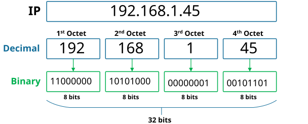
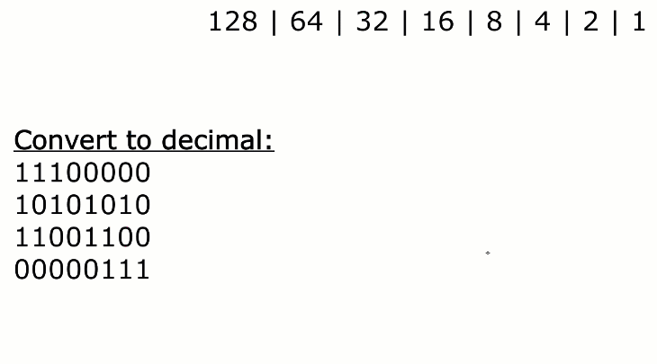
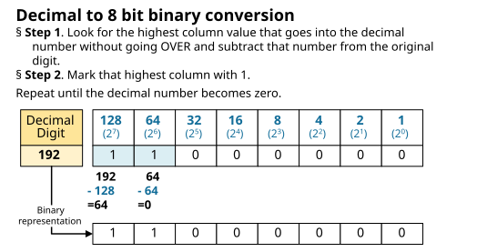
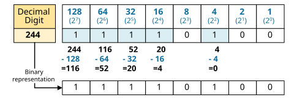
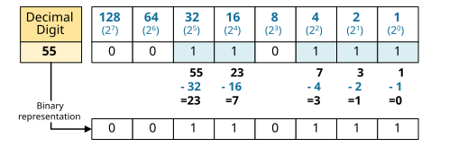
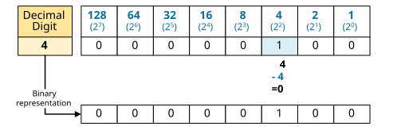
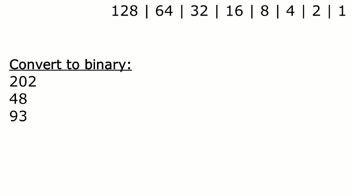

[Converting IP addresses into Binary](https://www.networkacademy.io/ccna/ip-subnetting/converting-ip-addresses-into-binary)
==========

Numeral systems for expressing numbers have a base. The base determines how many unique digits the system has. We humans use the **base-10** decimal system, which indicates that there are only ten unique digits, 0 through 9. Combining these ten digits creates all other possible numbers.


On the other hand, routers, switches, and computers use a **base-2 **numbering system called **binary**. There are only two possible unique digits in the binary numeral system:


- **0** = Off
- **1** = On

All other binary numbers are created using these two digits. For example, 10, 10101, 110101, 11011, etc.


## An IP address


Now with binary in mind, let's see what an IPv4 address is. An IP address is a 32-bit long binary number divided into four octets, as shown in the diagram below.




*Figure 1. An IP address example*


Routers and switches see IP addresses like this:


```
`**110000.10101000.00000001.00101101**`
```

However, we humans find it hard to work and remember binary numbers. That is why we work and write IP addresses in decimal representation, which looks like this:


```
`**192.168.1.45**`
```

We refer to this IP address representation as a **dotted-decimal format**. It's obviously much easier for humans to work with the decimal version of the IP address space. However, computers work with binary, so to really understand subnetting, we must be able to convert a dotted-decimal IP representation into a binary one.


## Binary Math


In this lesson, we will learn a technique called the **positional notation method**. In binary numbers, each successive bit within a group represents a power of two, and the values ascend from right to left. Therefore, the rightmost bit represents 2^0, the second most-right bit represents 2^1, and so on, as is shown in the table below. Each successive bit on the left represents twice the value. The value of each digit in a binary number is determined by its position in the table. The sum of all these column values for each digit gives the decimal representation of the binary number.


Values of each bit in an octet
| **8th bit**| **7th bit**| **6th bit**| **5th bit**| **4th bit**| **3th bit**| **2th bit**| **1th bit**
| 2^7 | 2^6 | 2^5 | 2^4 | 2^3 | 2^2 | 2^1 | 2^0 
| 128 | 64 | 32 | 16 | 8 | 4 | 2 | 1 

### Binary to Decimal


Using this logic, we can easily calculate the decimal representation of a binary number like 11100011, for example. We just turn the respective bits "ON" and calculate the value of the decimal values.


Binary number 11100011
| **8th bit (128)**| **7th bit (64)**| **6th bit (32)**| **5th bit (16)**| **4th bit (8)**| **3th bit (4)**| **2th bit (2)**| **1th bit (1)**
| 1 | 1 | 1 | 0 | 0 | 0 | 1 | 1 

The table above shows that the bits with the values 128, 64, 32, 2, and 1 are all turned on. As mentioned before, calculating the value of a binary number means totaling all the values for the "on" bits. So for the binary value in the table, 11100011, we add together 128+64+32+2+1 to get the number **227**.


```
`11100011 = 227`
```

The following animation shows a few examples of converting binary numbers into decimals using the power of two tables.




*Figure 2. Binary to Decimal Examples*


Binary arithmetic is pretty easy once you know what's going on.


### Decimal to Binary


Converting decimal numbers to binary uses the same logic. We start with the decimal number we want to convert and look for the highest column value that goes into the decimal. Then we subtract the column value from the original number and repeat the process until the original number becomes zero. Figure 3 illustrates the process graphically.




*Figure 3. Converting an IP address to a Binary*


Let's now make some more exercises to master this concept. 

Examples
The following figure shows how we convert the decimal number 244 into binary.




*Figure 4. Converting a decimal number 244 to a Binary*


The following figure shows how we convert the decimal number 55 into binary.




*Figure 5. Converting a decimal number 244 to a Binary*


The following figure shows how we convert the decimal number 4 into binary.




*Figure 6. Converting a decimal number 4 to a Binary*


In the following animation, we are going to show how you can easily convert decimal numbers to binary using the technique we have just seen. I have personally used this method on my CCNA exam.




*Figure 7. Decimal to Binary Examples*


The positional notation method is the easiest one to use without a calculator. Therefore, it is perfect for exams such as the Cisco CCNA.


Now, let's show how we can convert IP addresses into binary using the same technique. 


### Full Content Access is for Subscribed Users Only...


- **Learn any CCNA, CCIE or Network Automation topic** with animated explanation.
- **We focus on simplicity.** Networking tutorials and examples written in simple, understandable language.

Sign up for free ►
