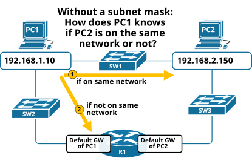
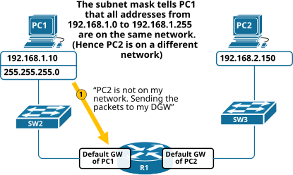
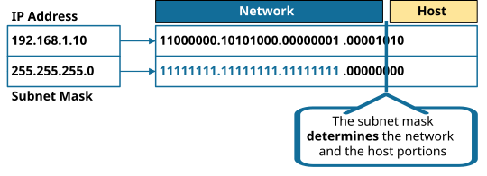
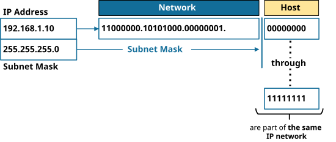
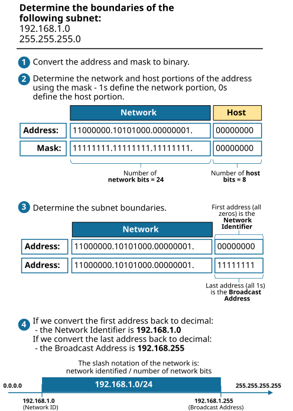

[The Subnet Mask](https://www.networkacademy.io/ccna/ip-subnetting/the-subnet-mask)
==========

In the first lesson of this course, we saw why we need subnetting in the first place. In this lesson, we will see why we need the netmask and its role in the subnetting process.


In short, subnetting is all about the network mask. To really understand IP subnetting, you need to have a good understanding of the function of the mask. Let's see why we need it. 


## Why do we need the subnet mask?


Imagine a world where there is no subnet mask alongside IP addresses, as illustrated in figure 1 below. Suppose that PC1 (192.168.1.10) wants to communicate with PC2 (192.168.2.150). How would PC1 know whether PC2 is on the same network or not? How would PC1 even know to which network it belongs?




*Figure 1. Why do we need the subnet mask?*


Recall that there is a major difference when hosts communicate within the same network or between different networks. 


- Within a network, communication is handled through LAN switches. When a host sends a packet to another host on the same network, it uses ARP to resolve **the target host's MAC address** and directly sends ethernet frames destined for the remote host. The LAN switches simply forward the frames based on the destination MAC address.
- On the other hand, communication between networks involves IP routing. When a host on a network sends an IP packet to a host on another network, it uses ARP to resolve **the default gateway's MAC address**. It then sends the packets to the default gateway router. The router examines the destination IP address and forwards the packet to the appropriate network based on its routing table.

Without knowing the network boundaries, PC1 does not know which process to follow and how to communicate with remote hosts. 


That's where the Subnet Mask comes into the picture. Using the mask, PC1 now knows which hosts are on the same network and which are not, as illustrated in figure 2 below.




*Figure 2. The role of the Subnet Mask*


In the example shown in figure 2, PC1 knows the boundaries of its network (based on the mask) and knows it has to send the packets to its default gateway.


Ok, now let's see what exactly is the subnet mask.


## What is the subnet mask?


The **subnet mask**, referred to as the netmask or the network mask, is a 32-bit binary number of consecutive ones that separates an IP address into a network and host portions. We, humans, are used to working with subnet masks represented in decimal numbers, such as:


```
`255.255.255.0`
```

However, routers and switches work with the network mask in binary. The binary representation of the above network mask is as follows:


```
`11111111.11111111.11111111.00000000`
```

When we look at the binary subnet mask, we see that it is made of leading consecutive 1s and then consecutive 0s up to 32 bits. The 1s in the subnet mask identify the IP address's **network portion,** while the 0s identify the **host portion**. That is why there are only 32 possible values for the network mask. Each one is a combination of leading ones and trailing zeros. The mask is not a random 32-bit number! Table 1 shows all possible subnet mask values.


```
`BINARY REPRESENTATION               |  DECIMAL REPRESENTATION 
--------------------------------------------------------------------
00000000.00000000.00000000.00000000 | 0.0.0.0                
10000000.00000000.00000000.00000000 | 128.0.0.0              
11000000.00000000.00000000.00000000 | 192.0.0.0              
11100000.00000000.00000000.00000000 | 224.0.0.0              
11110000.00000000.00000000.00000000 | 240.0.0.0              
11111000.00000000.00000000.00000000 | 248.0.0.0              
11111100.00000000.00000000.00000000 | 252.0.0.0              
11111110.00000000.00000000.00000000 | 254.0.0.0              
11111111.00000000.00000000.00000000 | 255.0.0.0 (Class A)    
11111111.10000000.00000000.00000000 | 255.128.0.0            
11111111.11000000.00000000.00000000 | 255.192.0.0            
11111111.11100000.00000000.00000000 | 255.224.0.0            
11111111.11110000.00000000.00000000 | 255.240.0.0            
11111111.11111000.00000000.00000000 | 255.248.0.0            
11111111.11111100.00000000.00000000 | 255.252.0.0            
11111111.11111110.00000000.00000000 | 255.254.0.0            
11111111.11111111.00000000.00000000 | 255.255.0.0 (Class B)  
11111111.11111111.10000000.00000000 | 255.255.128.0          
11111111.11111111.11000000.00000000 | 255.255.192.0          
11111111.11111111.11100000.00000000 | 255.255.224.0          
11111111.11111111.11110000.00000000 | 255.255.240.0          
11111111.11111111.11111000.00000000 | 255.255.248.0          
11111111.11111111.11111100.00000000 | 255.255.252.0          
11111111.11111111.11111110.00000000 | 255.255.254.0          
11111111.11111111.11111111.00000000 | 255.255.255.0 (Class C)
11111111.11111111.11111111.10000000 | 255.255.255.128        
11111111.11111111.11111111.11000000 | 255.255.255.192        
11111111.11111111.11111111.11100000 | 255.255.255.224        
11111111.11111111.11111111.11110000 | 255.255.255.240        
11111111.11111111.11111111.11111000 | 255.255.255.248        
11111111.11111111.11111111.11111100 | 255.255.255.252        
11111111.11111111.11111111.11111110 | 255.255.255.254        
11111111.11111111.11111111.11111111 | 255.255.255.255        `
```

The term “*mask*” is used because the subnet mask basically uses its own 32-bit binary number to mask the IP address's 32-bits. Let's see how.


## Network and Host portions


Figure 3 shows how the mask divides an IP address into network and host portions. 


- The 1s in the subnet mask define which bits in the IP address specify the network portion.
- The 0s in the subnet mask define which bits in the IP address specify the host portion.

You can see in the example shown below that the mask defines that the first 24 bits of the IP address are the network identifier. Therefore, all IP addresses that start with bits 11000000.10101000.0000001.hhhhhhh are part of the same network. If we translate this into decimal numbers, every address that starts with 192.168.1.h with mask 255.255.255.0 is part of the same network.




*Figure 3. The function of the Subnet Mask*


When we know the network portion of the address, we can figure out that the IP addresses in the network are as shown in figure 4 below.




*Figure 4. Number of hosts per subnet*


As you can see, the mask defines that addresses from 11000000.10101000.00000001.00000000 through 11000000.10101000.00000001.11111111 are part of the same network. If we translate this to decimal numbers, all addresses from 192.168.1.0 through 192.168.1.255 are part of the same subnet.


Using the subnet mask, you calculate the number of hosts per subnet using the formula:


```
`Number-of-hosts-per-subnet = 2^(number-of-bits-in-host-portion) - 2`
```

The "-2" at the end of the formula is because the first and last IP addresses in each subnet are reserved, one for the **network ID** and one for the **broadcast address**.


For example, suppose you have the IP address 192.168.1.0/24. The subnet mask for this network is 255.255.255.0, which means the first 24 bits of the IP address are the network ID, and the last 8 bits are the host ID.


To calculate the number of hosts per subnet for this network, we use the formula:


```
`Number-of-hosts-per-subnet = 2^(8) - 2 = 254 hosts`
```

Therefore, there are 254 usable IP addresses in this subnet.


## Determining the boundaries of a subnet


The subnet mask determines the boundary of a subnet. Based on the subnet mask, we find the **Network Identifier** and the **Broadcast Address** of the subnet, which are the two ends of the network's boundary. All addresses In between are usable host addresses. 


But how do we find those based on a given IP address/Mask, for example, 192.168.1.35/255.255.255.192?


If we want to be scientific, the explanation goes like this:


- The network address is obtained by performing a **bitwise AND** operation between the IP address and the subnet mask. The result of this operation is the network identifier, which is the lowest IP address in the subnet. 
- The broadcast address, the highest IP address in the subnet, is obtained by performing a **bitwise OR** operation between the network address and the inverted subnet mask.

If we want to be practical - We first convert the address and mask to binary and determine the network and host portions. Then we make the host portion to all zeros, which is the Network ID. Then we make the host portion to all 1s, which is the broadcast address. All IPs in between are the usable host addresses (2^host bits -2).


Let's start with a basic example. Let's calculate the boundary of 192.168.1.0/255.255.255.0.




*Figure 5. Determining the boundaries of a subnet*


You can see the entire process illustrated in figure 5. Notice that this is a basic example, just to start tuning in. Let's now see a few more complex examples of determining the subnet's boundaries.


Let's calculate the boundary of 192.168.15.55/255.255.255.192.

Let's calculate the boundary of **192.168.15.55/255.255.255.192**.

The mask 255.255.255.192 in binary is 11111111.11111111.11111111.11000000. This means the network portion is 26 bits (the first 26 bits are 1s), and the host portion is 6 bits (the last 6 bits are 0s).

The address 192.168.15.55 in binary is:
11000000.10101000.00001111.00**110111**

The line between network and host bits falls in the fourth octet. The first 2 bits of the fourth octet are part of the network, and the remaining 6 bits are for hosts.

To find the Network ID, we set all host bits to 0:
11000000.10101000.00001111.00**000000** = **192.168.15.0**

To find the Broadcast address, we set all host bits to 1:
11000000.10101000.00001111.00**111111** = **192.168.15.63**

So for the address 192.168.15.55/26:
- **Network ID:** 192.168.15.0
- **Usable range:** 192.168.15.1 — 192.168.15.62
- **Broadcast:** 192.168.15.63

More challenging example: **172.20.35.150/255.255.240.0**.

The mask 255.255.240.0 in binary is 11111111.11111111.11110000.00000000. This is a /20 prefix. The network portion is 20 bits, and the host portion is 12 bits.

The address 172.20.35.150 in binary is:
10101100.00010100.001**00011.10010110**

The line falls in the third octet. The first 4 bits of the third octet are network bits, the remaining 4 bits of the third octet plus all of the fourth octet are host bits.

Set host bits to 0 for Network ID:
10101100.00010100.001**0000**0.00000000 = **172.20.32.0**

Set host bits to 1 for Broadcast:
10101100.00010100.001**0000**0.00000000 = Wait, let's be more careful. The host bits are the last 4 bits of the third octet plus all 8 bits of the fourth octet, total 12 bits.

Network ID: 10101100.00010100.00100000.00000000 = **172.20.32.0**
Broadcast: 10101100.00010100.00101111.11111111 = **172.20.47.255**

So for the address 172.20.35.150/20:
- **Network ID:** 172.20.32.0
- **Usable range:** 172.20.32.1 — 172.20.47.254
- **Broadcast:** 172.20.47.255

One more: **10.100.0.55/255.255.255.248**.

The mask 255.255.255.248 in binary is 11111111.11111111.11111111.11111000. This is a /29 prefix. The network portion is 29 bits, and the host portion is 3 bits.

The address 10.100.0.55 in binary is:
00001010.01100100.00000000.00110**111**

Set host bits to 0: 00001010.01100100.00000000.00110000 = **10.100.0.48**
Set host bits to 1: 00001010.01100100.00000000.00110111 = **10.100.0.55**

Wait, that gives us 10.100.0.55 as the broadcast? Let's recalculate.

The last octet in binary is 00110111. The network portion uses the first 5 bits (00110), and the host portion is the last 3 bits (111).

Network ID: 00110**000** = 48, so **10.100.0.48**
Broadcast: 00110**111** = 55, so **10.100.0.55**

So for 10.100.0.55/29:
- **Network ID:** 10.100.0.48
- **Usable range:** 10.100.0.49 — 10.100.0.54
- **Broadcast:** 10.100.0.55

Only 6 usable addresses in a /29! This is commonly used for point-to-point WAN links.

## Quick Reference Table

| Prefix | Mask | Networks (/24) | Total Addresses | Usable Hosts |
|--------|------|----------------|-----------------|--------------|
| /24 | 255.255.255.0 | 1 | 256 | 254 |
| /25 | 255.255.255.128 | 2 | 128 | 126 |
| /26 | 255.255.255.192 | 4 | 64 | 62 |
| /27 | 255.255.255.224 | 8 | 32 | 30 |
| /28 | 255.255.255.240 | 16 | 16 | 14 |
| /29 | 255.255.255.248 | 32 | 8 | 6 |
| /30 | 255.255.255.252 | 64 | 4 | 2 |

## Summary

- The **subnet mask** defines which part of an IP address identifies the network and which part identifies the host.
- To find the **Network ID**, set all host bits to 0 in the binary representation.
- To find the **Broadcast address**, set all host bits to 1.
- All addresses between Network ID and Broadcast are valid **usable host addresses**.
- A /30 subnet has only 2 usable addresses and is typically used for point-to-point links between routers.

