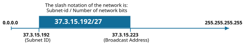
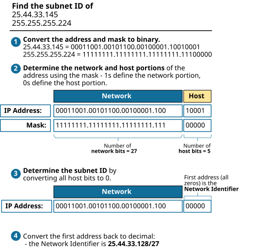
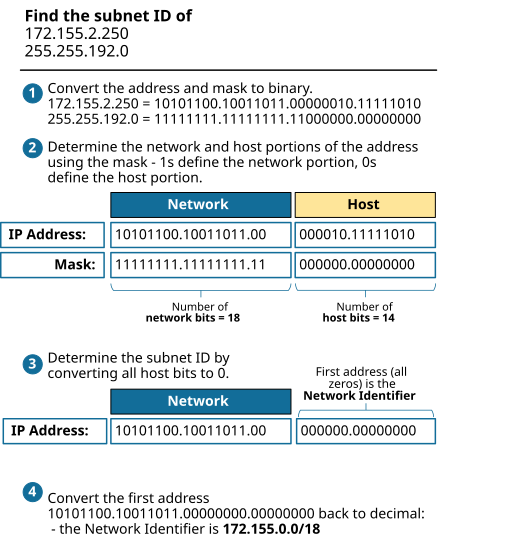

[Finding the Subnet ID](https://www.networkacademy.io/ccna/ip-subnetting/finding-the-subnet-id)
==========

Understanding the Subnet ID concept (also called the Network ID) is essential for network administrators, as it is used almost everywhere within the networking realm. For example, routing tables show the routes based on subnet id and mask. An engineer must understand the subnet CIRD notation and also be able to find the subnet id given an IP address and the prefix length. For example, given the IP 37.3.15.215/27, you must be able to calculate that this IP address is part of the 37.3.15.192/27 subnet and vice versa, as shown in figure 1 below.




*Figure 1. CIDR notation example*


## What is CIDR notation?


Before we jump into the practice portion, let's quickly tell what the CIDR (Classless Inter-Domain Routing) notation is. It is a compact representation of an IP address and its associated subnet mask. It is commonly used in IP subnetting to express the network address and the number of bits in the network portion of the address. CIDR notation helps simplify routing information and managing IP addresses.


In CIDR notation, an IP address is written, followed by a forward slash (/) and a decimal number that indicates the number of contiguous binary 1s in the subnet mask, also known as the prefix length.


## What is a Subnet?


An IP subnet is a subset of IP addresses created by the regional IP assignment body, service provider, or internal IP space administrator. However, a subnet is not just a random block of address, but it obeys the following rules:  


- A subnet includes a set of **consecutive **addresses.  
- A subnet contains 2^h addresses, where h is the number of host bits in the subnet mask.  
- Two special addresses in every subnet cannot be used on endpoints:  

- The first (lowest) address is the **network identifier** (the subnet ID).  
- The last (highest) address is the subnet **broadcast address**.  

- The remaining IP addresses, between the subnet ID and broadcast address, are usable ones and can be assigned to hosts.  

## Finding the Subnet ID


Finding the subnet ID is a three steps process:


- First, we convert the IP address and the Mask to binary.
- Then we determine the network and host portions of the address based on the mask. 1s define the network portion, and 0s define the host portion of the address.
- We find the subnet ID in binary by changing all host bits to 0s. We find the Broadcast address in binary by changing all host bits to 1s. 
- We convert the binary representations to decimals.
### Example 1: 25.44.33.145/27


Figure 1 shows an example of finding the subnet id of the IP address 25.44.33.145/27.




*Figure 1. Finding the Subnet ID - Example 1*


### Example 2: 172.155.2.250/18


Figure 2 shows another example of finding the subnet id of the IP address 25.44.33.145/27.




*Figure 2. Finding the Subnet ID - Example 2*


Here are some more examples with the given IP addresses and subnet masks in CIDR notation.


### Example 3: 10.1.1.55/20


IP address: 10.1.1.55 (00001010.00000001.00000001.00110111)  
Subnet mask: /20 -> 255.255.240.0 (11111111.11111111.11110000.00000000)


Find the network and host portions of the address and change the host bits to 0s.


```
`00001010.00000001.00000001.00110111 (10.1.1.55)
11111111.11111111.11110000.00000000 (255.255.240.0)
-----------------------------------
00001010.00000001.00000000.00000000 (10.1.0.0)`
```

Subnet ID: 10.1.0.0/20


### Example 4: 192.168.1.128/25


IP address: 192.168.1.128 (11000000.10101000.00000001.10000000)  
Subnet mask: /25 -> 255.255.255.128 (11111111.11111111.11111111.10000000)


Find the network and host portions of the address and change the host bits to 0s.


```
`11000000.10101000.00000001.10000000 (192.168.1.128)
11111111.11111111.11111111.10000000 (255.255.255.128)
-----------------------------------
11000000.10101000.00000001.10000000 (192.168.1.128)`
```

Subnet ID: 192.168.1.128/25


### Example 5: 13.1.120.244/22


IP address: 13.1.120.244 (00001101.00000001.01111000.11110100)  
Subnet mask: /22 -> 255.255.252.0 (11111111.11111111.11111100.00000000)


Find the network and host portions of the address and change the host bits to 0s.


```
`00001101.00000001.01111000.11110100 (13.1.120.244)
11111111.11111111.11111100.00000000 (255.255.252.0)
-----------------------------------
00001101.00000001.01111000.00000000 (13.1.120.0)`
```

Subnet ID: 13.1.120.0/22


### Try it yourself


Here are some examples that you can try yourself at home. Answers are in the next section of the lesson.


- Example 1: 172.16.5.34/16
- Example 2: 10.200.14.135/21
- Example 3: 192.0.2.53/28

### Answers


Answers of example-1


```
`10101100.00010000.00000101.00100010 (172.16.5.34)
11111111.11111111.00000000.00000000 (255.255.0.0)
-----------------------------------
10101100.00010000.00000000.00000000 (172.16.0.0)
**Subnet ID: 172.16.0.0/16**`
```

Answers of example-2


```
`00001010.11001000.00001110.10000111 (10.200.14.135)
11111111.11111111.11111000.00000000 (255.255.248.0)
-----------------------------------
00001010.11001000.00001000.00000000 (10.200.8.0)
**Subnet ID: 10.200.8.0/21**`
```

Answers of example-3


```
`11000000.00000000.00000010.00110101 (192.0.2.53)
11111111.11111111.11111111.11110000 (255.255.255.240)
-----------------------------------
11000000.00000000.00000010.00110000 (192.0.2.48)
**Subnet ID: 192.0.2.48/28**`
```

Understanding this concept is crucial for network administration, as it helps to efficiently manage and allocate IP addresses.


## Book traversal links for 5

