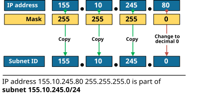
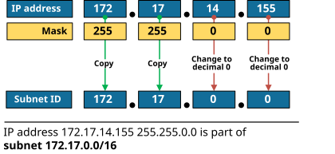
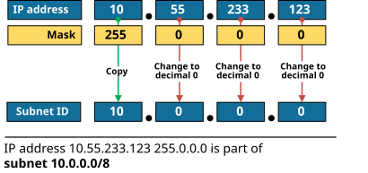
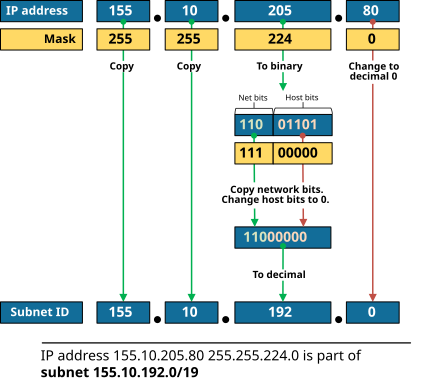
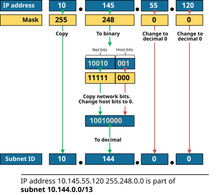

[Finding the Subnet ID (Shortcut)](https://www.networkacademy.io/ccna/ip-subnetting/finding-the-subnet-id-shortcut)
==========

So far, the binary process described in the previous lesson requires that all four octets be converted to binary and then back to decimal. However, this lesson shows a shortcut version of the process based on the decimal subnet mask. Given an IP address and mask in decimal notation, we can easily predict at least three of the four octets of the Subet ID. Hence, we only need to perform binary math in one octet.  


## The shortcut rules


There are two "magic" numbers in the subnet mask in decimal. The first one is **255**, and the second is **0**. The 255 indicates that all bits in this address's octet are part of the network portion, while the 0 indicates that all bits are part of the host portion. The shortcut rule to find the subnet id and broadcast address of a given IP has the following two steps:


- **Rule 1**. If the mask octet is 255, we copy the respective IP address octet value unchanged.
- **Rule 2**. If the mask octet is 0, we change the IP address octet value to decimal 0.

The process of finding the broadcast address is pretty similar, with the only difference being the second rule:


- **Rule 2.** If the mask octet is 0, we change the IP address octet value to decimal 255.

Let's see the rules in action through several examples.


## The three easy masks


These three subnet masks require no math at all to find the subnet ID:


- 255.0.0.0
- 255.255.0.0
- 255.255.255.0

These masks have only 0s and 255s in decimal. Therefore, we can easily calculate the subnet ID and the broadcast address using the shortcut rules. 


Let's go through the example shown in figure 1 below. We are given the IP address 155.10.245.80 with mask 255.255.255.0. To find the subnet id, we simply copy the first three octets of the IP address (because the first three octets of the mask are 255) and change the last octet value to 0 (because the last octet of the mask is 0). 




*Figure 1. Find the Subnet ID using a shortcut- Example 1*


You can see we find out that the subnet ID is 155.10.245.0/24 **without using any binary math**.


Let's go through another example shown in figure 2 below. We are given the IP address 172.17.14.155 with mask 255.255.0.0. To find the subnet id, we simply copy the first two octets of the IP address (because the first two octets of the mask are 255) and change the last two octets to 0 (because the last two octets of the mask is 0). 




*Figure 2. Find the Subnet ID using a shortcut- Example 2*


You can see we find out that the subnet ID is 172.17.0.0/16 without using any binary math. 


Lastly, figure 3 shows an example with mask 255.0.0.0. We are given the IP address 10.55.233.123 with mask 255.0.0.0. To find the subnet id, we simply copy the first octet of the IP address (because the first octet of the mask is 255) and change the last three octets to 0 (because the last three octets of the mask are 0). 




*Figure 3. Find the Subnet ID using a shortcut- Example 3*


We discover that the subnet ID is 10.0.0.0/8 without any binary math. 


## Examples with difficult masks


Let's now go through some more advanced examples. Let's find the subnet-id of 155.10.205.80 255.255.224.0. We can only apply the shortcut rules to octets 1,2, and 4 of the address. However, we must convert octet three of the address/mask to binary. 


```
`Address | 205 in binary is **110****01101**
Mask | 224 in binary is **111****00000**`
```

From the mask value of 11100000 (224), we find that the first three bits of the address 11001101 (205) are part of the network portion, and the last five a part of the host portion. Therefore to find the subnet id, we change all host bits to 0 and end up with the binary 11000000. When we convert it back to decimal, we discover that the third octet value is 192. All three octets can be discovered using the shortcut rule. Ultimately, we find out that the subnet ID is 155.10.192.0/19. Figure 4 below illustrates the process.




*Figure 4. An example with a more difficult mask.*


Notice that this is a significant improvement compared to the all-binary process. We only convert only one octet to binary and back to decimal.


Let's go through another example. We are given the IP address 10.145.55.120 255.248.0.0. We can only apply the shortcut rules to octets 1,3 and 4 of the address. However, we must convert octet two of the address/mask to binary. 


```
`Address | 145 is **10010****001**
Mask | 248 is **11111****000**`
```

From the mask value of 11111000 (248), we find that the first five bits of the address value 10010001 (145) are part of the network portion, and the last three are part of the host portion. Therefore to find the subnet id, we change all host bits to 0 and end up with the binary 10010000. When we convert it back to decimal, we discover that the third octet value is 144. All other octets can be discovered using the shortcut rule. Ultimately, we find out that the subnet ID is 10.144.0.0/13. Figure 5 below illustrates the process.




*Figure 5. Another example with a hard mask.*


Now it is time to try it yourself. 


## Try it yourself


Find the subnet id given the following IP addresses.


- **Example 1**

- IP address: 192.168.12.34
- Subnet mask: 255.255.255.248 (/29)

- **Example 2**

- 10.150.25.77
- 255.255.255.224 (/27)

- **Example 3**

- 172.20.89.102
- 255.255.254.0 (/23)


## Answers


**Example 1 - 192.168.12.34/29**


We only use binary math for the last octet. All others are easily figured out using the shortcut rules.


- IP address (binary): 192.168.12. **00100010**
- Subnet mask (binary): 255.255.255. **11111000**
- Subnet ID (binary): 192.168.12. **00100000**
- **Subnet ID (decimal): 192.168.12.32/29**

**Example 2 - 10.150.25.77/27**


We only use binary math for the last octet. All others are figured out using the shortcut rules.


- IP address (binary): 10.150.25. **01001101**
- Subnet mask (binary): 255.255.255. **11100000**
- Subnet ID (binary): 10.150.25. **01000000**
- **Subnet ID (decimal): 10.150.25.64/27**

**Example 3 - 172.20.89.102/23**


We only use binary math for the third octet. All others are figured out using the shortcut rules.


- IP address (binary): 172.20. **01011001** .102
- Subnet mask (binary): 255.255. **11111110** .0
- Subnet ID (binary): 172.20. **01011000 **.0
- **Subnet ID (decimal): 172.20.88.0/23**

## Book traversal links for 5

