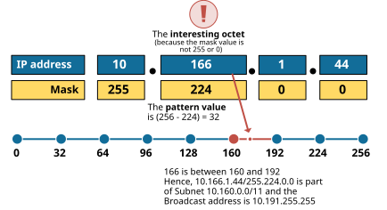
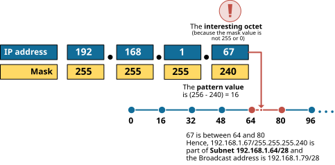

[Predictability Approach (without binary math)](https://www.networkacademy.io/ccna/ip-subnetting/predictability-approach-no-binary-math)
==========

In the previous two lessons, we have seen how to find the subnet ID and the broadcast address of a given IP/mask. If you have done most practice examples, you probably noticed that certain patterns repeat themselves. For example, the resulting decimal value is not random in the octet where the mask is not 255 or 0. There is an easier way to calculate the subnet id without using any binary math. 

## The predictability process

Before we jump into the process, let's introduce two new terms: **pattern value** and **interesting octet**.

- The **interesting octet** has a decimal value different from 255 or 0. There is always only one such octet in the subnet mask. For example, in 255.255.224.0, the third octet is the interesting one. In 255.255.255.240, the fourth octet is the interesting one, and so on.
- The **pattern value** results from (256 – the interesting octet's decimal value). For example, in mask 255.255.224.0, the pattern value is (256 - 224) = 32. In 255.255.255.240, the pattern value is (256 - 240) = 16, and so on.

With these two terms in mind, the process of finding the subnet ID is by applying the following three rules to the IP/Mask.

- **Rule 1.** If the mask octet is 255, we copy the IP's octet decimal value.
- **Rule 2.** If the mask octet is 0, we change the IP's octet decimal value to 0.
- **Rule 3.** If the mask octet is neither 255 nor 0:

- **Step a.** Calculate the pattern value as (256 – the interesting octet's decimal value).
- **Step b**. Set the Subnet ID’s value to the multiple of the pattern value closest to the IP address without going over.

The process might seem confusing at first, but it is actually very easy and efficient. Let's take the address 10.166.1.44 255.224.0.0, for example, and examine each step in the process of finding the subnet ID (and, subsequently, the broadcast address).

First, it is essential to understand that the action we perform on each octet of the IP address is based on the value in the subnet mask. For example, based on the first octet of the mask (255), we simply copy the IP address's first octet value to where we write down the subnet id. Based on the last two octets of the mask (0), we simply write 0 to the last two octets of the subnet id. Hence, the subnet id is 10.x.0.0/11, and we need to find the value of x. Based on the mask value of 224, we find that the interesting octet is the second one. We calculate the pattern value (256 - 224) = 32. Therefore, the subnet ID's value in the second octet (x) must be a multiple of 32. We write down the multiples of the pattern value (32) and choose the one closest to the IP's second octet value without going over it. In our case, the IP value is 166. The closest pattern value without going over is 160, as illustrated in figure 1 below. Therefore, the subnet ID is 10.160.0.0/11. Notice that **we haven't used any binary math**!

*Figure 1. The predictability process*

Okay, what about the broadcast address? Notice that the next number in the multiples of the pattern value is the next subnet 10.192.0.0/11. Hence, the last address of subnet 10.160.0.0/11 is 10.191.255.255 (the broadcast address) because 10.192.0.0/11 is another network.

Let's examine another example. From the first three octets of the mask (255), it's clear that we need to simply replicate the first three octets of the IP address's first three octet values to where we write down the subnet id. By evaluating the mask value of 240, we identify that the fourth octet is the one of interest. As a result, the subnet id is 192.168.1.x/28, and our task is to determine the value of x.  We calculate the pattern value as (256 - 240) = 16. Thus, the subnet ID's fourth octet value (x) must be a multiple of 16. We list the multiples of the pattern value (16) and select the one closest to the IP's fourth octet value without exceeding it. In this instance, the IP value is 67. The nearest pattern value without surpassing it is 64, as demonstrated in figure 2 below. Thus, the subnet ID is 192.168.1.64/28. Notice that binary math has not been utilized at all.

*Figure 2. Another example of a difficult mask*

Now let's find the broadcast address. Notice that the next number in the multiples of the pattern value is the next subnet -192.168.1.80/28. Hence, the last address of 192.168.1.64/28 is 192.168.1.79 (the broadcast address) because 192.168.1.80/28 is another network.

## Try it yourself

Here are some examples to practice yourself. You can write down the table and calculate and fill all cells without using binary math. The first row is given as an example.

| **Example ** | **IP address** | **Mask** | **Interesting Octet** | **Subnet ID** | **Broadcast Address** 
| **1 **(solved) | 1.77.145.6 | 255.248.0.0 | 2nd | 1.64.0.0/13 | 1.79.255.255 
| **2** | 172.16.99.55 | 255.255.192.0 |   |   |   
| **3** | 192.168.16.54 | 255.255.255.252 |   |   |   
| **4** | 172.16.3.81 | 255.255.128.0 |   |   |   
| **5** | 131.21.55.66 | 255.255.254.0 |   |   |   
| **6** | 215.1.44.76 | 255.255.255.248 |   |   |
