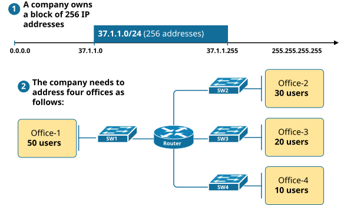
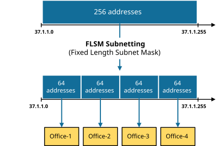
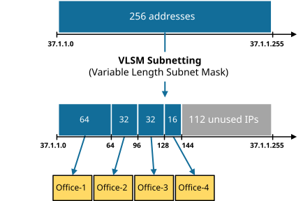

[What is VLSM?](https://www.networkacademy.io/ccna/ip-subnetting/what-is-vlsm)
==========

To understand what **Variable Length Subnet Masking (VLSM)** is, let's go through a business example. Suppose a company has bought the IP address range 37.1.1.0/24 (256 addresses). The company has 5 offices, as shown in figure 1 below:

*Figure 1. Subnetting Business Requirements*

We are tasked to subnet the 37.1.1.0/24 IP address block and assign each office an IP subnet. Let's see what the two ways to do this are.

## What is FLSM?

The first approach to this task is to divide the 256-address block into four equal-sized subnets. This technique is called **Fixed Lenght Subnet Mask (FLSM)**. The benefit of this approach is that all subnets have the same subnet mask, which makes the process very straightforward and less prone to errors. Figure 2 below illustrates this example.

*Figure 2. What is FLSM?*

However, this method **results in a significant waste of IP addresses**. For example, office-4 has only 10 users, but we assign a subnet with 64 IP addresses. Hence, 54 addresses sit unused. From the company's point of view, this is a bad use of resources.

## What is VLSM?

VLSM stands for **Variable Length Subnet Mask**. VLSM is a subnetting technique that allows network admins to allocate IP addresses more efficiently using different subnet masks for different network segments. It provides greater flexibility in assigning IP addresses by creating subnets of varying sizes based on the specific needs and number of hosts in each subnet. This technique **helps reduce the waste of IP addresses **and better uses the available IP space.

*Figure 3. What is VLSM?*

Notice that using VLSM, we are left with 112 free IP addresses that we can allocate to another location in the future. Compared to the FLSM approach, this method is much more efficient. The main idea is that VLSM allows us to divide an IP address space into subnets of varying sizes based on the specific requirements of each office. This helps to minimize the waste of IP addresses, as each subnet is assigned only the necessary number of IPs instead of using fixed-size subnets that may be too large or too small for the purpose.

On the other hand, the only downside of this approach is its complexity. The VLSM subnetting method requires more advanced planning, design, and administration than the FLSM approach. If we do not carefully plan in advance how we subnet our blocks of IP addresses, we can end up with IP address fragmentation, meaning some ranges of IP addresses may not be contiguous (more on this in the next lessons).

## FLSM vs. VLSM

Table 1 compares both techniques.

Table 1. FLSM vs. VLSM
| **FLSM (Fixed Length Subnet Masks) Subnetting** | **VLSM (Variable Length Subnet Masks) Subnetting** 
| One network is divided into multiple equal-sized subnets. | One network is divided into multiple different-sized subnets. 
| Each subnet contains an equal number of hosts. | The number of hosts in each subnet varies. 
| The same subnet mask is used for all subnets. | Different subnet masks are used for each subnet. 
| Configuration and administration are straightforward. | Configuration and administration are more complex. 
| This method results in a significant waste of IP addresses. | IP address waste is minimized. 

Let's now see the Variable Length Subnet Masking (VLSM) technique in action in the next lessons.
