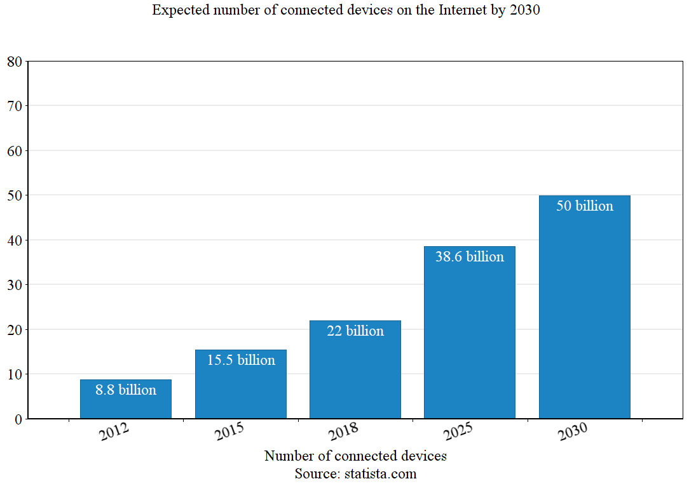
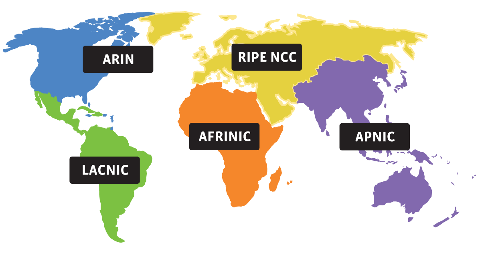
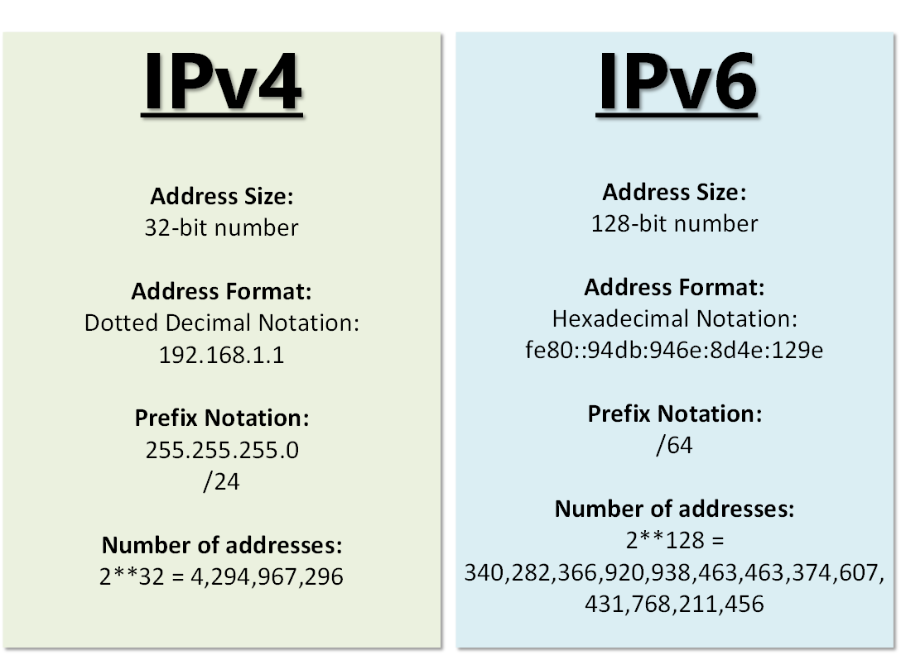
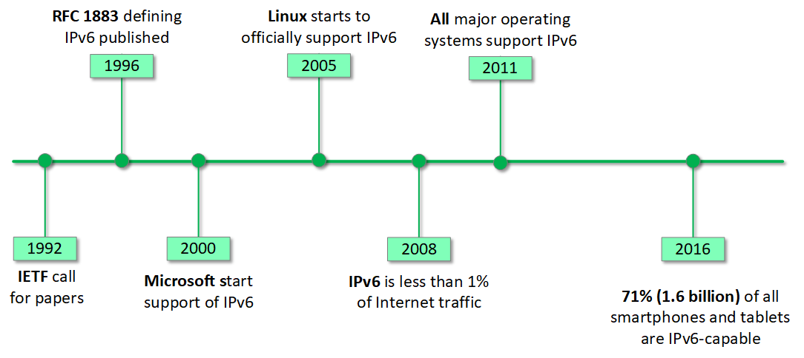
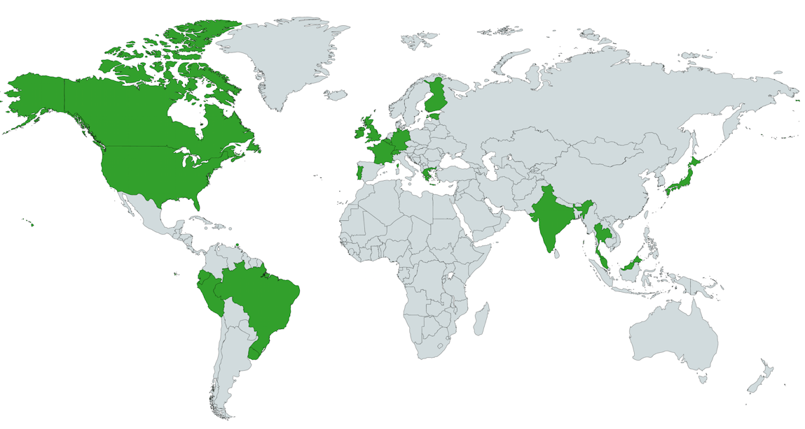

[What is IPv6?](https://www.networkacademy.io/ccna/ipv6/what-is-ipv6)
==========

# What is IPv6?

Before starting with IPv6 in more detail, we must first discuss the history of IPv4 - the most used Layer 3 protocol in enterprise networks and on the Internet today.

## IPv4 (Internet Protocol Version 4)

IPv4 was introduced in the late 1970s and was first officially described in [RFC 760](https://tools.ietf.org/html/rfc760) in January 1980, later replaced by [RFC 791](https://tools.ietf.org/html/rfc791) in September 1981. In those early years for computer networks, there were less than a few thousand hosts on the Internet, so the number of specified possible IPv4 addresses of **4.29 billion** seemed enormous and impossible to be depleted ever. 

Later on, in the early 1990s and 2000s, the world wide web (www) was introduced and Internet users increased drastically. But even then, connected devices were in the number of tens of millions and the IPv4 address space seemed enough for many years to come. Then in the early 2010s, mobile devices took over our lives and the number of Internet users skyrocketed very quickly. You can see in figure 1 that in 2012, there were 8.8 billion connected devices. This brings up the question - how could 8 billion devices being connected to the global network if there are only 4.29 billion possible IPv4 addresses?

Figure 1. Expected number of connected devices on the Internet by 2030

Well, in the early 2000s, network technologies such as **Network Proxy** and **Network Address Translation (NAT)** were introduced as a short-term solution to the depletion of public IPv4 addresses. This allowed the use of specifically allocated IPv4 address ranges (typically 10.x.x.x, 172.16.x.x or 192.168.x.x) in the internal networks, while sharing a single public IPv4 address when communicating with the public Internet. However, every private network still requires at least one or a few public IPv4 addresses.

## How IP addresses are assigned?

At this point, you may be wondering, who assign public IP addresses and who control and supervise the whole process. There is a global body called The Internet Assigned Numbers Authority (IANA) that is responsible for global coordination of the Internet Protocol addressing systems, as well as the Autonomous System Numbers used for routing Internet traffic. They do not directly provide IP addresses to providers and end customers though. For every geographical region of the world, there is another regional authority that is responsible for public IP address management in the respective area. 

Therefore, IANA is the authority that assigns IP addresses in large /8 blocks to the five Regional Internet Registries (RIPs). Using these large /8 address blocks, the RIPs then provide public addresses to Service Providers, Cloud Providers, and other end customers.

Figure 2. The five Regional Internet Providers (RIPs) and the areas they manage
Source: iana.org

Figure 2 shows the Regional Internet Provider for each geographical area of the world. 

- [AFRINIC](http://www.afrinic.net/) - Africa Region
- [APNIC](http://www.apnic.net/) - Asia/Pacific Region
- [ARIN](http://www.arin.net/) - Canada, USA, and some Caribbean Islands
- [LACNIC](http://www.lacnic.net/) - Latin America and some Caribbean Islands
- [RIPE NCC](http://www.ripe.net/) - Europe, the Middle East, and Central Asia

## IPv4 Address Depletion

In 2011, IANA allocated the last two large blocks of public IPv4 address space, 39.0.0.0/8 and 106.0.0.0/8, to the regional provider for the Asia-Pacific region - APNIC. At this point, there were five /8 address blocks remaining and IANA decided that they would be distributed equally among the five regional providers. After that, IANA had officially run out of public IPv4 addresses.

In 2015, ARIN, the RIR for North America, had allocated its last remaining address blocks and also run out of public IPv4 addresses. Currently, four out of the five RIRs have no more available address space for allocation. AFRINIC is the last regional provider to have any IPv4 addresses left.

Does this mean that IPv4 addresses are no longer available for end customers? No. Customers can still get IPv4 addresses from most local service and cloud providers. However, many ISPs are severely limited. In the wake of all this IPv4 address depletion, a "gray market" for IPv4 addresses has emerged. Several websites are serving as brokers for organizations that want to sell or lease IPv4 address space.

## IPv5 (Internet Protocol Version 5)

Before we dive into the realm of IPv6, let's first answer a question that you might be asking: Why IPv6 came after IPv4? Was there ever Internet Protocol Version 5?

The answer is yes ... sort of.

IPv5 was created for experimental reasons, specifically for video and voice transmissions. Big companies such as Apple and Sun experimented with it but it never came to be. Later, the work done on IPv5 was used as a groundwork for today's VoIP protocols.

## Introduction to IPv6

In the early 1990s, IETF (Internet Engineering Task Force) began discussions about the rapidly increasing number of Internet users and the growing size of the Internet routing table.  It was agreed that it is time to start developing a new network layer protocol that can fix the limitations of the current IPv4 and support the network growth well into the future. After investigating many proposals and drafts, the protocol suite known as IPv6 was included in an IETF Draft Standard in December 1998. In 1999, the Internet Assigned Numbers Authority (IANA) made the first assignments of public IPv6 address blocks to the Regional Internet Registries.

## IPv6 - more than just longer addresses

At first glance, many engineers think that IPv6 is just a larger address space and everything else is the same as IPv4. Well, it turns out IPv6 is not just longer addresses. The initial goals that were set when designing IPv6 were to achieve end-to-end security, quality of service, larger address space, and simplified more efficient header format. In the end, the following improvements over IPv4 were made:

- **New header format** - most non-essential fields in the IPv4 header were moved out of the IPv6 header, making it more efficient for the intermediate routers.
- **Extensibility** - IPv6 was designed to be easily extendable by adding extension headers after the IPv6 header.
- **Large address space** - IPv6 has 128-bit address fields, which allows for multiple levels of subnetting and more efficient address allocation from the regional internet providers.
- **Better security** - IPSec is built-in and part of the IPv6 protocol.  IPv6 has header extensions that ease the implementation of encryption and authentication.
- **Stateless and stateful host addressing (SLAAC)** - In the absence of a DHCP server, hosts in a LAN can automatically obtain IP addresses themselves and start using the network.
- **More efficient LAN interactions** - The broadcast-based ARP protocol is replaced with more efficient ICMPv4 Neighbor Discovery messages that use multicast instead of broadcast. 
- **Multiple IPv6 addresses per device** - Hosts can have multiple IPv6 addresses on the same subnet. This allows for improved security, greater privacy, and creates the possibility for additional network features.
- **New address types** - New network layer address types were included in the IPv6 suite such as non-routable IPv6 link-local addresses. 

Figure 3. Differences between IPv4 and IPv6

It is important to note that because of the IPv6 different address length, many other protocols and functions in the network change. For example, most routing protocols rely on understanding IPv4 addresses and including them in updates and other messages. Therefore, to support IPv6, they must change their message format, which usually leads to a rewrite of the whole routing protocol. The same logic applies to some upper-layer protocols as well. As a result, the migration from IPv4 to IPv6 is much more complex than changing one IP address from v4 to v6.

## IPv6 Timeline

After IPv6 was first defined in RFC 1883, its adoption process was slower than initially expected. At some point in the 2000s, engineers expected that all networks in the world will transition to IPv6 only in the next couple of years. This never really happened though, because there was no strong incentive from a revenue standpoint to replace network equipment and applications. In figure 4, some important landmarks are shown.

Figure 4. IPv6 Timeline

## IPv6 Deployment

In some countries such as India, Japan, and the USA, mobile networks have very high levels of IPv6 deployment. Additionally, some of the largest IT companies in the world such as Amazon, Microsoft, Linkedin, and Facebook already started the process of turning IPv4 off within their datacentres and use only IPv6. For example, Facebook transitioned to using 100% IPv6 addresses in all of its data centers in 2017 and is working on rolling out IPv6 to the rest of the infrastructure. 

Figure 5. Countries where IPv6 deployment is greater than 15% as of 2018.
Source: internetsociety.org

## Summary

- The combination of private addressing and Network Address Translation (NAT) has slowed the depletion of public IPv4 addresses. However, with the emergence of Cloud providers, demand for public addresses increased rapidly.
- Internet is its final stage of public IPv4 address availability. With the rapid adoption of cloud services, we will eventually run out of IPv4 addresses very soon. 
- IPv6 is more than just longer addresses. It provides additional enchantments such as Neighbor Discovery (NDP), Stateless Address Autoconfiguration (SLAAC), improved security, and better efficiency.
- Realistically, IPv4, and IPv6 will coexist for many years to come.
