[IPv4 vs IPv6 - Understanding the differences](https://www.networkacademy.io/ccna/ipv6/ipv4-vs-ipv6)
==========

# IPv4 vs IPv6 - Understanding the differences

In this lesson, we are going to examine the differences in how IPv6 operates compared to IPv4. We will compare the IPv6 header to the IPv4 header and talk about the new IPv6 extension headers.

## IPv4 Header vs IPv6 Header

IPv6 is using two main types of headers: Main IPv6 Header and the new IPv6 Extension Headers. The main IPv6 header is equivalent to the IPv4 one with some field differences introduced for better efficiency. Figure 1 compares both headers.

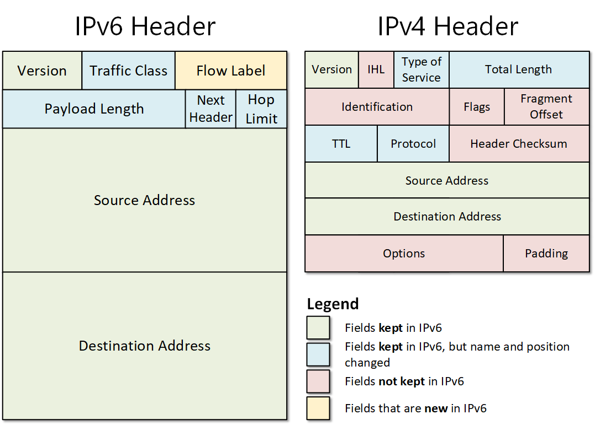

Figure 1. Comparing IPv4 and IPv6 headers

Note that the IPv6 header has fewer fields which makes it more efficient and faster to process. Another big advantage is that the header length is fixed size 40 bytes, comparing to the variable length size of the IPv4 header. 

### Version

The Version field is a 4-bit long identifier of the IP protocol version. Needles to say, it is set to 4 in IPv4 and 6 in IPv6.

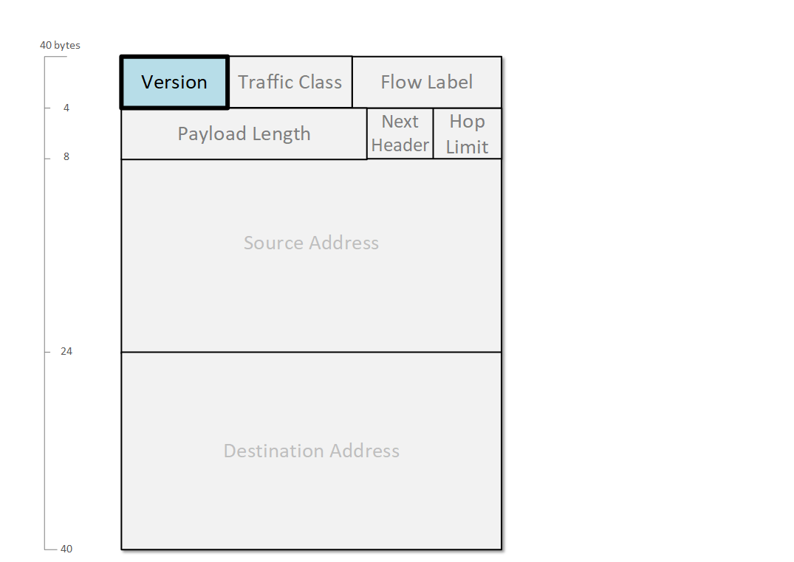

Figure 2. IPv6 Version field

However, in the most common case where IP is encapsulated in Ethernet, identification of the IP protocol happens at the data-link layer through a 16-bit field in the frames called EtherType. Each frame has an EtherType field that identifies the upper-layer protocol in the payload portion. When IPv6 is encapsulated in Ethernet II, the value used is 0x86dd, where 0x means that the digits are hexadecimal values. When IPv4 is encapsulated in Ethernet II, the value used is 0x800.

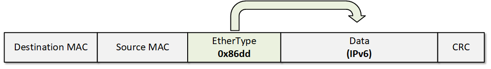

Figure 3. IPv6 Packet in Ethernet Frame

### Traffic Class

The Traffic Class field is an 8-bit long identifier of the packet's class or priority. It is the same concept as the Type of Service field in the IPv4 header. The first 6 bits of the Traffic Class field represents the DSCP field as defined in [RFC 2474](https://tools.ietf.org/html/rfc2474), and the last 2 bits are used for ECN as defined in [RFC 3168](https://tools.ietf.org/html/rfc3168).

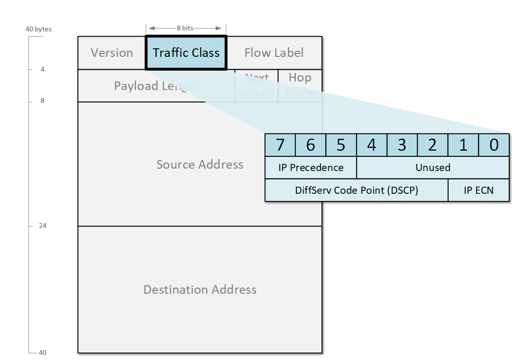

Figure 4. IPv6 Traffic Class Field

Originally, in IPv4 only the first 3 bits were used as QoS value called IP Precedence. Later it was superseded by the Diffserv technology that uses the first 6 bits and the value is called Differentiated Services Code Point or just DSCP.

### Flow Label

The Flow Label is a 20-bit long field that indicates to intermediate devices that a packet belongs to a specific sequence of packets between a source and a destination. IPv6 routers use this field to distinguish different traffic flow between the same source and destination, for example, different TCP sessions between the same endpoints. When the Flow label value is set to 0 means that the packet is not associated with any specific flow. 

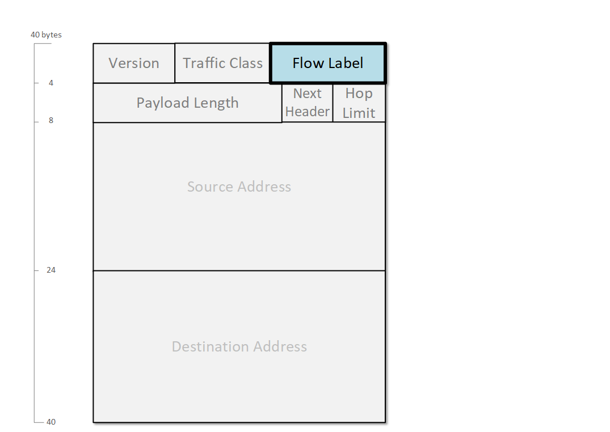

Figure 5. IPv6 Flow Label field

### Payload Length

The IPv6 Payload field is a 16-bit identifier of the length in bytes of the data portion of a packet including any IPv6 Extension headers. The length does not include the main IPv6 header. As you can see in Figure 3, any extension headers are considered part of the payload portion. In contrast, the IPv4 Total Length field measures the length of the entire IP packet including the IPv4 header.

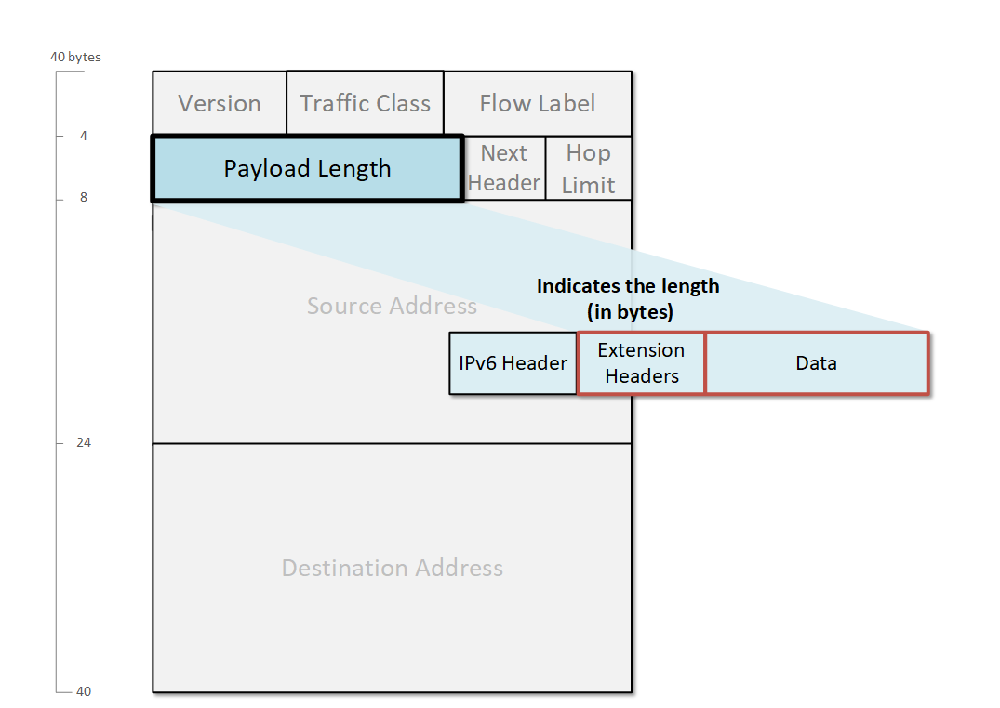

Figure 6. IPv6 Payload-Length Field

Both the IPv4 Total-Length and IPv6 Payload-length fields are 16-bit long, therefore allowing for up to 65,355 byte-long packets. In reality, most IP packets (both v4 and v6) are 1500 byte-long due to a technology called Maximum Transmission Unit (MTU), which defines the maximum size of a packet that can pass through the link. However, IPv6 can carry larger payloads than 65,355 bytes using the Jumbo Payload option in the Hop-by-hop extension header. These larger packets are called ***jumbograms*** and are defined in [RFC 2675](https://tools.ietf.org/html/rfc2675). Jumbograms IPv6 packets can carry payloads between 65,536 and 4,294,967,295 bytes. They are used inside very-high-speed datacenters and supercomputers.

### Next Header

The Next Header is an 8-bit field that specifies either the type of the first extension header (if any) or the upper-layer protocol in the payload such as TCP, UDP, or ICMPv6. The field is similar to the IPv4 Protocol field but with some additional options. When indicating an upper-layer protocol, the IPv6 Next Header field uses the same values that are used in the IPv4 Protocol.

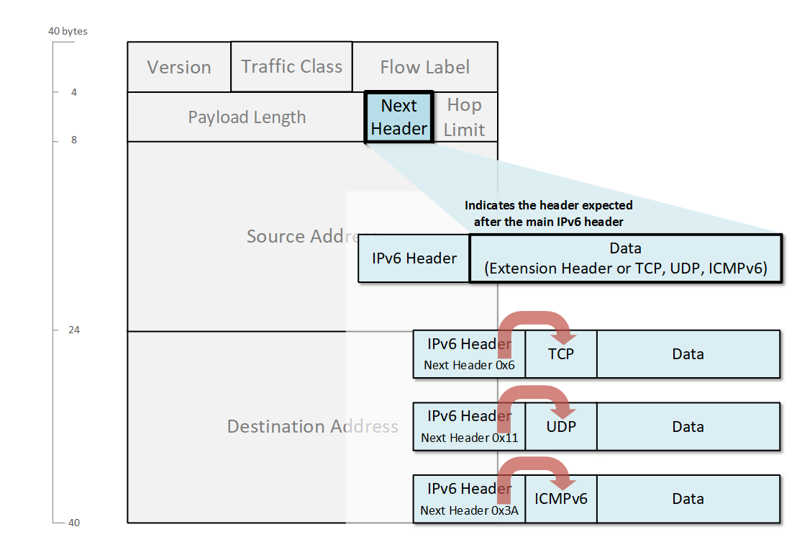

Figure 7. IPv6 Next Header Field

Some of the most common values are shown in the table below. 

Table 1. IPv6 Next Header field common values

| Next Header value (in hex) | Description                                          |
|----------------------------|------------------------------------------------------|
| 6                          | Transmission Control Protocol (**TCP**)               |
| 11                         | User Datagram Protocol (**UDP**)                      |
| 2F                         | Generic Routing Encapsulation (**GRE**)               |
| 32                         | Encapsulating Security Payload (**ESP**)              |
| 3A                         | Internet Control Message Protocol version 6 (**ICMPv6**) |
| 3B                         | No Next Header for IPv6                              |
| 59                         | Open Shortest Path First (**OSPF**)                  |

### IPv4 Checksum Field

In the IPv4 header, there is a **Checksum field** that is used to verify and discard corrupted packets. It is a 16-bit cyclic redundancy check (CRC) that is validated and recomputed at each hop along the network path. 

In IPv6, there is no **Checksum field**. To make the header more efficient and easier to process, the protocol creators decided to not include this CRC check in the Layer 3 header. At this point, you may be wondering whether this makes IPv6 less reliable than IPv4? The answer is no because upper-layer protocols such as TCP and UDP have their own checksum fields as shown in Figure 5. Also, there is a CRC validation at the Ethernet layer and therefore in the IPv6, the checksum is unnecessary.

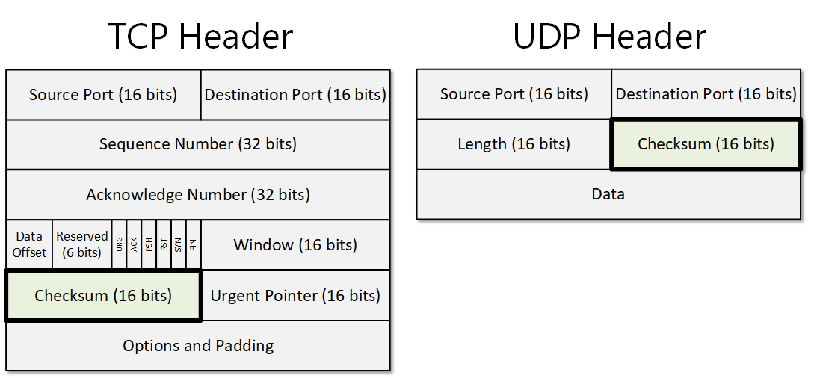

Figure 8. TCP and UDP Checksum field

In UDP, the checksum field is optional, but since there is no checksum field in the IPv6 header when UDP is carried by IPv6, the checksum field is mandatory. 

### IPv4 Time to Live (TTL) vs IPv6 Hop Limit

In IPv4, the TTL field ensures a packet won't circulate the network indefinitely in case of a routing loop. Each time a packet passes through a layer 3 device, the TTL value is decremented by one. When the value becomes 0, the packet is discarded. By default, the TTL value is set to 255.

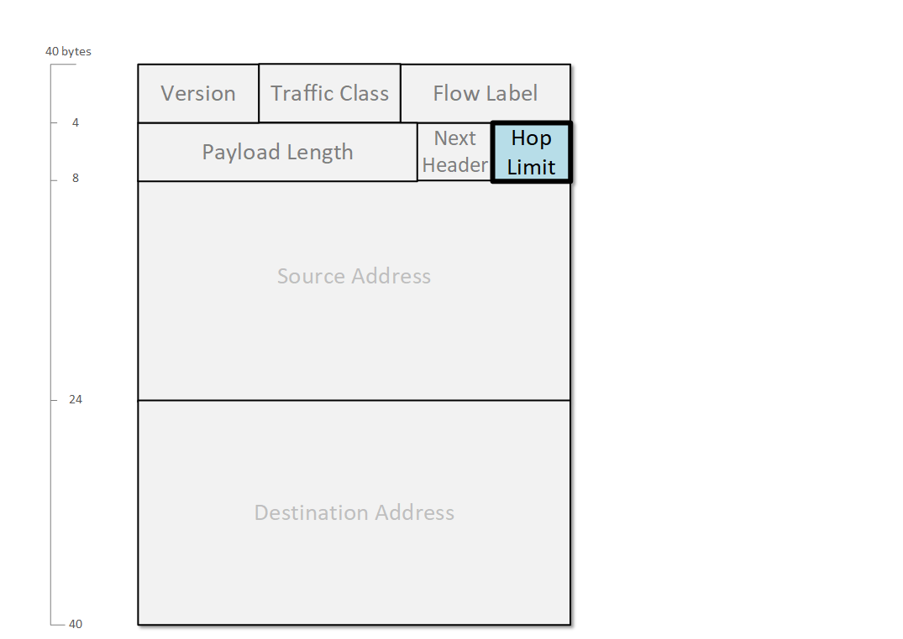

Figure 9. IPv6 Hop Limit Field

In IPv6, the Hop Limit field is basically the same thing, just the name has been changed to more precisely describe the function of the field. 

## Fragmentation in IPv4 and IPv6

If you look closely at the IPv4 header fields, you will note three fields that are not present in the IPv6 Header - the ***Identification***, ***Flags***, and ***Fragmentation Offset*** fields. They have been removed in version 6 because of the difference in the way fragmentation is handled in both protocols.

In IPv4, all network layer devices are allowed to fragment packets if the DF-bit (don't fragment) is not set. For example, if a router receives a packet that is larger than the MTU of the outgoing interface, the router divides the packet into multiple packets and send them out. The final destination is then responsible to reassemble the fragments into the original IP packet. Such an example is shown in figure 9. 

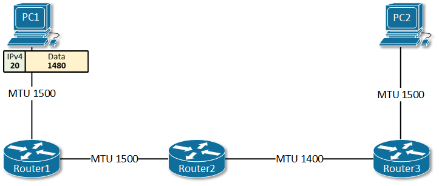

Figure 10. IPv4 Fragmentation is done by a router

The three IPv4 fields ***Identification***, ***Flags***, and ***Fragmentation Offset*** are used in this fragmentation handling process. 

In IPv6, routers do not fragment packets. When an IPv6 router receives a packet larger than the MTU of the outgoing interface, the router discards the packet and sends an ICMPv6 "Packet Too Big" message back to the sender. The message includes the MTU value of the egress link, so the source can adjust the packet size and retransmit. This process is called Path MTU Discovery and is described in [RFC 1981](https://tools.ietf.org/html/rfc1981), *Path MTU Discovery for IP Version 6*. An example is shown in figure 10.

There are two important points to clarify:

- Typically, when a source starts sending packets to a destination, it is not a single packet but a series of multiple ones. This process of adjusting the MTU is happening only with the first packet and after that, the entire flow is being transmitted with the proper packet size.
- Obviously, ICMPv6 messages have to be able to reach the sender for PMTU to work. Oftentimes, ICMPv6 is filtered out on firewalls or other security devices, and the PMTU process breaks.

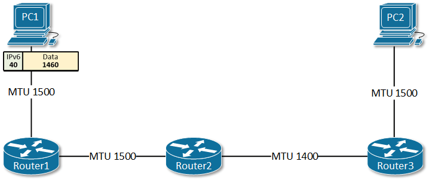

Figure 11. IPv6 Fragmentation is done by the source

### Example

Here is an example of an ICMPv6 Echo Request packet that uses the default Traffic Class, Flow Label, and a Hop Limit of 128. It is sent between two nodes using link-local addresses.

```ini
 Frame:
+ Ethernet: Etype = IPv6
- Ipv6: Next Protocol = ICMPv6, Payload Length = 40
  - Versions: IPv6, Internet Protocol, DSCP 0
     Version:  (0110............................) IPv6, Internet Protocol, 6(0x6)
     DSCP:     (....000000......................) DSCP 0
     ECT:      (..........0.....................) ECN-Capable Transport not set
     CE:       (...........0....................) ECN-CE not set
     FlowLabel: (............00000000000000000000) 0
    PayloadLength: 40 (0x28)
    NextProtocol: ICMPv6, 58(0x3a)
    HopLimit: 128 (0x80)
    SourceAddress: FE80:0:0:0:0:0:11FA:3BF1
    DestinationAddress: FE80:0:0:0:135A:BFFF:D313:D427
+ Icmpv6: Echo request, ID = 0x0, Seq = 0x18
```

## Summary

Let's quickly summarize what we have learned in this lesson in the following table:

Table 2. Comparing IPv4 and IPv6 Header fields

| IPv4 Field | IPv6 Field | Function |
|------------|-----------|----------|
| **Fields that have the same functionality and the same name in IPv4 and IPv6** |
| Version | Version | Indicates the version of the IP protocol in use. |
| Source Address | Source Address | The network layer identifier of the sender of the packet. 32-bit in IPv4 and is increased to 128-bit in IPv6. |
| Destination Address | Destination Address | The network layer identifier of the receiver of the packet. 32-bit in IPv4 and is increased to 128-bit in IPv6. |
| **Fields that have the same functionality but their names were changed** |
| Type of Service | Traffic Class | Used for traffic classification and marking. Nowadays, both protocols use the 6-bit Differentiated Services technique (DSCP). |
| Total Length | Payload Length | Indicates the length of the IP packet. In IPv4 the length includes both the IP header and the data. In IPv6, the length includes the data plus any extension headers but does not include the main IP header. |
| Time to Live | Hop Limit | Both fields have the same function. They ensure that packets do not loop around the network indefinitely. |
| Protocol | Next Header | Indicates the protocol being transported in the payload portion. In IPv6, it could also indicate the existence of an extension header. |
| **Fields that exist in IPv4 and have been removed from IPv6** |
| Internet Header Length | | In IPv4, this field is used in cases when the header is variable length. It is not needed in IPv6, because the v6 header is a fixed-length - 40 bytes. |
| Identification, Flags, Fragment Offset | | In IPv4, these fields are used when doing fragmentation. In IPv6, only the source of the packet is performing fragmentation using the Fragmentation extension header. |
| Header Checksum | | After many years of experience, the designers of IPv6 decided that this field is redundant and not necessary anymore because there are checksum fields in the upper layer protocols. |
| Options | | Options are now handled using the extension headers in IPv6, so this field is not necessary. |
| Padding | | Because IPv6 is fixed-sized, padding is not necessary. |
| **Fields that are new in IPv6 and do not exist in IPv4** |
| | Flow Label | A new field in IPv6 that is used for identifying that a packet is part of a sequence and has to be handled the same way as the entire traffic flow. |
