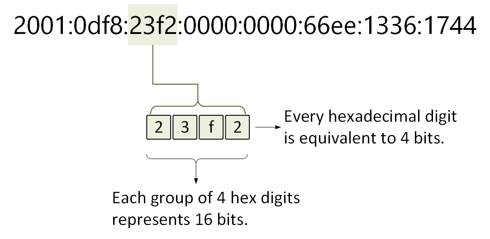
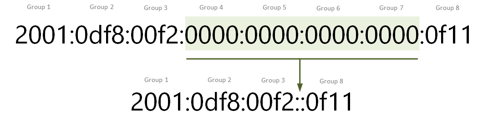
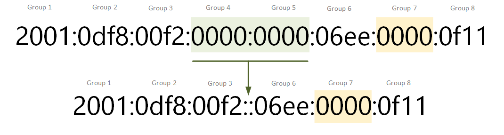
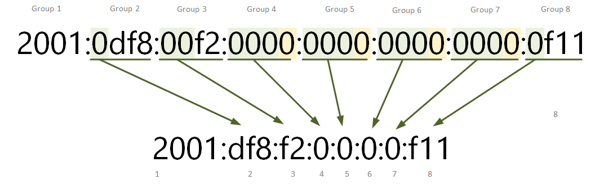
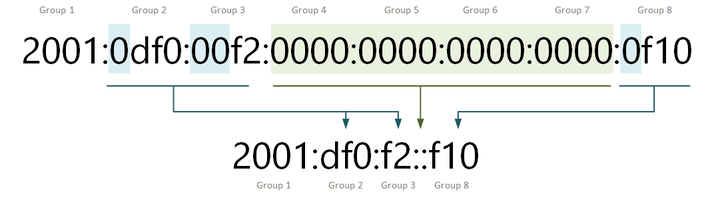
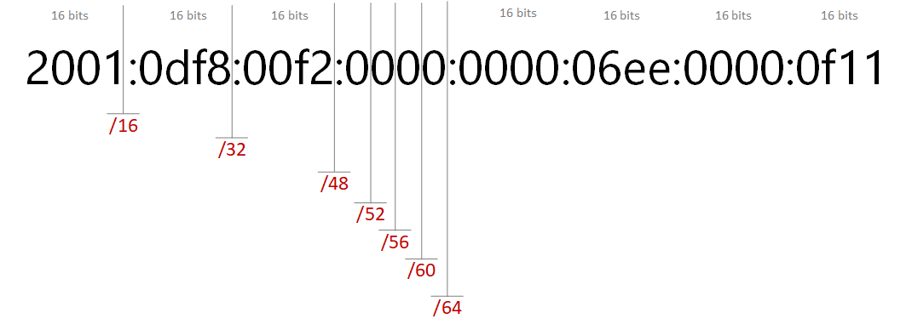

[IPv6 Address Representation](https://www.networkacademy.io/ccna/ipv6/ipv6-address-representation)
==========

# IPv6 Address Representation

When engineers first encounter IPv6, the most obvious and recognizable feature of the protocol is the IP address. It is quite different than the IPv4 one and at first, it seems hard to grasp. The other distinct difference is that IPv6 includes new address types such as link-local addresses. In this lesson, we are going to see that working with IPv6 addresses is not that hard. There are rules to shorten down the address and make it easier to work with.

## The IPv6 Address

An IPv6 address is **128 bits in length** and is written as **eight groups of four hexadecimal digits**. Each group is separated from the others by colons (:) as shown in figure 1. Hexadecimal characters are not case sensitive, therefore an address can be written either in uppercase or lowercase, both are equivalent.



Figure 1. Example of an IPv6 address

The eight groups make a total of 32 hexadecimal digits, four bits each, which makes a total of 128 bits. RFC 4291 says that the preferred representation of an IPv6 address is x:x:x:x:x:x:x:x and RFC 5952 recommends that the address is written in lowercase.

It is obvious that IPv6 addresses are long and hard to remember and work with. That's why there are rules that can significantly shorten the address

## Shortening IPv6 addresses

There are two rules, described in RFCs 2373 and 5952, that help engineers to reduce the length of the address representation. It's important to understand from the very beginning that using these two rules shortens only **the representation of the address**, the address itself is always 128 bits.

### Rule 1: Omit groups of all zeros

The first rule that we are going to look at is called **Zero Compression**. It says that a double colon (::) can replace a single, contiguous string of one or more groups consisting of all 0s. Example 1 illustrates the use of this rule.



Figure 2 - Applying Zero Compression - example 1

Note that Groups 4,5,6 and 7 of the IP address are all zeros. The rule says that we can replace them with a single double colon. There is one very important aspect of this rule - this zero compression with **a double colon can be applied only once**! Because otherwise, the original IPv6 address cannot be recreated from the shorted representation.

**IMPORTANT** - The **::** can only appear once in an IPv6 address.

Example 2 illustrates this. Note that there are two contiguous strings of zeros - Group 4 and 5, and Group 7. Having in mind that we can use only one double colon, we can either replace groups 4 and 5 with :: or group 7, but not both.



Figure 3 - Applying Zero Compression - example 2

### Rule 2: Omit Leading zeros

The other way to shorten addresses is to omit leading zeros in any group of 4 hexadecimal digits. **The rule applies only to leading zeros and no trailing zeros**. Even if a group consists of 4 zeros 0000 we can only omit the leading 3 - **000**0. This is illustrated in the following example.



Figure 4 - Applying Zero Compression - example 3

Note that all underscored groups have at least on leading zero. For groups 2,3 and 8, the rules are pretty straightforward, you just remove the leading zeros and that's about it. But if you look at group 4 for example, you cannot remove all four zeros, so the trailing zero highlighted in yellow must remain.

### Combining Rule 1 and 2

The shortest possible representation is achieved by combining both rules we have discussed. Let's get the IP address from example 3 and apply rule 1 and rule 2 at the same time.



Figure 5 - Applying Zero Compression - example 4

You can see that after we apply both rules, the resulting representation is significantly shorter.

### Common Mistakes

There are several common mistakes people make when they start applying these techniques. Let's look at several examples and highlight the key points.

```ini
IPv6 address
2001:0cb0:0000:0000:0fc0:0000:0000:0abc

Correctly Shortened
2001:cb0::fc0:0:0:abc
2001:cb0:0:0:fc0::abc

Common Mistake 1 - using :: twice
2001:cb0::fc0::abc

Common Mistake 2 - removing trailing zeros
2001:cb::fc:0:0:abc
```

In this example, in the original address, there are two consecutive strings of zeros, in groups 3 and 4, and in groups 6 and 7. People often try to replace both with :: and end up with two double colons in the shortened address. This is not allowed though, because it creates an ambiguous address representation. The other common mistake is to remove trailing zeros. Note the hex digits in group 2 - 0cb0, people often remove both 0s, but only the leading zero is allowed to be removed.

Let's have a look at a few more examples.

```ini
Example 1 - The match-all address
IPv6 address - 0000:0000:0000:0000:0000:0000:0000:0000
Shortened - ::
```

This is one appears very often in questions regarding IPv6 addresses. It is a valid address similar to 0.0.0.0 in IPv4 and its shortened representation is just a double colon. 

```ini
Example 2 - The loopback address
IPv6 address - 0000:0000:0000:0000:0000:0000:0000:0001
Shortened - ::1
```

The above example is the well-knows v6 loopback address. This is the v6 alternative to the well-known 127.0.0.1 in IPv4.

```ini
Example 3 - The all-nodes address
IPv6 address - ff02:0000:0000:0000:0000:0000:0000:0001
Shortened - ff02::1
```

The above example is the well-knows all-nodes multicast address. This is the v6 alternative to the well-known 224.0.0.1 in IPv4. The last example we are going to look at is a random link-local address. 

```ini
Example 2 - A random link-local address
IPv6 address - fe80:0000:0000:0000:0f19:1faf:008:5010
Shortened - fe80::f19:1faf:8:5010
```

It is very important to understand both rules for shortening addresses and to be able to apply them correctly on any random IPv6 address. There are at least a few questions in the CCNA exam that are related in some way to this topic.

## Prefix Length

In IPv4, the network portion of the address is written as a dotted-decimal network mask such as 255.255.255.0 and is called a subnet mask. It can also be represented as classless inter-domain routing (CIDR) notation such as /24 indicating that the first 24 bits of the IP address is the network portion.

In IPv6, there is no dotted-decimal representation but only CIDR notation such as /126. Therefore, there is only one way to write an IPv6 prefix:

***ipv6-address/prefix-length***

The prefix length is a decimal value showing that the number of leftmost bits of the address is the network portion. Let's take 2001:aaaa:bbbb:cccc:0:0:0:10/64 for example. The netmask length of 64 means that the IPv6 subnet is 2001:aaaa:bbbb:cccc::/64 and 2001:aaaa:bbbb:cccc::10 is a node in this subnet. 



Figure 6. IPv6 Prefix Notation

Typically in IPv6, engineers choose prefix lengths that are multiples of four. That makes the prefix easier to understand without using a subnet calculator. Look at the example in figure 6, each additional 4 in the prefix length moves the network portion of the address one hexadecimal digit to the right. 

Table 1 - IPv6 Subnetting Example

| Prefix Length | Network Portion       | Total Addresses |
|---------------|----------------------|-----------------|
| /4            | 2::                  | 2^124           |
| /8            | 20::                 | 2^120           |
| /12           | 200::                | 2^116           |
| /16           | 2001::               | 2^112           |
| /20           | 2001:0::             | 2^108           |
| /24           | 2001:0d::            | 2^104           |
| /28           | 2001:0df::           | 2^100           |
| /32           | 2001:0df8::          | 2^96            |
| /36           | 2001:0df8:0::        | 2^92            |
| /40           | 2001:0df8:00::       | 2^88            |
| /44           | 2001:0df8:00f::      | 2^84            |
| /48           | 2001:0df8:00f2::     | 2^80            |
| /52           | 2001:0df8:00f2:0::   | 2^76            |
| /56           | 2001:0df8:00f2:00::  | 2^72            |
| /60           | 2001:0df8:00f2:000:: | 2^68            |
| /64           | 2001:0df8:00f2:0000::| 2^64            |

## Summary

- An IPv6 address is a string of 128 bits represented as 32 hexadecimal digits grouped in eight groups separated by colons.
- Due to its length, it is hard to work with. Two rules have been introduced that shorten the address representation.
  - Rule 1, called Zero Compression, omits a group of consecutive zeros and replaces them with a double colon (::). **This can only be applied once per IPv6 address**, otherwise, the shortened representation becomes ambiguous.
  - Rule 2 omits leading zeros in a every group of hexadecimal digits. **It does not apply to trailing zeros though.**
- The prefix length of IPv6 address is written in CIDR notation like ***ipv6-address/prefix-length***. There is no dotted-decimal representation such as 255.255.255.0 in IPv6.
- There are at least a few questions in the CCNA exam that are related in some way to address shortening using the above rules.
