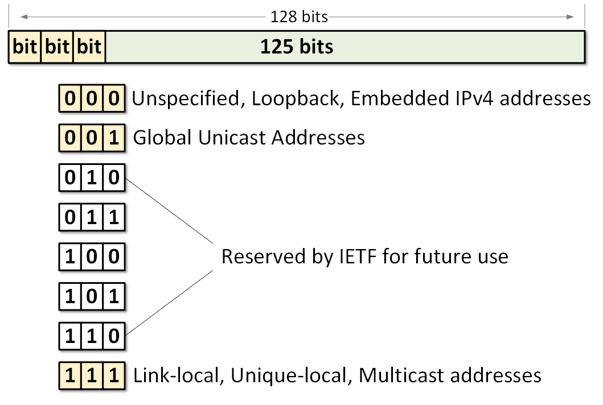
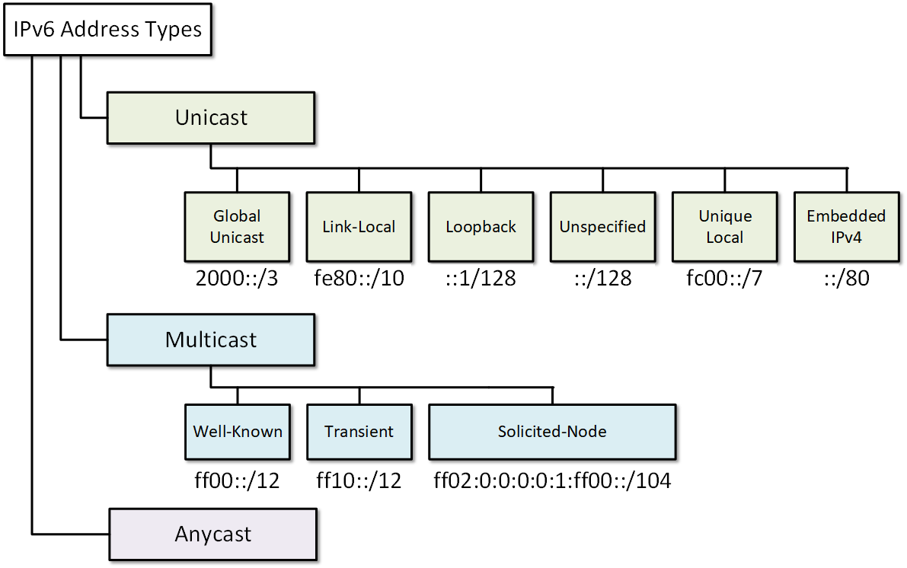
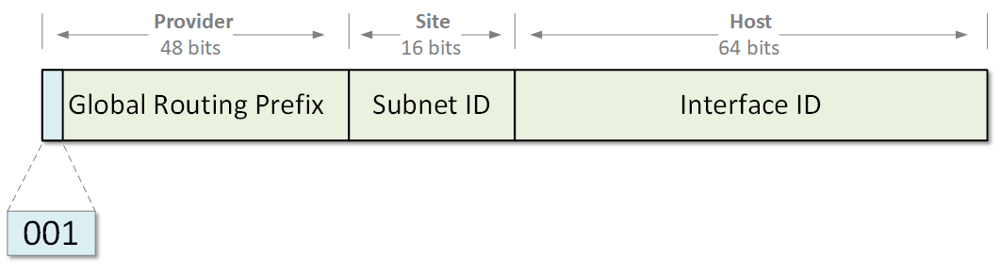
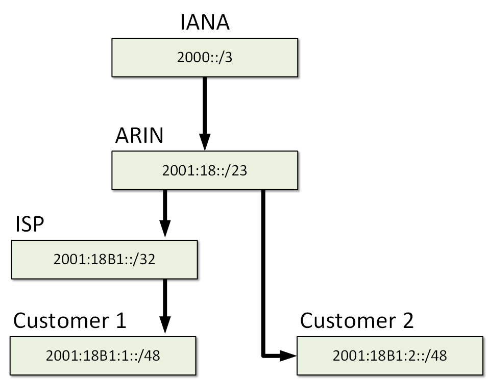
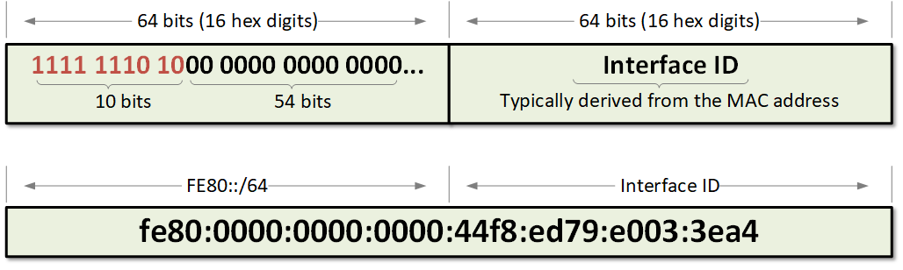
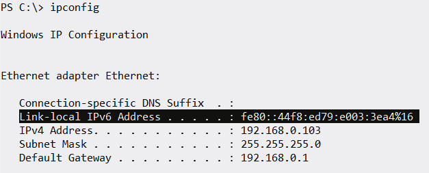
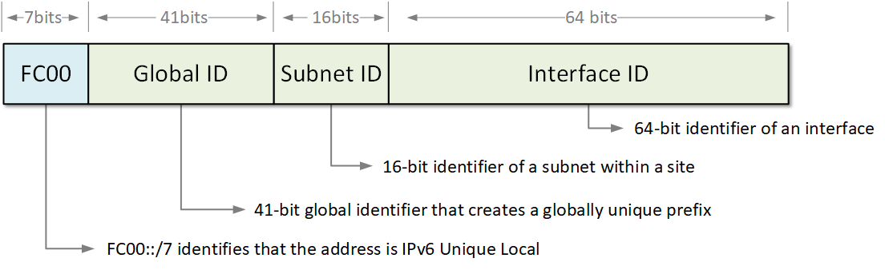
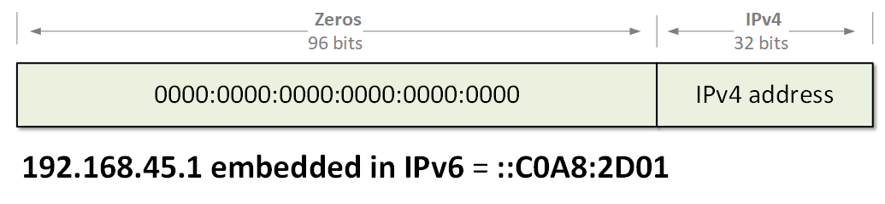
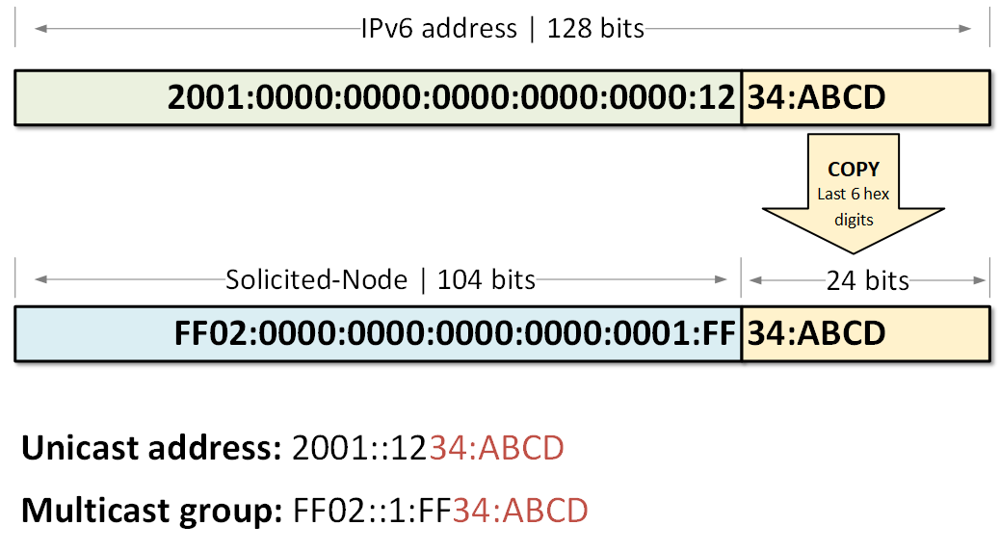

[IPv6 Address Types](https://www.networkacademy.io/ccna/ipv6/ipv6-address-types)
==========

# IPv6 Address Types

## The IPv6 Address Space

As we already learned, IPv6 addresses are 128-bit long, which means that there are 340 undecillion possible addresses (the exact number is shown below).

`340,282,366,920,938,463,463,374,607,431,768,211,456`

For reference, in IPv4 with its 32-bit address space, there are 4.29 billion possible addresses.

The Internet Assigned Numbers Authority (IANA) allocates only a small portion of the whole IPv6 space. IANA provides global unicast addresses that start with leading leftmost bits 001. A small portion of the addresses starting with 000 and 111 are allocated for special types. All other possible addresses are reserved for future use and are currently not being allocated. 



Figure 1. IANA's Allocation of IPv6 Address Space

Figure 1 visualizes the allocation logic. Note the following examples of Global Unicast Addresses:

```ini
2001:4::aac4:13a2
2001:0db6:87a3::2114:8f2e:0f70:1a11
2c0f:c20a:12::1
```

At present, in the Internet IPv6 routing table, all prefixes start with the hexadecimal digit 2 or 3, because IANA allocates only addresses that start with the first 3 bits 001.

## The IPv6 Address Types

An IPv6 address is a 128-bit network layer identifier for a single interface of IPv6 enabled node. There are three main types of addresses as shown in Figure 2:

- **Unicast** - A network layer identifier for **a single interface** of IPv6 enabled node. Packets sent to a unicast address are delivered to the interface configured with that IPv6 address. Therefore, it is **one-to-one** communication.
- **Multicast** - A network layer identifier for **a set of interfaces**, belonging to different IPv6 enabled nodes. Packets sent to a multicast address are delivered to all interfaces identified by that address. Therefore, it is **one-to-many** communication.
- **Anycast** - A network layer identifier for **a set of interfaces**, belonging to different IPv6 enabled nodes. Packets sent to an anycast address are delivered to the "closest" interface identified by that address. "Closest" typically means the one with the best routing metric according to the IPv6 routing protocol. Therefore, it is **one-to-closest** communication.
- **Broadcast** - There are no broadcast addresses in IPv6. Broadcast functionality is implemented using multicast addresses. 



Figure 2. IPv6 Address Types

## Unicast Addresses

### Aggregatable Global Unicast Address

Aggregatable global unicast addresses are part of the global routing prefix. The structure of these addresses enables for aggregation of routing entries to achieve a smaller global IPv6 routing table. At present, all global unicast addresses start with binary value 001 (2000::/3). Their structure consists of a 48-bit global routing prefix and a 16-bit subnet ID also referred to as Site-Level Aggregator (SLA). 



Figure 3. Aggregatable Global IPv6 Address Format

Let's take a look at the following example of allocating global unicast addresses.

- IANA currently allocates addresses from the prefix 2000::/3 to the regional providers.
- For example, part of this address space is allocated to ARIN.
- ARIN then allocates sub-parts of this address space 2001:18::/23 to ISPs and large customers.

Note that the prefix was given to Customer 1 2001:18B1:1::/48 is part of the bigger prefix 2001:18B1::/32 owned by the ISP, which itself is part of the bigger prefix 2001:18::/23 of ARIN and so on. That's is why these global IPv6 unicast addresses are called **aggregatable**.



Figure 4. IPv6 Allocation Example

### Link-Local 

IPv6 link-local is a special type of unicast address that is auto-configured on any interface using a combination of the link-local prefix FE80::/10 (first 10 bits equal to 1111 1110 10) and the MAC address of the interface. The structure of a link-local address is shown in Figure 4.



Figure 5. IPv6 Link-local address structure

The idea is to enable nodes attached to a common link to communicate without the need for globally unique addresses. Similar concept to 169.254.0.0/16 in IPv4. If we connect several IPv6 enabled nodes to a switch, they will auto-configure their interfaces with link-local addresses, will discover each other, and be able to communicate. The scope of the link-local address is only its respective link. Routers do not forward packets that have a link-local source or destination addresses to other links.



Figure 6. IPv6 Link-local address auto-configured on Windows

### Loopback

In both IPv4 and IPv6, a loopback address identifies a logical interface that has no physical representation and is always up and running. Packets sent to a loopback address are returned (looped) on the same interface. In the computer world, loopback addresses are typically used for testing the TCP/IP networking stack. 

In IPv4, the entire network 127.0.0.0/8 address range is reserved for loopback addresses but all leading operating systems use the famous address 127.0.0.1 called *"localhost"* by default. The rest of the 127.0.0.0/8 address space is typically not used.

In IPv6, the IPv6 address 0:0:0:0:0:0:0:1/128 is reserved for loopback identifier. It can be shortened to ::1/128 using the rules we have learned in the [previous lesson](https://www.networkacademy.io/ccna/ipv6/ipv6-address-representation). 

### Unspecified

In IPv4 and IPv6, the unspecified address in a special type of address with all binary bits set 0. Therefore, in v4 it looks like 0.0.0.0/32 and in v6 it looks like 0:0:0:0:0:0:0:0 or completely shortened as ::/128. The unspecified address is used by the Operating Systems in the absence of any valid IP address and processes like DHCP. 

Routers do not forward packets with source or destination address set to the unspecified address.

### Unique Local

A unique local address is a special type of globally unique IPv6 address that has the following characteristics:

- It has a globally unique prefix similar to global unicast addresses. If it is accidentally leaked outside of the organization, there will be no conflict with other IPv6 global prefixes.
- Its structure is well-known (shown in figure 4) which allows for easy filtering at site boundaries.
- It allows sites to be interconnected without creating any address conflicts.
- It is an Internet Service Provider independent address space. Therefore these addresses won't overlap with any other ISP assigned range.
- Application threats these address as regular global IPv6 ones.

Internet routers filter out any incoming or outgoing Local IPv6 unicast routes. The structure of a unique local address is shown below.



Figure 7. IPv6 Unique-local Address Structure

### Embedded IPv4-in-IPv6

Embedded IPv4-in-IPv6 is a unicast address that has only zeros in the first 96-bits of the address and an IPv4 address in the rightmost 32-bits. Therefore, when IPv4 address A.B.C.D (in hex digits) is embedded in IPv6 using this logic, it becomes 0:0:0:0:0:0:A:B:C:D or just ::A:B:C:D. These types of IPv6 addresses are used in automatic tunnels supporting both IPv4 and IPv6 protocol stacks. Shown in the figure below is the structure of an Embedded IPv4-in-IPv6 address.



Figure 8. Embedded IPv4-in-IPv6 Address Format

## Multicast Addresses

Network multicast is a technique in which a node sends packets to multiple destinations simultaneously (one-to-many). The destinations actually are **a set of interfaces**, identified by a single multicast address known as a **multicast group**.

In IPv6, multicast addresses are distinguished from all other types by the value of the leftmost 8 bits of the addresses: a value of 11111111 (hex digits FF) identifies that the address is multicast. Therefore, all multicast addresses are part of the prefix ff00::/8, which is equivalent to the IPv4 multicast address space of 224.0.0.0/4. Two important rules apply to IPv4 and IPv6 multicast:

- Packets sent to a multicast group always has a unicast source address.
- A multicast address can not be a source address of a packet.

There aren't broadcast addresses in IPv6. Instead, in IPv6 this functionality is done using special multicast groups - all-IPv6 devices multicast address and a solicited-node multicast address.

### Well-known Multicast Addresses

As you may already know, in IPv4 there are several well-known multicast addresses in the range 224.0.0.0/24. Well-known means that these addresses are predefined and reserved for special use.

In IPv6, all well-known multicast addresses start with the prefix ff00::/12. This means that the first 3 hexadecimal digits of an address will always be ff0. Several examples of such addresses are shown in the table below:

Table 1. Well-known IPv6 multicast addresses

| Address   | Function                      |
|-----------|--------------------------------|
| FF02::1   | All Nodes Address             |
| FF02::2   | All Routers Address           |
| FF02::4   | DVMRP Routers                 |
| FF02::5   | All OSPFv3 routers            |
| FF02::6   | OSPFv3 Designated Routers     |
| FF02::a   | All EIGRP (IPv6) routers      |
| FF02::D   | All PIM Routers               |
| FF02::12  | VRRP                          |
| FF02::16  | All MLDv2-capable routers     |

### Solicited-node Multicast Address

A solicited-node multicast address is a special type of IPv6 multicast. It is used as a more efficient approach to IPv4's broadcast delivery. A solicited-node multicast address is generated automatically using an IPv6 unicast of an interface.

When an interface is configured with an IPv6 unicast address, a solicited-node multicast address is generated automatically based on the unicast address for this interface and the node joins the multicast group. Therefore, any unicast address has a corresponding solicited-node multicast address. This auto-generated multicast group is then used for address resolution, neighbor discovery, and duplicate address detection.

As shown in figure 7, a solicited-node multicast address consists of the fixed prefix FF02::1:FF00:0/104 and the last 24 bits of the corresponding IPv6 address.



Figure 9. Solicited-node multicast address format

As we have already learned - there is no broadcast in IPv6. There is no ARP as well. When a node needs to resolve the MAC address of a known IPv6 address, the device still needs to send a request. In this request packet, the destination IPv6 address is the solicited-node multicast address corresponding to the target IPv6 unicast address (for reference, in IPv4 ARP target address is 0.0.0.0), and the destination MAC address is the multicast MAC address corresponding to the multicast address. Only the targeted node 'listens' to this solicited-node multicast address. Therefore the request will be processed only by the targeted node and not by all node attached to the link as it happens with broadcasted ARP in IPv4. 

```ini
Router#sh ipv6 interface gi0/0/0
GigabitEthernet0/0/0 is up, line protocol is up
  IPv6 is enabled, link-local address is FE80::ABCD:1234
  No Virtual link-local address(es):
  Global unicast address(es):
    2001::1234:ABCD, subnet is 2001::/64
  Joined group address(es):
    FF02::1
    FF02::1:FF34:ABCD
    FF02::1:FFCD:1234
  MTU is 1500 bytes
  ICMP error messages limited to one every 100 milliseconds
  ICMP redirects are enabled
  ICMP unreachables are sent
  ND DAD is enabled, number of DAD attempts: 1
  ND reachable time is 30000 milliseconds
```

### Anycast Addresses

An anycast address is a network layer identifier typically assigned to more than one interface (**a set of interfaces)**, belonging to different IPv6 enabled nodes. Packets sent to an anycast address are delivered to the "nearest" interface identified by that address. "Nearest" typically means the one with the best routing metric according to the IPv6 routing protocol. 

Anycast addresses are allocated from the unicast address space, therefore they are **indistinguishable from global unicast addresses**. Configuring the same unicast address to more than one interface makes it an anycast address. Devices that have an anycast address assigned must be explicitly configured to recognize that the address is used for anycast communication, as shown in the configuration example below. 

```ini
Device(config-if)#ipv6 address 2001:4db8:a541::/128 anycast
```

## Summary

Let's summarize all types of IPv6 address we have discussed in this lesson:

- **Global Unicast**
  - At present, IANA allocates global unicast addresses that start with binary value 001 (2000::/3).
  - Their structure consists of a 48-bit global routing prefix and a 16-bit subnet ID also referred to as Site-Level Aggregator (SLA). 
  - The structure of these addresses enables for aggregation of routing entries to achieve a smaller global IPv6 routing table.
- **Unique-local**
  - It has a globally unique prefix similar to global unicast addresses. 
  - Its structure is well-known (shown in figure 4) which allows for easy filtering at site boundaries.
  - It is an Internet Service Provider independent address space.
- **Loopback**
  - The well-known loopback address in IPv6 is ::1/128.
  - Similar concept to 127.0.0.0/8 in IPv4.
  - Typically used for testing the TCP/IP protocol stack in operating systems.
- **Unspecified**
  - The unspecified address in IPv6 is ::/128.
  - Similar concept to 0.0.0.0 in IPv4
- **Embedded IPv4-in-IPv6**
  - IPv4 address A.B.C.D (in hex digits) is embedded in IPv6 as 0:0:0:0:0:0:A:B:C:D or just ::A:B:C:D.
  - IPv6 addresses are used in automatic tunnels supporting both IPv4 and IPv6.
- **Link-local** 
  - FE80::/10 prefix.
  - Automatically assigned to any IPv6 enabled interface.
  - Analogous to 169.254.0.0/16 in IPv4.
  - Not routable. They are only valid in the scope of an interface.
  - Used for Neighbor Discovery and Stateless Autoconfiguration.
- **Well-known Multicast**
  - All well-known multicast addresses start with the prefix ff00::/12.
  - They have a similar function as 224.0.0.0/24 in IPv4.
- **Solicited-Node Multicast**
  - Each IPv6 unicast address has a corresponding solicited-node multicast address.
  - The structure consists of the fixed prefix FF02::1:FF00:0/104 and the last 24 bits of the corresponding IPv6 address.
  - These special multicast groups are used for address resolution, neighbor discovery, and duplicate address detection.
