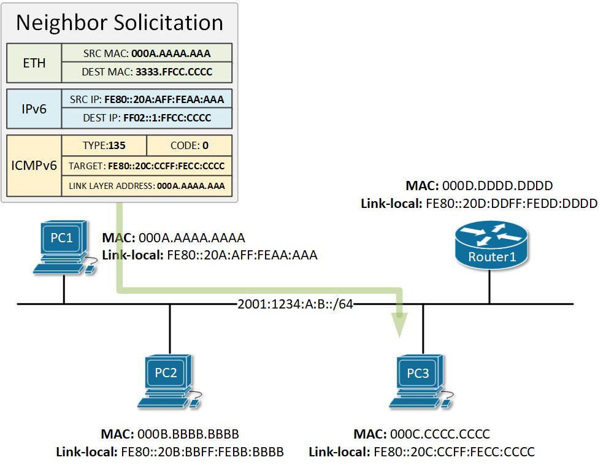
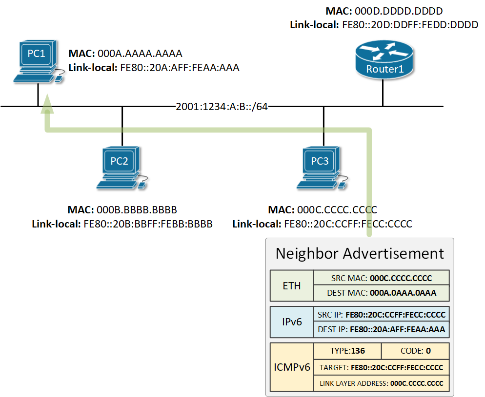
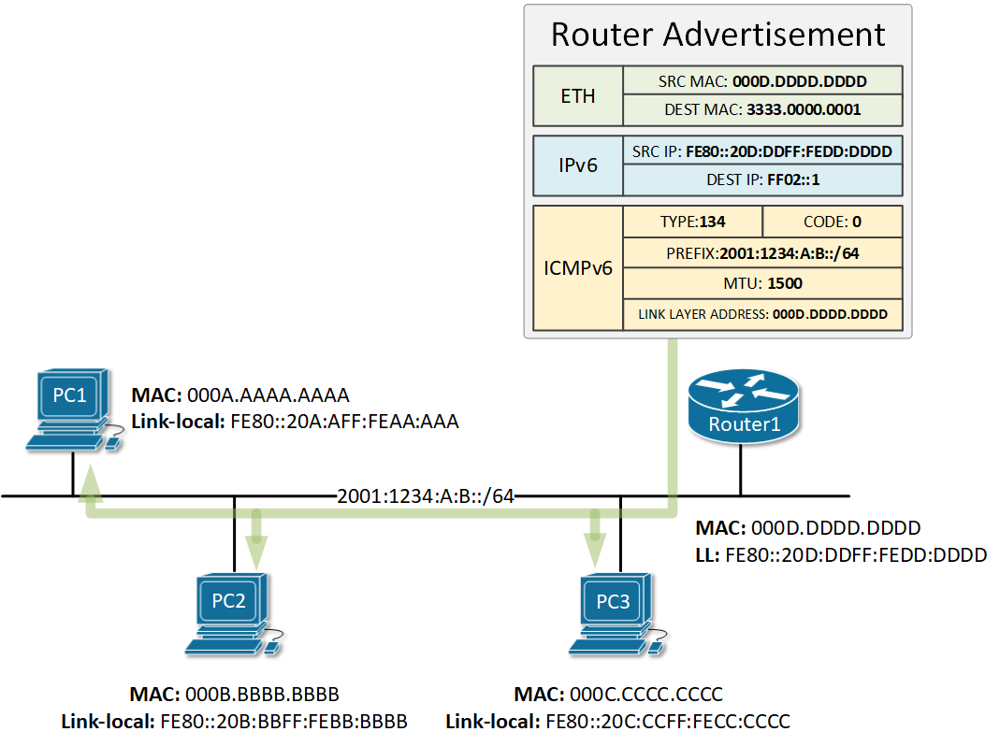
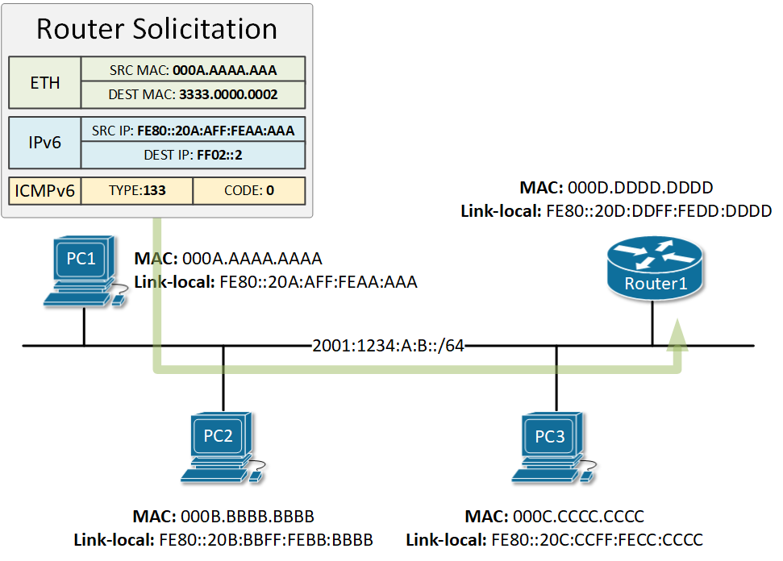

[IPv6 Neighbor Discovery Protocol](https://www.networkacademy.io/ccna/ipv6/neighbor-discovery-protocol)
==========

# IPv6 Neighbor Discovery Protocol

As we already mentioned a couple of times in this course - there is no Address Resolution Protocol (ARP) in IPv6. But then you may be wondering, how does IPv6-to-MAC resolution is done. How does a node find the physical address of a know IPv6 address? The answer is - using the **IPv6 Neighbor Discovery Protocol**. It is a **more secure and efficient** way of handling the Layer 3 to Layer 2 resolution process **using multicast messages instead of broadcast** like in IPv4.

The term **Neighbor** or **Neighbor node** refers to IPv6 nodes that are on the same local segment or in the same layer 2 domain. 

## Message Types

IPv6 Neighbor Discovery Protocol defines 5 types of messages that use ICMPv6 encapsulation:

- Router Solicitation (ICMPv6 type 133)
- Router Advertisement (ICMPv6 type 134)
- Neighbor Solicitation (ICMPv6 type 135)
- Neighbor Advertisement (ICMPv6 type 136)
- Redirect Message (ICMPv6 type 137)

In comparison, ARP messages such as ARP Request and ARP Reply are encapsulated directly in an Ethernet frame. 

Let's examine each message in detail and see what is its role in the process.

## Neighbor Solicitation (NS)

When a node needs to resolve the physical address of a known IPv6 address, it sends a Neighbor Solicitation (NS) message on the network segment. This message is the IPv6 alternative to the ARP Request. There are few changes in comparing to ARP though that makes the Neighbour Solicitation **more secure and efficient**.

Let's look at the example shown in figure 1 where PC1 wants to resolve the physical address of PC3 - FE80::20C:CFF:FECC: CCCC. PC1 needs to send a Neighbour Solicitation message for this IPv6 address so it creates a new ICMPv6 packet type 135. Type 135 explicitly tells the receiving side that this is an NS packet. In the target field of the ICMPv6, PC1 puts the IPv6 address that it wants to find the MAC of. In our example, it would be one of PC3 - FE80::20C:CFF:FECC:CCCC.

This ICMPv6 message is then encapsulated in an IPv6 packet. For source address at layer 3, PC1 sets its own link-local address FE80:20A:AFF:FEAA:AAAA. The destination address is key in the improved security and efficiency comparing to the ARP protocol in IPv4. For destination address in the IPv6 packet, PC1 set a special type of multicast address called ***solicited-node*** multicast. For each configured IPv6 address, every node joins a multicast group identified by the address FF02::1:FFXX:XXXX where XX:XXXX are the last 6 hexadecimal values in the IPv6 unicast address. Therefore, for each configured unicast address, no matter if it is link-local or global, the host joins the respective auto-generated ***solicited-node*** multicast group.

In our example, PC1 wants to send the NS message to the node with IP address FE80::20C:CFF:FECC: CCCC. Having the above logic in mind, the node that has that IPv6 address must have joint the solicited-node group generated from that address - FF02::1:FFCC:CCCC.

Figure 1. IPv6 Neighbor Solicitation Message

After the IPv6 header is filled, the packet is encapsulated in an Ethernet frame. For source MAC address, PC1 sets its own burnt-in physical address. The destination MAC address is set to a multicast MAC generated from the multicast IPv6 address in the layer 3 header using the following formula. 3333.XXXX.XXXX where XXXX:XXXX are the last 8 hex digits in the multicast IPv6 address. In our example, this will result in the physical address of 3333.FFCC.CCCC because are the last 8 hex digits in the destination address FF02::1:FFCC:CCC.

When PC1 sends this Neighbor Solicitation message on the network, there are two possible scenarios:

- If switches in the local segment are running a protocol called IPv6 Multicast Listener Discovery Snooping (MLD), they will know that only PC3 is subscribed to the multicast group FF02::1:FFCC:CCC and will switch the frame only to PC3.
- If the switches in the local segment are not running MLD, they will broadcast the frame to every node in the segment in the same way as an ARP frame in IPv4. However, only PC3 will process the packet, because only PC3 is subscribed to this multicast group. All other nodes that get this NS packet will discard it, because they do not listen to this solicited-node address FF02::1:FFCC:CCC.

## Neighbor Advertisement (NA)

When PC3 gets the Neighbor Solicitation message from PC1, it will look at the Target field in the ICMPv6 header and will compare it against its own configured IPv6 addresses. The target address matches PC3's link-local address, so PC3 will reply back to PC1 with a message called Neighbor Advertisement. This message is the IPv6 alternative to the ARP Reply in IPv4.

Let's examine in detail all values in the message. In the ICMPv6 header, PC3 sets the Type field to 136, which means that this is a NA message. In the *Target* field, P3 sets the IPv6 address and in the *Link-local Address* field, it sets the physical address of the interface configured with this IPv6.

Figure 2. IPv6 Neighbor Advertisement Message

In the IPv6 header, PC3 sets the source IPv6 address to be its link-local address and the destination to be the link-local address of PC1.

In the Ethernet header, PC3 sets its own physical address as source MAC and the physical address of PC3 as destination MAC. Note that the Neighbor Advertisement is **a unicast message**. 

## Router Advertisement (RA)

IPv6 routers attached to a local segment advertise their presence periodically via an ICMPv6 message called **Router Advertisement (RA)**. The message is destined to the ***all-nodes*** multicast address FF02::1 which means that every node on the segment receives and processes it. RA messages contain the *prefix* and the *prefix length* used on this segment as well as other parameters such as MTU. Cisco routers advertise their presence on a segment every 200 seconds by default. 

Figure 3. IPv6 Router Advertisement Message

Nodes use these messages for services such as Stateless Autoconfiguring (SLAAC) which we explain in detail in [this lesson](https://www.networkacademy.io/ccna/ipv6/stateless-address-autoconfiguration-slaac).

## Router Solicitation (RS)

As we said above, Cisco routers send Router Advertisement messages every 200 seconds by default. However, when a node is connected to a local segment, it sends out a message called Router Solicitation that requests that routers generate Router Advertisements (RA) immediately rather than at their next scheduled time.

Figure 4. IPv6 Router Solicitation Message

As you can see in the example in figure 4, the Router Solicitation message is destined to the ***all-routers*** multicast address, which means that only the routers on the local segment will process these RS messages.

## Summary

IPv6 Neighbor Discovery Protocol works by using 5 types of messages encapsulated in ICMPv6. Each message has the following purpose:

- **Router Solicitation** - Hosts use Router Solicitation messages to locate routers in their local segment. Upon receipt of an RS message, routers generate Router Advertisements immediately rather than at their next scheduled time. The RS message uses ICMPv6 type 133 and is destined to the **all-routers** multicast address FF02::2.
- **Router Advertisement** - IPv6 routers advertise their presence in the local segments either periodically, or in response to a Router Solicitation. The RA message uses ICMPv6 type 134 and is destined to the **all-nodes** multicast address FF02::1. Cisco router sent RA messages every 200 seconds by default.
- **Neighbor Solicitation** - The Neighbor Solicitation message is used by nodes to resolve the physical address of a known IPv6 address (target address). The NS message is encapsulated in ICMPv6 type 135 and is destined to the **solicited-node multicast group** that is auto-generated from the targeted IPv6 address. Only the owner of the targeted IP must have subscribed to this solicited-node group. The message has a similar function to the IPv4 ARP Request but is **more secure and efficient** because it is not broadcasted to all nodes. 
- **Neighbor Advertisement** - Neighbor advertisements are used by nodes to respond to a Neighbor Solicitation message. The NA message is encapsulated in ICMPv6 type 136 and is destined for the **unicast address** in the Neighbor Solicitation message. 
- **Redirect Message** - Routers informs hosts of a better first-hop router for a destination.
