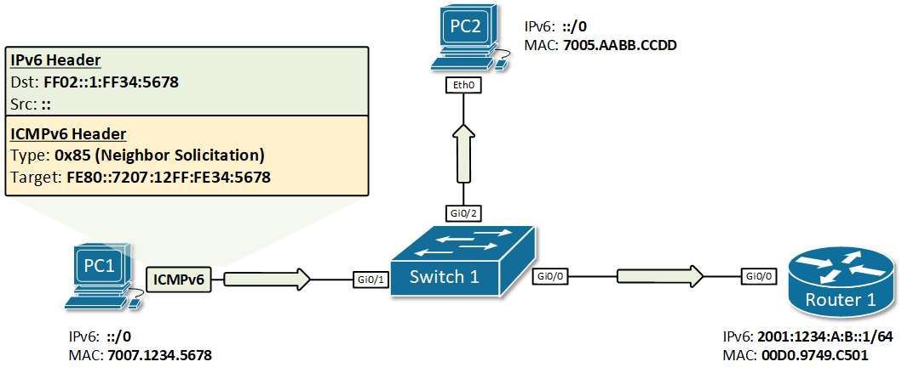
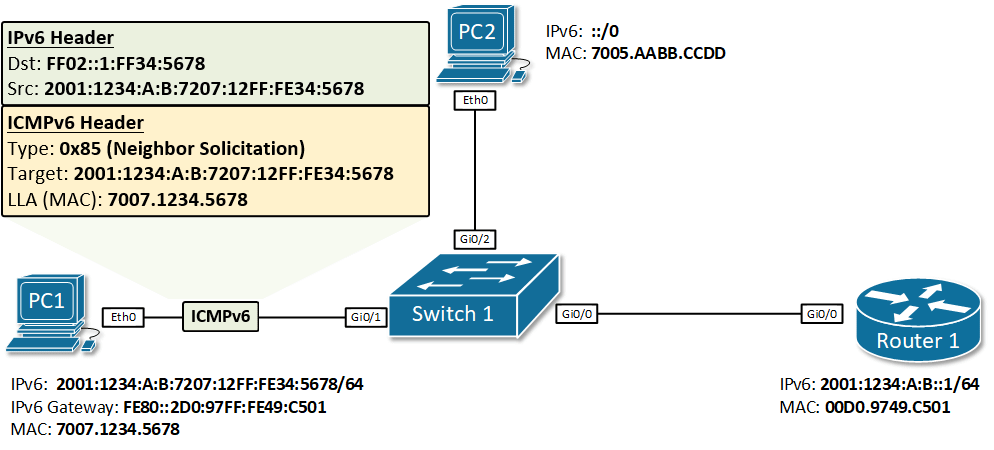
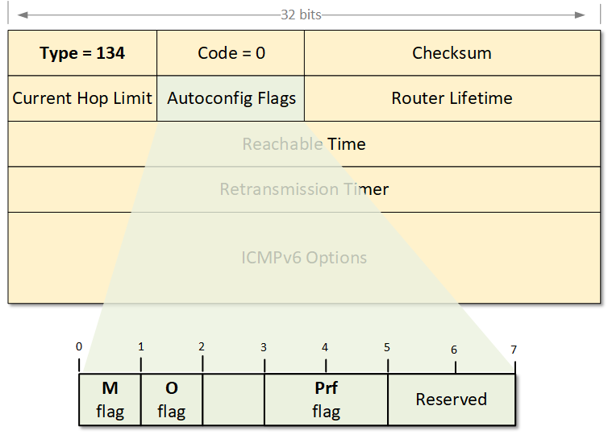
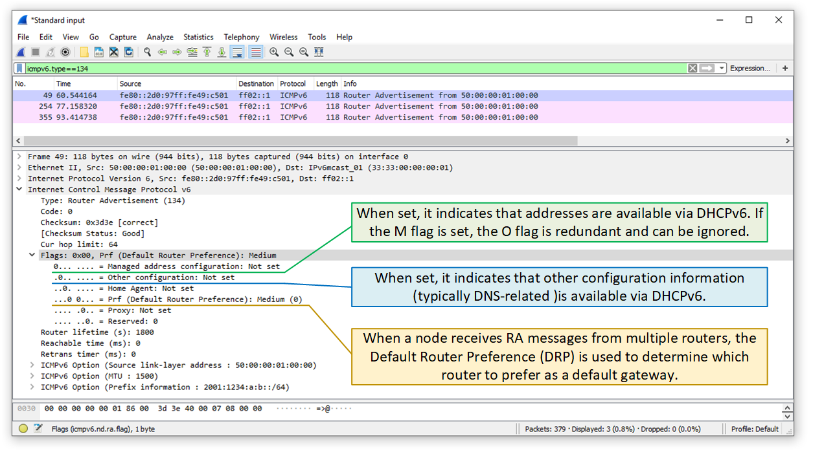

[IPv6 Stateless Address Auto-configuration (SLAAC)](https://www.networkacademy.io/ccna/ipv6/stateless-address-autoconfiguration-slaac)
==========

# IPv6 Stateless Address Auto-configuration (SLAAC)

Each IPv6 node on the network needs a globally unique address to communicate outside its local segment. But where a node get such an address from? There are a few options:

- **Manual assignment** - Every node can be configured with an IPv6 address manually by an administrator. It is not a scalable approach and is prone to human error. 
- **DHCPv6** (The Dynamic Host Configuration Protocol version 6) - The most widely adopted protocol for dynamically assigning addresses to hosts. Requires a DHCP server on the network and additional configuration.
- **SLAAC** (Stateless Address Autoconfiguration) - It was designed to be a simpler and more straight-forward approach to IPv6 auto-addressing. In its current implementation as defined in [RFC 4862](https://tools.ietf.org/search/rfc4862), SLAAC does not provide DNS server addresses to hosts and that is why it is not widely adopted at the moment. 

In this lesson, we are going to learn how SLAAC works and what are the pros and cons of using it in comparison to DHCPv6.

## What is SLAAC?

**SLAAC** stands for Stateless Address Autoconfiguration and the name pretty much explains what it does. It is a mechanism that enables each host on the network to auto-configure a unique IPv6 address without any device keeping track of which address is assigned to which node.

Stateless and Stateful in the context of address assignment mean the following:

- **A stateful address assignment** involves a server or other device that keeps track of the state of each assignment. It tracks the address pool availability and resolves duplicated address conflicts. It also logs every assignment and keeps track of the expiration times.
- **Stateless address assignment** means that **no server keeps track** of what addresses have been assigned and what addresses are still available for an assignment. Also in the stateless assignment scenario, nodes are responsible to resolve any duplicated address conflicts following the logic: Generate an IPv6 address, run the Duplicate Address Detection (DAD), if the address happens to be in use, generate another one and run DAD again, etc.

## How does SLAAC work?

To fully understand how the IPv6 auto-addressing work, let's follow the steps an IPv6 node takes from the moment it gets connect to the network to the moment it has a unique global unicast address.

#### Step 1: The node configures itself with a link-local address

When an IPv6 node is connected to an IPv6 enabled network, the first thing it typically does is to auto-configure itself with a link-local address. The purpose of this local address is to enable the node to communicate at Layer 3 with other IPv6 devices in the local segment. The most widely adopted way of auto-configuring a link-local address is by combining the link-local prefix FE80::/64 and the EUI-64 interface identifier, generated from the interface's MAC address. 

Figure 1 shows a step by step example of how a local address is generated from MAC address 7007.1234.5678.


Figure 1. Generating a link-local address from interface's MAC address

Once the above steps are completed, the node has a fully functional EUI-64 format link-local address as shown below:

```ini
C:\>ipconfig /all

Ethernet adapter Ethernet0:

   Connection-specific DNS Suffix..: 
   Physical Address................: 7007.1234.5678
   Link-local IPv6 Address.........: FE80::7207:12FF:FE34:5678
   IP Address......................: 0.0.0.0
   Subnet Mask.....................: 0.0.0.0
   Default Gateway.................: 0.0.0.0
   DNS Servers.....................: 0.0.0.0
   DHCP Servers....................: 0.0.0.0
   DHCPv6 Client DUID..............: 00-01-00-01-C4-35-08-8E-70-07-12-34-56-78
```

#### Step 2: The node performs Duplicate Address Detection (DAD)

After the IPv6 host has its link-local address auto-configured, it has to make sure that the address is actually unique in the local segment. Even though the chances that another node has the same exact address are very slim. It has to perform a process called Duplicate Address Detection (DAD).

DAD is a mechanism that involves a special type of address called *solicited-node multicast*. Upon configuring an IPv6 address, every node joins a multicast group identified by the address FF02::1:FFxx:xxxx where xx:xxxx are the last 6 hexadecimal values in the IPv6 unicast address. Therefore, for each configured unicast address, no matter if it is link-local or global, the host joins the respective auto-generated *solicited-node* multicast group.

In our example, the last 6 hexadecimal values of the link-local address are 34:5678 so the node joins the multicast group FF02::1:FF*34:5678*. As PC1 is running a Windows 10 operating system, we can verify that with the following command:

```ini
C:\>netsh interface ipv6 show joins

Interface 8: Ethernet0

Scope       References  Last  Address
----------  ----------  ----  ---------------------------------
0                    0  Yes   ff01::1
0                    0  Yes   ff02::1
0                    1  Yes   ff02::c
0                    2  Yes   ff02::fb
0                    1  Yes   ff02::1:3
0                    2  Yes   ff02::1:ff34:5678
```

Having this logic in mind, we know that if another host has the same exact link-local address, it will also be listening for messages on the solicited-node multicast group auto-generated from this address - FF02::1:FF34:5678. In order for PC1 to check that, it sends an ICMPv6 message with a destination address set to this group, and the source address set to the IPv6 unspecified address. In the ICMPv6 portion of the packet, PC1 puts the whole address in the Target Address field. Figure 2 illustrates that process. PC1 then sends the packet on the network. Only nodes that are listening to this exact auto-generated multicast group will open the packet, all other nodes will discard it. If any node has an IPv6 address that has the same last 6 hex digits, will look in the ICMPv6 portion and check if the target address matches any of its own addresses. If there is a match, the host will reply back that this IPv6 address is already in use. If nobody replies back, PC1 will conclude that this address is unique and available to be used, and will assign it.



Figure 2. PC1 performs IPv6 DAD for its link-local address

This process is called Duplicate Address Detection (DAD) and is done upon every new address assignment. In our example, PC1 sends the ICMPv6 Neighbor Solicitation message as shown in figure 2, and nobody replies back. PC1 will then know for sure that this link-local address is unique in this local segment.

#### Step 3: The node sends a Router Solicitation message

Step 1 and 2 in this example depict the process of generating and assigning a unique link-local address. This process is not exactly part of the Stateless Autoconfiguration feature but without a link-local address, PC1 won't be able to communicate at layer 3 with any other IPv6 node. Thus, it is a pre-requisite for the SLAAC to work and that's why we have included it in our example.

After PC1 has a link-local address, it can now start the process of auto-configuring a global unicast address using SLAAC. The first step of this process is to send an ICMPv6 message called **Router Solicitation (RS)**. The purpose of this message is to '*ask*' all IPv6 routers attached to this segment about the global unicast prefix that is used. The destination address is the all-routers multicast address FF02::2 and for source, PC1 uses its link-local address. Note that only routers are subscribed to multicast group FF02::2, which means that only Router 1 will process this message, and all other nodes on the local segment will discard it.

After Router 1 gets the Router Solicitation message, it responds back with an ICMPv6 message called **Router Advertisement** (RA). The RA message includes the global IPv6 prefix on the link and the prefix length. In our example, these would be the prefix 2001:1234:A:b:: and the prefix length of /64. For the source of this RA packet, Router 1 uses its own link-local address and destination is the all-nodes multicast address FF02::1. The process is illustrated in figure 3.


Figure 3. IPv6 Stateless Address Autoconfiguration example

#### Step 4: The node configures its global unicast address

Once PC1 gets back the Router Advertisement from Router 1, it combines the prefix 2001:1234:A:B::/64 with its EUI-64 interface identifier (7207:12FF:FE34:5678) resulting in the global unicast address 2001:1234:A:B:7207:12FF:FE34:5678/64. Because the Router Advertisement came from Router 1, PC1 sets its IPv6 default gateway to the link-local address of R1.

Now PC1 has a global unicast address and a default gateway. But the SLAAC process is not completed. PC1 must know for sure this auto-generated address is unique in the local segment. Thus, PC1 performs the Duplicate Address Detection (DAD) process. 

#### Step 5: The node performs Duplicate Address Detection (DAD)

We have already explained the DAD process in detail in step 2. When PC1 auto-generate its global unicast address, it immediately joins the auto-generated **solicited-node multicast group** FF02::1:FF34:5678. To be sure that nobody else is using this address, PC1 then sends an ICMPv6 message called **Neighbor Solicitation** to the solicited-node address FF02::1:FF34:5678 and waits to see if a node replies back. If no reply is received back, PC1 knows that this address is unique and can start using it for communication outside its local segment including on the Internet.



Figure 4. IPv6 Duplicate Address Detection

## The problem with SLAAC

So far so good. We have seen how a node can auto-configure a globally unique IPv6 address and a default gateway.

However, **SLAAC does not provide DNS information** and without DNS, many services such as surfing the Internet are not possible. 

There is a field in the Router Advertisement header, that is designed to solve this problem.

## Router Advertisement Flags

As we said above, by default, SLAAC does not provide DNS. And without DNS, many services that require resolution from URL addresses to IP won't work. There is a field in the RA message that helps nodes understand where to get an IPv6 address and DNS information from. 



Figure 5. Examining the Router Advertisement Flags

If the **M-flag** is set to 1, it indicates that addresses are available via DHCPv6. The router is basically telling the nodes to ask the DHCP server for addresses and DNS information. If the M flag is set, the O flag can be ignored because DHCPv6 will return all available information.

If the **O-flag** is set to 1, it indicates that DNS information is available via DHCPv6. The router is basically telling the nodes to auto-configure an address via SLAAC and ask the DHCP server for DNS information.

If neither M nor O flags are set, this indicates that no DHCPv6 server is available on the segment.

The **Prf-flag** (Default Router Preference) can be set to Low (1), Medium (0), or High(3). When a node receives Router Advertisement messages from multiple routers, the Default Router Preference (DRP) is used to determine which router to prefer as a default gateway.



Figure 6. Examining the Router Advertisement Flags with Wireshark

## Configuring SLAAC on Cisco routers

Typically, when IPv6 unicast-routing is enabled on a Cisco router, it starts to send RA messages via all interfaces that have a configured IPv6 global unicast address. 

```ini
Router1(config)#ipv6 unicast-routing 
```

In our example, when interface GigabitEthernet 0/0 is configured with a global IPv6 unicast address, it immediately starts sending RA messages on the local segment. 

```ini
Router1(config)#interface GigabitEthernet 0/0
Router1(config-if)#ipv6 enable 
Router1(config-if)#ipv6 address 2001:1234:A:B::1/64
```

Most parameters can be verified using the ***show ipv6 interface*** command

```ini
Router1#show ipv6 interface GigabitEthernet 0/0
GigabitEthernet0/0 is up, line protocol is up
  IPv6 is enabled, link-local address is FE80::2D0:97FF:FE49:C501 
  No Virtual link-local address(es):
  Global unicast address(es):
    2001:1234:A:B::1, subnet is 2001:1234:A:B::/64 
  Joined group address(es):
    FF02::1
    FF02::2
    FF02::1:FF00:1
    FF02::1:FF49:C501
  MTU is 1500 bytes
  ICMP error messages limited to one every 100 milliseconds
  ICMP redirects are enabled
  ICMP unreachables are sent
  ND DAD is enabled, number of DAD attempts: 1
  ND reachable time is 30000 milliseconds (using 30000)
  ND advertised reachable time is 0 (unspecified)
  ND advertised retransmit interval is 0 (unspecified)
  ND router advertisements are sent every 200 seconds
  ND router advertisements live for 1800 seconds
  ND advertised default router preference is Medium
  Hosts use stateless autoconfig for addresses.
```

If there is a DHCPv6 server available on the segment, we can set the M-flag or the O-flag in the RA messages using the following options. 

```ini
Router1(config-if)#ipv6 nd ? 
  advertisement-interval  Send an advertisement interval option in RA's
  autoconfig              Automatic Configuration
  cache                   Cache entry
  dad                     Duplicate Address Detection
  destination-guard       Query destination-guard switch table
  managed-config-flag     Hosts should use DHCP for address config
  na                      Neighbor Advertisement control
  ns-interval             Set advertised NS retransmission interval
  nud                     Neighbor Unreachability Detection
  other-config-flag       Hosts should use DHCP for non-address config
  prefix                  Configure IPv6 Routing Prefix Advertisement
  ra                      Router Advertisement control
  reachable-time          Set advertised reachability time
  router-preference       Set default router preference value
  secured                 Configure SEND
```

If you'd like to disable the SLAAC feature on this interface, you can use the ***suppress*** command under the interface ipv6 options

```ini
Router1(config-if)#ipv6 nd ra ?
  dns        DNS
  hop-limit  IPv6 RA hop-limit value
  interval   Set IPv6 Router Advertisement Interval
  lifetime   Set IPv6 Router Advertisement Lifetime
  mtu        IPv6 RA MTU Option
  solicited  Set solicited Router Advertisement response method
  suppress   Suppress IPv6 Router Advertisements
```
