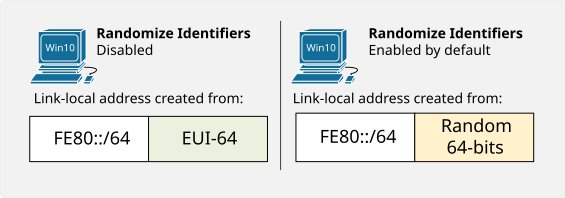
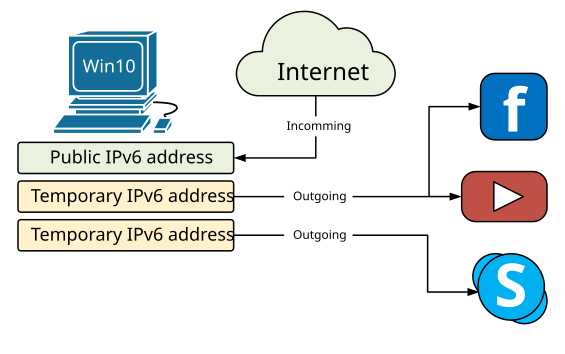
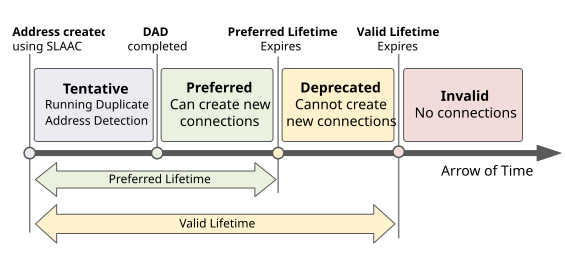
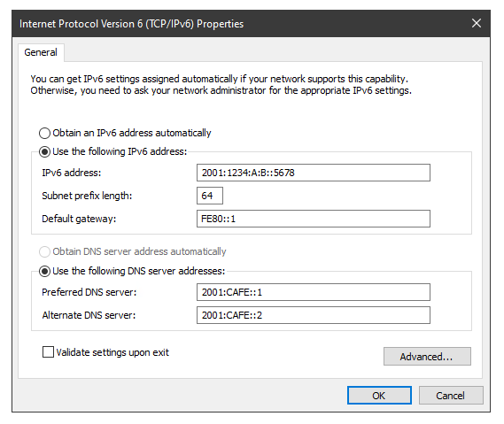
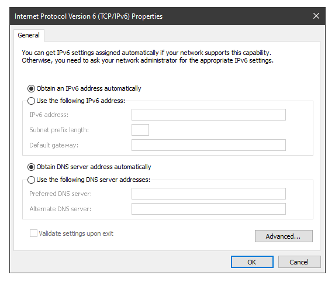
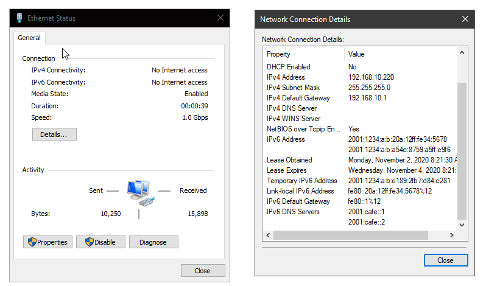

[IPv6 on Windows](https://www.networkacademy.io/ccna/ipv6/ipv6-on-windows)
==========

# IPv6 on Windows

## Windows and EUI-64

Prior to Windows Vista and Windows Server 2008, Windows hosts used only MAC addresses to create Interface Identifiers (EUI-64). Globally unique addresses and Link-local ones were created using the segment's prefix plus the EUI-64 identifier which is generated from the physical address of the host. With the rise of network security, this was found to be **a security vulnerability** because an IPv6 address can be easily tied to a MAC address, which uniquely identifies physical equipment.

For example, imagine a user with a laptop connecting to an IPv6 network with global prefix X:X:X:X::/64. Via SLAAC, the user's laptop will generate a globally unique address X:X:X:X:EUI-64. Let's say the user goes to another place and connects to another IPv6 network with a global prefix Y:Y:Y:Y::/64. Well, the user's laptop will generate a global unicast address Y:Y:Y:Y:EUI-64, if the user connects to a network Z:Z:Z:Z::/64 it will get IPv6 address Z:Z:Z:Z::EUI-64 and so on. You can clearly see that this creates an opportunity to track the user, because wherever he goes and to whichever network he connects, the second half of the globally unique IPv6 address his laptop generates is always the same. The user can not connect anonymously to any network if someone knows the EUI-64 interface identifier of his laptop. This can be easily exploited in many different ways, for example, websites and apps associating different IPv6 addresses to a particular device or user.

Companies realized that and introduced two concepts that help to improve user's privacy - **Random Interface Identifiers** and **Temporary IPv6 addresses**. Let's start by looking at what the first term is.

#### Randomize Identifiers

Randomize Identifiers feature has been introduced as a part of the privacy extension for SLAAC (Stateless Address Auto-configuration). After Windows Vista, this feature is enabled by default, so wherever a Windows host generates an IPv6 address with SLAAC, it always uses a Random Interface ID.



Figure 1. How Windows 10 creates a link-local address

Let's look at part of the output of ipconfig /all command that displays the Physical address and the Link-local address of a Windows 10 host. You can see that the MAC address is 00-0A-12-34-56-78 and therefore if PC1 uses EUI-64 to generate a link-local address, it should have been fe80::20a:12ff:fe34:5678. 

```ini
PS C:\Users\Administrator> ipconfig /all

Ethernet adapter Eth0:
   Description . . . . . . . . . . . : Intel(R) PRO/1000 MT Network Connection
   Physical Address. . . . . . . . . : 00-0A-12-34-56-78
   Link-local IPv6 Address . . . . . : fe80::ec94:3519:1f19:711f%8(Preferred)
```

Well, obviously the current link-local address is not created using the MAC address but rather a Random Interface Identifier. This is because the Randomize Identifiers feature is enabled by default. We can check this using the PowerShell command **get-netipv6protocol** or using **netsh interface ipv6 show global** in the Windows Command Prompt

```ini
PS C:\Users\Administrator> get-netipv6protocol

DefaultHopLimit               : 128
NeighborCacheLimit(Entries)   : 256
RouteCacheLimit(Entries)      : 4096
ReassemblyLimit(Bytes)        : 67105632
IcmpRedirects                 : Enabled
SourceRoutingBehavior         : DontForward
DhcpMediaSense                : Enabled
MediaSenseEventLog            : Disabled
MldLevel                      : All
MldVersion                    : Version2
MulticastForwarding           : Disabled
GroupForwardedFragments       : Disabled
RandomizeIdentifiers          : Enabled
AddressMaskReply              : Disabled
UseTemporaryAddresses         : Enabled
MaxTemporaryDadAttempts       : 3
MaxTemporaryValidLifetime     : 7.00:00:00
MaxTemporaryPreferredLifetime : 1.00:00:00
TemporaryRegenerateTime       : 00:00:05
MaxTemporaryDesyncTime        : 00:10:00
DeadGatewayDetection          : Enabled
```

We can use the following command in PowerShell to change the default behavior of a Windows host and disable the Randomize Identifiers. Disabling this feature forces Windows to use EUI-64 for Interface ID as you can see in the following example.

```ini
PS C:\Users\Administrator> set-netipv6protocol -RandomizeIdentifiers Disabled
PS C:\Users\Administrator>
PS C:\Users\Administrator> ipconfig /all

   Description . . . . . . . . . . . : Intel(R) PRO/1000 MT Network Connection
   Physical Address. . . . . . . . . : 00-0A-12-34-56-78
   Link-local IPv6 Address . . . . . : fe80::20a:12ff:fe34:5678%8(Preferred)
```

Note that now the link-local address is generated from the MAC address and is exactly the value we expected.

## Temporary IPv6 addresses

Another important concept, part of the Privacy Extension for SLAAC, is the use of Temporary IPv6 addresses. The idea behind temporary addresses is to have a public randomized IPv6 address that has a relatively short lifetime and can be used for anonymous outgoing connections. At every reboot, or IPv6 stack on/off, or when the Preferred-Lifetime expires this temporary address is re-generated using a Random Interface Identifier. Therefore, different outgoing connections can be initiated from different Temporary IPv6 addresses which minimize the risk of someone tracking the user by associating the global IPv6 address to physical equipment/user.



Figure 2. Windows 10 usage of Temporary IPv6 addresses

Of course, the incoming connections are made to the real Public IPv6 address that doesn't change. However, in a typical Internet user scenario, all connections are initiated by the user's machine towards an Internet service (client-server communication).

```ini
PS C:\Users\Administrator> get-netipv6protocol

DefaultHopLimit               : 128
NeighborCacheLimit(Entries)   : 256
RouteCacheLimit(Entries)      : 4096
ReassemblyLimit(Bytes)        : 67105632
IcmpRedirects                 : Enabled
SourceRoutingBehavior         : DontForward
DhcpMediaSense                : Enabled
MediaSenseEventLog            : Disabled
MldLevel                      : All
MldVersion                    : Version2
MulticastForwarding           : Disabled
GroupForwardedFragments       : Disabled
RandomizeIdentifiers          : Enabled
AddressMaskReply              : Disabled
UseTemporaryAddresses         : Enabled
MaxTemporaryDadAttempts       : 3
MaxTemporaryValidLifetime     : 7.00:00:00
MaxTemporaryPreferredLifetime : 1.00:00:00
TemporaryRegenerateTime       : 00:00:05
MaxTemporaryDesyncTime        : 00:10:00
DeadGatewayDetection          : Enabled
```

You can verify that this feature is enabled by default using either PowerShell's command get-netipv6protocol or Command Prompt netsh interface ipv6 show privacy command.

```ini
C:\Users\Administrator>netsh interface ipv6 show privacy
Querying active state...

Temporary Address Parameters
---------------------------------------------
Use Temporary Addresses             : enabled
Duplicate Address Detection Attempts: 3
Maximum Valid Lifetime              : 7d
Maximum Preferred Lifetime          : 1d
Regenerate Time                     : 5s
Maximum Random Time                 : 10m
Random Time                         : 6s
```

In some cases, you will see **multiple Temporary IPv6 Addresses** at a time (could be hundreds). This happens when the Maximum Preferred Lifetime of an address expires but there is a connection still opened using this particular address. In this case, another Temporary IPv6 address is created but the old one is not deleted until all opened connections are closed. More information on what the different lifetimes means can be seen in figure 3.



Figure 3. An IPv6 address States and Lifetimes

## Configuring Global IPv6 Address on Windows 10

There are three methods to configure a Windows 10 hosts with an IPv6 address:

- **Method 1**: Configure the host manually.
- **Method 2**: Using SLAAC and a Stateless DHCPv6 server.
- **Method 3**: Using a Stateful DHCPv6 server.

#### Manual Address Assignment

The manual configuration is pretty straightforward. We go to Network Adapters Setting and under Internet Protocol Version 6 Properties we configure everything as shown in Figure 4. This approach is applicable for SOHO networks but it is not a scalable solution for large network environments.



Figure 4. Configuring IPv6 addressing on Windows 10

#### Dynamic Addressing

To enable Windows to automatically decide how to configure its IPv6 settings, we just leave it on default settings "*Obtain an IPv6 address automatically*". When using this approach, the type of dynamic addressing is decided by the Router Advertisements sent by the Default Router on the segment. Depending on the Autoconfig Flags, the host knows whether to use SLAAC plus Stateless DHCPv6 or to use Stateful DHCPv6.



Figure 5. Configuring Windows 10 to use auto-addressing

Keep in mind that, it is up to the network administrators and the company's policy to decide which addressing method t use. From a Windows perspective, it can generate an IPv6 address using SLAAC and obtain another address using DHCPv6 at the same time. This means that the host will have at least two global unicast addresses. Such an example is shown in figure 6. 



Figure 6. Windows 10 Network Connection Details

The first GUA address is generated via SLAAC and the second one has been obtained from a DHCPv6 server.
