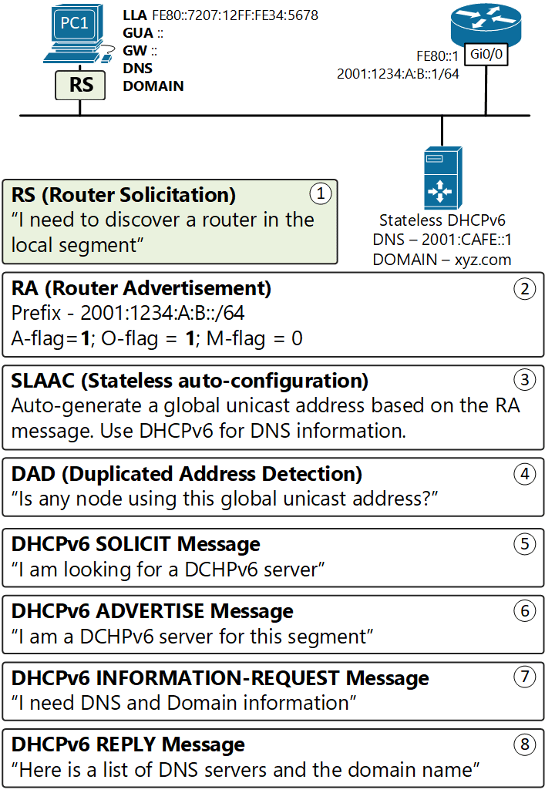
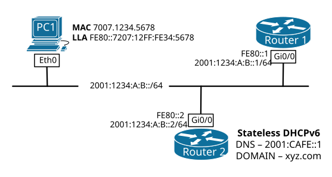
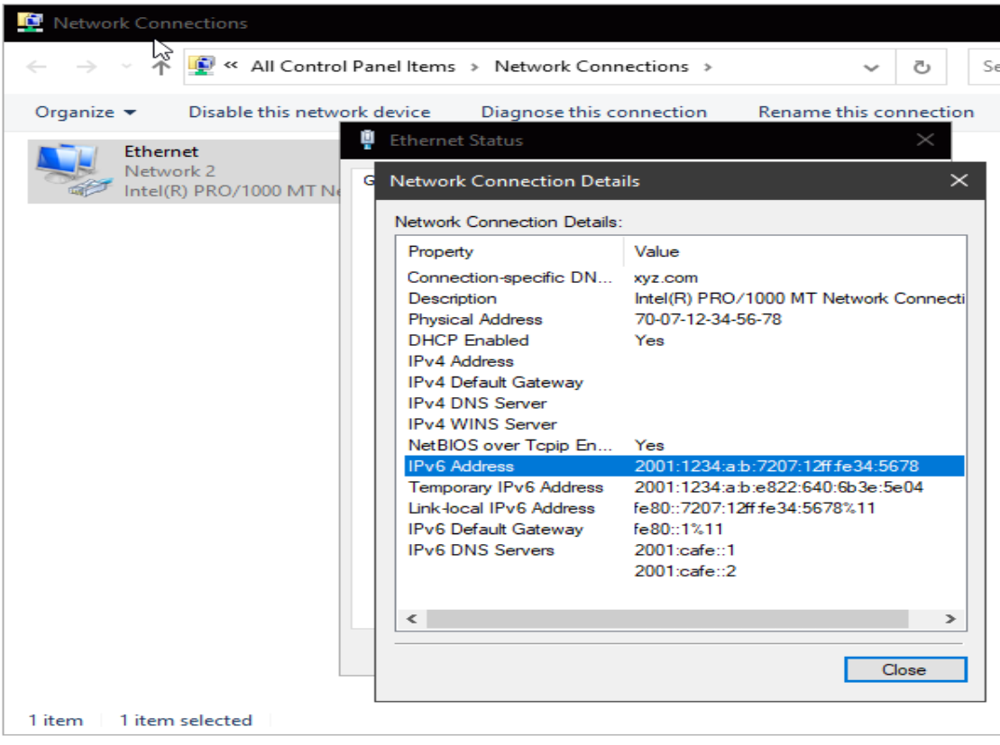

[Stateless DHCPv6](https://www.networkacademy.io/ccna/ipv6/stateless-dhcpv6)
==========

# Stateless DHCPv6

**Stateless address auto-configuration (SLAAC)** is a feature that enables IPv6 nodes to auto-generate globally unique addresses (GUA) using Route Advertisements messages sent by a router attached to the local segment. However, SLAAC does not provide DNS and Domain name information. To resolve this problem, the router that is sending the RA messages sets a special flag called O-flag to 1 (O comes from *other* information). This tells the nodes on the segment that they can contact a **stateless DCHPv6 server** and get the DNS and Domain name information.

**Stateless DHCPv6** is used by nodes to obtain **other information**, such as a DNS server list and a domain name, that does not require the maintenance of any dynamic state for individual nodes. A node that uses stateless DHCPv6 must have obtained its IPv6 addresses through some other mechanism usually SLAAC. It is defined in [RFC 3736](https://tools.ietf.org/html/rfc3736) "Stateless Dynamic Host Configuration Protocol (DHCP) Service for IPv6".

## SLAAC with Stateless DCHPv6

Typical dynamic addressing design in IPv6 is to use SLAAC for generating a global unicast address (GUA) and Stateless DHCPv6 for providing DNS and Domain name. Let's look at the example shown in figure 1 and follow the steps PC1 would take to obtain all info it needs.



Figure 1. Stateless DHCPv6 Operations

- **Step 1** - When PC1 is connected to the segment, shown in the example, and is configured to use SLAAC, it immediately sends a Router Solicitation message on the network. The message is encapsulated in ICMPv6 type 133 and is destined to the all-routers multicast group FF02::2. The purpose of this message is to discover all neighboring routers.
- **Step 2** - Upon receiving the Router Solicitation from PC1, Router 1 generates a Router Advertisement response. The message is destined to the all-nodes multicast group FF02::1 and is therefore received by every device in the local segment. In the ICMPv6 header, the type value is set to 134 and the following fields and values are set:
  - The **prefix** value is set to 2001:1234:A:B::/64
  - The **MTU** value is set to 1500
  - The **A-flag** (Address Autoconfiguration) is set to 1. This tells all neighboring nodes that they can use SLAAC for auto-addressing;
  - The **O-flag** (Other Configuration) is set to 1. This tells all neighboring nodes that they can use **Stateless DHCPv6 server** to obtain other information such as DNS and Domain name;
  - The **M-flag** (Managed Address Configuration) is set to 0. This indicates that **Stateful DHCPv6** is not needed.
- **Step 3** - Upon getting this information from the RA message, PC1 performs the following:
  - It uses the prefix 2001:1234:A:B::/64 plus the EUI-64 Interface ID to create one or more globally unique addresses.
  - The Interface ID could be created from the MAC address (EUI-64) or using a random 64-bit value. By default, Windows hosts use random identifiers. In our example, PC1 generates its address from the prefix + EUI-64 identifier.
  - PC1 sets its default gateway to the source of the RA message - the link-local address of Router 1.
- **Step 4** - PC1 performs DAD (Duplicate Address Detection) to ensure that the GUA address created using SLAAC is actually unique and is not used by other hosts in the segment. DAD is done by sending a Neighbor Solicitation message, looking for the MAC address of its own IPv6 address. If no host reply back, it means that the address is unique.

At this point, PC1 has a globally unique IPv6 address and a Default Gateway. This means that it has everything it needs to be able to communicate with nodes outside its local network including on the Internet. However, PC1 does not have a DNS server and Domain name, therefore services that require URL-to-IP resolution won't work. Because the O-flag in the Router Advertisement message was set to 1, PC1 knows that there is a stateless DHCPv6 service and it can obtain DNS and domain name from there.

- **Step 5** - The RA's O-flag set 1 suggests that additional information is available from a Stateless DHCPv6 server. PC1 sends out a DHCPv6 SOLICIT message destined to the all-DHCPv6 multicast address FF02::1:2.
- **Step 6** - Upon receiving this DHCPv6 SOLICIT message, the server replies with a DHCPv6 ADVERTISE indicating that the service is available.
- **Step 7** - PC1 then sends out a DHCPv6 INFORMATION-REQUEST message asking for ***other*** information.
- **Step 8** - The DHCPv6 server responds with a DHCPv6 REPLY message that contains the DNS server list and a domain name.

## Implementing SLAAC with Stateless DHCPv6

Implementing SLAAC with stateless DHCPv6 using Cisco routers requires the following steps:

- Setting up a router to send Router Advertisements
- Setting up the O-flag in the RA messages
- Configuring a stateless DHCPv6 server

For this example, we are going to use the topology shown in figure 2. Router 1 is going to send RAs on the segment and Router 2 will act as a stateless DHCP server and provide DNS information. At the end of the example, if everything is successfully configured, PC1 should have a global IPv6 address, a default gateway, DNS server, and domain name configured.



Figure 2. SLAAC with Stateless DHCPv6 Example Topology

#### Configuring a Cisco router's SLAAC settings

The first thing we need to configure is to enable the IPv6 unicast routing. If not enabled, the router won't send Router Advertisement messages.

```ini
Router1(config)#ipv6 unicast-routing 
```

After the IPv6 routing process is enabled, we need to configure a link-local and a global unicast address on the interface that is attached to the link. Using our example topology, that would be interface GigabitEthernet0/0. 

```ini
Router1(config)#interface GigabitEthernet 0/0
Router1(config-if)#ipv6 enable 
Router1(config-if)#ipv6 address FE80::1 link-local 
Router1(config-if)#ipv6 address 2001:1234:A:B::1/64
```

Once the interface is configured with LLA and GUA addresses and enabled, the router starts advertising its presence on the link. The A flag, which tells the hosts that they can use SLAAC, is set to 1 by default and does not need to be configured. However, by default, the *Other Configuration* flag is set to 0. To tell the hosts to use Stateless DHCPv6 for other information, we need to set the O-flag to 1. This is done using the ***ipv6 nd other-config-flag*** command.

```ini
Router1(config-if)#ipv6 nd ?
  advertisement-interval  Send an advertisement interval option in RA's
  autoconfig              Automatic Configuration
  cache                   Cache entry
  dad                     Duplicate Address Detection
  destination-guard       Query destination-guard switch table
  managed-config-flag     Hosts should use DHCP for address config
  na                      Neighbor Advertisement control
  ns-interval             Set advertised NS retransmission interval
  nud                     Neighbor Unreachability Detection
  other-config-flag       Hosts should use DHCP for non-address config
  prefix                  Configure IPv6 Routing Prefix Advertisement
  ra                      Router Advertisement control
  reachable-time          Set advertised reachability time
  router-preference       Set default router preference value
  secured                 Configure SEND

Router1(config-if)#ipv6 nd other-config-flag
Router1(config-if)#end
Router1#
```

Let's look at the output of ***show ipv6 interface GigabitEthernet 0/0*** command to verify the change in the RA message.

```ini
Router1#show ipv6 interface GigabitEthernet 0/0 
GigabitEthernet0/0 is up, line protocol is up
  IPv6 is enabled, link-local address is FE80::1 
  No Virtual link-local address(es):
  Global unicast address(es):
    2001:1234:A:B::1, subnet is 2001:1234:A:B::/64 
  Joined group address(es):
    FF02::1
    FF02::2
    FF02::1:FF00:1
  MTU is 1500 bytes
  ICMP error messages limited to one every 100 milliseconds
  ICMP redirects are enabled
  ICMP unreachables are sent
  ND DAD is enabled, number of DAD attempts: 1
  ND reachable time is 30000 milliseconds (using 30000)
  ND advertised reachable time is 0 (unspecified)
  ND advertised retransmit interval is 0 (unspecified)
  ND router advertisements are sent every 200 seconds
  ND router advertisements live for 1800 seconds
  ND advertised default router preference is Medium
  Hosts use stateless autoconfig for addresses.
  Hosts use DHCP to obtain other configuration.
```

The last two lines of the output of **show ipv6 interface gig0/0** indicate how hosts will obtain their addressing information:

- **"Hosts use stateless autoconfig for addresses"** indicates that the A-flag is set to 1 in the Router Advertisement messages. This tells the neighboring devices that they can use SLAAC for auto-addressing.
- **"Hosts use DHCP to obtain other configuration"** indicates that the O-flag is set to 1 in the Router Advertisement messages. This tells the neighboring devices that they obtain a DNS server list and a domain name from a Stateless DHCPv6 server.

If we look at a Wireshark capture of the Router Advertisement message, we can see that the O-flag is actually set to 1.

```ini
Ethernet II, Src: 50:00:00:01:00:00, Dst: 33:33:00:00:00:01
Internet Protocol Version 6, Src: fe80::1, Dst: ff02::1
Internet Control Message Protocol v6
    Type: Router Advertisement (134)
    Code: 0
    Checksum: 0x9b18 (correct)
    (Checksum Status: Good)
    Cur hop limit: 64
    Flags: 0x40, Other configuration, Prf (Default Router Preference): Medium
        0... .... = Managed address configuration: Not set
        .1.. .... = Other configuration: Set
        ..0. .... = Home Agent: Not set
        ...0 0... = Prf (Default Router Preference): Medium (0)
        .... .0.. = Proxy: Not set
        .... ..0. = Reserved: 0
    Router lifetime (s): 1800
    Reachable time (ms): 0
    Retrans timer (ms): 0
    ICMPv6 Option (Source link-layer address : 50:00:00:01:00:00)
    ICMPv6 Option (MTU : 1500)
    ICMPv6 Option (Prefix information : 2001:1234:a:b::/64)
```

At this point, PC1 has a global unicast address auto-configured using SLAAC.

#### Configuring a Cisco router as a Stateless DHCPv6 server

Configuring a Cisco router to act as a stateless DHCP server is very straightforward. There are two basic steps:

- **Step 1** - Create a DHCPv6 pool name and configuration parameters
- **Step 2** - Enable the DHCPv6 pool on an interface.

Let's configure step 1. The first command **ipv6 dhcp pool *[pool name]*** creates a DHCPv6 pool and enters into the pool configuration mode. There we define the DNS servers and the domain name and that's it.

```ini
Router2(config)#ipv6 dhcp pool DNS-SERVER-LIST
Router2(config-dhcpv6)#dns-server 2001:CAFE::1
Router2(config-dhcpv6)#dns-server 2001:CAFE::2
Router2(config-dhcpv6)#domain-name xyz.com
Router2(config-dhcpv6)#end
Router2#
```

In the second step, we enable the DHCPv6 pool on the router's interface attached to the link. With the ***ipv6 nd ra suppress all*** command we stop Router 2 from sending Router Advertisements because Router 1 is responsible for the SLAAC configuration and Router 2 is only acting as a stateless DHCP server. 

```ini
Router2(config)#interface GigabitEthernet 0/0
Router2(config-if)#ipv6 dhcp server DNS-SERVER-LIST
Router2(config-if)#ipv6 nd ra suppress all
Router2(config-if)#end
```

After the above configuration is set, we can see that Router 2 responds to the DHCPv6 SOLICIT message from PC1. Below you can see Wireshark captures of all messages. Note that the DCHPv6 Solicit message is sent to the ***all-dhcpv6 servers*** multicast group FF02::1:2. 

```ini
Frame 179: 151 bytes on wire (1208 bits), 151 bytes captured (1208 bits) on interface 0
Ethernet II, Src: 70:07:12:34:56:78 (70:07:12:34:56:78), Dst: IPv6mcast_01:00:02 (33:33:00:01:00:02)
Internet Protocol Version 6, Src: fe80::7207:12ff:fe34:5678, Dst: ff02::1:2
User Datagram Protocol, Src Port: 546, Dst Port: 547
DHCPv6
    Message type: Solicit (1)
    Transaction ID: 0x4a9f6f
    Elapsed time
    Client Identifier
    Identity Association for Non-temporary Address
    Fully Qualified Domain Name
    Vendor Class
    Option Request
```

Upon receiving the solicit message from PC1, Router 2 responds with DHCPv6 ADVERTISE. Note that this message is sent to the link-local address of PC1 and is unicast.

```ini
Frame 180: 117 bytes on wire (936 bits), 117 bytes captured (936 bits) on interface 0
Ethernet II, Src: 50:00:00:05:00:00 (50:00:00:05:00:00), Dst: 70:07:12:34:56:78 (70:07:12:34:56:78)
Internet Protocol Version 6, Src: fe80::2, Dst: fe80::7207:12ff:fe34:5678
User Datagram Protocol, Src Port: 547, Dst Port: 546
DHCPv6
    Message type: Advertise (2)
    Transaction ID: 0x4a9f6f
    Server Identifier
    Client Identifier
    Status code
        Option: Status code (13)
        Length: 15
        Value: 00024e4f41444452532d415641494c
        Status Code: NoAddrAvail (2)
        Status Message: NOADDRS-AVAIL
```

After PC1 has discovered that there is a Stateless DHCPv6 server attached to the local segment, it sends the actual request for other information as a DCHPv6 INFORMATION-REQUEST. Note that this message is again sent to the ***all-dhcpv6 servers*** multicast group.

```ini
Frame 196: 120 bytes on wire (960 bits), 120 bytes captured (960 bits) on interface 0
Ethernet II, Src: 70:07:12:34:56:78 (70:07:12:34:56:78), Dst: IPv6mcast_01:00:02 (33:33:00:01:00:02)
Internet Protocol Version 6, Src: fe80::7207:12ff:fe34:5678, Dst: ff02::1:2
User Datagram Protocol, Src Port: 546, Dst Port: 547
DHCPv6
    Message type: Information-request (11)
    Transaction ID: 0xfa46f2
    Elapsed time
    Client Identifier
    Vendor Class
    Option Request
        Option: Option Request (6)
        Length: 8
        Value: 0011001700180020
        Requested Option code: Vendor-specific Information (17)
        Requested Option code: DNS recursive name server (23)
        Requested Option code: Domain Search List (24)
        Requested Option code: Lifetime (32)
```

Upon receiving the DCHPv6 INFORMATION-REQUEST, Router 2 responds with the requested information. Note that the response is unicast as is sent to PC1's link-local address.

```ini
Frame 197: 147 bytes on wire (1176 bits), 147 bytes captured (1176 bits) on interface 0
Ethernet II, Src: 50:00:00:05:00:00 (50:00:00:05:00:00), Dst: 70:07:12:34:56:78 (70:07:12:34:56:78)
Internet Protocol Version 6, Src: fe80::2, Dst: fe80::7207:12ff:fe34:5678
User Datagram Protocol, Src Port: 547, Dst Port: 546
DHCPv6
    Message type: Reply (7)
    Transaction ID: 0xfa46f2
    Server Identifier
    Client Identifier
    DNS recursive name server
        Option: DNS recursive name server (23)
        Length: 32
        Value: 2001cafe0000000000000000000000012001cafe00000000...
         1 DNS server address: 2001:cafe::1
         2 DNS server address: 2001:cafe::2
    Domain Search List
        Option: Domain Search List (24)
        Length: 9
        Value: 0378797a03636f6d00
        DNS Domain Search List
            Domain Search List FQDN: xyz.com
```

Upon receipt of the DCHPv6 REPLY, PC1 sets the DNS settings to the provided addresses. We can verify that be looking at the Network Connection Details of PC1.



Figure 3. PC1 IPv6 network status

## DHCPv6 Rapid-Commit

By default, a client and a DHCPv6 server exchange four messages (SOLICIT, ADVERTISE, REQUEST, and REPLY) before the client gets the requested information. The **rapid-commit** option reduces this communication to two messages - SOLICIT and REPLY.

The client sends the initial DHCPv6 SOLICIT message with the **rapid-commit** option set. This tells the server that it wants to speed up the exchange. If the DHCPv6 server is enabled for rapid-commit, it response directly with a DHCPv6 REPLY message, skipping ADVERTISE and INFORMATION-REQUEST. If the DHCP server is not enabled for rapid-commit, it responds with an ADVERTISE message and the process continues with the normal four messages exchange.

#### Configuring the Rapid-commit option on a Cisco router.

The configuration of the rapid-commit option is pretty basic and straightforward. You include the rapid-commit keyword in the ***ipv6 dhcp server [poolname] rapid-commit*** command.

```ini
Router2(config)#interface GigabitEthernet0/0
Router2(config-if)#ipv6 dhcp server DNS-SERVER-LIST ?
  allow-hint    Allow hint from client
  preference    Preference
  rapid-commit  Enable Rapid-Commit
  <cr>
Router2(config-if)#ipv6 dhcp server DNS-SERVER-LIST rapid-commit 
Router2(config-if)#end
```

## Summary

- IPv6 clients use SLAAC to generate their global unicast addresses and obtain their default gateway and other link parameters such as MTU. However, SLAAC does not provide other important information such as DNS and Domain name.
- Routers set the **O-flag** to 1 in the Router Advertisement messages to inform hosts that other configuration info is available from a **Stateless DHCPv6 server**.
- When hosts receive RA messages with the **O-flag** set to 1, they send out a **DHCPv6 SOLICIT** message to the ***all-dhcpv6 servers*** multicast group FF02::1:2.
- If a **Stateless DHCPv6 server** is available on the segment it responds with a **DHCPv6 ADVERTISEMENT** message. The client then requests other information such as DNS and domain name with a **DHCPv6 INFORMATION-REQUEST** and the server provides the requested information with a **DHCPv6 REPLY** message.
- There is a Rapid-commit option that shortens this exchange from four messages to a rapid two **SOLICIT and REPLY**.
