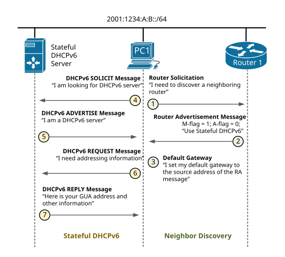
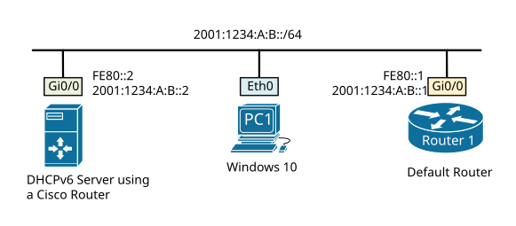
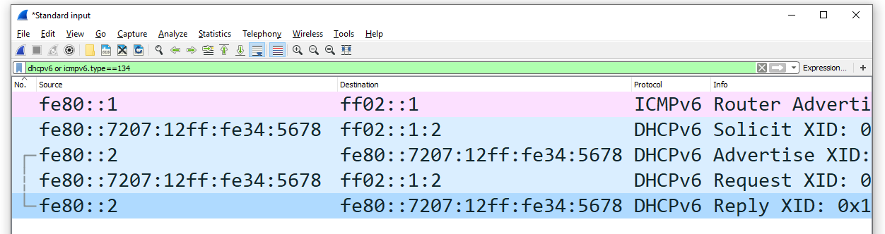

[Stateful DHCPv6](https://www.networkacademy.io/ccna/ipv6/stateful-dhcpv6)
==========

# Stateful DHCPv6

There are three methods to configure a host with a global unicast address, default gateway, DNS server, and a domain name:

- **Method 1**: Configure the host manually. This approach does not scale and is prone to human error;
- **Method 2**: Using SLAAC and a Stateless DHCPv6 server. We have looked at this approach in our [previous lesson](https://www.networkacademy.io/ccna/ipv6/stateless-dhcpv6);
- **Method 3**: Using a Stateful DHCPv6 server.

Stateful DHCPv6 is similar in functionalities to DHCP protocol in IPv4, but there are some major differences in the way the whole process works. In this lesson, we are going to examine it step by step.

## Stateful vs Stateless DHCPv6

A **stateless DHCPv6 server** does not provide IPv6 addresses at all. It only provides "*other information*" such as a DNS server list and a domain name. It works in conjunction with another feature called SLAAC that tells hosts how to generate global unicast addresses. In this context stateless means that **no server keeps track** of what addresses have been assigned by which hosts and what addresses are still available for an assignment.

A **stateful DHCPv6 server** provides IPv6 addresses and "*other information*" to hosts. It also keeps track of the state of each assignment. It tracks the address pool availability and resolves duplicated address conflicts. It also logs every assignment and keeps track of the expiration times. However, there is a big difference between DHCPv6 and DHCPv4. In IPv4 DHCP server typically provides default gateway addresses to hosts. In IPv6, only routers sending Router Advertisement messages can provide a default gateway address dynamically.

## Stateful DHCPv6 Messages

Unlike IPv4, in IPv6 routers actively participate in the process of dynamic hosts addressing. In both Stateless and Stateful implementations, a router on the link advertises its presence with Router Advertisements messages. These RA messages play a very important role for a few reasons:

- **Hosts set their Default Gateway based on the RA messages** - If there is only one router attached to the link, the source address of its RA messages is configured by hosts as a default gateway address. If there are multiple routers attached to the link, there is a value in the RA message called ***pref (router preference)*** that can be set to Low, Medium, or High. Hosts set their default gateway to the source address of the RA messages with the highest preference.
- **Router Advertisement messages inform hosts what to do** - There are three flags in the RA messages that play important role in defining how dynamic addressing works on this segment:
  - **A-flag** - if it is set to 1, this informs hosts that they can auto-generate GUA address using SLAAC. If it is set to 0 means that auto-configuration is not allowed for this segment.
  - **O-flag** - if it is set to 1, this informs hosts that they can obtain a DNS server list and a domain name from a Stateless DHCPv6 server, but not addressing information. Typically it works in conjunction with SLAAC for auto-addressing and both the A-flag and the O-flag are set to 1.
  - **M-flag** - if it is set to 1, this informs hosts that they can obtain a global address as well as DNS and a domain name from a Stateful DHCPv6 server. Typically this means that auto-addressing using SLAAC is not allowed on this segment and both the A-flag and the O-flag are set to 0.



Figure 1. Stateful DHCPv6 Messages

Figure 1 illustrates the steps PC1 takes to configure a global unicast address, a default gateway, and a DNS using a Stateful DHCPv6:

- **Step 1** - PC1 sends out a Router Solicitation message destined to the *all-routers* multicast address FF02::2.
- **Step 2** - Upon receiving the RS from PC1, Router 1 generates a Router Advertisement message with the M-flag set to 1 and the A-flag set to 0. This informs PC1 that SLAAC is not allowed on this segment and it must use a Stateful DHCPv6 for addressing and other configuration. Note that RA messages are sent to the *all-nodes* multicast group FF02::1 and are received by all neighbors on a local segment.
- **Step 3** - Upon receiving the Route Advertisement, PC1 sets the source IPv6 address of Router 1 (FE80::1) as its default gateway. Because the A-flag is set to 0, PC1 does not perform Stateless Address Auto-configuration (SLAAC).
- **Step 4** - Because the M-flag in the RA message is set to 1, PC1 sends out a DHCPv6 SOLICIT message to the *all-dhcpv6-servers* multicast group FF02::1:2, searching for DHCP server.
- **Step 5** - Upon hearing the solicit message, the server responds with a DHCPv6 ADVERTISE message. It is destined directly as unicast to the link-local address of PC1.
- **Step 6** - PC1 then knows that a DHCPv6 service is available and sends out a REQUEST packet asking for addressing information.
- **Step 7** - Upon receiving the REQUEST, the server responds with a DHCPv6 REPLY that contains the global unicast address and all other information that is available for assignment.
- **Step 8** - In the end, PC1 performs Duplicate Address Detection (DAD) on the received GUA address to ensure that it is unique.

Note that the DHCPv6 service works in conjunction with the Neighbor Discovery protocol. Although the global address including all other information is provided by the server, the default gateway is provided by Router 1.

## Implementing Stateful DHCPv6 with a Cisco router

For this example, we are going to use a basic topology shown in figure 2. As a Stateful DHCPv6 server, we will use a regular Cisco router named Router2.



Figure 2. Stateless DCHPv6 configuration topology

There are three mains configuration steps to enable Stateful DHCPv6 service:

- **Set the A-flag in the RA messages to 0** - From a technical standpoint, this is not a mandatory step. But if the A-flag is left to the default value of 1, hosts will obtain a global unicast address from DHCPv6 and will also generate one using SLAAC. Therefore, hosts will have at least two global addresses configured. Typically, companies have security policies in place and want to track the IP addresses on the network. In this case, hosts should not be able to generate addresses on their own. Thus, it is a best practice to disable the SLAAC process by setting the A-flag to 0.
- **Set the M-flag in the RA messages to 1** - To inform hosts in the local network that there is a DHCPv6 server that provides both addressing and other information, routers must advertise this feature using the M-flag in the RA messages.
- **Set up a Stateful DHCPv6 server** - A device in the network must act as a DHCP server. It could be a Cisco router or other appliance.

#### Setting the A-flag to 0 and the M-flag to 1

Let's configure Router 1 from scratch. Note that IPv6 unicast routing must be enabled otherwise the router won't begin sending RA messages.

```ini
Router1#configure terminal 
Enter configuration commands, one per line.  End with CNTL/Z.

Router1(config)#ipv6 unicast-routing 
Router1(config)#interface GigabitEthernet 0/0
Router1(config-if)#ipv6 enable 
Router1(config-if)#ipv6 address FE80::1 link-local 
Router1(config-if)#ipv6 address 2001:1234:A:B::1/64
```

At this point, all flags in the Router Advertisement messages are set to their default values. By default on Cisco routers, the M-flag is set to 0, the O-flag is set to 0 and the A-flag is set to 1. To enable **Stateful DHCPv6**, we must set the M-flag to 1 using the following command under the interface configuration mode.

```ini
Router(config-if)# ipv6 nd managed-config-flag
```

And disable **SLAAC** by setting the A-flag to 0 using the following command:

```ini
Router(config-if)# ipv6 nd prefix 2001:1234:A:B::/64 no-autoconfig
```

If we now look at a Wireshark capture of the RA messages being sent by Router1, we can verify that the M-flag is set to 1 and the A-flag is set to 0.

```ini
Ethernet II, Src: 50:00:00:01:00:00, Dst: 33:33:00:00:00:01
Internet Protocol Version 6, Src: fe80::1, Dst: ff02::1
Internet Control Message Protocol v6
    Type: Router Advertisement (134)
    Code: 0
    Checksum: 0x9b10 (correct)
    (Checksum Status: Good)
    Cur hop limit: 64
    Flags: 0x88, Managed address configuration, Prf (Default Router Preference): High
        1... .... = Managed address configuration: Set
        .0.. .... = Other configuration: Not set
        ..0. .... = Home Agent: Not set
        ...0 1... = Prf (Default Router Preference): High (1)
        .... .0.. = Proxy: Not set
        .... ..0. = Reserved: 0
    Router lifetime (s): 1800
    Reachable time (ms): 0
    Retrans timer (ms): 0
    ICMPv6 Option (Source link-layer address : 50:00:00:01:00:00)
    ICMPv6 Option (MTU : 1500)
    ICMPv6 Option (Prefix information : 2001:1234:a:b::/64)
        Type: Prefix information (3)
        Length: 4 (32 bytes)
        Prefix Length: 64
        Flag: 0x80, On-link flag(L)
            1... .... = On-link flag(L): Set
            .0.. .... = Autonomous address-configuration flag(A): Not set
            ..0. .... = Router address flag(R): Not set
            ...0 0000 = Reserved: 0
        Valid Lifetime: 2592000
        Preferred Lifetime: 604800
        Reserved
        Prefix: 2001:1234:a:b::
```

#### Configuring a Cisco router as a Stateful DHCPv6 server

Now it is time to configure Router2 as a DHCPv6 server. The configuration is pretty basic and straightforward. We must create a new DHCP pool using the command ipv6 dhcp pool [*pool-name*]. This will lead us into the pool configuration mode, where we specify all parameters such as prefix, DNS servers, and a domain name. 

```ini
Router2#configure terminal 
Enter configuration commands, one per line.  End with CNTL/Z.

Router2(config)#ipv6 dhcp pool STATEFUL-DHCPV6
Router2(config-dhcpv6)#address prefix 2001:1234:A:B::/64
Router2(config-dhcpv6)#dns-server 2001:CAFE::1
Router2(config-dhcpv6)#domain-name example.com
Router2(config-dhcpv6)#exit
Router2(config)#
```

After the pool has been created, we must enable it on the interface attached to the link.

```ini
Router2(config)#interface gigabitEthernet 0/0
Router2(config-if)#ipv6 dhcp server STATEFUL-DHCPV6 
Router2(config-if)#ipv6 nd ra suppress all 
Router2(config-if)#end
Router2#
```

Note that we stop Router2 from sending out any Route Advertisement messages with the command ipv6 nd ra suppress all because it just plays the role of a server and should not be acting as a router in our example.

## Verification Steps

Let's look at some verification steps that we can take to make sure everything worked as expected.

#### Verifying Router 1 as a Default Router

As you have seen in the Step-by-step explanation, the process starts with the Router Solicitation and Router Advertisement messages exchanged by Router1 and PC1. The most useful command we can use is the **show ipv6 interface** that displays all IPv6 and ICMPv6 settings of a particular interface.

```ini
Router1#show ipv6 interface gigabitEthernet 0/0
GigabitEthernet0/0 is up, line protocol is up
  IPv6 is enabled, link-local address is FE80::1 
  No Virtual link-local address(es):
  Global unicast address(es):
    2001:1234:A:B::1, subnet is 2001:1234:A:B::/64 
  Joined group address(es):
    FF02::1
    FF02::2
    FF02::1:FF00:1
  MTU is 1500 bytes
  ICMP error messages limited to one every 100 milliseconds
  ICMP redirects are enabled
  ICMP unreachables are sent
  ND DAD is enabled, number of DAD attempts: 1
  ND reachable time is 30000 milliseconds (using 30000)
  ND advertised reachable time is 0 (unspecified)
  ND advertised retransmit interval is 0 (unspecified)
  ND router advertisements are sent every 200 seconds
  ND router advertisements live for 1800 seconds
  ND advertised default router preference is High
  Hosts use DHCP to obtain routable addresses.
```

Note that the last line says "*Hosts use DHCP to obtain addresses*". This means that the M-flag is set to 1 and Router1 informs hosts on the segment to use Stateful DHCPv6. You should not see a line that says "*Hosts use stateless autoconfig for addresses*" meaning that SLAAC is disabled (A-flag is set to 0)

#### Verifying Router 2 as a Stateful DHCPv6 server

There are several commands that display information about the status of the DHCPv6 service provided by the router. The show ipv6 dhcp pool command outputs the allocation prefix, along with the other information and the number of active clients. In our example, there is only one active client as expected.

```ini
Router2# show ipv6 dhcp pool 
DHCPv6 pool: STATEFUL-DHCPV6
  Address allocation prefix: 2001:1234:A:B::/64 valid 172800 preferred 86400 (1 in use, 0 conflicts)
  DNS server: 2001:CAFE::1
  DNS server: 2001:CAFE::2
  Domain name: example.com
  Active clients: 1
```

Another useful one is the show ipv6 dhcp bindings command that displays the following important values:

- **Client** - This is the link-local address of a client that obtained an IPv6 address from the server. In our example, you can see that this is the LLA of PC1.
- **DUID** - This is the DHCP Unique Identifier used to uniquely identify a client. In our example, the value is the identifier of PC1, shown in the ipconfig /all output below.
- **Address** - This is the global unicast address that the DHCPv6 server provided to this client. You will see later on in the ipconfig /all output that this is the IPv6 address PC1 has had configured.

```ini
Router2# show ipv6 dhcp binding 
Client: FE80::7207:12FF:FE34:5678 
  DUID: 00010001268AB471000C2926497B
  Username : unassigned
  VRF : default
  IA NA: IA ID 0x08500000, T1 43200, T2 69120
    Address: 2001:1234:A:B:59A9:3004:A0EE:2CF8
            preferred lifetime 86400, valid lifetime 172800
            expires at Nov 02 2020 02:52 PM (171838 seconds)
```

#### Verifying that PC1 has obtained GUA address

Using the **ipconfig /all** command on PC1, we can verify that PC1 successfully obtained a global IPv6 address and other information from the DHCP server. You can check based on **the DHCP Unique Identifier (DUID)** that this is the exact address Router 2 has provided.

```ini
C:\Users\Administrator>ipconfig /all

Ethernet adapter Eth0:

   Connection-specific DNS Suffix  . : example.com
   Description . . . . . . . . . . . : Intel(R) PRO/1000 MT Network Connection
   Physical Address. . . . . . . . . : 70-07-12-34-56-78
   Autoconfiguration Enabled . . . . : Yes
   IPv6 Address. . . . . . . . . . . : 2001:1234:a:b:59a9:3004:a0ee:2cf8(Preferred)
   Lease Obtained. . . . . . . . . . : Saturday, October 31, 2020 2:52:57 PM
   Lease Expires . . . . . . . . . . : Monday, November 2, 2020 2:52:57 PM
   Link-local IPv6 Address . . . . . : fe80::7207:12ff:fe34:5678%8(Preferred)
   Default Gateway . . . . . . . . . : fe80::1%8
   DHCPv6 IAID . . . . . . . . . . . : 139460608
   DHCPv6 Client DUID. . . . . . . . : 00-01-00-01-26-8A-B4-71-00-0C-29-26-49-7B.
   DNS Servers . . . . . . . . . . . : 2001:cafe::1
                                       2001:cafe::2
```

As the last verification step, we can look at the messages PC1 and Router2 exchanged.



Figure 3. Stateful DHCPv6 Wireshark Capture
