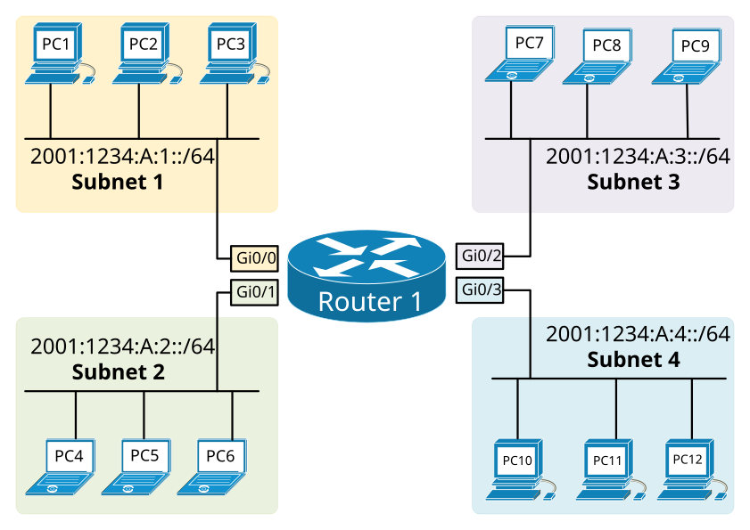
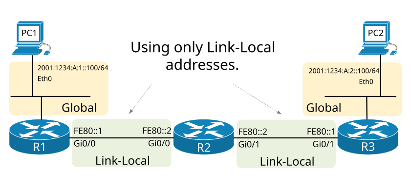

[IPv6 Routing Overview](https://www.networkacademy.io/ccna/ipv6/ipv6-routing-overview)
==========

# IPv6 Routing Overview

## The IPv6 Routing process

By default on Cisco routers, **the IPv6 routing process is disabled**. Therefore, before a router can start forwarding IPv6 packets and participate in any routing protocol, the IPv6 routing must be manually enabled. This process is also responsible for activating the ICMPv6 Router Advertisements and the subscription to the *all-ipv6-routers* multicast group. This is done using the following command in global configuration mode:

```ini
Router(config)# ipv6 unicast-routing
```

When the IPv6 routing process is enabled, the router does the following:

- It starts listening for messages on the ***all-ipv6-routers*** multicast group FF02::2;
- It starts **forwarding IPv6 packets** based on the routing table information;
- It begins announcing itself on all connected links by **sending Router Advertisement** messages;
- It could participate in a **dynamic routing protocol**.

At this point, you may be wondering, why IPv4 routing is enabled by default but IPv6 is not? The main difference is that when IPv6 routing is enabled, the router starts sending RA messages. Most end hosts are actively listening for these RA messages and upon receiving one, they auto-configure themselves with an IPv6 address and a default gateway. This can have a big network and security impact and that is why network administrators must be aware when this process is activated.

## Connected and Local Routes

When a router's interface is configured with an IPv6 global unicast address and the interface is in up/up status, the router does the following steps:

- The router adds a **Connected** route entry in the routing table for the IPv6 prefix;
- The router adds a **Local** route entry in the routing table for the IPv6 address;
- The router removes both routing entries if the interface status change to down.

It is important to note that Connected and Local routes are only created when an interface is configured with **Global Unicast** addresses like in the following example:

```ini
Router1(config-if)#ipv6 address 2001:1234:A:3::1/64
```

Routers do not create entries in the routing table when an interface is configured with a Link-local address.



Figure 1. IPv6 routing using conencted routes

If we look at the example in Figure 1, let's see the IPv6 configuration of R1's GigabitEthernet0/0 interface:

```ini
R1#show ipv6 interface GigabitEthernet0/0
GigabitEthernet0/0 is up, line protocol is up
  IPv6 is enabled, link-local address is FE80::1
  No Virtual link-local address(es):
  Global unicast address(es):
    2001:1234:A:1::1, subnet is 2001:1234:A:1::/64
  Joined group address(es):
    FF02::1
    FF02::1:FF00:1
  MTU is 1500 bytes
  ICMP error messages limited to one every 100 milliseconds
  ICMP redirects are enabled
  ICMP unreachables are sent
  ND DAD is enabled, number of DAD attempts: 1
  ND reachable time is 30000 milliseconds
```

You can see that the interface is configured with a global unicast address 2001:1234:A:1::1/64. As you can see highlighted in green, this is address is part of prefix 2001:1234:A:1::/64. Let's now look at the routing table of R1 and see how it added this information. 

```ini
R1#show ipv6 route
IPv6 Routing Table - 9 entries
Codes: C - Connected, L - Local, S - Static, R - RIP, B - BGP
       U - Per-user Static route, M - MIPv6
       I1 - ISIS L1, I2 - ISIS L2, IA - ISIS interarea, IS - ISIS summary
       O - OSPF intra, OI - OSPF inter, OE1 - OSPF ext 1, OE2 - OSPF ext 2
       ON1 - OSPF NSSA ext 1, ON2 - OSPF NSSA ext 2
       D - EIGRP, EX - EIGRP external
C   2001:1234:A:1::/64 (0/0)
     via GigabitEthernet0/0, directly connected
L   2001:1234:A:1::1/128 (0/0)
     via GigabitEthernet0/0, receive
C   2001:1234:A:2::/64 (0/0)
     via GigabitEthernet0/1, directly connected
L   2001:1234:A:2::1/128 (0/0)
     via GigabitEthernet0/1, receive
C   2001:1234:A:3::/64 (0/0)
     via GigabitEthernet0/2, directly connected
L   2001:1234:A:3::1/128 (0/0)
     via GigabitEthernet0/2, receive
C   2001:1234:A:4::/64 (0/0)
     via GigabitEthernet0/3, directly connected
L   2001:1234:A:4::1/128 (0/0)
     via GigabitEthernet0/0/0, receive
L   FF00::/8 (0/0)
     via Null0, receive
```

The code letter "**C**" shows that the router is connected to this subnet and has an interface with up/up state in the layer 2 domain. The code letter "**L**" shows that this exact IPv6 address is configured on the router's interface and all packets destined to this interface have to be handled by the router.

## Routing using only Link-Local Addresses

When discussing IPv6 routing, we definitely have to explain the concept of using only Link-Local address on infrastructure links between routers in an IPv6 network. 

In IPv6, links between routers, called Infrastructure links, do not require unique global unicast addresses. Using only LLA as shown in figure 2, has a number of advantages:

- **Less routing table entries** - Since the routing protocol does not advertise link-local addresses, it means that infrastructure links won't be presented in the routing table. This reduces memory consumption and increases the convergence speed of the routing protocol.
- **Better address management** - Only one GUA loopback address per router is required to have all IPv6 services up and running. This means simpler and more efficient address management comparing to IPv4.
- **More secure links** - Every global unicast address on a router is a potential attack point for DDOS and other attacks. Using only link-local addresses on infrastructure links means that the links are not reachable remotely and do not need to be protected from outside the network. 



Figure 2. IPv6 Routing using only Link-Local addresses

Of course, there are some minor disadvantages in this approach such as:

- **Ping and Traceroute** - If an interface does not have a routable GUA address, it can only be ping from nodes attached directly on the same link. Thus, it is not possible to ping the interface from an outside network. The same applies to traceroute. 

It is important to understand this concept of using only LLA addresses on infrastructure links because it is quite different than the way IPv4 routing operates and many engineers are not used to it. More information regarding this principle can be found in information [RFC7404](https://tools.ietf.org/html/rfc7404).
