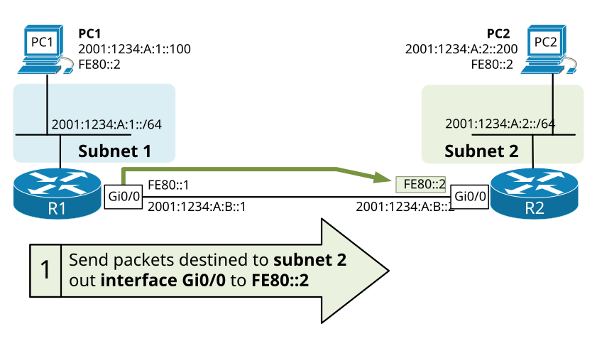
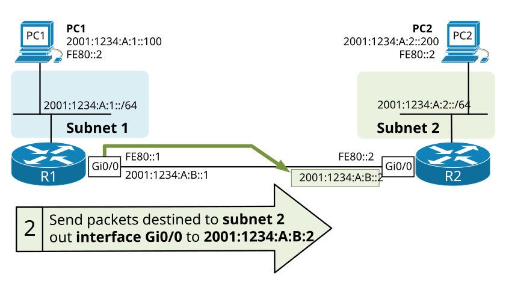
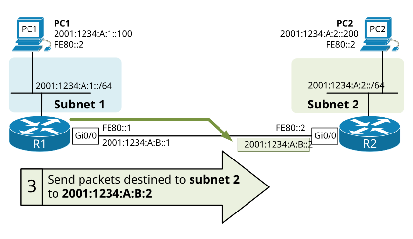
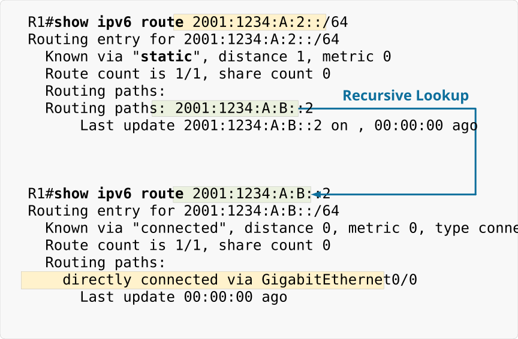
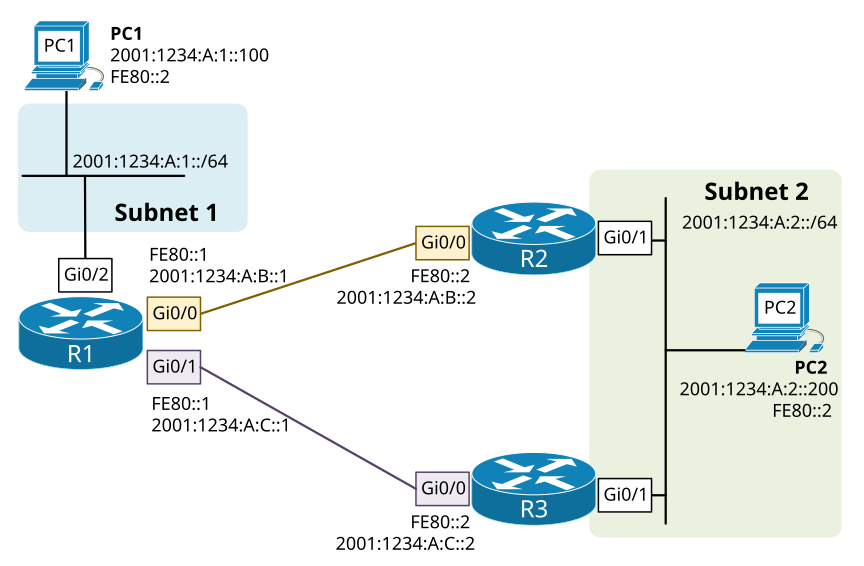
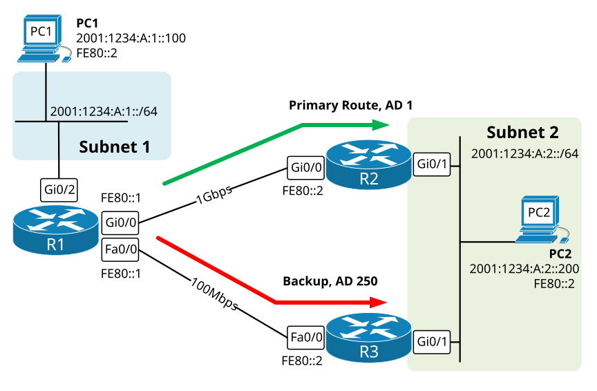

[IPv6 Static Routing](https://www.networkacademy.io/ccna/ipv6/ipv6-static-routing)
==========

# IPv6 Static Routing

## What is IPv6 Static Routing

When a router's interface is configured with an IP address/Mask and enabled, the router automatically adds the prefix in its routing table as Connected. However, to forward packets toward networks that are not directly connected to the router, it has to have a valid routing entry in the routing table. If we examine figure 1 for example, from the perspective of Router 1, Subnet 1 is directly connected, but Subnet 2 is not. Therefore, router 1 is not able to forward packets destined for subnet 2 while it doesn't have a routing entry for 2001:1234:A:2::/64 in the Routing table.

There are two methods to add entries in the routing table:

- **Statically** - meaning that a network administrator statically configures a routing entry and the router places it in the routing table.
- **Dynamically** - meaning that there is a routing protocol running in the network and routers exchange routing information automatically 

In this lesson, we are going to look at the first technique demonstrating different methods to add a static routing entry. Most of the concepts apply equally to IPv4 and IPv6, however, we are going to examine only the IPv6 configuration portion.

The main benefits of using IPv6 static routes are better security and efficiency. Static routes use fewer resources than dynamic routing protocols because no CPU cycles are needed to calculate the topology and no messages are being exchanged between routers. However, there is a huge disadvantage which is the lack of automatic re-routing around network failures and topology changes.

## Configuring IPv6 Static Routes

Defining an IPv6 static route entry is done using the

ipv6 route [ *destination prefix* ] [ *outgoing interface* ] [ *next-hop* ] [ *AD* ] 

command in global configuration mode. Because some of the parameters are optional, there are a few different combinations of specified parameters when configuring an IPv6 static route. Depending on the next-hop, the outgoing interface, and the administrative distance that is configured, the router acts differently. Table 1 summarizes the different types of ipv6 static routes.

Table 1. Different methods of configuring IPv6 static routes

| Type of IPv6 static route | Outgoing interface | NextHop | AD  | Use case                                                                                                      |
|---------------------------|-------------------|---------|-----|---------------------------------------------------------------------------------------------------------------|
| Directly Attached         | set               | not set | 1   | **ipv6 route 2001:AB5::/32 Serial0/0**<br>Only an outgoing interface is specified. Used on point-to-point links. Not applicable to broadcast networks such as Ethernet. |
| Recursive                 | not set           | set     | 1   | **ipv6 route 2001:AB5::/32 2001:1234:B::1**<br>Only GUA next hop is specified. The outgoing interface is derived by performing another routing lookup. |
| Fully Specified           | set               | GUA     | 1   | **ipv6 route 2001:AB5::/32 FastEthernet0/0 2001:1234:B::1**<br>An outgoing interface and a next-hop are specified. Recommended method. |
| Fully Specified           | set               | LLA     | 1   | **ipv6 route 2001:AB5::/32 FastEthernet0/0 FE80::1**<br>Similar, but next-hop is a link-local address. Used when the segment does not have GUA addresses. |
| Floating                  | set               | GUA or LLA | >1 | **ipv6 route 2001:AB5::/32 FastEthernet0/0 FE80::1 210**<br>A fully specified static route used as a backup. AD is set higher than the primary route. |

#### Method 1: Using Outgoing interface and Link-Local Next-Hop

One of the most common methods for configuring ipv6 static routes is by specifying an outgoing interface and a link-local next-hop. This is a convenient way to use static routing on segments where there are no global unicast addresses configured. 



Figure 1. Configuring IPv6 Static Route Method 1

The syntax for configuring an ipv6 routing entry with an outgoing interface and LLA next-hop is as follow:

```ini
R1(config)#ipv6 route 2001:1234:A:2::/64 GigabitEthernet0/0 FE80::2
```

Note that link-local addresses are only reachable from devices on the same link. Therefore, if we use LLA next-hop, specifying an outgoing interface is required because the same link-local address may exist on another link. If we look at the example in figure 1, that is the case with the address FE80::2, it is configured on PC1 and R2 Gi0/0. Thus R1 won't accept the command if an outgoing interface is not explicitly set.

```ini
R1(config)#ipv6 route 2001:1234:A:2::/64 FE80::2
% Interface has to be specified for a link-local nexthop
```

Once the static route is configured, we can verify that R1 has accepted and added it to the routing table with the following command:

```ini
R1#show ipv6 route
IPv6 Routing Table - 6 entries
Codes: C - Connected, L - Local, S - Static, R - RIP, B - BGP
       U - Per-user Static route, M - MIPv6
       I1 - ISIS L1, I2 - ISIS L2, IA - ISIS interarea, IS - ISIS summary
       O - OSPF intra, OI - OSPF inter, OE1 - OSPF ext 1, OE2 - OSPF ext 2
       ON1 - OSPF NSSA ext 1, ON2 - OSPF NSSA ext 2
       D - EIGRP, EX - EIGRP external
C   2001:1234:A:1::/64 (0/0)
     via GigabitEthernet0/1, directly connected
L   2001:1234:A:1::1/128 (0/0)
     via GigabitEthernet0/1, receive
S   2001:1234:A:2::/64 (1/0)
     via FE80::2, GigabitEthernet0/0
C   2001:1234:A:B::/64 (0/0)
     via GigabitEthernet0/0, directly connected
L   2001:1234:A:B::1/128 (0/0)
     via GigabitEthernet0/0, receive
L   FF00::/8 (0/0)
     via Null0, receive
```

This entry in the routing table can be translated as "Send packets destined to network 2001:1234:A:2::/64 out interface GigabitEthernet 0/0 to next-hop FE80::2"

#### Method 2: Using Outgoing interface and GUA Next-Hop

This is the same example as Method 1 with the only difference being the next-hop address. Instead of a link-local address, we can specify a global unicast address as shown in Figure 2. There is no functional difference comparing to Method 1. If all nodes on the link have GUA addresses, this is the recommended way of specifying static routes.



Figure 2. Configuring IPv6 Static Route Method 2

The syntax of configuring IPv6 static route with an outgoing interface and a GUA next hop is shown below.

```ini
ipv6 route 2001:1234:A:2::/64 GigabitEthernet 0/0 2001:1234:A:B::2
```

Once the routing entry is configured, we can verify that R1 has accepted and added it to the routing table with the following command:

```ini
R1#show ipv6 route
IPv6 Routing Table - 6 entries
Codes: C - Connected, L - Local, S - Static, R - RIP, B - BGP
       U - Per-user Static route, M - MIPv6
       I1 - ISIS L1, I2 - ISIS L2, IA - ISIS interarea, IS - ISIS summary
       O - OSPF intra, OI - OSPF inter, OE1 - OSPF ext 1, OE2 - OSPF ext 2
       ON1 - OSPF NSSA ext 1, ON2 - OSPF NSSA ext 2
       D - EIGRP, EX - EIGRP external
C   2001:1234:A:1::/64 (0/0)
     via GigabitEthernet0/1, directly connected
L   2001:1234:A:1::1/128 (0/0)
     via GigabitEthernet0/1, receive
S   2001:1234:A:2::/64 (1/0)
     via 2001:1234:A:B::2, GigabitEthernet0/0
C   2001:1234:A:B::/64 (0/0)
     via GigabitEthernet0/0, directly connected
L   2001:1234:A:B::1/128 (0/0)
     via GigabitEthernet0/0, receive
L   FF00::/8 (0/0)
     via Null0, receive
```

This entry in the routing table can be translated as "Send packets destined to network 2001:1234:A:2::/64 out interface GigabitEthernet 0/0 to next-hop 2001:1234:A:B::2"

#### Method 3: IPv6 Static Route using only GUA Next-Hop

Another valid way of specifying static routes is by only pointing to a Global Unicast Next-Hop. This type of configuring without specifying an outgoing interface tells the router to do another routing lookup and find the link on which this GUA address is attached to.



Figure 3. Configuring IPv6 Static Route Method 3

The syntax of configuring an IPv6 static route to a GUA next hop is shown below:

```ini
R1(config)#ipv6 route 2001:1234:A:2::/64 2001:1234:A:B::2
```

Let's see how R1 added this entry in the routing table.

```ini
R1#show ipv6 route
IPv6 Routing Table - 6 entries
Codes: C - Connected, L - Local, S - Static, R - RIP, B - BGP
       U - Per-user Static route, M - MIPv6
       I1 - ISIS L1, I2 - ISIS L2, IA - ISIS interarea, IS - ISIS summary
       O - OSPF intra, OI - OSPF inter, OE1 - OSPF ext 1, OE2 - OSPF ext 2
       ON1 - OSPF NSSA ext 1, ON2 - OSPF NSSA ext 2
       D - EIGRP, EX - EIGRP external
C   2001:1234:A:1::/64 (0/0)
     via GigabitEthernet0/1, directly connected
L   2001:1234:A:1::1/128 (0/0)
     via GigabitEthernet0/1, receive
S   2001:1234:A:2::/64 (1/0)
     via 2001:1234:A:B::2
C   2001:1234:A:B::/64 (0/0)
     via GigabitEthernet0/0, directly connected
L   2001:1234:A:B::1/128 (0/0)
     via GigabitEthernet0/0, receive
L   FF00::/8 (0/0)
     via Null0, receive
```

Note that the static route in the routing table does not have an outgoing interface. So when packets destined to 2001:1234:A:2::/64 come in, the router knows that it has to forward them to the next-hop 2001:1234:A:B::2, but to find the outgoing interface it has to perform another routing lookup for the next-hop address. 



Figure 4. IPv6 Static Route Recursive Lookup

This entry in the routing table can be translated as "Send packets destined to network 2001:1234:A:2::/64 next-hop 2001:1234:A:B::2. Make another routing lookup to find the outgoing interface."

## Floating static routes

In this example, we are going to look at another type of IPv6 Static routing called **Floating Static Route**. This means that when we configure a route, we set a higher **Administrative Distance** than the default value of 1. This is useful in scenarios where we have two paths to a particular destination and want to use one of them as a primary path and the other one as a backup. Such an example is shown in figure 5. Let's say that we want to configure R1 to send all packets via the link between R1 and R2 and only in case of link failure to use the link R1-R3 as a backup path. 



Figure 5. Using a Floating IPv6 Static Routes

We can achieve this by using the following configuration. First, we specify that Subnet 2 is reachable via link R1-R2:

```ini
R1(config)#ipv6 route 2001:1234:A:2::/64 GigabitEthernet0/0 FE80::2 ?
  <1-254>  Administrative distance
  <cr>
R1(config)#ipv6 route 2001:1234:A:2::/64 GigabitEthernet0/0 FE80::2 
```

Note that at the very end we have the option to configure the AD value. If we do not specify any value, it inherits the default value of 1.

Now that we have the primary path set up, let's configure the backup path using the following command:

```ini
R1(config)#ipv6 route 2001:1234:A:2::/64 GigabitEthernet0/1 FE80::2 250
```

Note that at the very end of the command, we specify the value of 250. This is the Administrative Distance of the static route. Routers use the AD value as a measure of the trustworthiness of the source of the routing information. For example, if a router has two routes (static or dynamic), it chooses to use the one with a lower AD value. Therefore in our case, R1 would have two static routes to Subnet 2, the route via R2 with AD of 1 and the route via R3 with AD of 250. Thus the router will use the path via R2 as a primary path and only in case of link failure will use the link via R3.



Figure 6. Using a Floating IPv6 Static Route as a backup

Now let's see which route is installed in R1's routing table:

```ini
R1#show ipv6 route
IPv6 Routing Table - 6 entries
Codes: C - Connected, L - Local, S - Static, R - RIP, B - BGP
       U - Per-user Static route, M - MIPv6
       I1 - ISIS L1, I2 - ISIS L2, IA - ISIS interarea, IS - ISIS summary
       O - OSPF intra, OI - OSPF inter, OE1 - OSPF ext 1, OE2 - OSPF ext 2
       ON1 - OSPF NSSA ext 1, ON2 - OSPF NSSA ext 2
       D - EIGRP, EX - EIGRP external
S   2001:1234:A:2::/64 (1/0)
     via FE80::2, GigabitEthernet0/0
C   2001:1234:A:B::/64 (0/0)
     via GigabitEthernet0/0, directly connected
L   2001:1234:A:B::1/128 (0/0)
     via GigabitEthernet0/0, receive
C   2001:1234:A:C::/64 (0/0)
     via GigabitEthernet0/1, directly connected
L   2001:1234:A:C::1/128 (0/0)
     via GigabitEthernet0/1, receive
L   FF00::/8 (0/0)
     via Null0, receive
```

You can see that the static route with an Administrative Distance of 1 is installed in the forwarding table. Let's now see what will happen if we shut down the link between R1 and R2.

```ini
R1(config)#int gi0/0 
R1(config-if)#shutdown 

R1(config-if)#
%LINK-5-CHANGED: Interface GigabitEthernet0/0, changed state to administratively down
%LINEPROTO-5-UPDOWN: Line protocol on Interface GigabitEthernet0/0, changed state to down

R1#show ipv6 route
IPv6 Routing Table - 4 entries
Codes: C - Connected, L - Local, S - Static, R - RIP, B - BGP
       U - Per-user Static route, M - MIPv6
       I1 - ISIS L1, I2 - ISIS L2, IA - ISIS interarea, IS - ISIS summary
       O - OSPF intra, OI - OSPF inter, OE1 - OSPF ext 1, OE2 - OSPF ext 2
       ON1 - OSPF NSSA ext 1, ON2 - OSPF NSSA ext 2
       D - EIGRP, EX - EIGRP external
S   2001:1234:A:2::/64 (250/0)
     via FE80::2, GigabitEthernet0/1
C   2001:1234:A:C::/64 (0/0)
     via GigabitEthernet0/1, directly connected
L   2001:1234:A:C::1/128 (0/0)
     via GigabitEthernet0/1, receive
L   FF00::/8 (0/0)
     via Null0, receive
```

You can see that after we disabled the link R1-R2, now the static route via R3 is installed in the routing table and is used to reach Subnet 2. Note the value in red, this is the Administrative Distance we specified. The route is being used only when the primary one with AD of 1 is invalid, due to the outgoing interface being down.
