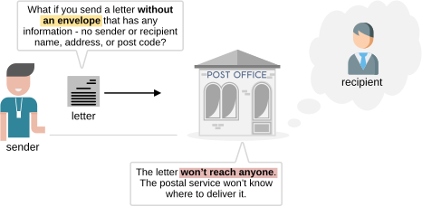
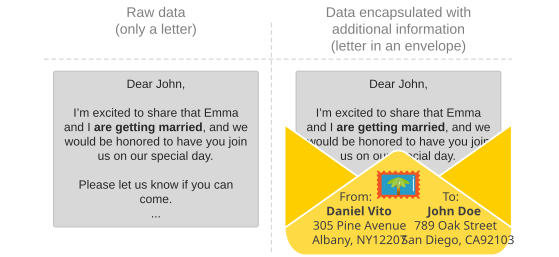
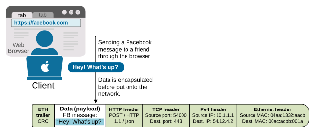
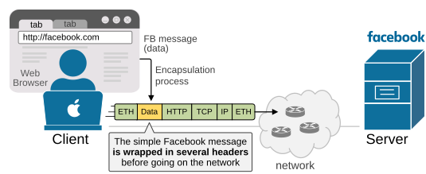
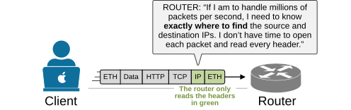
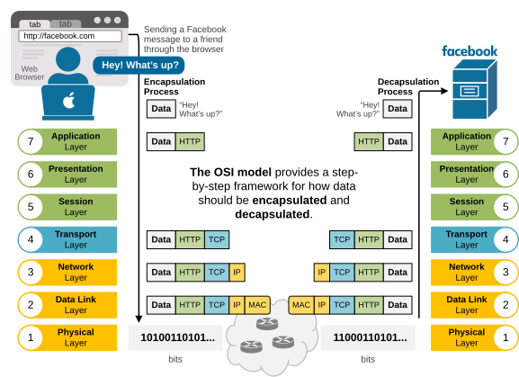
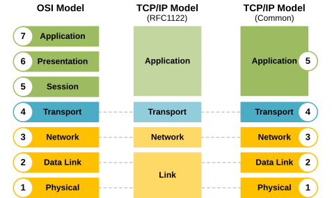

[Understanding the OSI model](https://www.networkacademy.io/ccna/network-fundamentals/understanding-the-osi-model)
==========

In this lesson, we explain **what the OSI model is** in an easy and understandable language. It is one of the most important concepts in networking, so we break it down into pieces to help you understand exactly what its purpose is.

What is data encapsulation?
---------------------------

To understand the OSI model, you must first understand what data encapsulation is. Let's explore the following example. Imagine you want to send a letter to a friend who lives in another city to invite him to your wedding. What if you send the letter without an envelope, with any information, such as the sender's and recipient's names, addresses, and postcodes? What if you simply write the letter and drop it in the mailbox at the post office? 

Figure 1. Data encapsulation example with a letter.

Most readers of this CCNA course are so young that **they've never sent a physical letter in their lives**. They live in the digital age and have grown up with emails and instant text messages. However, surprisingly, everyone understands the concept of the post service and sending mail.

Let's examine the following two examples: a letter without an envelope (on the left) and one placed inside an envelope with all required information written on top (on the right). If you put those two into your mailbox, **which one will reach its intended recipient** and which one won't?

Figure 2. Two letters, with and without an envelope.

It is pretty obvious, right? If you send a letter with no envelope and no additional information, such as sender and recipient details, the postal service **won't know where to deliver it**. The letter won't reach anyone. Your friend won't show up at your wedding.

To ensure that the information (the letter) is delivered to the correct recipient, we must **include additional information alongside the letter**, so that the postal service knows how to handle it (we encapsulate the data).

Figure 3. Data encapsulation example, a letter with an envelope.

**The envelope that encapsulates the letter** contains the following information, which helps the postal service deliver the letter correctly:

- Stamp and postcard
- Sender's name
- Sender's address
- Sender's postcode
- Recipient's name
- Recipient's address
- Recipient's postcode

Optionally, the envelope may include:

- Return address (if different from the sender's address)
- Date and time stamp
- Subject or reference line inside the letter (in formal letters)

The main idea is that sending letters equals sending information by utilizing the postal service as the medium. Sending emails is the same—it's still a process of sending information, but through a computer network. The key point is that in both cases, you can't send just the information alone; you need to include extra details that tell the transporting medium how to deliver the information.

Data Encapsulation in Networking
--------------------------------

Computer networks function similarly to the postal service. The difference is that they move digital information instead of paper letters. However, **you can't just send raw data onto the network** and expect it to reach the destination, just like you can't drop a plain letter into a mailbox and expect it to be delivered. The data must be encapsulated with additional information first, as shown in the diagram below.

Figure 4. Data encapsulated before send over the network.

Imagine a device (like your laptop) wants to send data onto the network. Let's say **you're sending a Facebook message** to a friend. As you type the message and hit enter, the data goes from the web browser (where you have Facebook opened), to the Operating System (OS), to the NIC, and out to the network. Many processes add their own additional information called headers. These headers contain important details, like:

- Who the data is for.
- Where did it come from?
- How it should be delivered.
- What type of data is it?

In the end, the simple Facebook message "Hey! What's up?" looks like a network packet **encapsulated with multiple headers**, as shown in the diagram below.

Figure 5. Data Encapsulation of a simple message.

This added information helps network devices (like routers and switches) understand how to handle and forward the data correctly to the correct recipient - one of the Facebook servers.

Encapsulation is the process of adding additional information to the data (payload) so that network devices know where to deliver the message.

At the destination, the data undergoes the reverse process of removing headers before the it is presented to the correct application.

Why do we need the OSI model?
-----------------------------

The process of data encapsulation is not simple. It involves many different protocols, headers, and steps. Each part of a network—like applications, network devices, and physical mediums—needs to know what to do with the data and how to handle it correctly.

In the early days of networking, **different companies built their own systems**, using their own encapsulation methods. These systems often couldn't work together because they didn't follow the same rules. For example, one vendor might add certain headers in a unique order that another vendor's device couldn't understand. This made it hard to send data between different networks or even between devices from the same company.

Additionally, to achieve the ultra-high speeds of today's networks, network devices **must precisely locate the information they need**, without examining headers that are irrelevant, as shown in the diagram below.

Figure 6. Why do we need the OSI model?

To fix this, engineers realized that the industry needed a standard framework. They needed a common way to describe how data should be prepared, sent, and received. That's where the OSI model comes in.

The OSI model gives a step-by-step structure for how data encapsulation should work:

- Each layer has a specific job, like adding source and destination addresses or checking for errors.
- Each layer uses specific protocols that follow agreed-upon rules.
- Each layer adds its own header (and sometimes trailer) to the message, so the receiving system knows how to process it.

In short, the OSI model helps manage the complexity of data encapsulation by providing a clear, standard method that everyone in networking can use. This ensures interoperability, consistency, and easier troubleshooting.

The OSI model helps us understand and explain how data is wrapped up layer by layer (encapsulation), and how it's unwrapped at the other end (de-encapsulation).

What is the OSI model?
----------------------

The OSI model, or Open Systems Interconnection model, is **a framework that breaks down the encapsulation process into seven layers**. Each layer has a specific role and handles a part of the encapsulation, such as data formatting, logical addressing, routing, physical addressing, or error checking.

The following example shows how data moves through the OSI layers and gets wrapped at each step before being sent over the network to the next device. Notice that each layer adds its own specific header with relevant information for the network function.

Figure 7. What is the OSI model?

The primary goal of the OSI model is to establish a standard and vendor-agnostic data encapsulation framework. It helps different devices and systems work together by following the same set of rules and standards. 

The following diagram illustrates each layer, with a brief description and the protocols that operate at that layer. Notice that in general, different network devices operate at different layers of the OSI model. This means that a network device cares only for the headers up to a particular layer and doesn't care about the rest of the headers in the message. For example, a switch only cares about the data link (layer 2) header, which consists of the source and destination MAC addresses. A router cares only about the layer 2 and layer 3 headers, and so on.

| Layer | Name | Description | Common Protocols | Device |
|---|---|---|---|---|
| 7 | Application | End-user services (web, email, file transfer) | HTTP, FTP, SMTP, DNS | Host/Server |
| 6 | Presentation | Data translation, encryption/compression | TLS/SSL, JPEG, MPEG | Host/Server |
| 5 | Session | Session management between apps | NetBIOS, RPC | Host/Server |
| 4 | Transport | End-to-end connections, reliability | TCP, UDP | Firewall |
| 3 | Network | Addressing, routing | IP, ICMP, OSPF | Router |
| 2 | Data Link | Physical addressing, error detection | Ethernet, PPP | Switch/Bridge |
| 1 | Physical | Cables, signals, bits | 10BASE-T, 1000BASE-SX | Hub/Repeater |

Table 1. The 7 layers of the OSI model.

Note also that we refer to the data at each layer of the OSI model with a different term. For example, at layer 4, we refer to a TCP message as **a segment**. At layer 3, we refer to it as **a packet**. At layer 2, we refer to it as **a frame**.

The OSI model vs. TCP/IP model
------------------------------

The OSI model, with its seven layers, is a well-structured and useful way to understand how data encapsulation works. However, network engineers quickly notice that **layers 5, 6, and 7 are not directly related to most networking tasks**. These layers focus more on how software applications handle data, which is usually outside the scope of networking.

As a result, network professionals, through practice and real-world experience, began using a simpler model that focuses on the aspects that matter most to networking—Layers 1 through 4. This led to the development of **the TCP/IP model**, which has fewer layers and is more aligned with how networks actually operate.

The following diagram shows a comparison of the OSI model (with 7 layers), the first version of TCP/IP (which had 4 layers), and the modern version of the TCP/IP model (with 5 layers).

Figure 9. OSI vs. TCP/IP models.

The modern 5-layer TCP/IP model uses the same names as the OSI model for the lower layers, and their jobs are very similar. So, when reading about networks or talking to others in the field, you can think of the lower four layers as being the same in both models - OSI and TCP/IP.

For this course, make sure you understand how the 5-layer TCP/IP model maps to the 7-layer OSI model (as shown in both ends of the diagram above). Also, remember that when people refer to "Layer 7," they typically mean the top layer in both models, which handles applications.

**KEY NOTE:** The CCNA exam no longer focuses on the OSI and TCP/IP models; however, understanding them remains important. Network engineers often discuss networking using the layers of the OSI model.

For example, you will often hear one of the following phrases that you must understand:

- "Do you need a layer 2 or a layer 3 port?"
- "Is this a layer 2 or layer 3 switch?"
- "The problem is at layer 2."

Although networks today use TCP/IP, many people still refer to OSI layer numbers. For example, people call an application protocol a "Layer 7 protocol," even though TCP/IP combines some of those OSI layers (application, presentation, and session) into just one.

Key Takeaways on the OSI Model
------------------------------

- The OSI model is **a theoretical framework** that breaks down the data encapsulation process into seven layers
- Each layer describes the information included in the message as **a header**.
- The OSI model remains widely used to teach networking and explain how protocols function. 
- However, while Cisco includes the OSI model in the CCNA/CCNP exams, knowing more than the basics isn't very useful in real-world networking today. 
- It's essential to know the first four layers as they are the ones that concern network engineers the most.

## Summary

- **Encapsulation** is the process of adding headers to data at each OSI layer for delivery.
- **OSI model** has 7 layers: Physical, Data Link, Network, Transport, Session, Presentation, Application.
- **TCP/IP model** has 5 layers (modern): Physical, Data Link, Network, Transport, Application.
- Data naming: Layer 4 = **segment**, Layer 3 = **packet**, Layer 2 = **frame**.
- Each network device operates at a specific layer (e.g., switch = L2, router = L3).