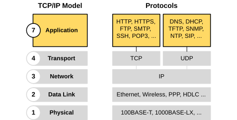
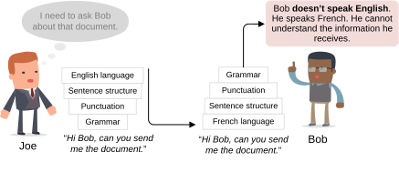
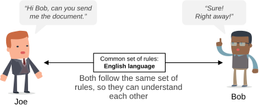
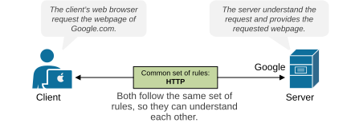
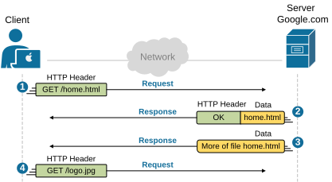

[Application Layer](https://www.networkacademy.io/ccna/network-fundamentals/application-layer)
==========

In this lesson, we examine the top three layers of the OSI model, layers 5, 6, and 7, called the Application, Presentation, and Session. Although there are three different layers, in the CCNA we refer to them as the Application layer because they are typically out of the scope of the network team.

The Application Layer(s)
------------------------

First, let's start with the fact that there are three layers on top of the OSI model: Application, Presentation, and Session. However, we will discuss them as one layer, called the Application. That's because they are typically outside of the scope of the organization's network team. Additionally, some simplified models, such as the TCP/IP model, directly combine them into one layer called Application, as shown below.

Figure 2. TCP-IP Application layer.

Why do we need the Application layer?
-------------------------------------

Now let's get to the point — what is the Application layer and why do we need one? 

It is the topmost layer where software applications meet the network. It sits at the top of the model and **defines the rules** applications use to talk over the network. These rules are called protocols.

To understand what we mean by "define the rules", let's walk through the following example.

Imagine Joe and Bob communicating as shown in the diagram below. Joe is English and speaks only English, and Bob is French and speaks only French. Will they be able to communicate? Of course not.

Figure 3. Application Layer as a language example.

To successfully understand each other, they **need to speak a common language**. Which, in other words, means they need to follow the same set of rules so they can understand each other.

For example, when two people speak English, they both know how words are formed, how sentences are structured, and what certain expressions mean. They follow the rules of grammar, spelling, punctuation, and sentence order. Because both sides use these shared rules, they can communicate, as shown in the diagram below.

Figure 4. English language as a set of rules.

If one person started using a completely different structure or ignored the grammar rules, the other person might not understand.

The same idea applies in networking. When two computers communicate, they must follow the same protocols. A protocol is a set of rules (like a language rulebook) that defines how to format, send, and receive data. If both computers follow the same protocol, like HTTP, the communication is successful, just like two people speaking the same language.

Figure 5. HTTP example.

For example, the HTTP protocol defines how a web browser can request a web page from a server, as shown in the diagram above. In short, the application layer acts as a bridge between the application and the network.

HTTP Overview
-------------

If you are reading this page, it means you sit at your computer or mobile phone, open a web browser, and type in the URL networkacademy.io. Therefore, you are using HTTP(s) at the moment. But how does it work under the hood? 

### How HTTP Works

When you open your web browser and type a website's URL address, the browser automatically requests the website's default web page (often called the home page), as shown in the diagram below.

Figure 6. How does HTTP work?

Here's what happens in more detail:

- **Request (GET):** Your web browser sends an HTTP message to the web server. The message includes an HTTP header that says, "GET /home.html." If no file name is given, the server assumes you want the default page.
- **Response (OK):** The server replies with another HTTP message. The header includes a return code like HTTP 200 OK, meaning the request was successful. If there's an error (for example, page not found), the code might be 404 Not Found instead.
- **Data Transfer:** The server may send multiple messages containing parts of the requested file. To save space, only the first message includes an HTTP header; the rest just carry data.
- **Request (GET):** After opening the homepage, you most likely click on a link that leads you to another internal page. Subsequently, your web browser sends another request for that page. The server responds with the page, and so on.

You can see that HTTP is a client-server, request-response protocol. A web browser sends a request like GET or POST. The server answers with a status code and the web page content.

Where does the network fit into the picture? It transports the request-response messages between the client and server over the most efficient path. However, the application layer does not directly interact with the network. It is more of a set of rules that end devices use to encode/decode data and understand each other.

The network devices operate at the lower layers of the OSI model, as we are going to see in the next lessons.

### Key Takeaways

- The key takeaway of this lesson is to remember that the application layer gives programs the rules they need to use the network.
- It defines how applications request and receive data.
- It also determines how apps encode and decode data. 

Key protocols at the application layer include HTTP, DNS, SMTP, FTP, SSH, SNMP, and DHCP. Most of them we are going to cover in more detail in the coming sections of our CCNA learning path.