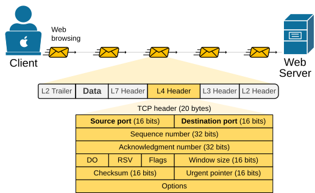
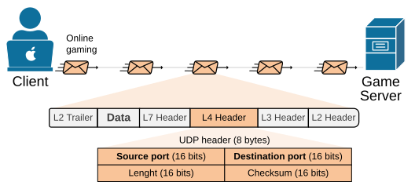
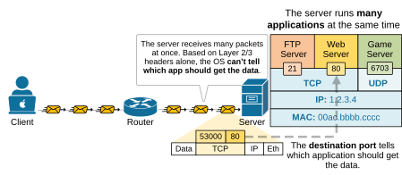
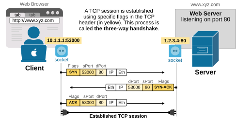
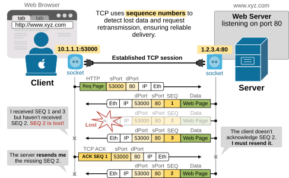
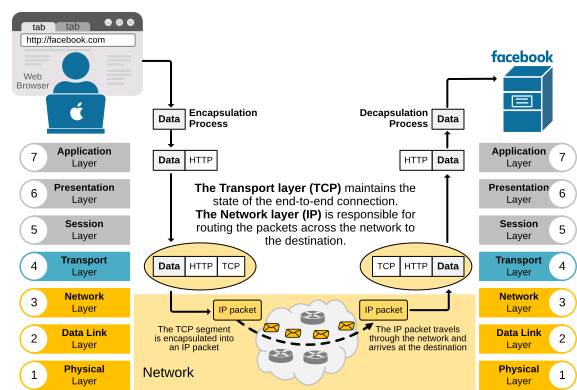

[Transport Layer](https://www.networkacademy.io/ccna/network-fundamentals/transport-layer)
==========

In this lesson, we examine the 4th layer of the OSI model called **the Transport Layer**. There are a few protocols that operate at the Transport layer. However, by far the most widely used ones are TCP and UDP.

- **TCP** is used when reliability and data order matter. 
- **UDP** is used when speed and low latency are more important than perfect delivery.

The Layer 4 header
------------------

Each protocol in the OSI model has its own header that it puts on the packet during the data encapsulation process. Since the data encapsulation process starts from the top (layer 7) to the bottom (layer 1), **the application layer determines whether TCP or UDP will be used at the transport layer**. Therefore, depending on the application, the packet is encapsulated with a TCP or UDP header. 

**KEY NOTE:** Each OSI model layer serves the one above it. The application layer serves the user.

Let's examine each header in detail. It is very important to know the content of each L4 header because they are so fundamental to every network technology that you are going to learn along the CCNA/CCNP/CCIE certification path.

### TCP header

The TCP header contains information used to ensure the **reliable delivery of data**. It includes the following fields:

- Source and destination ports (to identify applications).
- Sequence and acknowledgment numbers (to track and confirm data receipt).
- Flags (such as SYN, ACK, and FIN) that control the connection state. 
- Window size for flow control.
- Checksum for error checking. 
- Optional fields for additional features. 



Figure 2. TCP Header.

TCP has so many fields in the header because it is designed to manage the connection between two hosts and ensure the reliable delivery of data. That's why it is referred to as a connection-oriented protocol. The most commonly used TCP header is 20 bytes long, but it can grow up to 60 bytes if options are used.

### The UDP Header

The UDP header is much simpler. It has **a fixed size of 8 bytes**. It contains only four fields:

- Source and destination ports (to identify applications). 
- Length (total size of the UDP header and data).
- Checksum (used for basic error checking). 



Figure 3. UDP Header.

UDP is a connectionless protocol. Its header only has four fields, making it faster and more efficient than TCP. However, it does not provide any data reliability because it lacks the necessary header fields (sequence number and acknowledgment number) to verify data receipt. 

UDP is used for applications where **speed is more important than reliability**, like live video streaming, online gaming, and other real-time services.

What are the primary functions of the Transport Layer?
------------------------------------------------------

Now that we have seen the headers of TCP and UDP, let's discuss the primary function of the information in the layer 4 header.

### Multiplexing

First and foremost, the transport layer header is used to identify the application that sends and receives the data over the network. This is the function of the source and destination ports. 

- **The source port** identifies which application on the sender's device created the data.
- **The destination port** tells the receiving device which application should receive the data. 

Let's look at the diagram below, for example. The server is running several applications at the same time and keeps receiving packets. All the packets have the same MAC (Layer 2) and IP (Layer 3) headers. Because of this, the server **cannot determine which application should receive each packet's data** solely by reading the Layer 2 and 3 information. This is where the information in the transport header comes in. 



Figure 4. Multiplexing based on ports.

When packets arrive at a device, **the port numbers in the Layer 4 header** help the device determine which application should receive the data. Each process that runs on the server "listens" for incoming data on a specific TCP/UDP port, as shown in the output below. For example, the Web Server listens on port 80, while the FTP Server listens on port 21.

```
Microsoft Windows [Version 11.0.25621.5339]
(c) Microsoft Corporation. All rights reserved.

C:\> netstat -a -n

Active Connections
  Proto  Local Address          Foreign Address        State
  TCP    1.2.3.4:21             0.0.0.0:0              LISTENING
  TCP    1.2.3.4:80             0.0.0.0:0              LISTENING
  TCP    1.2.3.4:443            0.0.0.0:0              LISTENING
  UDP    1.2.3.4:6703           0.0.0.0:0              LISTENING
```

During the decapsulation process, when the operating system encounters a TCP segment with destination port 80, it immediately recognizes that it must deliver the data to the web server listening on port 80.

### End-to-End connectivity

Another essential function of the transport layer is to provide end-to-end connectivity and reliability services to upper-layer protocols. TCP is the transport layer protocol that performs these functions.

#### Establishing a TCP session

TCP provides end-to-end connectivity by establishing a TCP session that maintains the connection state at all times. It happens in three steps, called the three-way handshake:

- **Step 1:** The client that wants to initiate the connection sends a TCP message with **the SYN flag set**. This says, "I want to start a connection."
- **Step 2:** The server responds with a TCP message that includes **the SYN and ACK flags**. This says, "I got your request and I'm ready too."
- **Step 3:** The client sends a message with **the ACK flag** to confirm. This says, "We are connected."

Once these three steps are done, the two hosts can start sending and receiving data. The process is visualized in the diagram below.



Figure 5. Establishing a TCP session.

Note that each side of the connection uses a socket, which is a combination of IP address and port Number. The socket helps the host determine exactly which application the data should be sent to or received from. For example, a web browser uses socket **10.1.1.1:53000** to connect to a web server at socket **1.2.3.4:80**.

A TCP connection is always established between two sockets. For example, the TCP session between the client and the server shown in the diagram above can be uniquely identified as highlighted below:

```
Microsoft Windows [Version 11.0.25621.5329]
(c) Microsoft Corporation. All rights reserved.

C:\> netstat -a -n

Active Connections
 Proto  Local Address          Foreign Address        State
 TCP    10.1.1.1:53000         1.2.3.4:80        ESTABLISHED
```

Note an important concept here. Most internet communications use the Client-Server model.

- **The client** is the application that sends a request. For example, a web browser requests a web page. Notice that the client uses **a randomly assigned dynamic port number**.
- **The server** is the application that waits for requests and provides a service. For example, a web server that sends back the requested web page. Notice that the server uses **a well-known port number**.

#### Providing reliability (TCP error recovery)

Another fundamental function of the Transport layer is to provide reliable data delivery. TCP provides error recovery to help application protocols, such as HTTP and FTP, work reliably.

For example, let's say a client uses a web browser to retrieve a homepage from a web server via HTTP. Let's walk through the process step by step.

- First, the client **establishes a TCP session** with the server by initiating a three-way handshake.
- Once a TCP session is established, **the client sends an HTTP GET request** to retrieve the web server's homepage. 
- The server then **sends the entire webpage** via HTTP.

But what if the server's response—the web page itself—is lost during transmission? The web page wouldn't show up in the client's browser.



Figure 6. TCP Sequence Numbers.

That's why TCP includes a built-in method to make sure data is delivered successfully. Many applications need reliable delivery, so TCP was designed with an error recovery system. It does this using sequence numbers (SEQ) and acknowledgments (ACKs).

In the diagram above, the server sends the web page to the client in three TCP segments, each labeled with a sequence number (SEQ).

- The client receives segments 1 and 3, but segment 2 is lost in the network.
- The client's TCP layer notices that **segment 2 is missing** (because it got 1 and 3, but not 2).
- The client sends a message back to the server **asking it to resend segment 2**.

This process enables TCP to detect missing data and request a resend, ensuring the application (such as a web browser) receives all the necessary information.

Transport and Network layers work together
------------------------------------------

Lastly, let's look at the bigger picture and possibly clear up some confusion that students may have. We have seen that the Transport layer (TCP) keeps track of the end-to-end connection. However, TCP does not influence how the information travels through the network to the remote host. 

The Network layer (IP) is responsible for actually delivering packets from the source to the destination. It is the information in the Layer 3 header (source and destination IP addresses) that guides packets through the network. The source and destination IP addresses are like the sender and receiver addresses on a letter sent through the postal service — they tell the postal service where the letter comes from and where it should go. IP addresses do the same — they tell the network where the packet comes from and where it must be delivered.



Figure 7. Transport and Network layers working together.

In summary, the Transport layer includes information about which application sent the data and which application at the remote end should receive it. Additionally, if TCP is used, the Transport layer maintains connection state (whether the remote end wants to communicate) and reliability (using sequence numbers and acknowledgments).

The Transport layer **assumes that the network layer delivers the packets to the remote end**, as we are going to see in more detail in the next lesson. 

Key Takeaways – Transport Layer (OSI Model)
-------------------------------------------

For me, the most important thing that people must understand and remember is **what information is inserted at the Transport layer** of the OSI model and what the purpose of that information is.

First and foremost, the Transport layer (both TCP and UDP) inserts source and destination port numbers.

- **The source port number** indicates which application sent the data.
- **The destination port number** indicates which application at the remote end must receive the data.

If the application layer uses **UDP** for transport, basically that's all. In the UDP header, there is no other significant information apart from the port numbers.

If the application layer uses **TCP** for transport, the transport layer also inserts **sequence numbers**, **acknowledgment numbers**, and **flags** alongside the **port numbers**.

- The sequence numbers and acknowledgments are used for the reliable delivery and ordering of data. 
    - **Sequence numbers (SEQ)** label each segment sent, so the receiver knows the order of the data.
    - **Acknowledgments (ACKs)** are sent back by the receiver to confirm which segment has arrived.
    - If data is missing or out of order, TCP can detect it using sequence numbers and request a retransmission.
- TCP flags are control bits in the TCP header that help manage the state and behavior of a TCP connection:
    - SYN – Starts a connection.
    - ACK – Acknowledges received data.
    - FIN – Ends a connection.
    - RST – Resets a connection.
    - PSH – Tells the receiver to process data immediately.
    - URG – Marks data as urgent.

Having those essential points in mind, we can summarize everything we have discussed so far as follows:

- **TCP (Transmission Control Protocol):**
    - Reliable: ensures all data arrives in order.
    - Establishes a TCP session using a 3-way handshake with SYN and ACK flags.
    - Uses sequence numbers (SEQ) and acknowledgments (ACKs) for error recovery.
    - Slower due to added reliability features and header size.
    - Commonly used for web (HTTP/HTTPS), email, and file transfers.
- **UDP (User Datagram Protocol):**
    - Unreliable: does not guarantee delivery or order.
    - No connection setup, so it's faster.
    - No sequence numbers or acknowledgments.
    - Often used for voice/video streaming, online gaming, and other real-time services.
    - Good for applications that need speed over reliability.
- A socket is made of an IP address and a port number. A pair of sockets identifies a unique TCP connection.
- Most internet applications use the client-server model:
    - The client initiates the connection and requests some resources.
    - The server provides the requested resources.
    - The client uses **a random dynamic port number**.
    - The server uses **a well-known port number** registered by IANA.