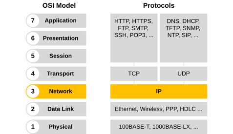
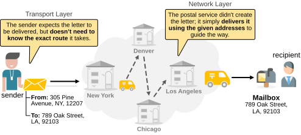
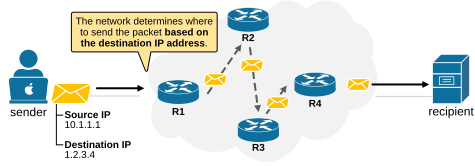
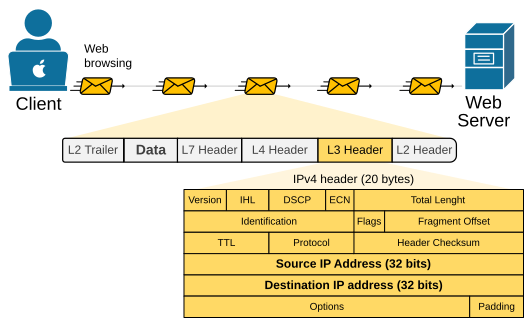
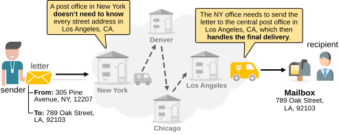
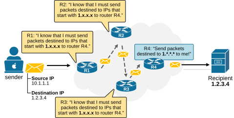
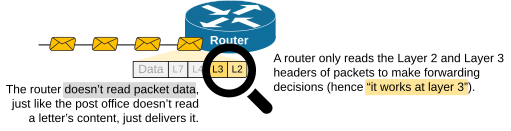

[Network Layer](https://www.networkacademy.io/ccna/network-fundamentals/network-layer)
==========

In this lesson, we examine the 3rd layer of the OSI model called **the Network Layer**. Unlike the other OSI layers that have multiple protocols, layer 3 mostly depends on **just one**— the Internet Protocol (IP), which has developed into two main versions.

- IPv4 uses 32-bit addresses and supports about 4.3 billion unique IPs.
- IPv6 uses 128-bit addresses, allowing for a much larger number of IPs and improved network efficiency.

The Internet Protocol (IP)
--------------------------

In the previous few lessons, we discussed the application and transport layers in detail. We saw that the application layer has many protocols, like HTTP, FTP, SSH, and DNS. The transport layer has fewer protocols, with the two most common being TCP and UDP. However, **the network layer mainly uses one protocol**—the Internet Protocol (IP), as shown in the diagram below. That's why the Network layer is often called **the IP layer**.

Figure 1. The Network Layer uses the IP protocol.

The Network layer has two primary responsibilities: 

- **To insert the logical addressing** into the message in the form of source and destination IP addresses.
- **To deliver the message** to the intended recipient based on the destination IP address.

Let's revisit our analogy with the postal service to explain how the Network layer functions and how it interacts with the Transport layer.

The Network layer vs. the Postal Service
----------------------------------------

Let's imagine again that you want to send a letter to a friend who lives in another city or even another country. What do you do — you just write the letter, put it in an envelope with the names and addresses of the sender and receiver, and **drop it in your mailbox**. You then expect the letter to be delivered to your friend's address by the Postal Service. You don't need to know the exact route the letter takes to go there. 

Figure 2. The Network layer as Postal Service.

On the other hand, the Postal Service doesn't know what's inside the envelope — it's **only responsible for delivering it to the correct recipient address**. It must know how to route the letter via the shortest path to its destination address.

Now let's focus on the difference between the person sending the letter and the postal service. You can clearly see that each one has a separate role and responsibilities. 

- **The person** sending the letter knows what's inside the envelope. Knows the name of the sender and the receiver. However, he doesn't know the route the letter must take to reach the receiver. He just drops the envelope in his mailbox and expects the postal service to deliver it.
- On the other hand, **the postal service** doesn't know what's inside the envelope. It only knows the sender's and receiver's addresses. It just accepts letters and delivers them to their destination address. It knows the route to any address and zip code inside the country and also knows where to send letters destined for countries abroad.

This is a very close analogy to the interaction between the Transport and Network layers of the OSI model. The Transport layer is like the person sending the letter. It puts the source and destination port numbers in the message and passes it to the network layer for delivery. The Network layer is responsible for moving the packet from router to router until it reaches the destination. Each router works like a post office, looking at the destination address and forwarding the packet.

Figure 3. Routing packets based on destination IP address.

You can see how each of the two layers (Transport and Network) has its own distinct role and responsibility:

- **The transport layer** is like the person sending the letter. It doesn't need to know how the data travels—it just trusts the network layer will deliver it.
- **The network layer** is like the post office. It ensures the packet is delivered by verifying addresses and selecting the most efficient route.

### The IP Header

The Internet Protocol (IP) has evolved through two main versions — **IPv4 and IPv6**. For now, we will only talk about the IPv4 protocol, which is still more widely adopted than IPv6. Most concepts apply equally to version 6.

The IPv4 header is 20 to 60 bytes long and contains key information for the routing and delivery of packets. It includes 14 fields. Each one has a specific role and provides important information to the network devices along the path.

Figure 4. IPv4 header format.

Pay special attention to the **Source and Destination IP address** fields. They are the most important fields in this header. They have the same role as the street address on a letter. They tell the network where to deliver the packet.

#### What are IP addresses?

Every device on the network **must have a unique IP address**, just like every house in a city has its own unique street address. The IP address identifies where a device is located and allows data to be sent to and from it, like a street address for computers.

In the layer 3 header of packets, there are two types of IP addresses: Source and Destination.

- The **destination IP address** tells the network where the packet should go.
- The **source IP address** tells the network who originated the packet.

IP addresses can be grouped into blocks, similar to how street addresses and zip codes are grouped into neighborhoods, cities, states, and countries. This grouping helps routers manage and forward traffic more efficiently, just like the postal service sorts mail **by area code rather than by street address**.

### What is IP Routing?

Routers use the IP addresses in the IP header to forward packets to their destination. The process is called **IP routing** and is analogous to how the postal service works.

Let's go back to our example with sending letters. A post office in New York doesn't need to know every street address and every house in California. It simply needs to know that a letter destined for Los Angeles must be sent to LA's Central Post Office, which knows where the exact street and zip code are located in their area.

Figure 5. IP routing - postal service example.

IP addresses work like zip codes and street addresses. A router in one part of the network doesn't need to know where each individual address is located. It only needs to know where blocks of address space are located.

Figure 6. IP routing - simplified example.

Each router does its part, like each post office. R1 doesn't need to know the full path, just like a person sending a letter doesn't need to know how your letter travels through the mail.

In short, IP and the network layer take care of delivering data between devices across networks, using addresses and routing, just like how the postal system delivers letters.

What is a Router?
-----------------

You will often encounter the explanation that a router is a network device that operates at Layer 3 of the OSI model. But what does that exactly mean — routers work at the Network layer? 

It means that routers **read the layer 3 header of packets** and make forwarding decisions based on that information, as shown in the diagram below. That's why we say they operate at Layer 3.

Figure 7. A router works at Layer 3.

Routers connect different IP networks and move packets between them. They read the destination IP address in each packet and decide where to send it next. Using routing tables, they choose the best path and forward the packet toward its destination. 

Key Takeaways
-------------

- The Network Layer (Layer 3) of the OSI model is mainly responsible for **routing and delivering packets** across networks using IP addresses.
- Unlike other layers that use many protocols, **Layer 3 primarily uses one protocol** — IP (Internet Protocol), which has two versions: IPv4 and IPv6.
    - IPv4 uses 32-bit addresses and supports about 4.3 billion unique IPs.
    - IPv6 uses 128-bit addresses, allowing for a vastly larger number of devices and better routing efficiency.
- The IP header contains critical information, including the **source and destination IP addresses**, which are like street addresses on a letter — they guide the packet to its destination.
- Each device on a network **must have a unique IP address**, just like every house in a city has a unique street address.
- IP addresses are grouped into blocks (subnets), similar to how street addresses and zip codes are grouped into neighborhoods and cities. This helps routers efficiently forward traffic.
- Routers operate like post offices. They don't need to know the final address — **only where to send packets next**, based on address blocks.
- IP routing is the process of forwarding packets **based on their destination IP address**, selecting the best path across routers.
- The Transport layer (like the sender of a letter) handles the data and ports **but relies on the Network layer to deliver it** (like the postal system).