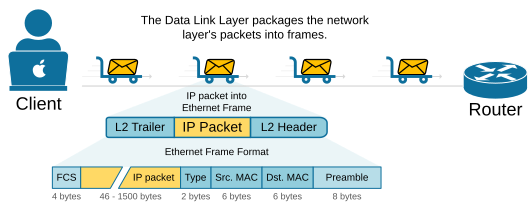
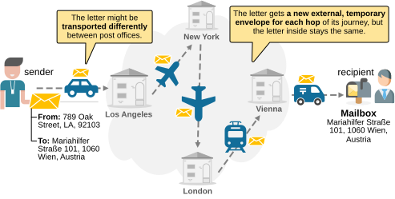
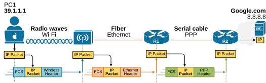
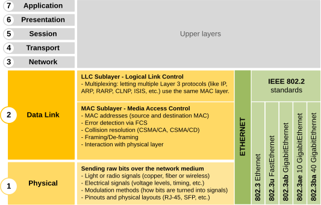
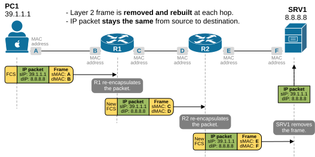

[Data Link Layer](https://www.networkacademy.io/ccna/network-fundamentals/data-link-layer)
==========

In this lesson, we examine the 2nd layer of the OSI model, called **the Data Link Layer**. Its main job is to move data between two devices that are directly connected at the physical layer. It adds framing, error detection, and MAC addressing. The physical layer then converts this data into electrical, optical, or radio signals and sends it over the medium.

Unlike Layer 3, which primarily uses the IP protocol, **Layer 2 employs a variety of protocols**. These protocols depend on the type of physical network being used. Some common Layer 2 protocols include 802.3 Ethernet, 802.11 Wireless (Wi-Fi), PPP (Point-to-Point Protocol), and HDLC (High-Level Data Link Control).

However, by far the most widely used Layer 2 protocols today are Ethernet for wired networks and Wi-Fi for wireless networks.

The Ethernet Header
-------------------

Let's first examine the layer 2 header of the Ethernet protocol and then discuss its main function.

The data link layer adds **a layer 2 header and a layer 2 trailer** to the packet it receives from the Network Layer (Layer 3). This forms an Ethernet frame, as shown in the diagram below. 

Figure 2. IP packets into frames.

The frame includes important information like the MAC address of the sender and receiver, and a frame check sequence (FCS) that is used to check if the frame is received correctly by the directly connected device.

Data Link layer - Postal Service analogy
----------------------------------------

When you send a letter to someone in another country, you just drop it in your local mailbox. You don't worry about how it will travel all the way there. Behind the scenes, the postal system moves your letter **from one post office to another**. Between each pair of offices, they might use cars, trucks, trains, or airplanes. Depending on the transport method, they place your letter in different temporary packages or containers.

Figure 3. The Data Link Layer - Postal Service example.

The data link layer works the same way. It handles how data is moved **from one device to the next directly connected device**, just like how a letter moves from one post office to the next. It adds a "wrapper" around the data (called a frame) to help with delivery over that specific link. Each link along the path might use a different Layer 2 protocol (Ethernet, Wireless, PPP, HDLC, etc.), just like different transport methods in the postal system.

The key idea is that:

- The data link layer handles local delivery—hop by hop (post office to post office). At each hop, the address of the next post office is inserted on the temporary package.
- The network layer (IP) handles end-to-end delivery — from the sender's street address to the recipient's street address (sender and receiver addresses don't change during delivery).

Framing
-------

Now, let's see the same example but in the context of networking. The primary function of the Data Link layer is to package the network layer's packets into frames. Frames add structure so the receiving device can:

- Know where the data starts and ends.
- Detect if something went wrong in transmission.

Think of a frame like **a transport package around the IP packet**, with:

- **Header** — source & destination MAC address.
- **Payload** — the data from Layer 3 (e.g., the IP packet).
- **Trailer** — error-checking information.

Let's see an example and make an analogy with the postal service. Suppose the user 10.1.1.1 sends data to Google. It first encapsulates the data into a packet. This packet includes the destination IP address of google.com. That IP packet is then placed inside a Layer 2 frame, for example, an 802.11 wireless frame, so that it can travel across the local network to the local wireless router.

Figure 4. Hop-by-hop frame re-encapsulation.

The wireless router receives the frame, removes the Layer 2 header and trailer, and keeps the IP packet inside. It then checks the destination IP address and decides where to send the packet next. To do that, it wraps the same IP packet in a new Layer 2 frame. This new frame is built for the next link — it uses the router's MAC address as the source and the MAC address of R2 as the destination.

At the next router, the same thing happens again. The frame is removed, the IP packet is checked, and then it's placed in a new frame for the next hop. This continues until the packet reaches the final destination.

When the destination receives the frame, it removes the Layer 2 information and sees that the IP packet is meant for it. Then it passes the data up the stack to the correct application.

**Key Note:** The IP packet **stays the same** from start to finish, but the Layer 2 frame that wraps the packet **is replaced at every router** to match the link between devices.

Data Link Sublayers
-------------------

An important aspect of the data link layer is that it is not as independent as other layers of the OSI model. It works closely with the physical layer to move data across a network. The data link layer has two sublayers:

- Logical Link Control (LLC) sublayer.
- Media Access Control (MAC) sublayer. 

The MAC sublayer is especially tied to the physical layer, as it controls how devices access the physical medium and how data is placed on the network.

Figure 5. Data Link Sublayers.

These two layers help deliver data from one device to another. When a computer or router wants to send an IP packet, it uses the data-link layer to get that packet to the next device in the path.

What are the MAC addresses?
---------------------------

At the Data Link layer, devices use MAC addresses to deliver data. Each network interface, like a network card or a router port, has its own unique MAC address.

When a device like PC1 wants to send data, it creates a packet with the source and destination IP addresses. Then, **it encapsulates the IP packet into a frame** that includes its own physical address as the source MAC and the destination MAC address of the next hop router on the same local network.

Figure 6. Frame hop-by-hop re-encapsulation.

- When R1 receives the frame, it removes the layer 2 header and trailers, makes a routing decision, and then re-encapsulates the IP packet into a new frame, with a new layer 2 header. It sets the source MAC to its own physical address and the destination MAC to the physical address of the next-hop router R2.
- The process repeats at R2. It removes the layer 2 header and trailer and re-encapsulates the IP packet into a new frame destined to the MAC address of the Server SRV1.
- When the server receives the frame, it removes the layer 2 header and trailer and decapsulates the IP packet to get the payload.

Note a few essential aspects of the communication:

- At each router, **the layer 2 frame is removed and rebuilt**. This is called frame re-encapsulation.
- The source and destination MAC addresses **change when the frame is re-encapsulated by every router**.
- The IP packet (the layer 3 header) **stays the same** along the entire network path.

This is how information travels across the network. The information in the layer 3 header (source and destination IPs) stays the same along the entire path. It is used to guide the packet to the intended recipient of the data payload. On the other hand, the layer 2 header changes at every hop. The information in the layer 2 header is used to guide the frame to the directly connected next-hop router. 

KEY NOTE: MAC addresses are used to deliver frames within the same local network (Layer 2).

The layer 2 trailer
-------------------

Let's look again at the example shown in the diagram above. The Layer 2 trailer is added at the end of each frame before it is sent over the network. Its main purpose is **to help detect errors during transmission**. The most common part of the trailer is the Frame Check Sequence, or FCS. The FCS contains a value calculated from the data in the frame using a method called CRC, or Cyclic Redundancy Check.

When the frame reaches the destination, the receiving device performs the same CRC calculation. It compares the result with the FCS in the trailer. If the values match, the frame is assumed to be correct. If they don't match, it means the data was corrupted during transmission, and the frame is discarded.

The Layer 2 trailer is important for error detection but not for error correction. 

What is a Switch?
-----------------

You will often encounter the explanation that a switch is a network device that operates at Layer 2 of the OSI model. But what does that exactly mean — switches work at the Data Link layer?

It means that switches read only the layer 2 header of frames and make switching decisions based on that information, as shown in the diagram below. That's why we say they operate at Layer 2.

Figure 7. A switch operates at Layer 2.

Switches connect devices within the same local network and forward frames based on MAC addresses.

Key Takeaways
-------------

- The Data Link Layer (Layer 2) is responsible for **local delivery between devices directly connected on the same network**. It takes IP packets from Layer 3 and wraps them in frames that include a header and a trailer. 
    - **The L2 header** contains source and destination MAC addresses. 
    - **The L2 trailer** includes the Frame Check Sequence (FCS) used to detect transmission errors.
- Unlike IP addresses, which stay the same across the entire network path, **MAC addresses change at every hop**. Each router removes the old frame and adds a new one to move the IP packet to the next device. This is called frame re-encapsulation.
- MAC addresses are only used within the local network. Routers forward packets based on IP addresses but re-encapsulate them in new Layer 2 frames for each link.
- **Ethernet** is the most common Layer 2 protocol for wired networks. **802.11 Wi-Fi** is standard for wireless networks. 
- **Switches operate at Layer 2** and use MAC addresses to forward frames between devices on the same network.
- The Data Link Layer has two sublayers: 
    - Logical Link Control (LLC). 
    - Media Access Control (MAC). 
- The MAC sublayer **manages access to the physical medium** and works closely with the Physical Layer.
- Finally, the trailer at the end of the frame helps **detect errors but doesn't correct them**. If the frame is corrupted, it is simply discarded.