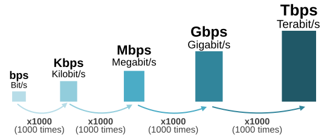
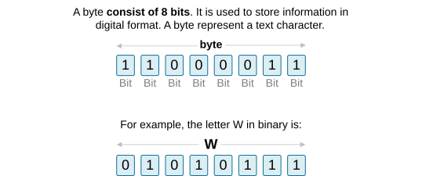
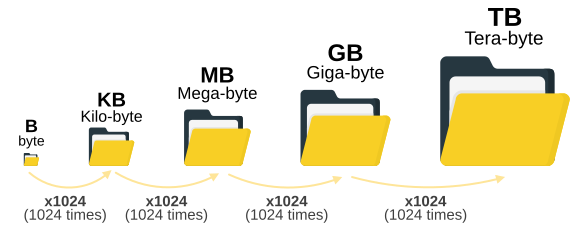
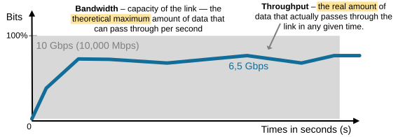
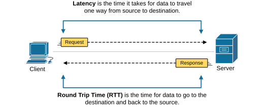
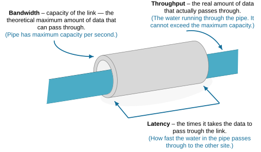

[Bandwidth, Latency and Throughput](https://www.networkacademy.io/ccna/network-fundamentals/bandwidth-latency-throughput)
==========

In this lesson, we cover the most fundamental measurement and data units used in networking. We also discuss why electronics use bits instead of decimal numbers and what the difference is between bits and bytes.

What is a Bit?
--------------

We humans use basic math all our lives. Our everyday math uses the base-10 decimal system, which indicates that there are only ten unique digits, 0 through 9. All other decimal numbers are created using these ten digits.

On the other hand, routers, switches, and computers use a base-2 numbering system called binary. There are only two possible unique digits in the binary numeral system: 0 and 1. All other binary numbers are created from a combination of these two digits.

### Why do all electronics use binary?

But why do electronics use binary instead of decimal digits? The simple answer is that binary digits — 0 and 1 — **match the physical world extremely well**. Electronics are built from components that are easiest to design **with only two states (on and off)**. For instance, a circuit can be on or off, a signal can be high voltage or low voltage, there can be current or no current, and there can be light or no light. Each of these pairs of states fits naturally with the binary system of 1s and 0s.

Figure 1. Transmitting bits with a flashlight.

When the flashlight is ON, that's a 1. When the flashlight is OFF, that's a 0. By blinking the light in a certain pattern, you can send a message across kilometers. **This is basically how networks work**, just at much higher speeds and with far more precision.

**KEY TOPIC:** Binary digits 0 and 1 match perfectly with the physical world because most physical phenomena can be On (1) or Off (0).

On the other hand, imagine trying **to make a flashlight shine at ten different brightness levels**, one for each decimal digit from 0 to 9. Even tiny changes — such as weak batteries — could make it difficult to determine whether you want to transmit 5 or 6. But if the flashlight only has two clear states, off and on, there's no confusion.

### How do we measure bits at scale?

Computers and networks ultimately use bits to send data. A bit is the smallest unit of information — it's either 0 or 1. However, networks are now unimaginably fast when transmitting data. When we talk about network speed, we measure how many bits are sent per second, but in scaled units as follows:

- Bps (bits per second): the basic unit. Example: 1 bps = 1 bit every second.
- Kbps (kilobits per second): 1,000 bits per second.
- Mbps (megabits per second): 1,000,000 bits per second.
- Gbps (gigabits per second): 1,000,000,000 bits per second.

Figure 2. Bits Sizing Scale.

So there are two important things to remember:

- Networks transmit data in binary bits because it matches the physical world. 
- Bit rates grow in steps of a thousand. For example, 1 Kbps equals 1,000 bps, and 1 Mbps equals 1,000 Kbps, and so on.

### What is Byte?

Non-technical people often **confuse Bits with Bytes**. A byte is the basic unit to store information. Historically, a byte was **the number of bits needed to store one character**, like a letter or number, in a computer. Because of this, in most computer architectures, the byte became the smallest chunk of memory you can directly work with.

Figure 3. What is a Byte?

For example, the letter W is stored in a computer memory as a single byte, as shown in the diagram above.

#### How do we measure bytes at scale?

We measure bytes at scale by using multiples of bytes, each 1,024 times bigger than the previous. Here's the standard scale in computing:

- 1 KB (Kilobyte) = 1,024 bytes
- 1 MB (Megabyte) = 1,024 KB = 1,048,576 bytes
- 1 GB (Gigabyte) = 1,024 MB = 1,073,741,824 bytes
- 1 TB (Terabyte) = 1,024 GB = 1,099,511,627,776 bytes

Figure 4. Bytes Sizing Scale.

Notice the important fact — bytes scale with multiples of 1024. Although many companies simplify this when advertising their products, as an engineer, you need to have that in mind. (This is why a 500 GB hard drive might show only about 465 GB in your computer.)

### Bits vs. Bytes

The concept of bits and bytes is important, so let's summarize what we covered so far. A bit is the smallest unit of data and can be 0 or 1. A byte is made of 8 bits and represents one character of data.

- We use bits to measure network speed, throughput, and bandwidth. For example, a Fast Ethernet interface has a capacity of 100 Mbps.
- We use bytes to measure data size and digital storage. For example, a file is 30 MB. A hard drive is 2 TB.

Bandwidth and Throughput
------------------------

Now, let's shift our focus to the network-related measurement units. What is Bandwidth?

**Bandwidth is the capacity of a link**. It is the theoretical maximum amount of data that can be transmitted through a link in a second. Bandwidth is measured in bits per second (bps). Common units are Kbps, Mbps, and Gbps.

Figure 5. Bandwidth vs. Throughput.

On the other hand, **throughput is the actual data rate you see**. It is how much data flows through the link in real life. Throughput is like the number of cars that actually move on the highway each minute. Congestion, errors, and other traffic reduce throughput.

Throughput is also measured in bits per second. If a link has 100 Mbps bandwidth but many users share it, your throughput might be 20 Mbps. Throughput depends on both the link and the network conditions.

### Speed

People often use the terms "speed" and "bandwidth" interchangeably. Speed can mean link rate, throughput, or both. Be careful with this word. In exams, clarify what kind of speed you mean. If a question says "link speed," it often means the bandwidth of the physical link.

Latency and RTT
---------------

**Latency** is the time it takes for a packet to travel from source to destination. Delay is another word for the time taken. They are often used together.

Figure 6. Latency and RTT.

**Round-trip time (RTT)** is the time for data to go to the destination and back to the source.

How do these terms fit together?
--------------------------------

Let's use one of the most common examples that circulate on the Internet. Think of a water pipe:

- **Bandwidth** is the width of the pipe — how much water can flow through at once. 
- **Throughput** is the actual amount of water flowing through the pipe right now. 
- **Latency** is how long it takes one drop of water to travel from one end to the other. 
- **Packet loss** is when some water leaks out of the pipe before reaching the end. 

Figure 7. Bandwidth, Throughput and Latency.

If the pipe is narrow, the bandwidth is low. If the pipe is partly blocked, throughput drops. If the pipe is long, latency increases. If there are leaks, packet loss happens.

Key Takeaways
-------------

CCNA covers many topics that rely on these terms. Routing, switching, QoS, and WAN technologies use them. You must read and configure timers, buffers, and QoS rules. You must design networks where throughput and latency meet application needs.

Terms short description:

- **Bit:** smallest data unit (0 or 1).
- **Byte:** 8 bits.
- **Bandwidth:** maximum data capacity (bps).
- **Throughput:** actual data rate achieved (bps).
- **Latency/Delay:** time for data to travel.
- **Jitter:** variation in latency.
- **Packet loss:** packets that do not arrive.

Simple rules of thumb:

- Always convert bits and bytes carefully. Remember 1 byte = 8 bits.
- Expect throughput to be less than bandwidth. 
- Overhead from headers and protocols reduces usable speed.

Always pay attention and write the measurement units carefully. 

- **b** for bits. 
- **B** for bytes. 
- **Mbps** for megabits per second. 
- **MB** for megabytes. 

Mixing them up causes big mistakes.