[Lab#1.1 - OSI model in practice](https://www.networkacademy.io/ccna/network-fundamentals/osi-model-in-practice)
==========

In this lab lesson, we are going to see the OSI model in action. We will examine an HTTP connection between a client and a server, observing how the network traffic is encapsulated with headers using Wireshark.

At the end of the lesson, you can download the traffic capture file (pcap) and open it in Wireshark, so that you can have a deeper look at the headers.

Lab Setup
---------

We are going to use the setup shown in the diagram below to demonstrate **how HTTP traffic is encapsulated** through the layers of the OSI model. Notice that the website that we use is nonexistent; it is only used as a fictitious example for demonstration.

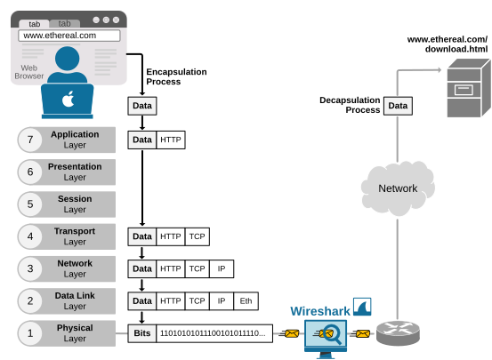

Figure 1. OSI Model - Lab Setup.

Notice that the Wireshark tool makes traffic captures at the NIC card of the computer, as shown above. However, it shows the network data exactly as it appears on the local LAN.

What is Wireshark?
------------------

First, let's introduce the application that we use to capture and explore network packets. Wireshark is a free tool that lets you capture and analyze network traffic in real time. It shows you packets going through your network, including their source, destination, protocol, and contents. It is one of the most commonly used network tools in the real world for troubleshooting, monitoring, learning how protocols work, and finding security issues. Think of it as a microscope for network data.

You can download Wireshark at this [link](https://www.wireshark.org/download.html). It has releases for all modern operating systems (Windows, Linux, macOS) and CPU architectures (x86, x64, ARM).

### Working with Wireshark

After installing Wireshark on our computer, go to **Capture > Options**.

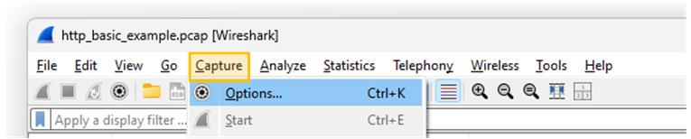

Figure 2. Wireshark Menus.

Next, choose the network interface you want to capture traffic on. This is usually the one that connects your computer to the Internet. Remember that a computer can have multiple interfaces. To identify the correct one, check the traffic graph and look for signs of live data passing through it.

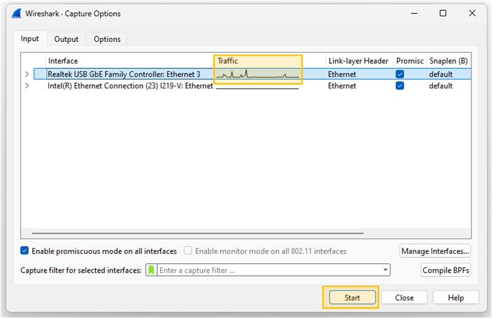

Figure 3. Wireshark Start Capture.

Lastly, you click the start button at the bottom of the window to start the traffic capture. Now you must start seeing network packets in real time.

Exploring traffic with Wireshark
--------------------------------

First, let's take a random packet and see how the Wireshark tool **visualizes all the headers** and the information inside each one. 

### Layer 2

The screenshot below shows the outer header of the frame — the layer 2 Ethernet header. It is one of the simplest headers of all, with only a few fields.

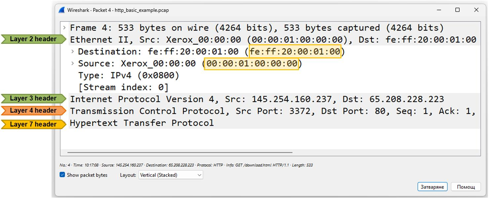

Figure 4. The Layer 2 header.

Note that the only significant information in this header is **the source and destination MAC addresses**, which show the physical (hardware) addresses of the devices sending and receiving the Ethernet frame on the local network.

- **Source MAC** — The physical address of the device that sent the frame (usually the sender's NIC card).
- **Destination MAC** — The physical address of the device that should receive the frame next. If the packet is going out of the local network (which is the case), the destination MAC is the gateway router's MAC address.

### Layer 3

The screenshot below shows the content of the layer 3 header of an IP packet.

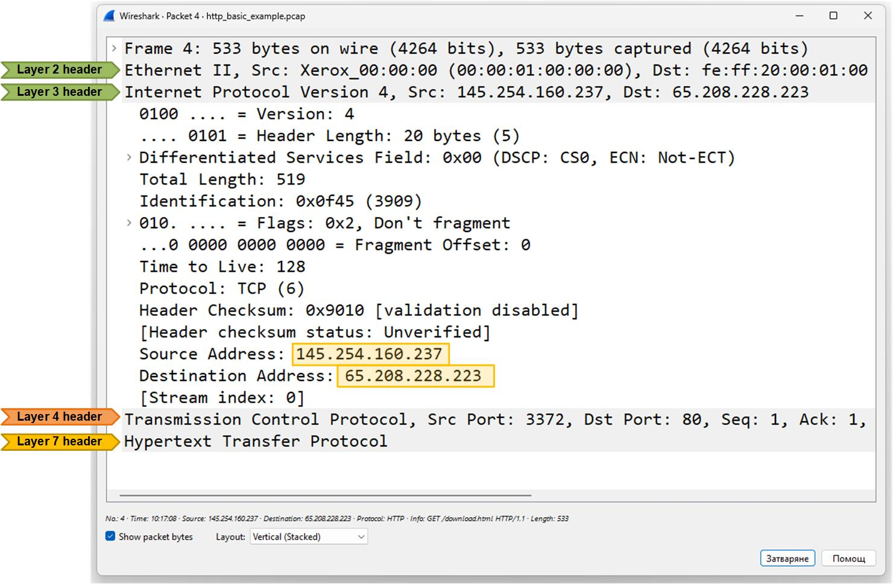

Figure 5. The Layer 3 header.

Here's a high-level explanation of the most significant fields in the header:

- **Version: 4** — It's an IPv4 packet.
- **Header Length:** 20 bytes — The size of the IP header.
- **Differentiated Services (DSCP/ECN)** — Indicates quality of service (QoS) priority info; here it's default with no QoS marking.
- **Total Length:** 519 — Entire IP packet size (header + data) in bytes.
- **Flags:** Don't fragment and Fragment Offset — Packet is not fragmented and should not be split into smaller pieces.
- **Time to Live (TTL):** 128 — Maximum number of hops the packet can travel before being discarded.
- **Protocol:** TCP (6) — The payload is a TCP segment.
- **Source Address:** 145.254.160.237 — Where the packet came from.
- **Destination Address:** 65.208.228.223 — Where the packet is going.

Ninety-nine percent of the time, people look at the source and destination IP addresses in the Layer 3 header of packets.

### Establishing the TCP Session

Now, let's shift our focus to the higher layers of the OSI model. Recall that every client-server HTTP/HTTPS connection starts with the TCP three-way handshake.

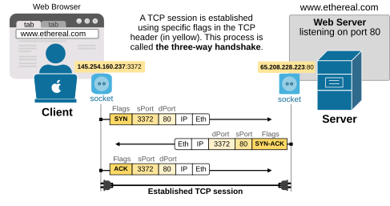

Figure 6. Expected Three-way Handshake.

Let's see how this TCP handshake looks inside the Wireshark tool. Note that the client and the server exchange three TCP segments that **do not carry any data payload**. They are only used to confirm that there is network connectivity between the client and the server at the Network layer.

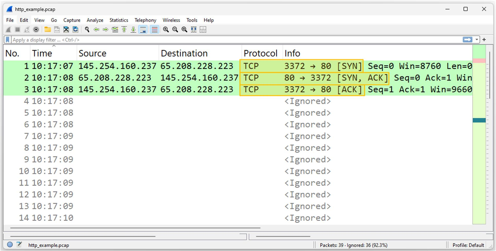

Figure 7. Three-way Handshake Capture.

Now let's open the TCP header and look at its content. This packet is the start of a TCP connection (part of the three-way handshake).

Note the SYN flag in the Flags field. It is used to initiate the TCP connection. Also note the other available flags, such as ACK and FIN.

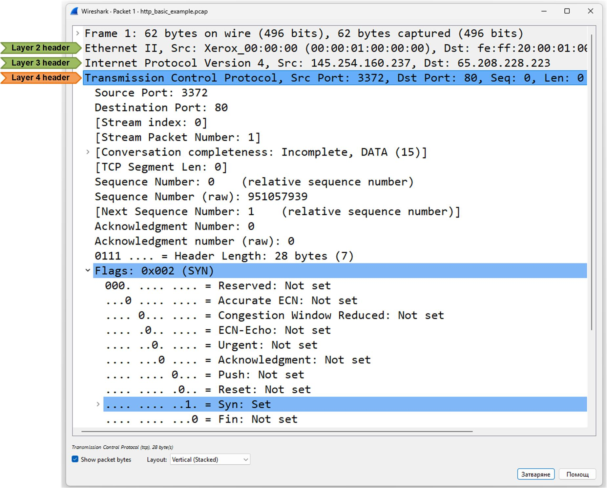

Figure 8. The Layer 4 header.

Let's look at the high-level explanation of the most significant fields in the header:

- **Source Port:** 3372, **Destination Port:** 80 — Client is trying to connect to a web server (HTTP).
- **TCP Flags**: SYN — This is a SYN packet, used to initiate the connection.
- **Sequence Number**: 0 — First byte in the connection.
- **TCP Segment Length**: 0 — No data is being sent yet; it's just signaling connection start.
- **Window**: 8760 — The client can receive 8760 bytes before sending an ACK.
- **Header Length & Options** — Includes options like Maximum Segment Size and SACK (Selective Acknowledgment) support.
- **Acknowledgment Number**: 0 — Not used in the first SYN.

In short, this packet is the client saying: "I want to start a TCP connection with you."

### HTTP

Once the client establishes a TCP connection with the server, it requests the web page that the user wants via HTTP.

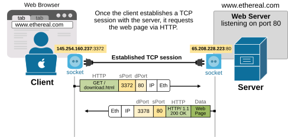

Figure 9. Request page over HTTP.

Let's look at what this HTTP GET request looks like in Wireshark.

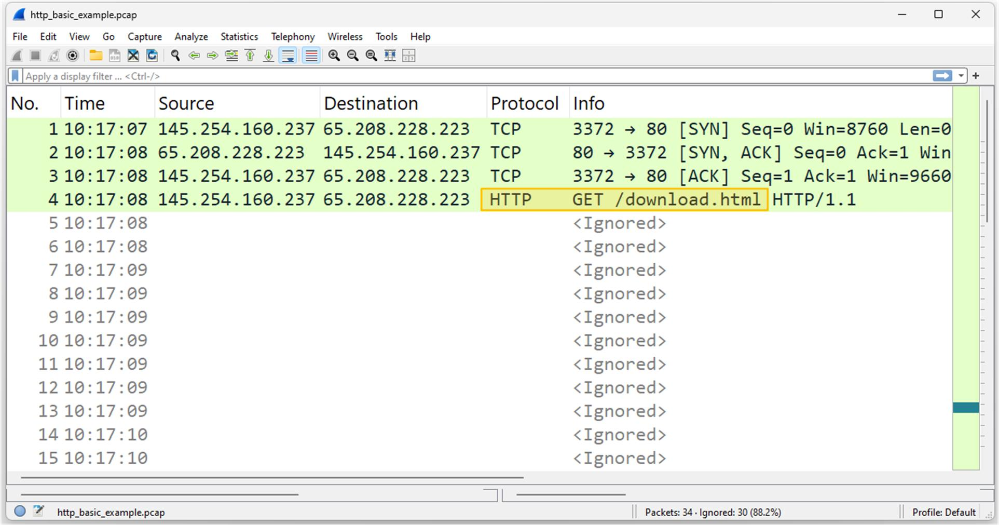

Figure 10. HTTP.

Let's examine the HTTP request content from the client (such as a browser) to the web server.

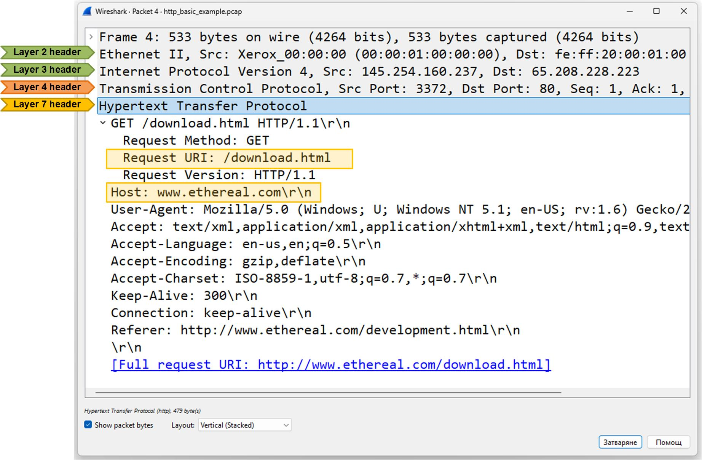

Figure 11. The Layer 7 header.

Here's a high-level explanation of the most significant fields in the header:

- **GET /download.html HTTP/1.1** — The client is asking the server for the page download.html using HTTP/1.1.
- **Host**: www.ethereal.com — Specifies which website the request is for.
- **User-Agent: Mozilla/5.0**… — Identifies the browser and operating system.
- **Accept / Accept-Language / Accept-Encoding / Accept-Charset** — Tell the server what types of content, languages, encoding, and character sets the client can handle.
- **Connection**: keep-alive — The client wants to keep the connection open for more requests.
- **Referer**: http://www.ethereal.com/development.html — Shows the page that linked to this request.

In short, the client is requesting a web page and providing details about how it can handle the response.

Key Takeaways
-------------

The main point of this lesson is that **Wireshark is an indispensable tool for network engineers** at any stage of their career. The earlier you start using it to learn and understand protocols in depth, the better engineer you will become.

- The OSI model helps visualize how data travels through different network layers, from physical transmission to application-level requests.
- Wireshark is a powerful tool for capturing and analyzing traffic at each OSI layer.
- Understanding each layer's headers helps diagnose network problems and learn protocol behavior.