[Lab#1.2 - Exploring Data Encapsulation in Cisco CML](https://www.networkacademy.io/ccna/network-fundamentals/exploring-data-encapsulation-in-cisco-cml)
==========

In this lesson, we'll show you how to set up a basic lab in the free version of Cisco Modeling Labs (CML) and explore the data encapsulation process we've covered in this section of the course.

What is Cisco Modeling Labs (CML)?
----------------------------------

Cisco Modeling Labs (CML) is a software tool that lets you build real networks **in a virtual environment using virtual devices**. This makes it easier and cheaper to practice networking without needing physical equipment. CML is a must-have tool for students and network engineers who prepare for certifications like the CCNA and CCNP. There are a few alternative solutions that can also be used, such as EVE-NG, GNS3, and PNETlab.

Figure 1. Cisco CML.

In this lab, we will take advantage of the latest CML version 2.9.x, which has two significant improvements: **Docker Container Support** and **Git Integration**. 

- Now you can use **containers instead of full virtual machines**. CML 2.9 ships with several useful container nodes out of the box: Web Browsers (Chrome, Firefox), routing tools (FRR), services (DNSmasq, Nginx, TACACS+, RADIUS), monitoring tools (Net-tools, ThousandEyes agent), and more. 
- Additionally, you can **link CML directly to Git repositories** (e.g., GitHub). CML will sync and show your lab files automatically under the Sample Labs menu.

Lab Topology
------------

We are going to use a very simple topology.

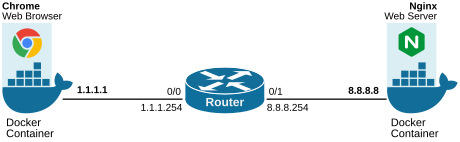

Figure 2. Cisco CML Lab Topology.

We have a Docker container with **a web browser (Chrome)**, which we will use to open web pages via HTTP. On the other side, we have **an Nginx web server** that hosts one elementary web page. In the middle, we have a router with two interfaces that simply connect the two containers together.

Lab Setup
---------

Let's quickly see how to set up the topology in your CML instance. First, you create a new lab named "Data Encapsulation Lab" via the **ADD** button on the CML's homepage. Then, via the **Add Nodes** button, you add a web browser, router, and web server.

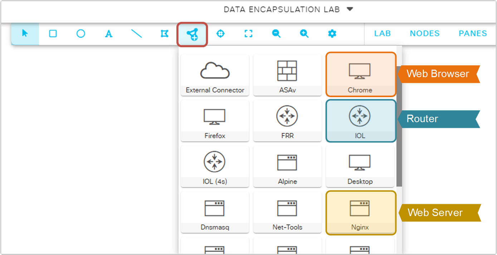

Figure 3. Adding devices to CML.

### Connecting the nodes

Next, you must connect the nodes together as shown in the lab topology diagram. To do so, you right-click on each node and select the **Add Link** function.

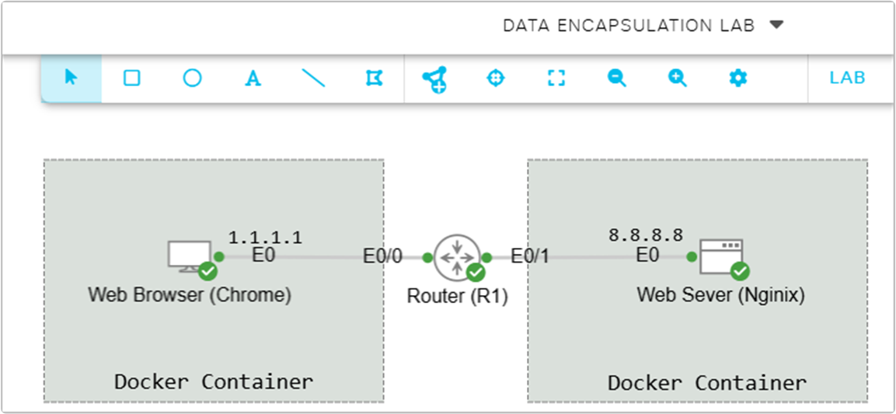

Figure 4. Connecting devices.

Pay attention to the interface numbers — the container nodes use e0, while the router uses e0/0 and e0/1.

### Nodes Configuration

Next, we need to configure the nodes before powering them up. First, let's start with the container nodes — the web browser (Chrome) and the web server (Nginx). We go to the CONFIG tab and add the following configuration.

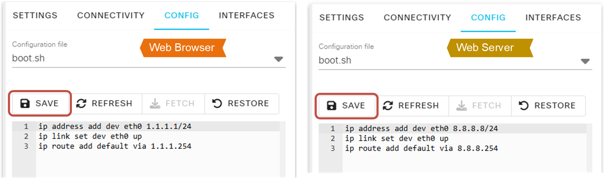

Figure 5. Configuring the nodes.

Next, we need to configure the router. We go to the router's Config tab and configure the two interfaces with IP addresses.

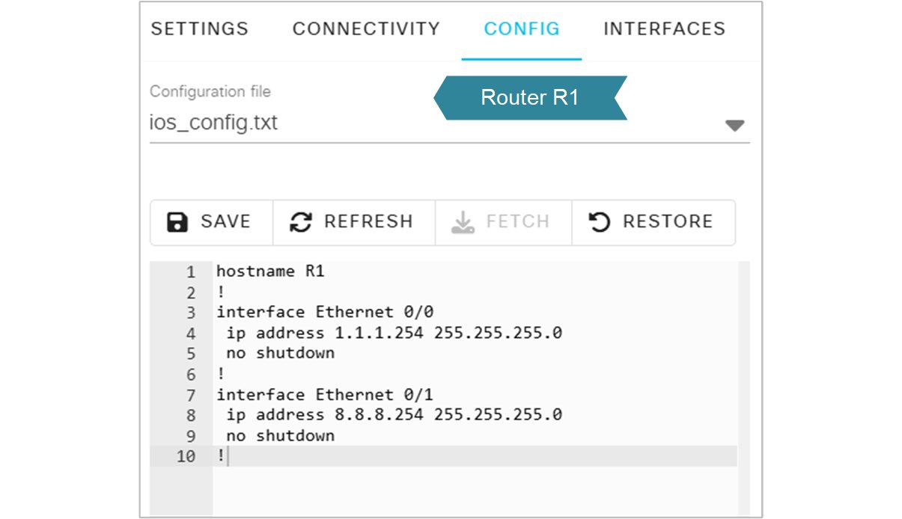

Figure 6. Router Configuration.

The following diagram summarizes the configuration of each node into one image.

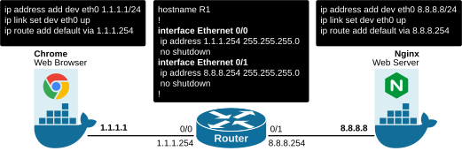

Figure 7. Nodes Configurations Summary.

Now we can power up the lab by going to the LAB tab and then clicking the **Start Lab** button.

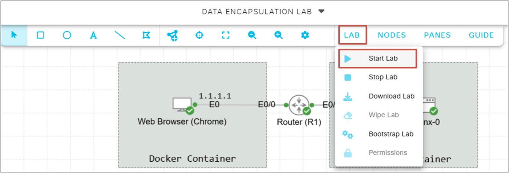

Figure 8. Starting the lab.

Once the nodes have started, you can start a packet capture on one of the links and observe the packets that traverse that link. You right-click on the link you want and select "Packet Capture".

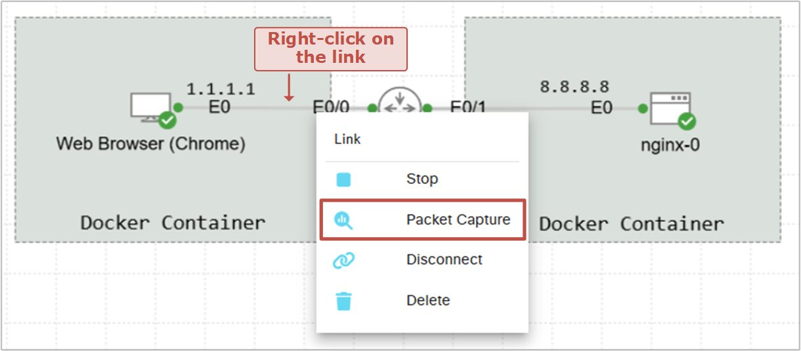

Figure 9. Starting packet capture.

Once you start the packet capture, it will open in the bottom section of the browser.

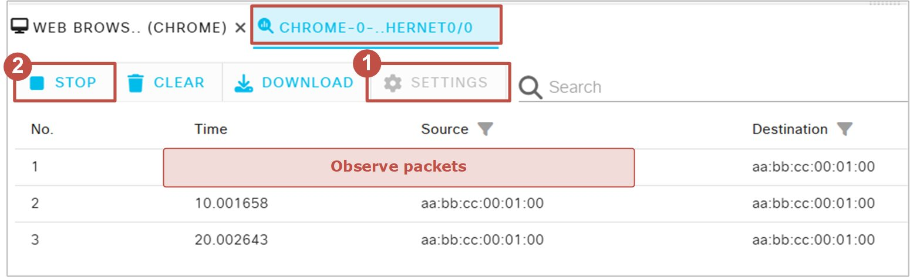

Figure 10. CML Packet Capture.

By default, the capture only captures 50 packets and then automatically stops. You would likely want to change that behavior from the very beginning. Navigate to **Settings > Max Packets** and adjust the value to a higher number, such as 500 or more packets, and click **Apply**.

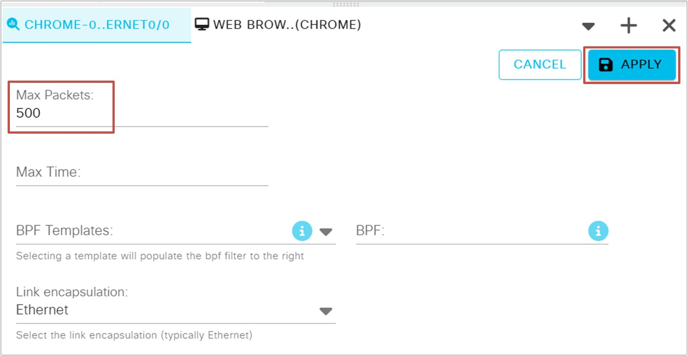

Figure 11. CML Packet Capture Settings.

After setting up and starting the packet capture, open the Web Browser node (Chrome) by right-clicking on the icon and selecting VNC. It will open the Chrome browser at the bottom of the screen. From the browser, you request the root webpage from the Web Server (Nginx).

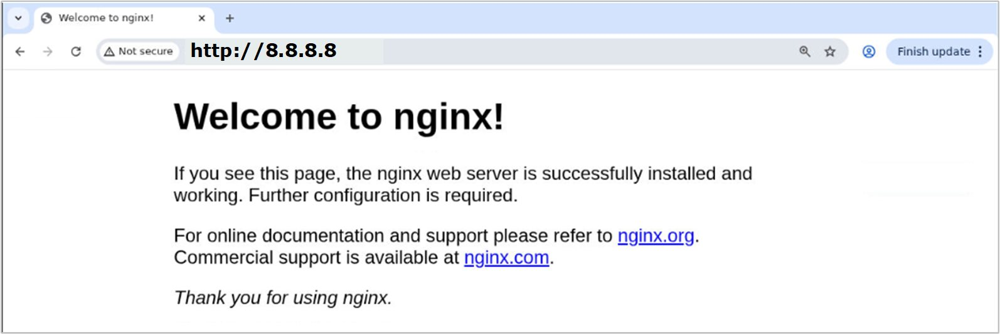

Figure 12. CML Web Browser.

This will make the web browser container first initiate a TCP three-way handshake with the web server (Nginx).

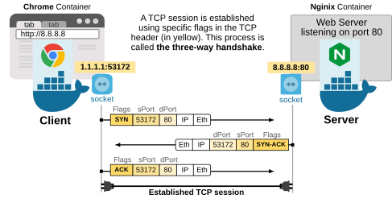

Figure 13. Three-way Handshake on CML.

You can observe the actual network packets being exchanged between the web browser and the web server on the traffic capture tab.

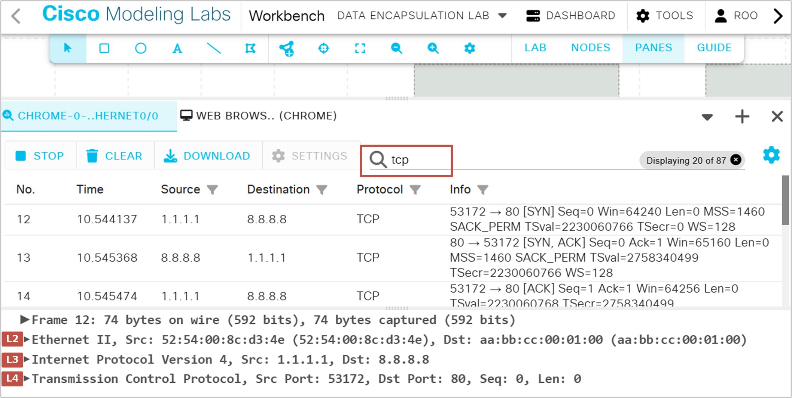

Figure 14. CML Observing Data Encapsulation.

Pay attention to the TCP three-way handshake shown above. The first packet is the TCP SYN from the web browser to the web server. This packet initiates the TCP connection. The server replies with TCP SYN-ACK, which means it accepts the connection. Then the web browser replies with a TCP ACK, which establishes the connection in both directions. At this point, the TCP connection is established. The web browser requests the root web page from the server via HTTP GET. The web server replies with HTTP 200 OK and sends back the web page.

Next Steps in CML to deepen understanding
-----------------------------------------

If you successfully ran the lab as shown in the lesson, you can now explore the different headers of each packet. Pay special attention to source and destination IP addresses in the Layer 3 header, source and destination ports in the Layer 4 header, and the TCP flags used to establish and maintain the TCP connection.

- Capture traffic on different links (browser–router, router–server) and compare headers. Note that the layer 2 header changes at every hop, while the layer 3 and layer 4 headers remain the same throughout the entire traffic path.
- Save the packet capture as a .pcap and analyze it in Wireshark for more detailed views.