[Hubs, Bridges and Switches](https://www.networkacademy.io/ccna/network-fundamentals/hubs-bridges-switches)
==========

In this lesson, we examine the network devices that operate at Layer 2 of the OSI model. We start from the very beginning — the introduction of the network hub — and go all the way to modern days when switches are the most widely adopted devices at the Data Link layer.

Why do we need a hub?
---------------------

To really understand what a hub is and what it does in a network, let's walk through a simple example. Imagine you've got a personal computer at home and you want to connect it to a printer. Now, pretend we are back in the 1980s. Wi-Fi does not exist. What would you do?

Simple — **you'd run a cable from the PC to the printer**, as shown in the diagram below. That's it.

Figure 1. Two connected devices.

Two devices, one cable, and life is good. Your computer can now communicate with the printer and send documents for printing. This is the most basic form of a network: two devices connected directly, with IP addresses in the same subnet.

Now, let's expand the example a little bit. Say you've got **three PCs and a few other devices** — like a printer, a server, and a phone. How would you connect all of them together? If you stick to the same logic as before, you'd have to run a cable between each computer and each device.

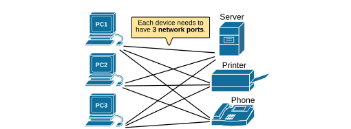

Figure 2. Multiple connected devices.

But now several problems start to appear. To make that setup work, you'd need 9 cables. And every device would need 3 network ports — one for each connection. But in real life, most devices (PCs, printers, etc.) **only have one network port**. You can't just plug three cables into a single port.

And there's more. Every connection would need to be on its own IP subnet. So now you're managing multiple IP addresses and network settings — just to connect a few devices.

As the number of devices grows, **things get out of hand very quickly**.

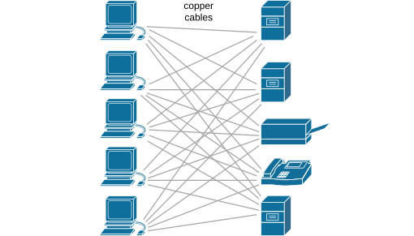

Figure 3. Many connected devices.

That's why, even in the early days of networking, people realized they needed a better way — a single central device that could connect multiple devices into one shared network and let them communicate easily. This led **to the creation of the network hub**.

What is a network hub (repeater)?
--------------------------------

A hub is a simple network device that connects multiple devices in a local area network (LAN). When using a hub, each device **only needs one network port and one cable** to connect to the network. You don't have to connect each device to every other device directly.

Instead, all devices connect to the hub. **The hub acts like a central point**, making it much simpler to build a small network.

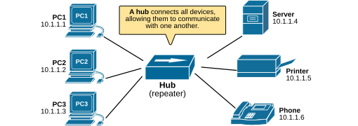

Figure 4. Hub connecting multiple devices.

The hub was the first step in creating the local LAN. It's a Layer 1 device, which means it works only at the physical layer and doesn't really understand what data it's forwarding — it just copies and sends out the electrical signals to every port.

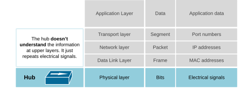

Figure 5. Network hub and the OSI model.

For small networks, hubs worked fine. But as networks grew and more devices got connected, new problems started to pop up. One of the main disadvantages of the hub is that it connects all devices into a single collision domain. A collision occurs when **two devices send data at the same time**, and their signals interfere with each other.

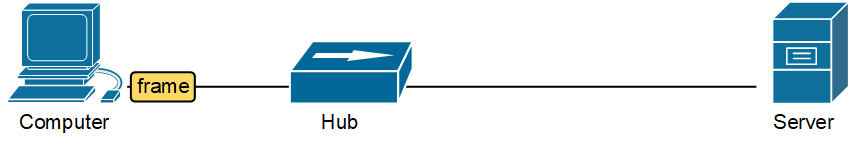

Figure 6. Network Collision (animated).

### What is a collision domain?

A collision domain is a part of a network where data collisions can happen. This means that if two devices in the same collision domain try to send data at the same time, their signals interfere with each other — **a collision occurs**. When that happens, the devices stop, wait, and try again later. This slows down the network.

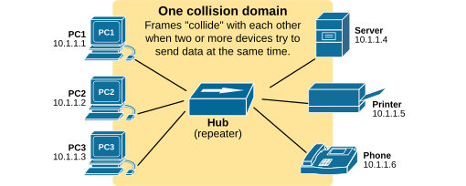

Figure 7. Hub creates one collision domain.

In one collision domain, **only one device could talk at a time**. The more devices you add, the worse the performance gets.

To understand the concept, imagine a collision domain **like a big dinner table** where everyone is sitting together and wants to talk. Since only one person can talk at a time without causing confusion, everyone has to take turns speaking. **If two people talk at the same time, no one understands anything** — it's just noise.

To solve this problem, engineers invented a more intelligent device called **a network bridge**.

What is a Network Bridge?
-------------------------

Bridges were introduced to help solve the problem of too many devices in one collision domain. A bridge splits the local network into two collision domains (hence the name "bridge"). By splitting the network into two, each side had fewer devices competing to send data. This meant fewer collisions and better performance.

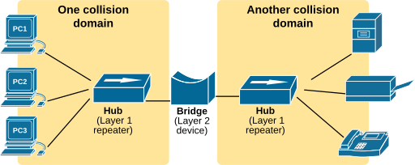

Figure 8. Network bridge.

A network bridge **works at Layer 2** (the Data Link) and reads the information in the frame header. It understands MAC addresses and builds a table of which devices are on which side. This allows bridges to perform selective frame forwarding and not only to repeat electrical signals as the hub does.

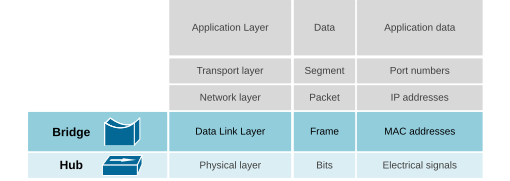

Figure 9. Network bridge and the OSI model.

However, bridges had their limitations. Most of them **had only two ports**, meaning they could only divide a network into two segments. This gave just a 2x improvement in performance. Still, bridges helped develop the logic that eventually led to the switch — a smarter, faster, and more scalable version of a bridge with many ports.

Why do we need a network switch?
--------------------------------

In the 1990s, networks continued to grow, and the required speeds continued to increase. **People needed to connect tens of devices in a local network** and enable them to communicate at high speed. The hub and the bridge were simply not able to provide the performance required to connect many devices. This led to the creation of the switch.

While bridges could only split a network into two collision domains, **each port of a switch is a separate collision domain**.

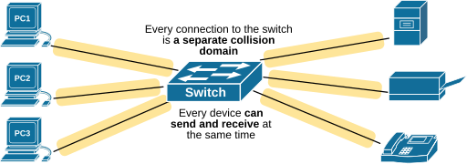

Figure 10. Network LAN switch.

Each device connected to a switch **gets its own collision domain**, so they don't interfere with each other when sending data. This makes the network much more scalable and efficient.

What is a network switch?
-------------------------

A network switch works at Layer 2 of the OSI model and uses MAC addresses to decide where to send data. When a device sends data, the switch looks at the destination MAC address and forwards the data only to the correct device, not to everyone. This saves bandwidth and reduces unnecessary traffic.

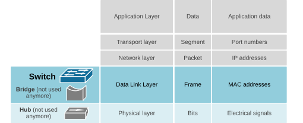

Figure 11. Network switch and OSI model.

Each device connected to a switch has its own collision domain, so multiple devices can send data at the same time without interfering with each other.

The primary function of a network switch is **to connect multiple devices in a local network (LAN)** and forward data only to the specific device it's meant for. It does this by reading the Ethernet header of frames, learning the MAC addresses of connected devices, and building a MAC address table. Then, it sends frames directly to the correct port according to the MAC address table.

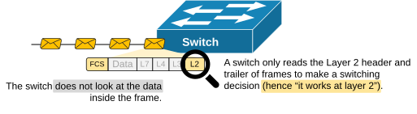

Figure 12. What is a network switch?

It is essential to understand that from the end devices' point of view, **switches are invisible**. You can think of a switch like a power strip — it gives you more ports, but doesn't interfere with the traffic itself. Devices like computers, printers, or IP phones don't interact directly with the switch or **even know it's there**.

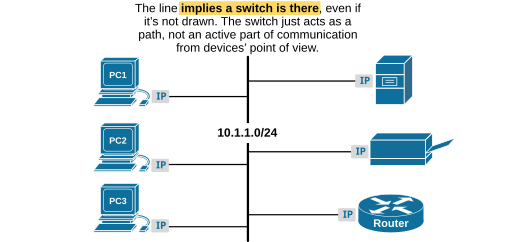

Figure 13. Network switch function.

### Where are switches used in modern networks?

Switches are used in three main layers: access, distribution, and core.

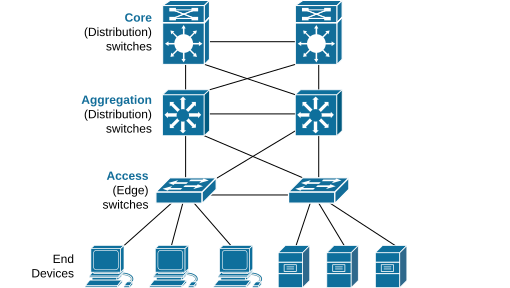

Figure 14. Types of switches.

**Access layer switches** are found at the edge of the network. They connect directly to end devices such as computers, printers, phones, and wireless access points. Their main job is to provide connectivity and enforce basic network policies like VLAN assignments or port security.

**Distribution layer switches** sit between the access and core layers. They gather traffic from multiple access switches and make forwarding decisions based on policies. This is where functions like inter-VLAN routing, QoS, and ACLs are commonly applied.

**Core layer switches** form the backbone of the network. Their main role is to move large amounts of data quickly and reliably across the network. These switches are optimized for speed, high availability, and redundancy.

Key Takeaways
-------------

| Feature | Hub | Bridge | Switch |
|---|---|---|---|
| OSI Layer | Layer 1 | Layer 2 | Layer 2 (some L3) |
| Forwarding | All ports | Selective | Selective |
| Collision domains | One (shared) | Two | Per port |
| MAC learning | No | Yes | Yes |
| Duplex | Half-duplex | Half-duplex | Full-duplex |
| Used today? | No | No | Yes |

- **Hubs** were the earliest way to connect multiple devices. All devices shared the same collision domain. Not used anymore.
- **Bridges** improved this by splitting a network into two smaller collision domains. Limited to 2 ports. Not used anymore.
- **Switches** solved these problems by giving each connected device its own collision domain, eliminating collisions and improving speed and scalability.
- To end devices, **switches are invisible**. They simply forward frames behind the scenes.